## 4.1. Style Guidelines

El diseño visual de Prothia busca transmitir avance, tecnología médica y empatía. El isotipo presenta una extremidad inferior en movimiento conectada por nodos y líneas biomecánicas, simbolizando la integración de datos y la recuperación continua. Las formas fluidas refuerzan la idea de un proceso de rehabilitación seguro, mientras que la tipografía sólida inspira confianza y estabilidad.

### 4.1.1. General Style Guidelines

*   **Branding:** Identidad centrada en la salud digital y la biomecánica, orientada a reducir la brecha de información entre pacientes amputados, clínicas de rehabilitación y centros ortopédicos.
*   **Typography:** La tipografía seleccionada es Montserrat para títulos y elementos destacados, por su claridad y estructura moderna. Para el cuerpo de texto se utiliza Inter a 14px con un interlineado de 1.5, garantizando una lectura fluida de los datos médicos. Los tamaños se adaptan al contexto web según la jerarquía: títulos, subtítulos y párrafos.

    *   **Escala:**
        

          
        

    *   **Weights:**
        

          
        

    *   **Nomenclatura:**
        

          
        

    *   **Example:**
        

          
        

*   **Colors:** La paleta de colores de Prothia prioriza la confianza médica, la tecnología y el progreso. El Azul Profundo transmite estabilidad y profesionalismo, usado en textos y fondos principales. El Teal (Verde Azulado) simboliza innovación y eficiencia, ideal para acentos y gráficos biomecánicos. El Verde Esmeralda incrementa la sensación de logro, siendo ideal para captar estados positivos o metas de rehabilitación cumplidas. Finalmente, el Gris Claro aporta orden y limpieza, usado en fondos secundarios y contenedores.

*   **Spacing:** El espaciado está diseñado para ofrecer una experiencia clara y ordenada, facilitando la lectura de historiales técnicos y datos biomecánicos en tiempo real:
    *   Entre secciones principales: mínimo 24px para marcar el cambio de contexto clínico.
    *   Entre encabezados y párrafos: 16px para reforzar jerarquía visual.
    *   Entre párrafos consecutivos: 14px para mantener continuidad y evitar bloques densos.
    *   Espaciado de botones e inputs: mínimo 10px entre elementos para garantizar usabilidad, especialmente en dispositivos móviles.

*   **Tono de comunicación:** Prothia transmite profesionalismo, empatía y proactividad, claves para un sistema que acompaña la adaptación a una prótesis:
    *   Profesional y analítico, de modo que sea comprensible para clínicas de rehabilitación y centros ortopédicos.
    *   Preventivo y confiable, orientado a alertar sobre posturas incorrectas sin generar alarma innecesaria.
    *   Empático y cercano, resaltando que la plataforma está diseñada para apoyar al paciente en su rutina diaria.

*   **Lenguaje aplicado:**
    *   Claro y directo, evitando tecnicismos ortopédicos complejos en la vista del paciente.
    *   Orientado a la acción, con instrucciones breves para los ejercicios de rehabilitación.
    *   Consistente en terminología médica, garantizando coherencia en alertas, reportes de desempeño y documentación técnica.

### 4.1.2. Web Style Guidelines

Elegimos una paleta basada en Azul Profundo, Teal / Verde Azulado, Verde Esmeralda y Gris Claro, porque queremos representar los valores de profesionalismo médico, tecnología, progreso y confianza. El Azul Profundo transmite estabilidad clínica y rigor, siendo el color principal de fondos de cabecera y tipografías para garantizar un alto contraste. El Teal simboliza la salud digital y la innovación, y es utilizado en botones primarios, elementos interactivos y trazados de gráficos biomecánicos. El Verde Esmeralda se reserva para indicadores de éxito, como la confirmación de ejercicios completados o posturas correctas. Finalmente, el Gris Claro se emplea como color de fondo en los dashboards, ofreciendo un lienzo limpio que evita la fatiga visual al revisar historiales clínicos y reportes de uso prolongado.

El uso balanceado de estos tonos asegura que la información clave, como las alertas de posturas inadecuadas o avisos de mantenimiento preventivo, sea rápidamente perceptible sin perder sobriedad visual. Los contrastes se aplican estratégicamente para mantener un diseño ordenado, moderno y fácil de interpretar por los tres actores del sistema: pacientes, profesionales de rehabilitación y técnicos ortopédicos.

En cuanto a la tipografía, dado que Prothia gestiona datos biomecánicos, historiales técnicos y programas de ejercicios, optamos por fuentes claras y contemporáneas. Montserrat se utiliza en títulos y encabezados para dar una estructura moderna y sólida, mientras que Inter se aplica en los cuerpos de texto y tablas de datos para maximizar la legibilidad. Los tamaños son lo suficientemente grandes para asegurar claridad en las métricas, utilizando variaciones de peso para guiar la atención del usuario en las pantallas de monitoreo.

  

*   **Tipografía:** Se respetará la relación tipográfica y jerarquía establecida en los General Style Guidelines, combinando Montserrat e Inter.

*   **Responsive Design Standards:** Prothia está diseñado con una arquitectura adaptable para satisfacer los distintos contextos de uso de sus usuarios:
    *   **Mobile (360px – 768px)**
        *   Navegación tipo hamburguesa.
        *   Tarjetas de ejercicios y reportes apiladas en columna.
        *   Botones grandes y legibles, ideal para el paciente amputado que consulta su rutina y progreso desde el hogar mediante su smartphone.
    *   **Tablet (769px – 1024px)**
        *   Layout en 2 columnas.
        *   Menú lateral colapsable, optimizado para técnicos ortopédicos que visualizan datos de mantenimiento y ajustan parámetros desde el taller.
    *   **Desktop (1025px en adelante)**
        *   Menú principal siempre visible.
        *   Layout de 3 columnas en los dashboards clínicos, permitiendo a los fisioterapeutas analizar gráficos biomecánicos, métricas en tiempo real y listas de alertas de forma simultánea.

*   **Interactivity:**
    *   **Botones:**
        *   Bordes redondeados en 8px.
        *   Hover: cambio sutil de saturación en el color Teal y sombra suave para indicar interactividad.
        *   Feedback claro mediante animaciones sutiles al confirmar una tarea de rehabilitación o guardar un registro técnico.
    *   **Transiciones y animaciones:**
        *   Duración: 200–300ms.
        *   Curva: ease-in-out, asegurando fluidez al navegar entre fichas de pacientes y reportes de uso de prótesis.

*   **Accessibility:**
    *   Todo ícono debe tener alternativa textual (`aria-label` o `alt`) para herramientas de asistencia.
    *   Navegación totalmente compatible con teclado (Tab, Enter, Esc).
    *   Fuente mínima: 16px para garantizar legibilidad, considerando a pacientes que puedan tener dificultades visuales.
    *   Colores validados para asegurar un contraste suficiente (WCAG AA), permitiendo que textos sobre fondos claros como el Gris Claro se lean sin esfuerzo.

*   **UI Consistency:**
    *   Iconografía uniforme orientada a la salud y biomecánica, en estilo outline con grosor consistente.
    *   Botones y formularios con la misma geometría y espaciado en las interfaces del paciente, clínica y centro ortopédico.
    *   Uso consistente de la paleta semántica: Teal para acciones, Verde Esmeralda para éxito y estados óptimos, y colores de alerta (como rojo o naranja) exclusivamente para advertencias críticas de posturas inadecuadas o necesidades de mantenimiento en la prótesis.
    *   Estándar de espaciado basado en múltiplos de 8px para mantener un ritmo visual coherente y ordenado.

---

## 4.2. Information Architecture

La arquitectura de la información de Prothia se ha estructurado considerando los diferentes niveles de conocimiento técnico de sus tres actores principales: pacientes amputados, profesionales de clínicas de rehabilitación y técnicos de centros ortopédicos. El objetivo es presentar datos biomecánicos complejos de manera comprensible y accesible.

### 4.2.1. Organization Systems

Para estructurar la gran cantidad de datos médicos y de sensores, Prothia utiliza los siguientes sistemas de organización:

*   **Organización Jerárquica:** Utilizada en los dashboards principales, donde se prioriza mostrar en la parte superior las alertas críticas (posturas incorrectas o mantenimientos urgentes), seguidas por los resúmenes de progreso biomecánico y, finalmente, los historiales detallados.
*   **Organización Secuencial:** Aplicada en los flujos de tareas paso a paso, como el registro de los datos clínicos de un paciente, la asociación de una prótesis a un usuario o la asignación de un plan de ejercicios.
*   **Organización Matricial:** Empleada en las vistas de analítica, permitiendo a los profesionales de rehabilitación cruzar datos de adherencia a los ejercicios con métricas de simetría de apoyo o cadencia a lo largo del tiempo.

### 4.2.2. Labeling Systems

El sistema de etiquetado en Prothia está diseñado para reducir la carga cognitiva, utilizando un lenguaje ubicuo que sea familiar tanto para el personal clínico como para el paciente en su hogar.

*   **Principios clave del sistema de etiquetado:**
    *   Se evitarán tecnicismos ortopédicos en la vista del paciente, utilizando términos claros como "Mis Ejercicios" o "Mi Progreso".
    *   Para las clínicas y ortopedias, se mantendrá la precisión técnica necesaria (ej. "Datos Biomecánicos", "Historial Técnico").
*   **Etiquetas principales por área:**
    *   **Navegación global:** Inicio, Pacientes, Prótesis, Monitoreo, Alertas, Mensajes.
    *   **Landing Page:** Soluciones, Para Clínicas, Para Ortopedias, Para Pacientes, Contacto.
    *   **Gestión de rehabilitación (Clínicas):** Asignar plan, Progreso de rehabilitación, Historial biomecánico.
    *   **Gestión técnica (Ortopedias):** Historial de uso, Programar mantenimiento, Estado del dispositivo.
    *   **Acciones del usuario:** Registrar paciente, Asociar prótesis, Generar reporte, Enviar mensaje, Configurar umbrales.

### 4.2.3. SEO Tags and Meta Tags

Para asegurar el posicionamiento de la Landing Page de Prothia y captar a los segmentos objetivo corporativos (clínicas y ortopedias), se han definido las siguientes etiquetas SEO:

*   **Title:** Prothia | Plataforma de Monitoreo Biomecánico y Rehabilitación
*   **Meta Description:** Conecta a pacientes amputados, clínicas de rehabilitación y centros ortopédicos. Optimiza el seguimiento remoto, analiza datos biomecánicos en tiempo real y gestiona el mantenimiento de prótesis con Prothia.
*   **Meta Keywords:** telerehabilitación, monitoreo biomecánico, pacientes amputados, prótesis, software clínico, mantenimiento ortopédico, salud digital.
*   **Meta Author:** SeniorsInProcess.

### 4.2.4. Searching Systems

Dado que las clínicas y los centros ortopédicos manejarán múltiples pacientes y dispositivos, el sistema de búsqueda es fundamental para la eficiencia operativa:

*   **Opciones de Búsqueda:**
    *   **Barra de búsqueda global:** Permite ingresar nombres de pacientes, números de serie de prótesis o DNI para un acceso directo.
*   **Filtros disponibles:**
    *   **Por rol o entidad:** Filtrado exclusivo según los pacientes asignados a una clínica o las prótesis fabricadas por un taller ortopédico.
    *   **Por estado de rehabilitación:** Pacientes con "Alertas activas", "Mantenimiento requerido" o "Rutina completada".
    *   **Filtro por rango de fechas:** Esencial para consultar el historial de datos biomecánicos o el historial de uso en periodos específicos.
*   **Apariencia de los resultados:**
    *   Los resultados mostrarán tarjetas de resumen con el nombre del paciente, el tipo de prótesis vinculada y un indicador visual de su estado actual (ej. verde para estable, rojo para alerta de postura).

### 4.2.5. Navigation Systems

La navegación de Prothia se adapta al acceso diferenciado según el rol del usuario (paciente, profesional clínico o técnico ortopédico), asegurando que cada uno vea solo la información pertinente a sus objetivos.

*   **Páginas principales (Landing Page):**
    *   **Inicio:** Hero section con la propuesta de valor integradora de Prothia.
    *   **Beneficios:** Explicación de ventajas para los tres segmentos (visibilidad clínica, trazabilidad de mantenimiento, recuperación segura).
    *   **Contacto/Demo:** Formularios de captación (Leads) para clínicas y talleres.
*   **Estructura de la Aplicación Web (Acceso diferenciado):**
    *   **Vista Paciente:** Menú simplificado centrado en "Mi Progreso", "Mis Ejercicios" y un acceso directo a "Mensajes" con su clínica.
    *   **Vista Clínica:** Menú lateral (Sidebar) expansible con acceso al "Dashboard Biomecánico", "Directorio de Pacientes", "Planes de Ejercicio" y "Alertas".
    *   **Vista Centro Ortopédico:** Menú centrado en "Inventario de Prótesis", "Historial Técnico", "Mantenimientos Programados" y "Alertas de Desgaste".
*   **Búsqueda y navegación contextual:**
    *   Uso de *Breadcrumbs* (migas de pan) en las vistas profundas (ej. *Inicio > Pacientes > Marcelo Arias > Datos Biomecánicos*) para que el usuario no pierda el contexto.
    *   Iconografía clara en el menú lateral (ej. un icono de advertencia para las alertas y una silueta humana para los perfiles de pacientes).

## 4.3. Landing Page UI Design

La Landing Page funciona como punto de entrada público a Prothia. Su propósito es comunicar la propuesta de valor, diferenciar los beneficios para pacientes, clínicas de rehabilitación y centros ortopédicos, y facilitar el acceso a la Web Application. Los CTA de cada segmento conducen a la experiencia correspondiente de la Web Application, mientras que los formularios públicos de demostración y newsletter se comunican con el RESTful API.

### 4.3.1. Landing Page Wireframe

Los wireframes priorizan estructura, jerarquía y secuencia de lectura antes de aplicar color o detalle visual.

#### Desktop Web Browser

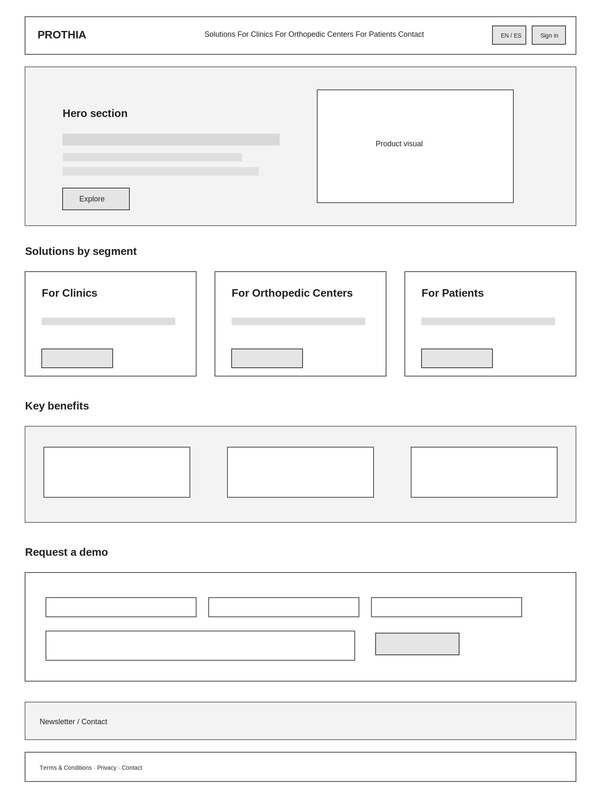

*Landing Page Wireframe - Desktop Web Browser.*

#### Mobile Web Browser

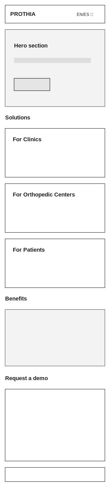

*Landing Page Wireframe - Mobile Web Browser.*

### 4.3.2. Landing Page Mock-up

Los mock-ups aplican la paleta, jerarquía tipográfica y componentes definidos para Prothia, conservando la misma arquitectura entre desktop y mobile.

#### Desktop Web Browser

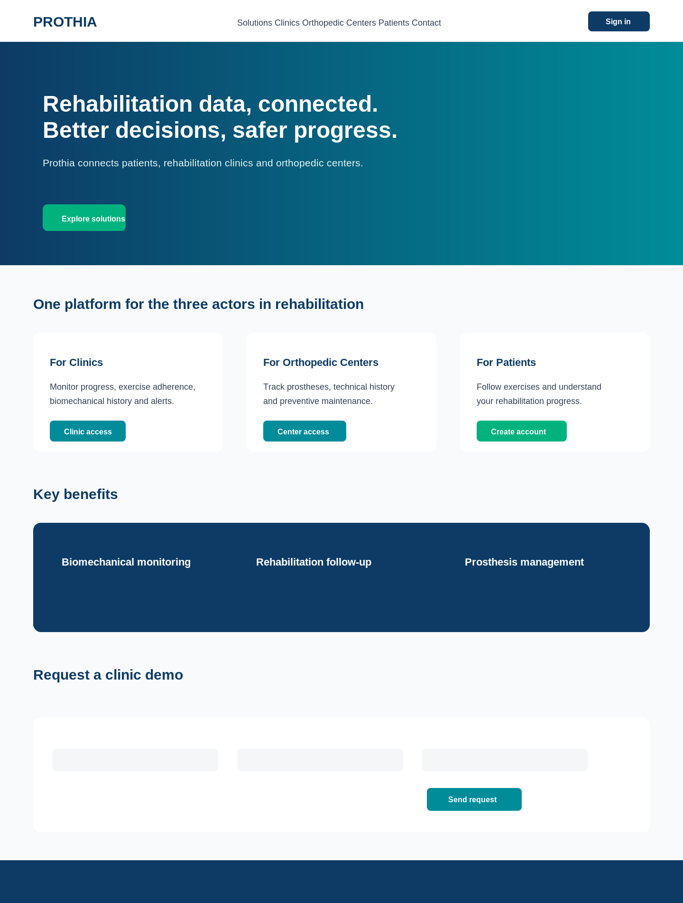

*Landing Page Mock-up - Desktop Web Browser.*

#### Mobile Web Browser

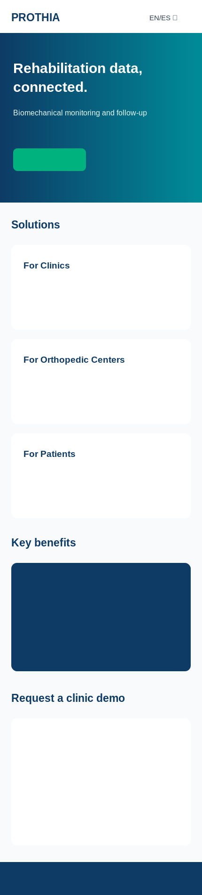

*Landing Page Mock-up - Mobile Web Browser.*

## 4.4. Web Applications UX/UI Design

La Web Application utiliza una experiencia responsive con acceso diferenciado según el rol. Los artefactos se derivan de las User Stories del Capítulo III y mantienen trazabilidad entre wireframes, wireflows, mock-ups y User Flows.

### 4.4.1. Web Applications Wireframes

Los wireframes definen la estructura de las vistas principales para Desktop y Mobile Web Browser.

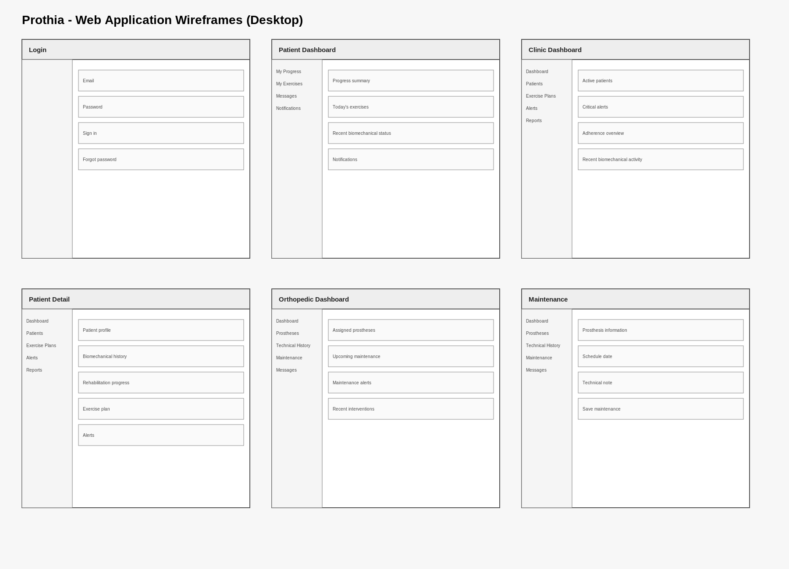

*Web Application Wireframes - Desktop Web Browser.*

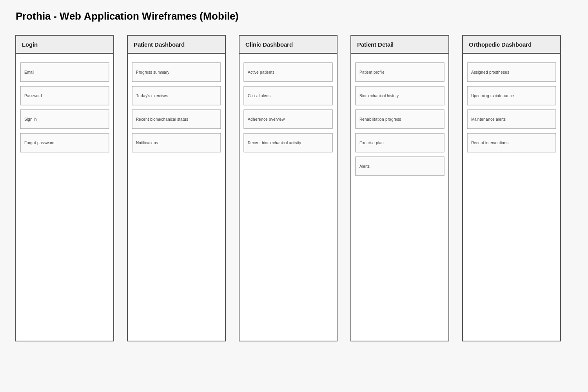

*Web Application Wireframes - Mobile Web Browser.*

### 4.4.2. Web Applications Wireflow Diagrams

Se elaboró un Wireflow por cada User Goal, incorporando los estados de pantalla relevantes.

| ID | User Goal | User Stories base |
|---|---|---|
| UG01 | Acceder a la cuenta o recuperar el acceso | US-01, US-02, US-03 |
| UG02 | Consultar el progreso y el historial biomecánico | US-08, US-09 |
| UG03 | Registrar el cumplimiento de ejercicios | US-11 |
| UG04 | Comunicarse con la clínica | US-19 |
| UG05 | Gestionar al paciente y su plan de ejercicios | US-04, US-06, US-10 |
| UG06 | Monitorear datos biomecánicos, alertas y umbrales | US-07, US-13, US-14, US-15 |
| UG07 | Generar reportes y exportar información | US-28, US-29, US-30 |
| UG08 | Asociar y gestionar una prótesis | US-05, US-16 |
| UG09 | Programar y controlar el mantenimiento | US-17, US-18 |
| UG10 | Compartir información entre clínica y centro ortopédico | US-20 |
| UG11 | Contratar y consultar una suscripción o licencia | US-22, US-23, US-24 |

#### UG01 - Acceder a la cuenta o recuperar el acceso

**User Goal:** Como usuario de Prothia, quiero ingresar a la plataforma o recuperar mi acceso para utilizar las funciones correspondientes a mi rol.

*Wireflow UG01 - Acceder a la cuenta o recuperar el acceso.*

**Explicación del flujo:** El flujo parte del acceso desde la Landing Page. Considera registro del paciente, inicio de sesión y recuperación de contraseña. Cuando las credenciales son válidas, el acceso continúa hacia el dashboard asociado al rol; cuando no lo son, el usuario permanece en el proceso de autenticación y recibe retroalimentación de error.

#### UG02 - Consultar el progreso y el historial biomecánico

**User Goal:** Como paciente, quiero revisar mi progreso y mi historial biomecánico para comprender la evolución de mi rehabilitación.

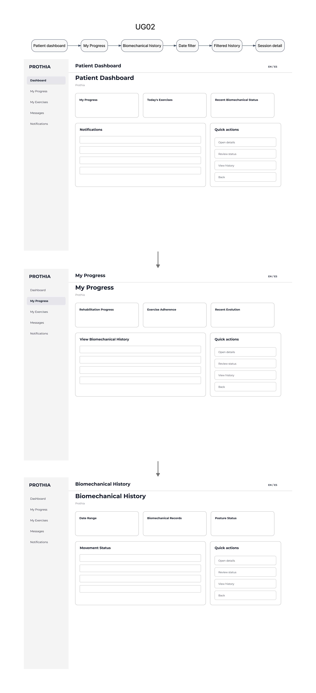

*Wireflow UG02 - Consultar el progreso y el historial biomecánico.*

**Explicación del flujo:** El recorrido inicia en el Patient Dashboard, continúa hacia My Progress y luego hacia Biomechanical History. Desde el historial se contempla el filtrado por rango de fechas y la consulta de registros asociados a las sesiones biomecánicas.

#### UG03 - Registrar el cumplimiento de ejercicios

**User Goal:** Como paciente, quiero registrar la realización de los ejercicios de mi plan para mantener actualizada mi adherencia a la rehabilitación.

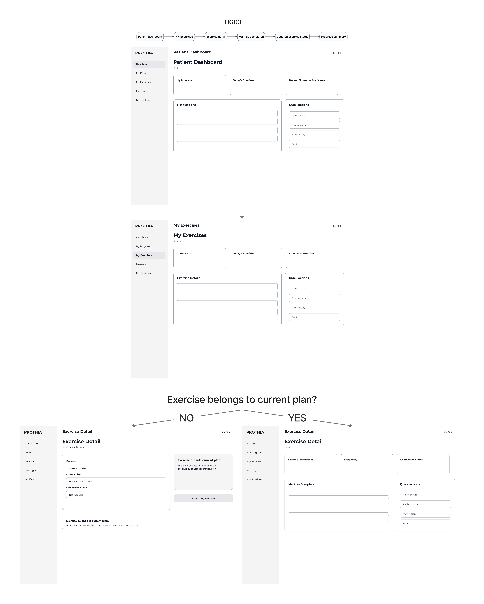

*Wireflow UG03 - Registrar el cumplimiento de ejercicios.*

**Explicación del flujo:** El flujo conduce desde el Patient Dashboard a My Exercises y luego al detalle del ejercicio. Antes de registrar el cumplimiento, se valida que el ejercicio pertenezca al plan vigente.

#### UG04 - Comunicarse con la clínica

**User Goal:** Como paciente, quiero enviar mensajes a mi clínica para resolver dudas relacionadas con mi tratamiento.

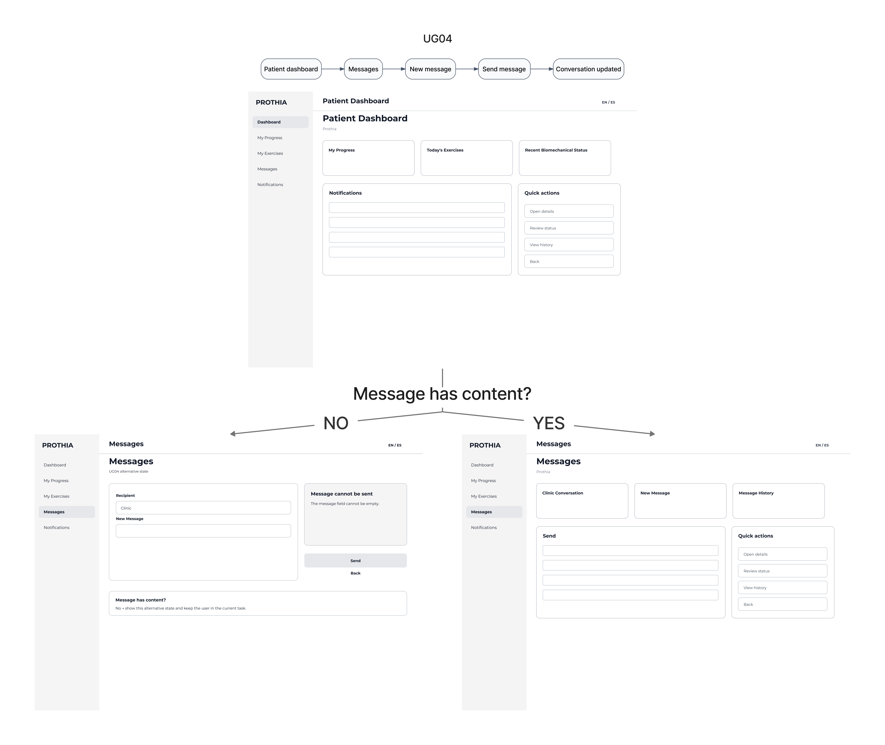

*Wireflow UG04 - Comunicarse con la clínica.*

**Explicación del flujo:** El flujo va desde el Patient Dashboard a Messages, permite redactar un nuevo mensaje y enviarlo para actualizar la conversación con la clínica.

#### UG05 - Gestionar al paciente y su plan de ejercicios

**User Goal:** Como profesional de clínica, quiero consultar al paciente y gestionar su plan de ejercicios para organizar su rehabilitación.

*Wireflow UG05 - Gestionar al paciente y su plan de ejercicios.*

**Explicación del flujo:** El profesional parte del Clinic Dashboard, accede al directorio de pacientes, abre la ficha seleccionada y llega a Exercise Plan para definir ejercicios y frecuencia.

#### UG06 - Monitorear datos biomecánicos, alertas y umbrales

**User Goal:** Como profesional de clínica, quiero revisar alertas y configurar umbrales para intervenir oportunamente sobre eventos biomecánicos relevantes.

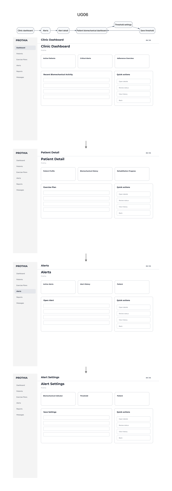

*Wireflow UG06 - Monitorear datos biomecánicos, alertas y umbrales.*

**Explicación del flujo:** El recorrido conecta el dashboard de la clínica con la ficha del paciente, la vista de Alerts y Alert Settings. De esta manera, el profesional puede revisar eventos críticos, consultar su historial y actualizar los umbrales aplicables al paciente.

#### UG07 - Generar reportes y exportar información

**User Goal:** Como profesional de clínica, quiero generar reportes y exportar información histórica para documentar la evolución del paciente.

*Wireflow UG07 - Generar reportes y exportar información.*

**Explicación del flujo:** El profesional accede desde Clinic Dashboard a Patients, abre Patient Detail y llega a Reports, donde selecciona paciente y periodo antes de generar o exportar información.

#### UG08 - Asociar y gestionar una prótesis

**User Goal:** Como técnico ortopédico, quiero asociar una prótesis disponible y consultar su historial técnico para mantener la trazabilidad del dispositivo.

*Wireflow UG08 - Asociar y gestionar una prótesis.*

**Explicación del flujo:** El flujo inicia en el Orthopedic Dashboard, continúa hacia Prostheses y Prosthesis Detail, y permite acceder al Technical History una vez seleccionada la prótesis.

#### UG09 - Programar y controlar el mantenimiento

**User Goal:** Como técnico ortopédico, quiero programar el mantenimiento preventivo de una prótesis para anticipar fallas y mantener su atención técnica.

*Wireflow UG09 - Programar y controlar el mantenimiento.*

**Explicación del flujo:** El recorrido parte del Orthopedic Dashboard, permite seleccionar una prótesis y abrir su detalle antes de ingresar a Maintenance para programar una fecha.

#### UG10 - Compartir información entre clínica y centro ortopédico

**User Goal:** Como profesional de clínica, quiero compartir información relevante del paciente con el centro ortopédico responsable para coordinar la atención de su prótesis.

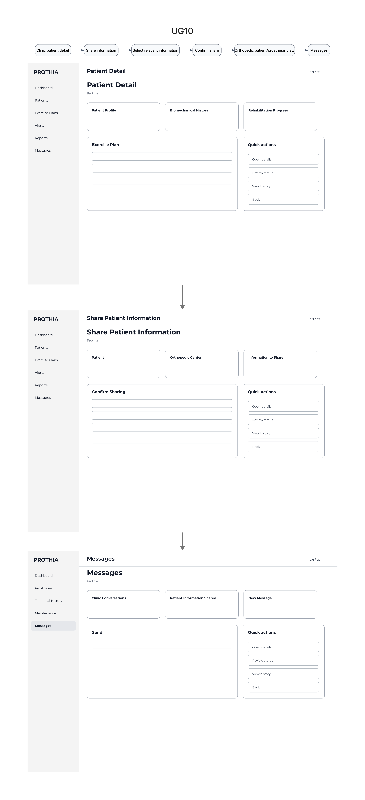

*Wireflow UG10 - Compartir información entre clínica y centro ortopédico.*

**Explicación del flujo:** El flujo parte de Patient Detail, abre Share Patient Information, permite seleccionar la información relevante y confirmar el envío al centro ortopédico responsable. Luego la coordinación continúa mediante Messages.

#### UG11 - Contratar y consultar una suscripción o licencia

**User Goal:** Como administrador de clínica o centro ortopédico, quiero contratar y consultar mi suscripción o licencia para mantener vigente el acceso institucional.

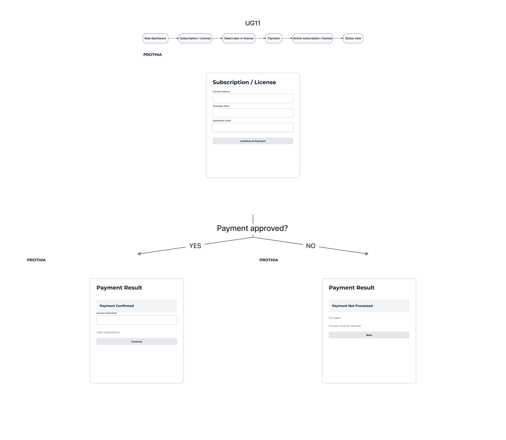

*Wireflow UG11 - Contratar y consultar una suscripción o licencia.*

**Explicación del flujo:** El flujo parte del dashboard del rol, continúa hacia Subscription / License, selección del plan o licencia y pago, y finaliza en la consulta del estado de acceso.

### 4.4.2. Web Applications Mock-ups

Los mock-ups aplican el sistema visual de Prothia sobre los mismos estados representados en los wireframes.

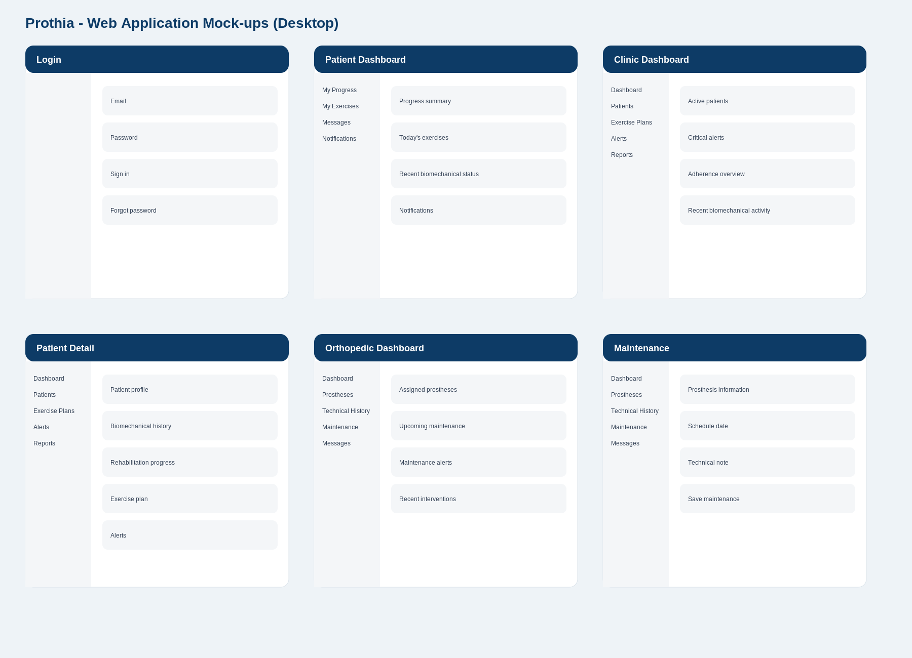

*Web Application Mock-ups - Desktop Web Browser.*

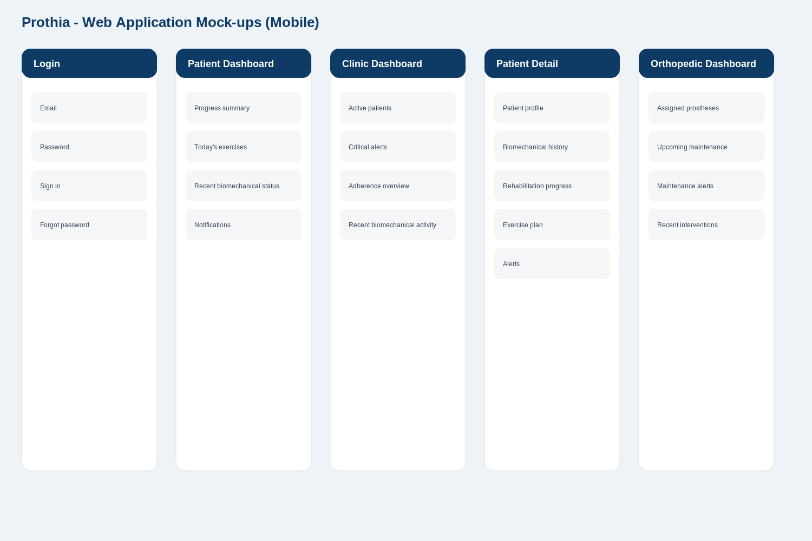

*Web Application Mock-ups - Mobile Web Browser.*

### 4.4.3. Web Applications User Flow Diagrams

Los User Flow Diagrams emplean mock-ups para representar la experiencia final e incorporan happy paths y, cuando corresponde, unhappy paths derivados de los criterios de aceptación.

#### UG01 - Acceder a la cuenta o recuperar el acceso

**User Goal:** Como usuario de Prothia, quiero ingresar a la plataforma o recuperar mi acceso para utilizar las funciones correspondientes a mi rol.

*User Flow UG01 - Acceder a la cuenta o recuperar el acceso.*

**Explicación de rutas y condiciones:** El User Flow conserva el recorrido de autenticación e incorpora la condición de credenciales válidas. La ruta esperada conduce a los dashboards de paciente, clínica o centro ortopédico; la ruta alternativa mantiene al usuario en Login y comunica el error.

#### UG02 - Consultar el progreso y el historial biomecánico

**User Goal:** Como paciente, quiero revisar mi progreso y mi historial biomecánico para comprender la evolución de mi rehabilitación.

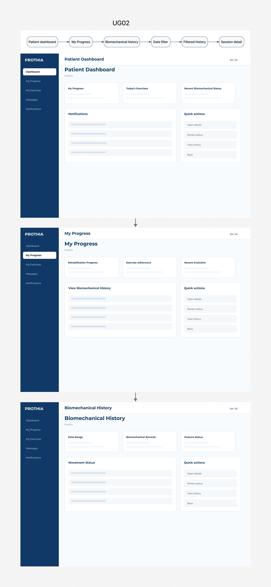

*User Flow UG02 - Consultar el progreso y el historial biomecánico.*

**Explicación de rutas y condiciones:** El User Flow representa la ruta esperada para revisar el progreso y llegar al historial biomecánico. Las acciones de filtrado y consulta permiten acotar la información del paciente sin modificar la estructura principal de navegación.

#### UG03 - Registrar el cumplimiento de ejercicios

**User Goal:** Como paciente, quiero registrar la realización de los ejercicios de mi plan para mantener actualizada mi adherencia a la rehabilitación.

*User Flow UG03 - Registrar el cumplimiento de ejercicios.*

**Explicación de rutas y condiciones:** La ruta esperada permite marcar el ejercicio como completado. Si el ejercicio no pertenece al plan actual, el sistema bloquea el registro y devuelve al usuario a My Exercises, evitando alterar la adherencia con actividades no asignadas.

#### UG04 - Comunicarse con la clínica

**User Goal:** Como paciente, quiero enviar mensajes a mi clínica para resolver dudas relacionadas con mi tratamiento.

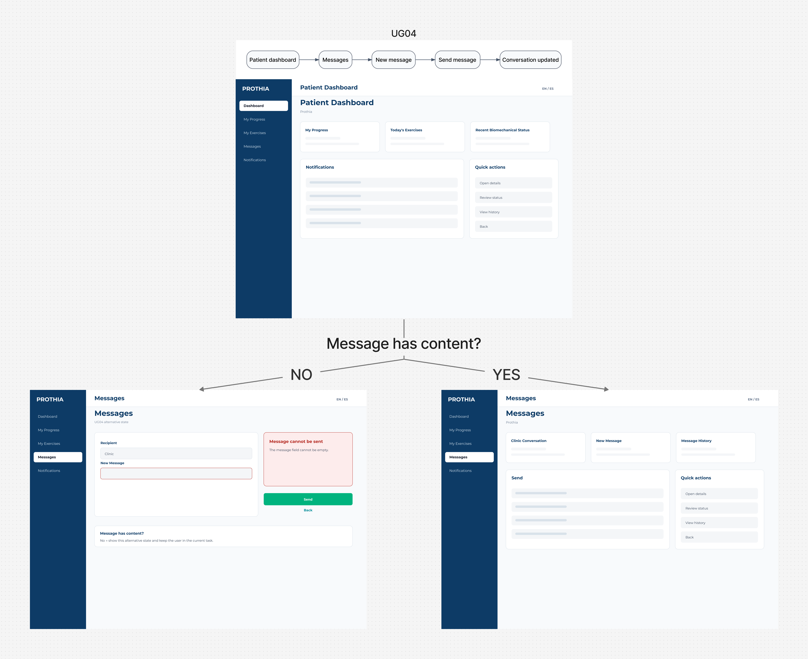

*User Flow UG04 - Comunicarse con la clínica.*

**Explicación de rutas y condiciones:** El User Flow incorpora la validación de contenido. Si el mensaje contiene texto, se envía y la conversación se actualiza; si está vacío, el sistema no permite el envío y mantiene al usuario en la misma tarea.

#### UG05 - Gestionar al paciente y su plan de ejercicios

**User Goal:** Como profesional de clínica, quiero consultar al paciente y gestionar su plan de ejercicios para organizar su rehabilitación.

*User Flow UG05 - Gestionar al paciente y su plan de ejercicios.*

**Explicación de rutas y condiciones:** La ruta esperada permite guardar un plan con ejercicios definidos. La alternativa impide guardar un plan vacío y solicita incorporar al menos un ejercicio antes de confirmar la asignación.

#### UG06 - Monitorear datos biomecánicos, alertas y umbrales

**User Goal:** Como profesional de clínica, quiero revisar alertas y configurar umbrales para intervenir oportunamente sobre eventos biomecánicos relevantes.

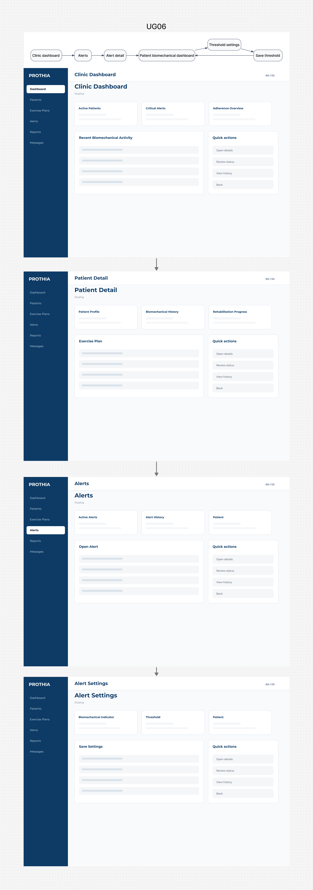

*User Flow UG06 - Monitorear datos biomecánicos, alertas y umbrales.*

**Explicación de rutas y condiciones:** El User Flow mantiene la secuencia clínica de revisión y configuración. La actualización del umbral se realiza dentro del contexto del paciente y queda vinculada a las siguientes evaluaciones biomecánicas.

#### UG07 - Generar reportes y exportar información

**User Goal:** Como profesional de clínica, quiero generar reportes y exportar información histórica para documentar la evolución del paciente.

*User Flow UG07 - Generar reportes y exportar información.*

**Explicación de rutas y condiciones:** El User Flow contempla la disponibilidad de datos como condición. Si existe información suficiente, se genera el reporte o exportación; de lo contrario se informa la insuficiencia de datos y se permite modificar el rango seleccionado.

#### UG08 - Asociar y gestionar una prótesis

**User Goal:** Como técnico ortopédico, quiero asociar una prótesis disponible y consultar su historial técnico para mantener la trazabilidad del dispositivo.

*User Flow UG08 - Asociar y gestionar una prótesis.*

**Explicación de rutas y condiciones:** El User Flow valida la disponibilidad del dispositivo. Si la prótesis está disponible, continúa la asociación y el acceso a su detalle e historial técnico; si ya está asociada, se informa la restricción y se solicita elegir otra prótesis.

#### UG09 - Programar y controlar el mantenimiento

**User Goal:** Como técnico ortopédico, quiero programar el mantenimiento preventivo de una prótesis para anticipar fallas y mantener su atención técnica.

*User Flow UG09 - Programar y controlar el mantenimiento.*

**Explicación de rutas y condiciones:** La ruta esperada registra una fecha futura válida. La ruta alternativa detecta una fecha inválida y solicita seleccionar una fecha posterior, evitando guardar una programación inconsistente.

#### UG10 - Compartir información entre clínica y centro ortopédico

**User Goal:** Como profesional de clínica, quiero compartir información relevante del paciente con el centro ortopédico responsable para coordinar la atención de su prótesis.

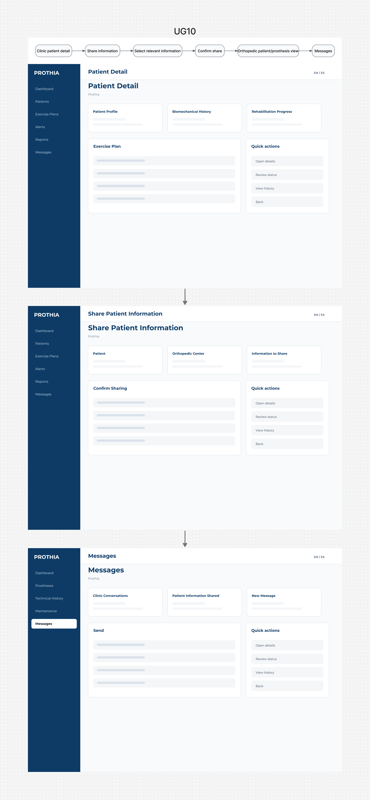

*User Flow UG10 - Compartir información entre clínica y centro ortopédico.*

**Explicación de rutas y condiciones:** El User Flow representa la ruta de compartición autorizada y la posterior comunicación con el centro ortopédico. La información se mantiene vinculada al paciente y al centro responsable de su prótesis.

#### UG11 - Contratar y consultar una suscripción o licencia

**User Goal:** Como administrador de clínica o centro ortopédico, quiero contratar y consultar mi suscripción o licencia para mantener vigente el acceso institucional.

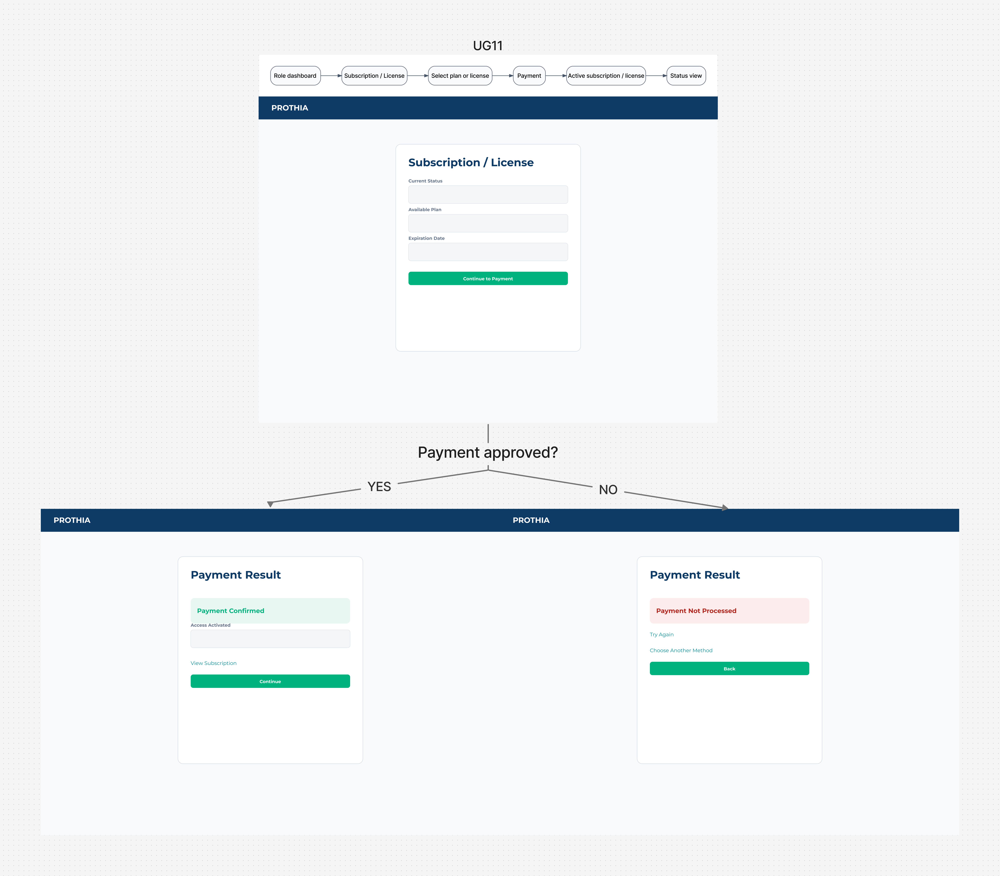

*User Flow UG11 - Contratar y consultar una suscripción o licencia.*

**Explicación de rutas y condiciones:** El User Flow incorpora el resultado del pago. Un pago aprobado activa el acceso correspondiente; un pago no procesado muestra la ruta alternativa para reintentar o elegir otro método antes de continuar.

## 4.5. Web Applications Prototyping

El prototipo se desarrollará en Figma a partir de los mock-ups ya definidos y deberá cubrir Desktop y Mobile Web Browser con navegación consistente con los User Flow Diagrams.

**Estado actual:** en elaboración. Falta configurar las interacciones nativas en Figma, registrar la evidencia audiovisual y añadir el enlace de Microsoft Stream. Esta sección se mantiene abierta hasta incorporar la evidencia interactiva; no se reemplaza con imágenes estáticas.

## 4.6. Domain-Driven Software Architecture

La arquitectura parte del Big Picture EventStorming desarrollado en el Capítulo II y profundiza el dominio hasta identificar Bounded Contexts, Aggregates, Commands, Domain Events, Policies y Read Models. C4 Model complementa esta visión mediante los niveles Context, Container y Component.

| Bounded Context | Responsabilidad principal |
|---|---|
| Identity & Access | Registro, autenticación, recuperación de contraseña, roles y control de acceso. |
| Rehabilitation Management | Pacientes, planes de ejercicios, cumplimiento y progreso de rehabilitación. |
| Biomechanical Monitoring | Sesiones, mediciones, clasificación de postura/movimiento, umbrales y alertas clínicas. |
| Prosthesis & Maintenance | Asociación de prótesis, historial técnico, uso acumulado y mantenimiento preventivo. |
| Communication & Notifications | Mensajería, compartición de información y notificaciones. |
| Subscription & Licensing | Suscripciones, licencias, vigencia de acceso y pagos. |
| Lead Management | Solicitudes de demostración y suscripciones al boletín informativo. |
| Reporting & Analytics | Reportes de progreso, exportaciones e indicadores agregados de clínica. |

### 4.6.1. Design-Level EventStorming

El Design-Level EventStorming refina los procesos del dominio y permite verificar dependencias entre monitoreo biomecánico, rehabilitación, mantenimiento, comunicación, contratación y reportes.

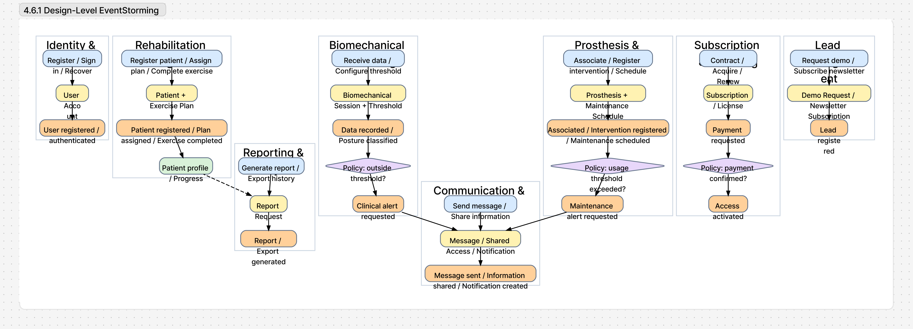

*Design-Level EventStorming de Prothia.*

### 4.6.2. Software Architecture Context Diagram

El Context Diagram representa a Prothia como un único sistema con Visitor, Patient, Clinic User y Orthopedic Center User, además de Payment Gateway, Email Service y Biomechanical Sensor / Device como sistemas externos.

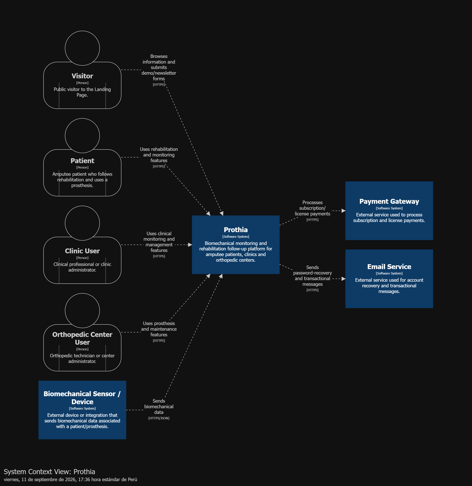

*C4 System Context Diagram de Prothia.*

### 4.6.3. Software Architecture Container Diagrams

La solución se distribuye en Landing Page (HTML5/CSS3/JavaScript), Web Application (Vue 3/PrimeVue/JavaScript), RESTful API (ASP.NET Core/C#/Entity Framework Core) y Relational Database (PostgreSQL).

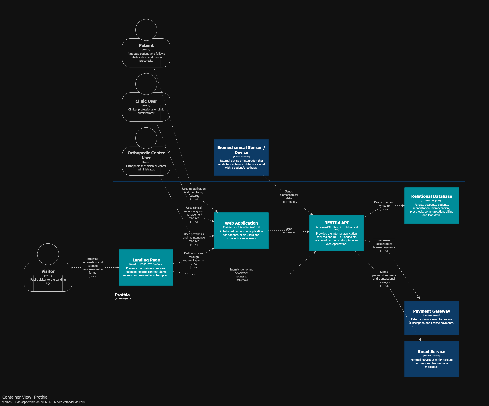

*C4 Container Diagram de Prothia.*

### 4.6.4. Software Architecture Components Diagrams

#### Landing Page Components

La Landing Page separa navegación/CTA, contenido por segmento, formularios públicos, cliente de API e internacionalización/accesibilidad.

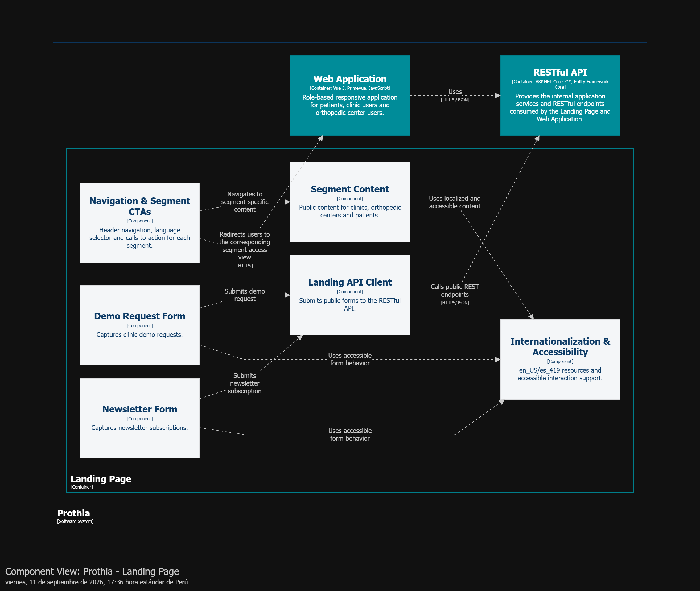

*C4 Component Diagram - Landing Page.*

#### Web Application Components

La Web Application separa experiencias por rol, autenticación, suscripción/licencia, API Client e internacionalización/accesibilidad.

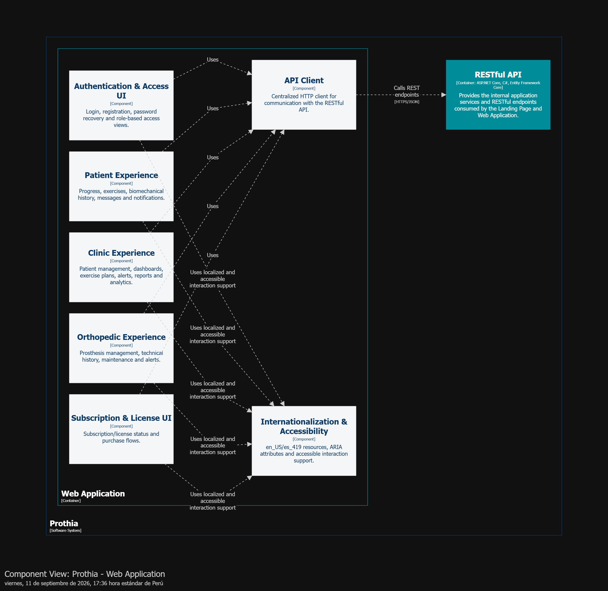

*C4 Component Diagram - Web Application.*

#### RESTful API Components

El API se organiza por responsabilidades del dominio y utiliza Persistence Layer para PostgreSQL y External Integrations para correo, pagos y datos biomecánicos.

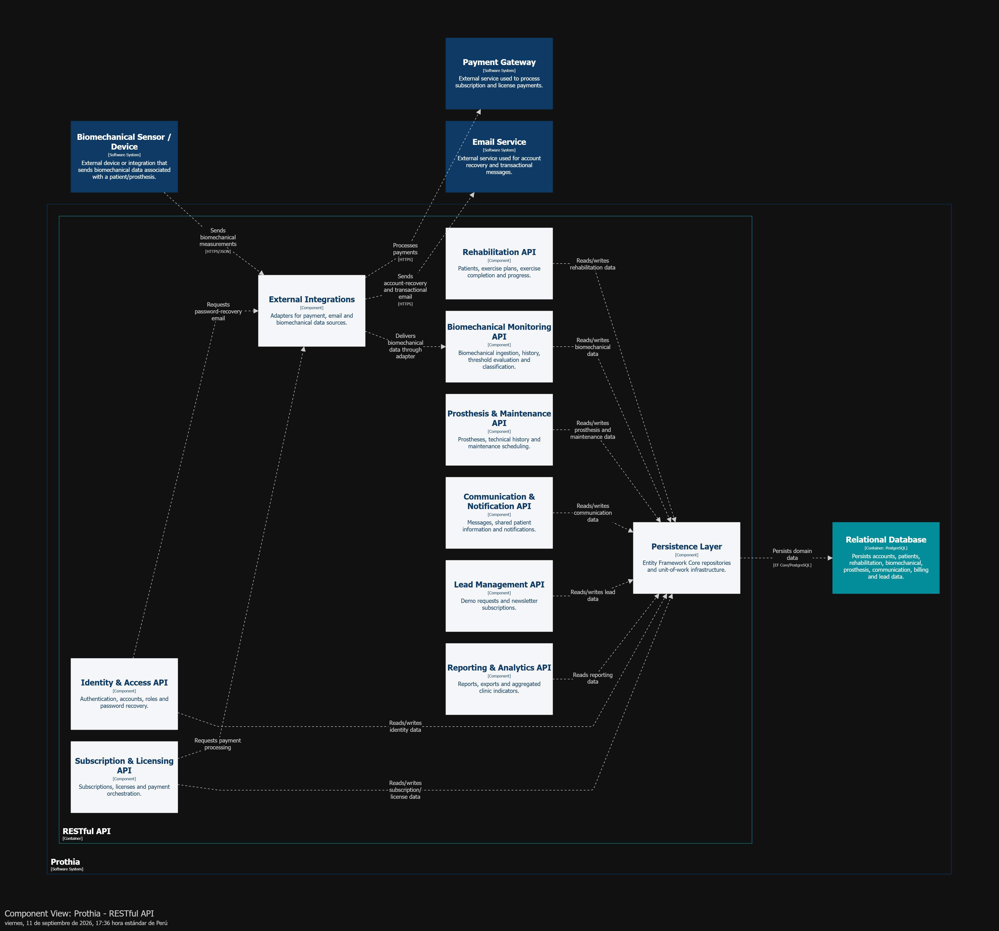

*C4 Component Diagram - RESTful API.*

## 4.7. Software Object-Oriented Design

Los diagramas de clases se organizan por Bounded Context e incluyen clases, interfaces, enumeraciones, atributos, métodos, visibilidad, relaciones y multiplicidades.

### 4.7.1. Class Diagrams

#### Identity & Access

El modelo concentra UserAccount y PasswordResetToken, junto con UserRole y AccountStatus. IdentityService implementa IIdentityService y encapsula registro, autenticación y recuperación de contraseña.

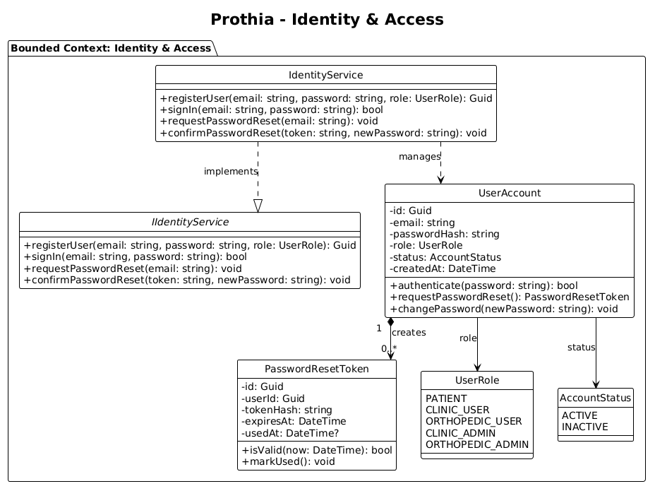

*Class Diagram - Identity & Access.*

#### Rehabilitation Management

El modelo relaciona Patient, ExercisePlan, Exercise, PlanExercise y ExerciseCompletion. RehabilitationService implementa el contrato de aplicación y mantiene las reglas de asignación y registro de cumplimiento.

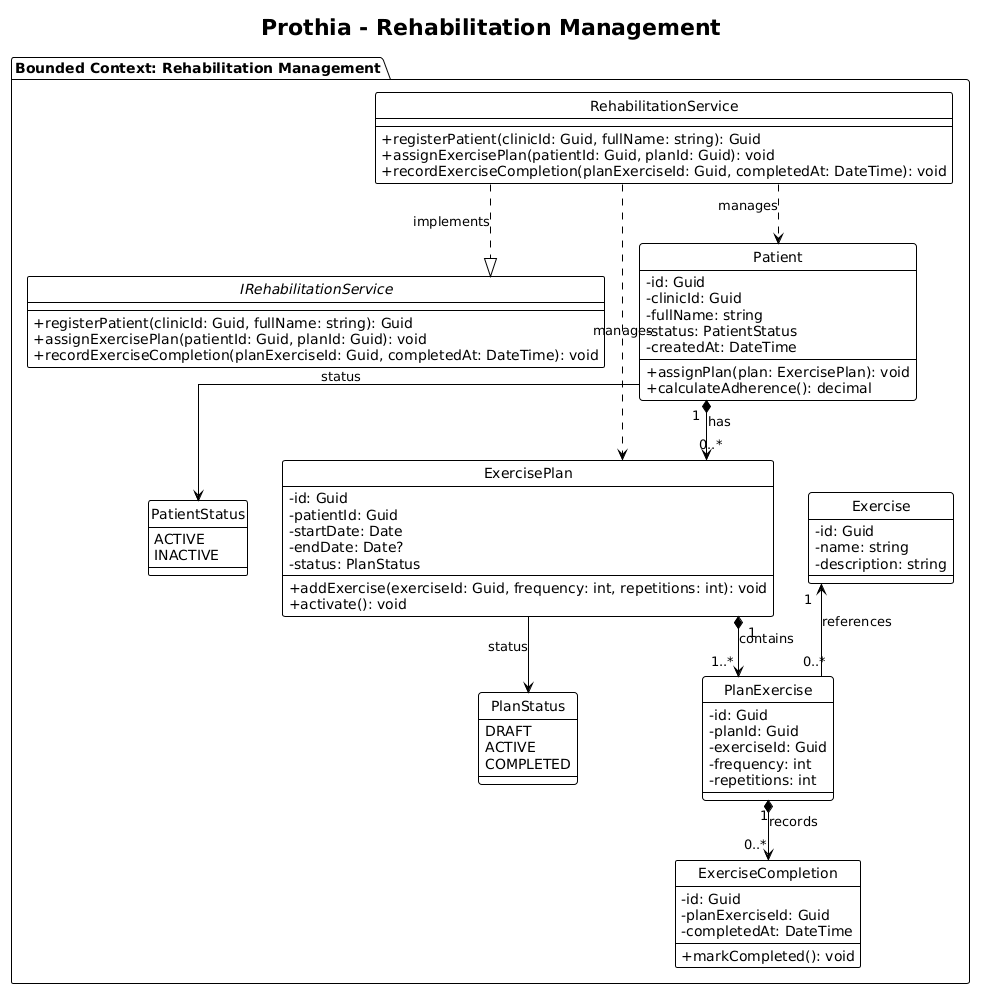

*Class Diagram - Rehabilitation Management.*

#### Biomechanical Monitoring

BiomechanicalSession concentra las mediciones y puede producir una PostureAssessment. ThresholdConfiguration mantiene los límites aplicables al paciente y el servicio coordina recepción, procesamiento y configuración.

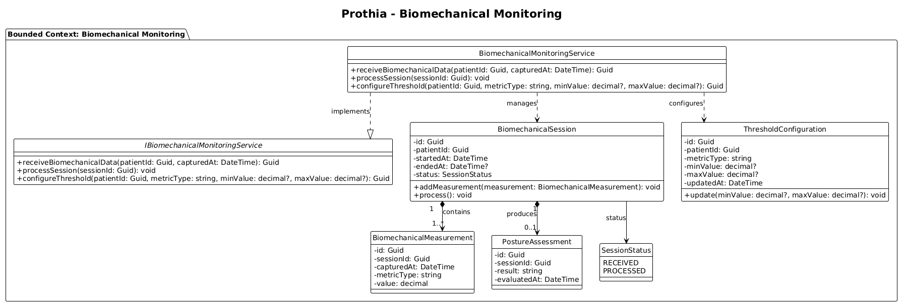

*Class Diagram - Biomechanical Monitoring.*

#### Prosthesis & Maintenance

Prosthesis es el objeto central y se relaciona con TechnicalRecord, MaintenanceSchedule y UsageSummary. El servicio coordina asociación, intervenciones y programación de mantenimiento.

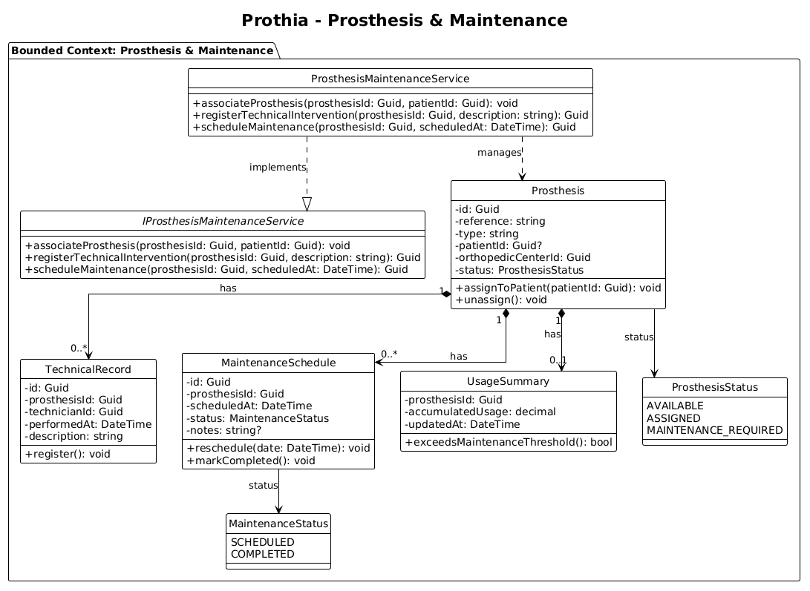

*Class Diagram - Prosthesis & Maintenance.*

#### Communication & Notifications

El contexto modela Message, SharedPatientAccess y Notification. CommunicationService administra mensajería, compartición de información y lectura de notificaciones, manteniendo la coordinación entre actores.

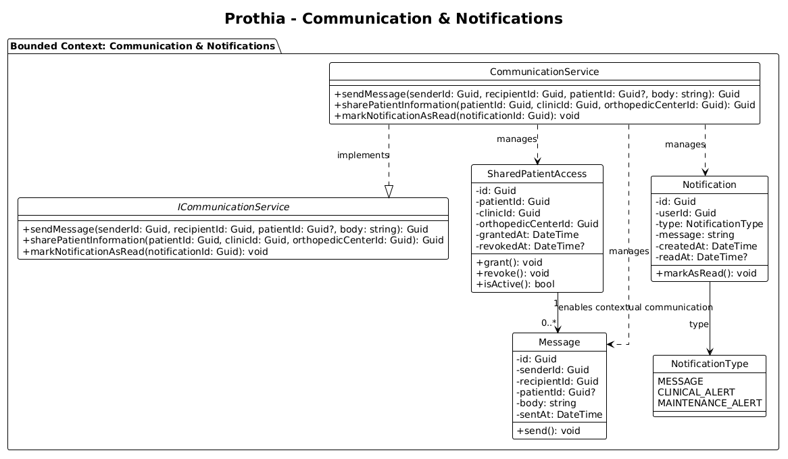

*Class Diagram - Communication & Notifications.*

#### Subscription & Licensing

Subscription y SoftwareLicense modelan el acceso institucional y se vinculan con PaymentTransaction. El servicio contempla confirmación y rechazo de pago, renovación y activación del acceso.

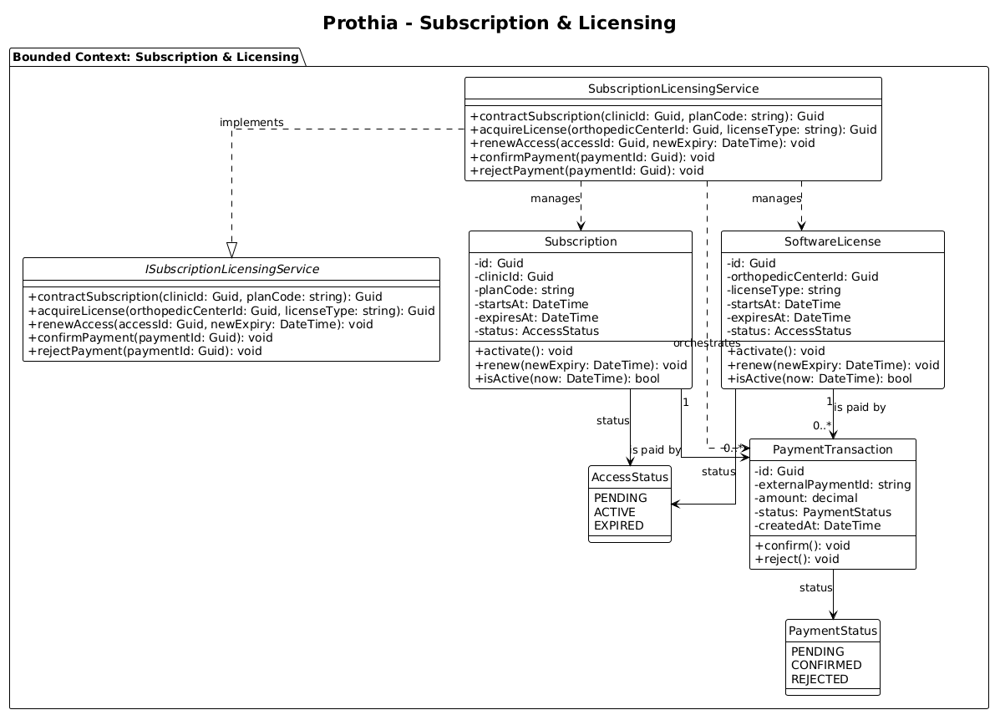

*Class Diagram - Subscription & Licensing.*

#### Lead Management

DemoRequest y NewsletterSubscription representan los dos flujos públicos de captación del Landing Page. LeadManagementService registra solicitudes, suscripciones y bajas del newsletter.

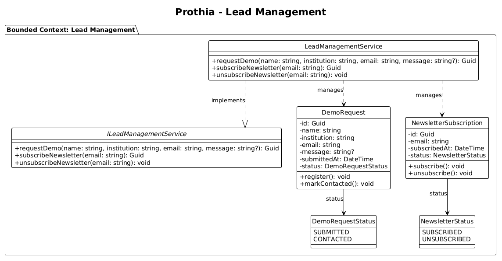

*Class Diagram - Lead Management.*

#### Reporting & Analytics

ReportRequest, ReportFile y ClinicIndicatorReadModel separan solicitudes, resultados exportables e indicadores agregados. ReportService coordina generación, exportación y actualización de indicadores.

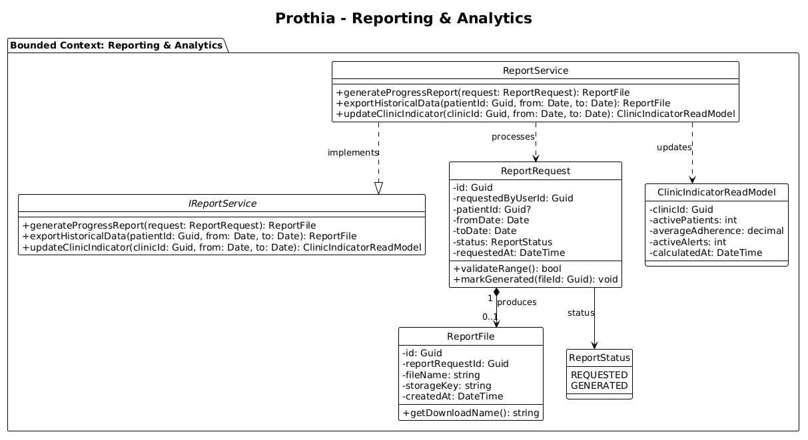

*Class Diagram - Reporting & Analytics.*

## 4.8. Database Design

El diseño utiliza PostgreSQL como DBMS relacional y conserva la separación lógica definida por los Bounded Contexts. Se utiliza `lowercase_snake_case`, `UUID`, `TIMESTAMPTZ`, `DATE` y `NUMERIC`; los diagramas documentan `PK`, `FK`, `UK`, `NOT NULL`, `NULL` y `CHECK`.

Las referencias hacia entidades administradas por otros Bounded Contexts se mantienen mediante identificadores lógicos, aun cuando la primera versión utilice una única instancia de PostgreSQL.

### 4.8.1. Database Diagrams

#### Identity & Access

Persiste las cuentas de usuario y los tokens de recuperación de contraseña. El correo y el hash del token son únicos; una cuenta puede generar cero o varios tokens y used_at permanece en NULL mientras el token no haya sido utilizado.

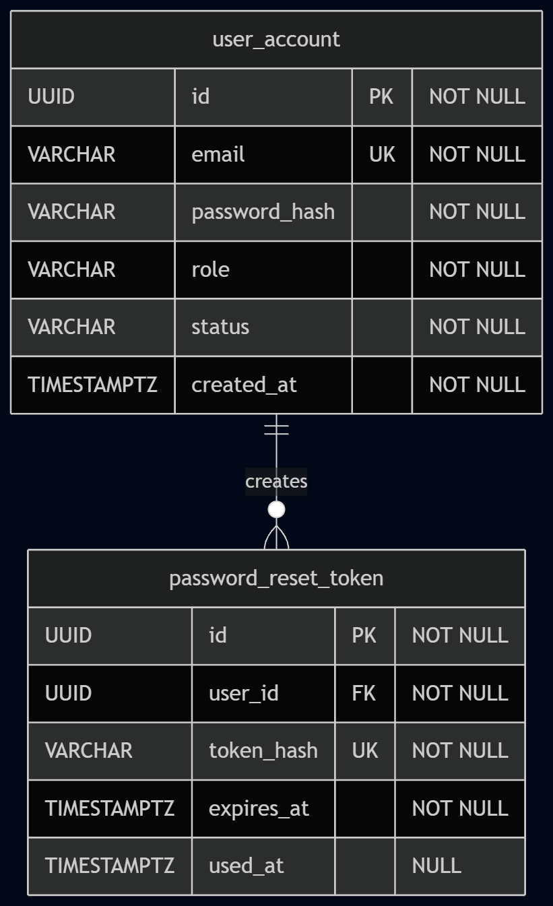

*Database Diagram - Identity & Access.*

#### Rehabilitation Management

Persiste pacientes, planes, ejercicios, asignaciones y cumplimientos. Cada plan contiene uno o más ejercicios; la combinación plan_id + exercise_id es única, frecuencia y repeticiones son positivas y una fecha final no puede ser anterior a la inicial.

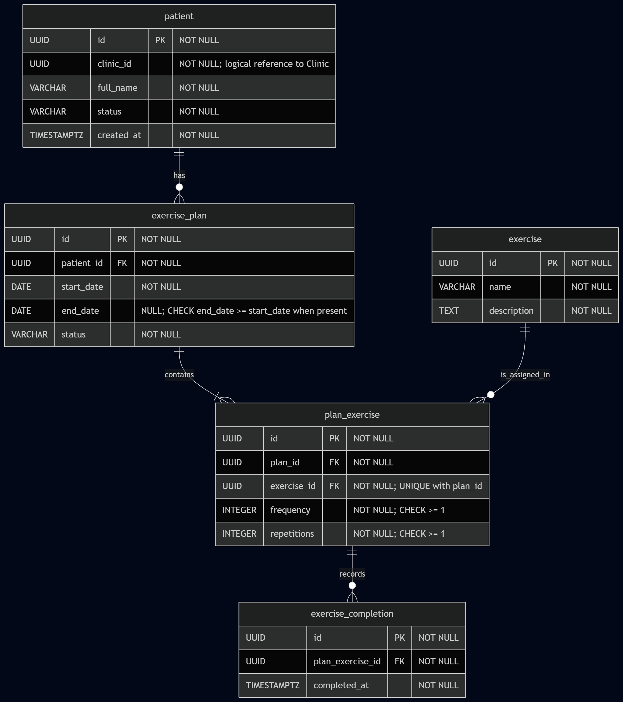

*Database Diagram - Rehabilitation Management.*

#### Biomechanical Monitoring

Persiste sesiones, mediciones, evaluaciones de postura y configuraciones de umbral. Cada sesión contiene una o más mediciones y puede producir como máximo una evaluación; los rangos temporales y límites de umbral mantienen restricciones de integridad.

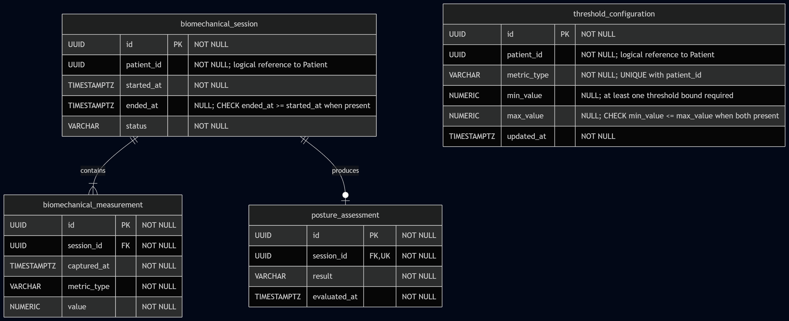

*Database Diagram - Biomechanical Monitoring.*

#### Prosthesis & Maintenance

Persiste prótesis, intervenciones técnicas, mantenimientos programados y resumen de uso. La referencia de la prótesis es única, el paciente asociado puede ser NULL mientras no exista asignación y el uso acumulado no admite valores negativos.

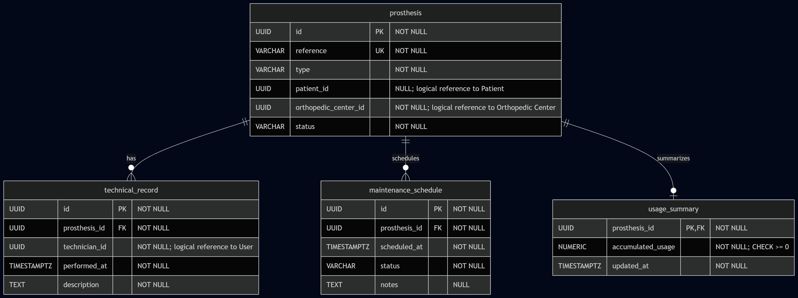

*Database Diagram - Prosthesis & Maintenance.*

#### Communication & Notifications

Persiste mensajes, notificaciones y autorizaciones de compartición. Los identificadores de usuario, paciente, clínica y centro ortopédico se documentan como referencias lógicas a entidades de otros contextos, evitando relaciones artificiales dentro del ERD.

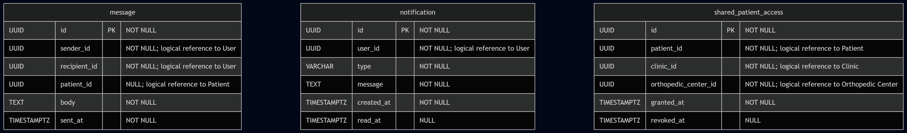

*Database Diagram - Communication & Notifications.*

#### Subscription & Licensing

Persiste suscripciones, licencias y transacciones de pago. Cada pago se asocia con una suscripción o una licencia; exactamente uno de subscription_id o license_id debe tener valor, regla que se implementa mediante una restricción CHECK de exclusión lógica.

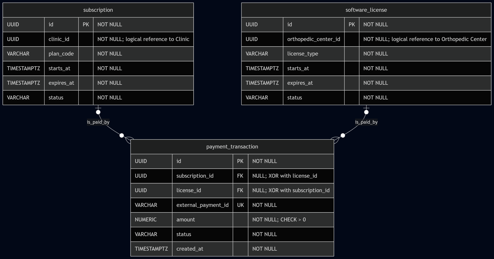

*Database Diagram - Subscription & Licensing.*

#### Lead Management

Persiste solicitudes de demostración y suscripciones al newsletter. Ambos procesos son independientes y el correo del newsletter mantiene una restricción de unicidad.

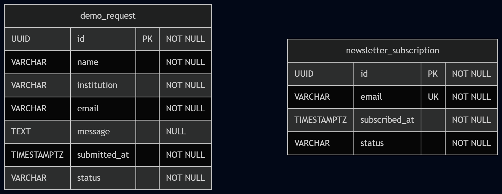

*Database Diagram - Lead Management.*

#### Reporting & Analytics

Persiste solicitudes de reporte, archivos generados y snapshots de indicadores. Una solicitud puede producir como máximo un archivo; el rango de fechas debe ser válido, los contadores no admiten negativos y la adherencia se mantiene entre 0 y 100.

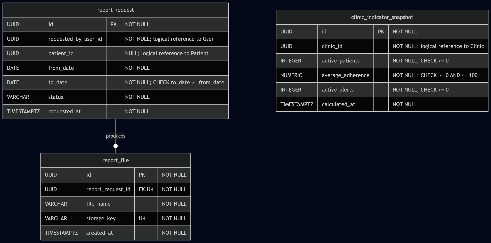

*Database Diagram - Reporting & Analytics.*

