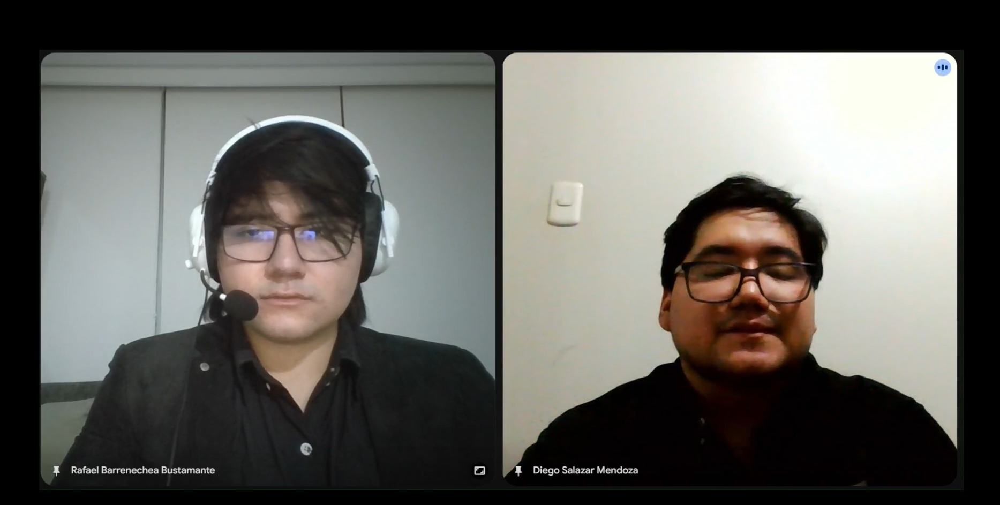
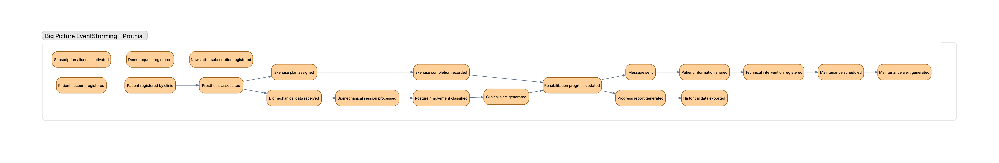

# Capítulo II: Requirements Elicitation & Analysis 

## 2.1. Competidores. 

### Competidor 1: DyCare (ReHub)
DyCare es una empresa de salud digital que ha desarrollado ReHub, una plataforma de telerehabilitación asistida por inteligencia artificial y visión computacional para el tratamiento de afecciones musculoesqueléticas. Proporciona herramientas para la prescripción de ejercicios personalizados, guía interactiva con biofeedback en tiempo real para el paciente desde su hogar y un panel clínico para monitorear la adherencia y evolución del tratamiento. Esta plataforma es reconocida en el sector de la fisioterapia digital por permitir a las clínicas y aseguradoras optimizar el seguimiento remoto sin requerir hardware adicional complejo.

### Competidor 2: Ottobock Digital Solutions
Ottobock Digital Solutions es la división tecnológica del fabricante global de prótesis y órtesis Ottobock, la cual ofrece herramientas digitales y aplicaciones móviles (como connectgo, connectgo.pro y Cockpit) conectadas por Bluetooth a sus prótesis controladas por microprocesador. Proporciona funcionalidades para que los técnicos ortopédicos calibren y configuren modos de movimiento, al tiempo que permite a los usuarios monitorear el estado del dispositivo, el nivel de batería y métricas básicas de actividad física diaria. Esta suite es conocida por su alto nivel de precisión técnica y por facilitar el mantenimiento y control directo de dispositivos protésicos de alta gama.

### Competidor 3: SWORD Health
SWORD Health es una plataforma integral de terapia física digital y telerehabilitación predictiva enfocada en el tratamiento del dolor y la recuperación posquirúrgica. Su solución combina sensores de movimiento inerciales portátiles con un terapeuta digital impulsado por IA (Phoenix), el cual guía y corrige al paciente en tiempo real durante cada sesión mientras un equipo de fisioterapeutas clínicos supervisa su progreso de forma remota a través de la nube. Esta plataforma es ampliamente reconocida en el mercado corporativo y de aseguradoras de salud por reducir significativamente la deserción en las terapias domiciliarias y disminuir costos médicos asociados a cirugías o tratamientos tradicionales.

---

## 2.1.1. Análisis competitivo.

<table>
  <thead>
    <tr>
      <th colspan="6">Competitive Analysis Landscape</th>
    </tr>
    <tr>
      <th colspan="2">¿Por qué llevar a cabo este análisis?</th>
      <th colspan="4">Identificar las soluciones existentes de telerehabilitación y monitoreo de prótesis en el mercado, contrastando sus propuestas de valor frente al enfoque integrado de SeniorsInProcess (paciente–clínica–ortopedia) para detectar ventajas competitivas y oportunidades de posicionamiento.</th>
    </tr>
    <tr>
      <th colspan="2"></th>
      <th>SeniorsInProcess (Prothia)  </th>
      <th>DyCare (Rehub)  </th>
      <th>Ottobock Digital Solutions  </th>
      <th>SWORD Health  </th>
    </tr>
  </thead>
  <tbody>
    <!-- SECCIÓN: Perfil -->
    <tr>
      <td rowspan="2"><b>Perfil</b></td>
      <td><b>Overview</b></td>
      <td>Plataforma web integral de monitoreo biomecánico y seguimiento remoto de rehabilitación para amputados, articulando clínica, paciente y ortopedia.</td>
      <td>Empresa de salud digital (HealthTech) especializada en software de telerehabilitación y análisis de movimiento en tiempo real para lesiones musculoesqueléticas</td>
      <td>Gigante global en diseño, fabricación y soluciones digitales de prótesis/ortesis inteligentes con apps de configuración y telemetría de dispositivos.</td>
      <td>Unicornio de terapia física digital enfocado en la rehabilitación remota guiada por sensores corporales (Digital Therapist) y supervisada por fisioterapeutas.</td>
    </tr>
    <tr>
      <td><b>Ventaja competitiva ¿Qué valor ofrece a los clientes?</b></td>
      <td>Integración en una sola plataforma la clínica, el centro ortopédico y el paciente, permitiendo cruzar datos biomecánicos con historial y mantenimiento protésico</td>
      <td>Algoritmos de visión computacional propios sin hardware obligatorio (+60 puntos anatómicos) y biofeedback visual inmediato de ejercicios.</td>
      <td>Marca de referencia mundial, integración nativa de microprocesadores y sensores mecánicos propietarios en la misma prótesis física.</td>
      <td>Solución integral llave en mano con sensores de movimiento portátiles propietarios, alta adherencia terapéutica y validaciones clínicas masivas.</td>
    </tr>
    <!-- SECCIÓN: Perfil de Marketing -->
    <tr>
      <td rowspan="2"><b>Perfil de Marketing</b></td>
      <td><b>Mercado objetivo</b></td>
      <td>Clínicas de rehabilitación física especializadas, centros de confección ortopédica y pacientes amputados (enfoque inicial en Perú y LATAM).</td>
      <td>Clínicas de fisioterapia, hospitales, aseguradoras de salud y mutuas laborales en Europa y Latinoamérica.</td>
      <td>Ortesistas/protesistas certificados (CPO), clínicas de ortopedia especializada y usuarios de dispositivos protésicos avanzados a nivel global.</td>
      <td>Aseguradoras médicas, grandes corporaciones/empleadores que buscan reducir costos de bajas laborales y pacientes con dolencias musculoesqueléticas.</td>
    </tr>
    <tr>
      <td><b>Estrategias de marketing</b></td>
      <td>Ventas directas B2B a clínicas y ortopedias, pilotos de validación clínica, alianzas académicas/universitarias y demostraciones de producto.</td>
      <td>Inbound marketing médico, acuerdos B2B con mutuas/aseguradoras, participación en ferias sanitarias y pruebas gratuitas para centros clínicos.</td>
      <td>Venta cruzada atada a la compra de prótesis físicas de alta gama, capacitación médica continua y congresos internacionales de ortopedia.</td>
      <td>Modelo B2B2C centrado en beneficios corporativos para empresas ("employer benefits"), reducción demostrada de costos médicos y marketing institucional de alto impacto.</td>
    </tr>
    <!-- SECCIÓN: Perfil de Producto -->
    <tr>
      <td rowspan="3"><b>Perfil de Producto</b></td>
      <td><b>Productos & Servicios</b></td>
      <td>Plataforma web centralizada con dashboard de métricas biomecánicas, alertas de posturas/ejercicios, seguimiento clínico e historial de uso protésico.</td>
      <td>Software Rehub: plataforma de telerehabilitación con IA, biblioteca de más de 3,500 ejercicios terapéuticos y corrección postural en tiempo real.</td>
      <td>Ecosistema de apps (Cockpit, connectgo, Myo Plus) para configuración de modos, nivel de batería, lectura de mioelectrodos y mantenimiento.</td>
      <td>Kit de sensores de movimiento inerciales portátiles, tableta con software de ejercicios interactivos y portal web para el terapeuta clínico.</td>
    </tr>
    <tr>
      <td><b>Precios & Costos</b></td>
      <td>Suscripción anual para clínicas de rehabilitación y licencias de software para centros ortopédicos.</td>
      <td>Planes SaaS recurrentes por número de fisioterapeutas/pacientes activos o contratos corporativos a gran escala con aseguradoras.</td>
      <td>Las aplicaciones básicas son gratuitas/incluidas con el hardware protésico; licencias clínicas avanzadas integradas al costo de las prótesis biónicas.</td>
      <td>Modelo de tarificación por empleado/miembro cubierto (PEPM) o cobro por episodio de tratamiento rehabilitador a las aseguradoras.</td>
    </tr>
    <tr>
      <td><b>Canales de distribución (Web y/o Móvil)</b></td>
      <td>Plataforma Web (SaaS accesible por navegador para clínica/ortopedia) con portal web/móvil responsivo para el paciente.</td>
      <td>Web (portal clínico) y aplicación móvil/tableta (iOS y Android) para pacientes.</td>
      <td>Aplicaciones móviles nativas en Google Play Store y Apple App Store sincronizadas por Bluetooth a los componentes.</td>
      <td>Hardware físico enviado directamente al domicilio del paciente junto a aplicaciones móviles y portal en la nube para los profesionales.</td>
    </tr>
    <!-- SECCIÓN: Análisis SWOT -->
    <tr>
      <td rowspan="5"><b>Análisis SWOT</b></td>
      <td colspan="5">Realice esto para su startup y sus competidores. Sus fortalezas deberían apoyar sus oportunidades y contribuir a lo que ustedes definen como su posible ventaja competitiva.</td>
    </tr>
    <tr>
      <td><b>Fortalezas</b></td>
      <td>
        • Enfoque de nicho centrado específicamente en amputados. 
        • Conexión directa entre la clínica y la ortopedia para mantenimiento. 
        • Arquitectura web accesible y adaptable a diversas prótesis.
      </td>
      <td>
        • Certificación como dispositivo médico (CE Clase IIa). 
        • IA de visión computacional madura y sin hardware adicional requerido. 
        • Biblioteca masiva de ejercicios terapéuticos.
      </td>
      <td>
        • Presencia de marca y red de distribución líder en el mundo. 
        • Hardware y software integrados de fábrica con alta precisión. 
        • Solidez financiera y patentes propietarias.
      </td>
      <td>
        • Solución clínica y tecnológicamente validada a gran escala. 
        • Respaldada por fuerte capitalización y alianzas con grandes aseguradoras. 
        • Experiencia de usuario (UX) simplificada para el paciente.
      </td>
    </tr>
    <tr>
      <td><b>Debilidades</b></td>
      <td>
        • Etapa temprana de desarrollo. 
        • Requiere validar la compatibilidad e integración con diversos sensores. 
        • Menor presupuesto inicial para marketing y homologación médica.
      </td>
      <td>
        • No está especializada en dinámicas de adaptación ni encaje protésico. 
        • No integra a los fabricantes u ortopedias en la gestión técnica del dispositivo.
      </td>
      <td>
        • Ecosistema cerrado (funciona únicamente con dispositivos y componentes Ottobock). 
        • No profundiza en el plan diario de ejercicios fisioterapéuticos en casa.
      </td>
      <td>
        • Solución de alto costo orientada a mercados masivos, poco adaptable a realidades sanitarias de países en desarrollo. 
        • Poca personalización para amputados.
      </td>
    </tr>
    <tr>
      <td><b>Oportunidades</b></td>
      <td>
        • Alta demanda insatisfecha de telemonitoreo protésico asequible en Perú y la región. 
        • Alianzas estratégicas con clínicas locales y talleres ortopédicos. 
        • Reducción de costos de telemedicina postoperatoria.
      </td>
      <td>
        • Expansión de contratos con sistemas públicos de salud y aseguradoras privadas para descongestionar listas de espera. 
        • Incorporación de nuevos módulos de patologías.
      </td>
      <td>
        • Incorporación de analítica predictiva de marcha y desgaste de componentes para ofrecer servicios de mantenimiento programado.
      </td>
      <td>
        • Penetración en nuevos mercados internacionales a través de planes de salud corporativos y convenios con mutuas de trabajo.
      </td>
    </tr>
    <tr>
      <td><b>Amenazas</b></td>
      <td>
        • Resistencia inicial al cambio por parte de profesionales de la salud tradicionales. 
        • Tiempos prolongados de decisión de compra en clínicas y ortopedias. 
        • Barreras en adquisición de sensores biomecánicos compatibles.
      </td>
      <td>
        • Competidores de bajo costo basados en apps móviles sin suscripción corporativa. 
        • Regulaciones crecientes sobre IA y manejo de datos clínicos (RGPD/MDR).
      </td>
      <td>
        • Nuevos fabricantes emergentes de componentes protésicos de código abierto o costo reducido. 
        • Falta de interoperabilidad de sus datos con sistemas de salud de terceros.
      </td>
      <td>
        • Entrada de gigantes de la tecnología médica (MedTech) al sector de la telerehabilitación musculoesquelética. 
        • Cambios en políticas de reembolso de aseguradoras de salud.
      </td>
    </tr>
  </tbody>
</table>

---

### 2.1.2. Estrategias y tácticas frente a competidores
Hemos identificado diversas estrategias y tácticas para diferenciarnos y competir efectivamente con otros actores del mercado de la telerehabilitación y las soluciones tecnológicas protésicas. A continuación, se detallan las principales:

**Estrategias de Diferenciación:**
* **Ecosistema Integrado:** A diferencia de competidores como DyCare (Rehub), que se enfocan en la relación terapeuta-paciente para rehabilitación musculoesquelética general, Prothia articula en una sola plataforma web a las clínicas de rehabilitación, los centros ortopédicos y los pacientes amputados. Esto permite cruzar datos de evolución motriz con métricas de uso y mantenimiento técnico del dispositivo protésico. 
* **Plataforma Multimarca e Interoperable:** Frente a competidores directos como Ottobock Digital Solutions, cuyos sistemas de software están cerrados exclusivamente a sus propios componentes biónicos, Prothia se posiciona como una solución agnóstica. Nuestra plataforma está diseñada para registrar y analizar datos biomecánicos sin importar la marca o fabricante de la prótesis utilizada por el paciente. 
* **Visualización Biomecánica Simplificada:** La plataforma prioriza una interfaz intuitiva con dashboards claros y alertas automáticas de posturas o patrones de marcha incorrectos. Esto permite que tanto el paciente en su hogar como el fisioterapeuta puedan interpretar la información de inmediato sin requerir conocimientos avanzados de ingeniería biomecánica. 

**Tácticas de Marketing:**
* **Demostraciones Clínicas y Pruebas Piloto B2B:** Implementaremos contacto directo con directores de centros de rehabilitación y talleres ortopédicos en Lima, ofreciendo demostraciones en vivo y programas piloto controlados con pacientes reales. Esta táctica nos permite validar la utilidad clínica de la plataforma y acelerar la confianza en el producto frente a competidores internacionales que carecen de presencia local. 
* **Contenido Especializado y Difusión Científica:** Desarrollaremos casos de estudio, artículos y material informativo sobre la importancia del seguimiento domiciliario en pacientes amputados, difundidos en redes profesionales (como LinkedIn) y eventos del sector salud. De esta manera, nos posicionamos como referentes técnicos en rehabilitación protésica basada en datos. 

**Estrategias de Precios:**
* **Suscripción Escalonada para Clínicas:** Ofrecemos planes de suscripción anual adaptados al tamaño y volumen de pacientes de cada centro de rehabilitación, lo que reduce el riesgo financiero de entrada. Esto nos diferencia de competidores como SWORD Health o paquetes de software corporativo extranjeros con costos de implementación elevados. 
* **Licenciamiento Accesible para Talleres Ortopédicos:** A los centros ortopédicos se les ofrece un esquema de licenciamiento flexible orientado al control y seguimiento de mantenimiento de prótesis. Esto facilita que talleres locales independientes incorporen tecnología de monitoreo a sus servicios sin incurrir en grandes inversiones de infraestructura. 

**Expansión y Adaptabilidad:**
* **Enfoque Local Inicial y Expansión Regional:** A diferencia de soluciones globales como Ottobock o SWORD Health, Prothia comenzará su validación e implementación en clínicas y centros ortopédicos de Lima, adaptándose a los flujos de trabajo y presupuestos de la realidad sanitaria peruana antes de expandirse a nivel nacional y latinoamericano. 
* **Alianzas Estratégicas con Centros Ortopédicos y de Rehabilitación Locales:** Estableceremos convenios de colaboración mutua con ortopedias y especialistas locales para co-diseñar módulos clave (como el historial de uso y mantenimiento preventivo), garantizando una adopción fluida y un soporte técnico directo que las plataformas extranjeras no pueden ofrecer en el mercado local.

---

## 2.2. Entrevistas. 

### 2.2.1. Diseño de entrevistas. 
En esta sección, se han planteado diversas preguntas dirigidas a nuestros segmentos objetivos con el objetivo de obtener información relevante, como opiniones o descripciones. Estos datos serán fundamentales para el desarrollo de nuestra solución.

**Preguntas para el Segmento Objetivo 1 – Pacientes Amputados:**
1. ¿Cuál es su edad, estado civil y en qué distrito o ciudad reside?
2. ¿A qué se dedica actualmente y con quiénes vive en su hogar?
3. ¿Hace cuánto tiempo utiliza una prótesis y de qué tipo es (mecánica, hidráulica, mioeléctrica)? 
4. ¿Podrías detallar qué tipo de amputación tienes o qué extremidad se vio afectada?
5. ¿Con qué frecuencia asiste a sus sesiones presenciales de terapia física o rehabilitación? 
6. ¿Qué ejercicios o rutinas le indica su terapeuta para realizar en casa y con qué regularidad los practica? 
7. ¿Qué dificultades o molestias (como dolor, fatiga o desbalances) suele experimentar al realizar sus ejercicios o al caminar solo en casa? 
8. ¿Cómo sabe si está realizando correctamente los movimientos o si mantiene una postura adecuada sin la presencia del profesional? 
9. ¿Cómo se comunica habitualmente con su clínica o con su ortopedia cuando presenta dudas o problemas con el uso de su dispositivo? 
10. ¿Utiliza actualmente su celular, computadora u otra herramienta tecnológica para llevar el registro de su salud o terapias?
11. ¿Qué tan valioso le resultaría contar con una plataforma que le muestre en tiempo real si realiza bien sus movimientos y alerte a su médico si hay errores? 
12. ¿Qué dispositivos (computadora, tableta o teléfono inteligente) utiliza con mayor frecuencia y preferiría para interactuar con esta solución? 
13. En su opinión, ¿qué características o funciones son indispensables para que usted decida usar diariamente esta plataforma? 
14. ¿Qué factores o situaciones harían que usted se desmotive o deje de utilizar una aplicación de seguimiento de su prótesis?

**Preguntas para el Segmento Objetivo 2 – Clínicas de Rehabilitación:**
1. ¿Cuál es su edad, profesión o cargo en la institución y en qué ciudad labora?
2. ¿Hace cuántos años trabaja en el área de rehabilitación física y cuántos pacientes amputados atienden periódicamente en su centro? 
3. ¿Cómo estructuran y coordinan actualmente el plan de rehabilitación y adaptación protésica fuera de las consultas presenciales? 
4. ¿Cómo supervisan y registran el progreso biomecánico o la adherencia del paciente cuando este realiza sus ejercicios en el hogar? 
5. ¿Cuáles son los principales problemas o riesgos que detectan cuando los pacientes no cuentan con seguimiento continuo en sus domicilios? 
6. ¿Qué mecanismos o canales emplean actualmente para compartir información médica con los centros ortopédicos que confeccionan las prótesis? 
7. ¿Utilizan en su clínica algún software clínico, sistema de telemedicina o herramienta digital para evaluar métricas biomecánicas? 
8. ¿Qué tan valioso resultaría para su equipo disponer de un dashboard centralizado que muestre datos biomecánicos y de uso de la prótesis en tiempo real? 
9. ¿Qué impacto tendría en su trabajo contar con alertas automáticas ante posturas incorrectas o compensaciones musculares de los pacientes? 
10. ¿Estaría su clínica dispuesta a adquirir una suscripción anual por una solución digital que optimice el seguimiento y aumente el valor clínico del servicio? 
11. ¿Qué módulos o indicadores considera estrictamente indispensables para que su equipo médico adopte una plataforma de este tipo? 
12. ¿A través de qué dispositivos preferirían los profesionales de su centro acceder a la plataforma (navegador web en PC, laptops, tabletas)? 
13. ¿Qué barreras o problemas operativos podrían desincentivar el uso continuado de este software en su institución? 

**Preguntas para el Segmento Objetivo 3 – Centros Ortopédicos:**
1. ¿Cuál es su edad, especialidad técnica o cargo y en qué ciudad opera su centro ortopédico?
2. ¿A qué se dedica específicamente su taller y cuántas prótesis adaptan o fabrican mensualmente? 
3. ¿Cómo organizan actualmente el calendario de ajustes, revisiones periódicas y mantenimiento de las prótesis entregadas? 
4. ¿Llevan un historial técnico o registro estructurado del estado físico y vida útil de cada componente protésico? ¿Cómo lo gestionan? 
5. ¿Qué dificultades enfrentan para saber con certeza el uso real, desgaste y esfuerzo al que los usuarios someten las prótesis en su vida cotidiana? 
6. ¿Cómo fluye actualmente la comunicación técnica entre su taller y los médicos o fisioterapeutas a cargo de la rehabilitación del paciente? 
7. ¿Han utilizado previamente algún software de gestión de prótesis o telemetría para componentes ortopédicos? Si fue así, ¿cuál fue su experiencia? 
8. ¿Qué tan beneficioso sería para su centro disponer de un portal con el historial de uso y horas de actividad del dispositivo en tiempo real? 
9. ¿De qué manera ayudaría a su negocio recibir alertas preventivas sobre necesidad de mantenimiento o calibración de las piezas? 
10. ¿Estaría su centro ortopédico dispuesto a pagar una licencia de software para optimizar la trazabilidad, posventa y servicio técnico de sus prótesis? 
11. ¿Qué funcionalidades técnicas considera fundamentales para que una herramienta digital sea útil en la rutina de un protesista u ortesista? 
12. ¿En qué dispositivos (computadoras de escritorio del taller, laptops de evaluación o smartphones) necesitarían utilizar la herramienta? 

### 2.2.2. Registro de entrevistas.

#### Segmento Objetivo 2 – Clínicas de Rehabilitación

##### Entrevista 1 – Diego Salazar Mendoza

**Nombres y apellidos:** Diego Salazar Mendoza  
**Edad:** 28 años  
**Profesión:** Licenciado en Tecnología Médica, especialidad de Terapia Física y Rehabilitación  
**Cargo:** Fisioterapeuta  
**Distrito:** Jesús María, Lima (distrito donde labora)  
**Experiencia profesional:** Aproximadamente 5 años, de los cuales cerca de 3 años corresponden al trabajo con pacientes amputados.  
**Fecha de entrevista:** 07/09/2026  
**Nombre del video:** upc-pre-202620-1asi0730-8155-SeniorsInProcess-needfinding-sprint-1  
**Inicio de la entrevista en el video:** 00:00:36  
**Duración de la entrevista:** 00:06:45  
**Enlace:** [Ver entrevista en Microsoft Stream / OneDrive](https://1drv.ms/v/c/59fda0760f9c3f3a/IQDqjRVMClXKQ7ccZqQnU5OAAYrhIv1B8vOdM6lj8bgtF6I?e=E85Kz4)

**Resumen de la entrevista:**

Diego Salazar Mendoza trabaja como fisioterapeuta en un centro de rehabilitación ubicado en Jesús María y cuenta con aproximadamente cinco años de experiencia profesional, de los cuales cerca de tres corresponden al trabajo con pacientes amputados. Señaló que personalmente puede atender entre seis y diez pacientes amputados, mientras que el centro puede tener entre quince y veinte pacientes activos en determinados periodos. También explicó que cada paciente presenta un proceso diferente de adaptación y rehabilitación, incluso cuando existen amputaciones similares.

Durante las sesiones se enseñan ejercicios de equilibrio, fortalecimiento, transferencia de peso y actividades relacionadas con la marcha, los cuales posteriormente deben continuar en el hogar. Para enviar indicaciones utilizan principalmente WhatsApp, mediante textos, imágenes o videos. Sin embargo, una de las principales dificultades aparece cuando el paciente se encuentra fuera de la clínica, ya que el profesional depende en gran medida de lo que este comunica y no cuenta con información objetiva que permita conocer con qué frecuencia realizó los ejercicios o cómo los ejecutó. Algunos pacientes envían videos para recibir observaciones, pero esta práctica no ocurre en todos los casos.

Respecto a la comunicación con los centros ortopédicos, indicó que actualmente no cuentan con un sistema compartido. La comunicación suele realizarse mediante llamadas, WhatsApp o informes, mientras que cada institución mantiene su propia información. En la clínica utilizan un sistema para registrar información clínica y Excel para algunos controles internos, pero no disponen de una plataforma específica que permita monitorear información biomecánica del paciente amputado mientras se encuentra en su hogar.

Finalmente, consideró que una plataforma como Prothia podría resultar útil porque permitiría conocer lo que ocurre entre una sesión y otra, siempre que la información presentada sea fácil de interpretar. Entre las funcionalidades que considera importantes mencionó una ficha organizada del paciente, el plan y cumplimiento de ejercicios, el seguimiento de su evolución, el historial biomecánico, las alertas y mecanismos de comunicación tanto con el paciente como con el centro ortopédico. En relación con una posible suscripción anual, señaló que la decisión de compra corresponde a la administración de la clínica y que, desde su posición como fisioterapeuta, primero necesitaría comprobar el funcionamiento de la solución antes de recomendarla.

### 2.2.3. Análisis de entrevistas.

---

## 2.3. Needfinding. 

### 2.3.1. User Personas. 
En esta sección se presentan las fichas de User Personas construidas a partir de los datos recolectados del análisis de entrevistas a nuestros segmentos objetivos. Estas fichas permiten representar de forma clara y estratégica los perfiles de cada segmento objetivo, considerando sus metas, habilidades, motivaciones y dificultades. De esta manera se integra la perspectiva del usuario y tendencias del sector para identificar oportunidades en el mercado y ofrecer una solución alineada a lo que el usuario necesita.

**Segmento Objetivo 1: Paciente Amputado**

**Segmento Objetivo 2: Clínica de Rehabilitación**

**Segmento Objetivo 3: Centro Ortopédico**

---

### 2.3.2. User Task Matrix. 
En esta sección se presenta el User Task Matrix, construido a partir de los User Persona que representan a los tres segmentos clave identificados:
- Segmento 1: Paciente Amputado
- Segmento 2: Clínica de Rehabilitación
- Segmento 3: Centro Ortopédico

Las tareas fueron identificadas a partir del análisis cualitativo de entrevistas, y cada una fue evaluada según su frecuencia y nivel de importancia para los respectivos perfiles.

|  |  |  |  |
| :--- | :--- | :--- | :--- |
|  |  |  |  |
|  |  |  |  |
|  |  |  |  |
|  |  |  |  |
|  |  |  |  |
|  |  |  |  |

**Análisis:**  
A través del User Task Matrix, podemos identificar las frecuencias e importancias entre los diferentes segmentos que presentamos y usar esta información como guía.

---

### 2.3.3. User Journey Mapping. 
En esta sección se presentan los User Journey Maps de los tres segmentos objetivo. Cada mapa refleja el recorrido actual que estos usuarios realizan para cumplir sus objetivos sin contar aún con una solución tecnológica integrada, mostrando los puntos críticos, emociones, tareas clave y oportunidades de mejora. Estos recorridos nos permiten entender los desafíos que enfrentan los usuarios día a día.

**Segmento Objetivo 1: Paciente Amputado**

**Segmento Objetivo 2: Clínica de Rehabilitación**

**Segmento Objetivo 3: Centro Ortopédico**

---

### 2.3.4. Empathy Mapping. 
En esta sección se presentan los Empathy Maps. Estos nos ayudarán a comprender las experiencias, emociones y pensamientos que expresan los usuarios de cada segmento objetivo.

**Segmento Objetivo 1: Paciente Amputado**

**Segmento objetivo 2:**

**Segmento Objetivo 3: Centro Ortopédico**

---

## 2.4. Big Picture EventStorming

El Big Picture EventStorming permite representar de manera general los principales eventos que ocurren durante el proceso de rehabilitación, monitoreo biomecánico y gestión de la prótesis. Para esta primera aproximación se tomaron como referencia los procesos descritos en las User Stories y las responsabilidades de los tres segmentos objetivo.

El recorrido comienza con el registro y acceso de los usuarios, continúa con el registro del paciente y la asociación de la prótesis, y posteriormente incorpora la asignación de ejercicios, recepción de datos biomecánicos, seguimiento de progreso, alertas, comunicación entre actores y mantenimiento. También se consideran los eventos relacionados con suscripciones, licencias y captación de usuarios desde la Landing Page.

Entre los eventos principales identificados se encuentran: `Patient Registered`, `Prosthesis Associated`, `Exercise Plan Assigned`, `Exercise Completed`, `Biomechanical Data Received`, `Biomechanical Session Processed`, `Posture Classified`, `Clinical Alert Generated`, `Patient Information Shared`, `Technical Intervention Registered`, `Maintenance Scheduled`, `Maintenance Alert Generated`, `Subscription Activated`, `License Activated`, `Demo Request Registered` y `Report Generated`.

A partir de estos eventos se identificaron grupos de responsabilidades que posteriormente son refinados en el Design-Level EventStorming del Capítulo IV.

El código editable del diagrama se encuentra en `diagrams/big_picture_eventstorming.mmd`.

## 2.5. Ubiquitous Language

El Ubiquitous Language reúne los términos principales del dominio de Prothia para que el equipo utilice un mismo significado durante el análisis, diseño e implementación. Los términos se mantienen en inglés y sus definiciones se presentan en español.

| Término | Definición |
|---|---|
| **Amputee Patient** | Persona que ha sufrido una amputación, utiliza una prótesis y participa en un proceso de adaptación y rehabilitación. |
| **Rehabilitation Clinic** | Institución o equipo profesional responsable de evaluar, planificar y realizar seguimiento al proceso de rehabilitación del paciente. |
| **Orthopedic Center** | Establecimiento especializado en la fabricación, adaptación, revisión y mantenimiento de prótesis. |
| **Prosthesis** | Dispositivo utilizado por el paciente para sustituir total o parcialmente una extremidad y apoyar su movilidad. |
| **Rehabilitation Plan** | Conjunto de objetivos y actividades definidas para acompañar la recuperación y adaptación del paciente. |
| **Exercise Plan** | Conjunto de ejercicios asignados a un paciente, incluyendo frecuencia y repeticiones esperadas. |
| **Exercise Completion** | Registro que indica que un paciente realizó un ejercicio perteneciente a su plan vigente. |
| **Adherence** | Nivel de cumplimiento del paciente respecto de los ejercicios y actividades indicadas en su plan de rehabilitación. |
| **Biomechanical Data** | Información obtenida durante el movimiento o uso de la prótesis y utilizada para analizar el desempeño del paciente. |
| **Biomechanical Session** | Periodo de actividad durante el cual se recopilan y procesan datos biomecánicos relacionados con un paciente. |
| **Posture Assessment** | Evaluación del movimiento o postura del paciente a partir de datos biomecánicos y parámetros establecidos. |
| **Biomechanical History** | Conjunto cronológico de registros biomecánicos asociados a un paciente. |
| **Rehabilitation Progress** | Evolución del paciente a partir del cumplimiento de ejercicios y la información registrada durante su rehabilitación. |
| **Clinical Alert** | Aviso generado cuando se identifica una condición biomecánica que requiere la revisión de un profesional de la clínica. |
| **Alert Threshold** | Valor o rango configurado para determinar cuándo un indicador biomecánico debe generar una alerta. |
| **Technical History** | Registro de intervenciones, revisiones y observaciones realizadas sobre una prótesis. |
| **Maintenance** | Actividad de revisión, ajuste o intervención realizada para conservar el funcionamiento adecuado de una prótesis. |
| **Preventive Maintenance** | Mantenimiento programado antes de la aparición de una falla, según fecha o condiciones de uso. |
| **Maintenance Alert** | Aviso dirigido al centro ortopédico cuando una prótesis alcanza una condición que requiere revisión o mantenimiento. |
| **Patient Information Sharing** | Acción mediante la cual la clínica habilita información relevante del paciente al centro ortopédico responsable de su prótesis. |
| **Subscription** | Modalidad de acceso anual utilizada por una clínica para utilizar Prothia. |
| **Software License** | Modalidad de acceso utilizada por un centro ortopédico para emplear las funcionalidades de Prothia. |
| **Demo Request** | Solicitud realizada por un visitante interesado en conocer el funcionamiento de Prothia antes de una posible contratación. |
| **Biomechanical Monitoring** | Seguimiento de información biomecánica generada durante el uso de la prótesis y las actividades de rehabilitación. |
| **Prosthesis Usage** | Información relacionada con el uso acumulado y condiciones de utilización de una prótesis. |
