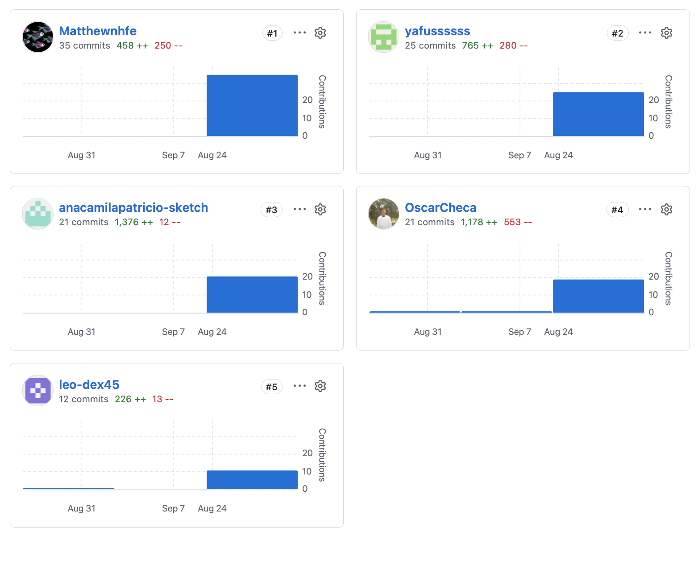

# Project Report Collaboration Insights

El Project Report del equipo se encuentra alojado en el repositorio de informes dentro de la organización de GitHub del equipo:

- **Organización de GitHub:** https://github.com/upc-pre-202620-1asi0730-8155-SeniorsIP
- **Repositorio del Project Report:** https://github.com/upc-pre-202620-1asi0730-8155-SeniorsIP/SeniorsInProcess-Prothia-Report

El informe se elaboró de manera colaborativa utilizando Git y GitHub como plataforma de control de versiones. Cada integrante trabajó las secciones asignadas y registró sus aportes mediante commits al repositorio del informe, lo cual queda evidenciado en los analíticos de colaboración de GitHub y en el Registro de Versiones del Informe. A continuación, se describe el desarrollo de las actividades por cada entrega.

