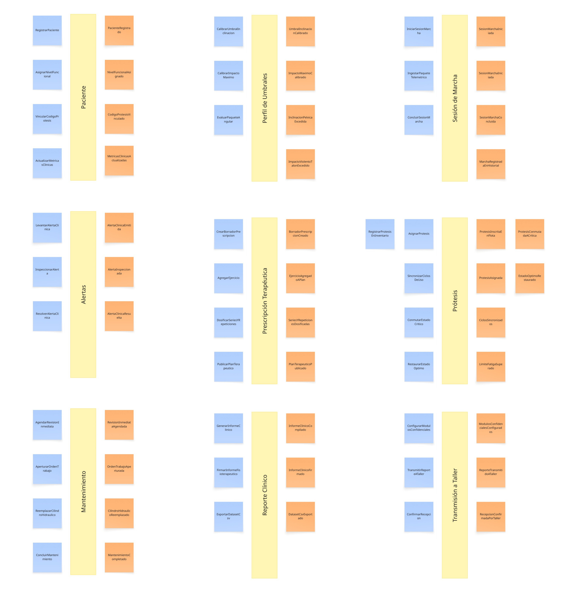
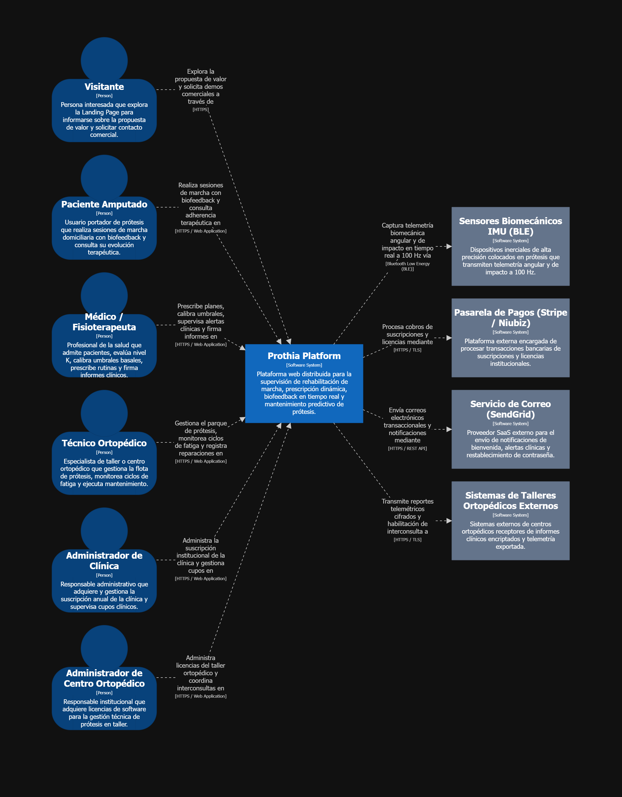
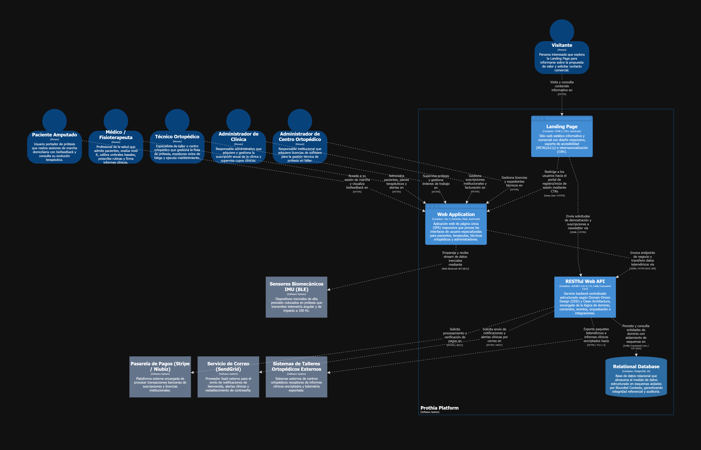
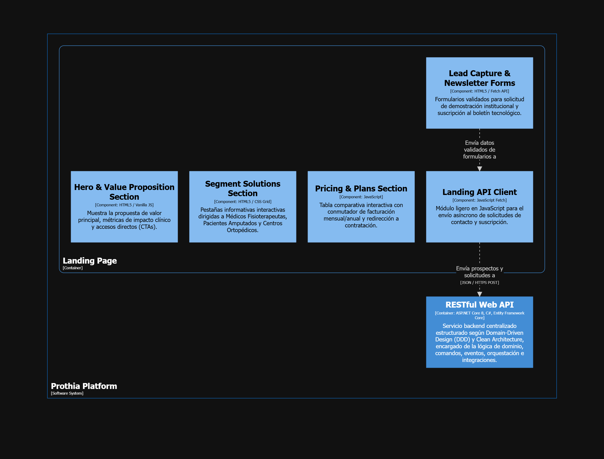
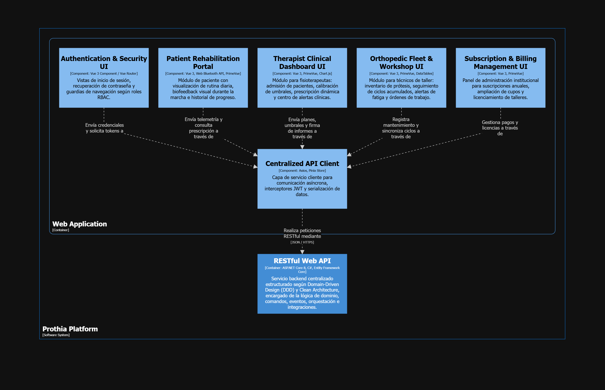
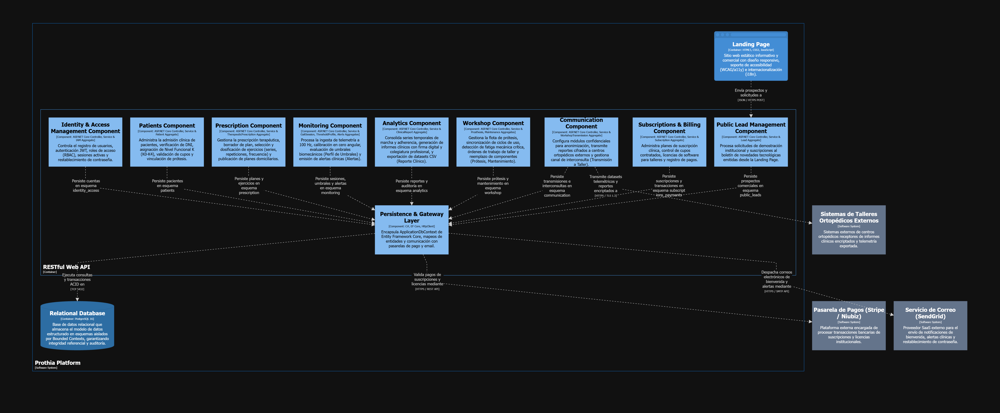
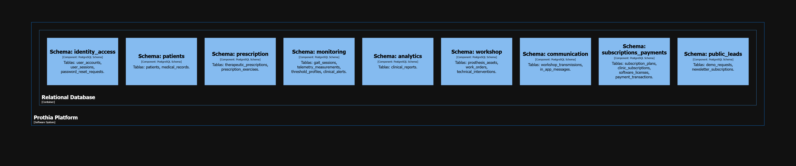

## 4.6. Domain-Driven Software Architecture
### 4.6.1. Design-Level EventStorming

Para pasar del entendimiento general del negocio al diseño de la arquitectura del software, se desarrolló un Design-Level Event Storming. Este proceso se llevó a cabo en tres etapas consecutivas: identificación de Pivotal Points, definición de Aggregates y delimitación de Bounded Contexts.

#### Paso 1: Identificación de Eventos Clave y los Pivotal Points

##### Paso 2: Modelado de Agregados y Comandos

##### Paso 3: Delimitación de Contextos e Integraciones

Miro: https://miro.com/app/board/uXjVHm-Fti8=/?share_link_id=426808403513

## 4.6.2. Software Architecture Context Diagram

El Context Diagram representa a Prothia como un único sistema de software y muestra a los principales actores y sistemas externos con los que interactúa. Los actores considerados son Visitor, Patient, Healthcare Professional (Médico/Fisioterapeuta), Orthopedic Technician (Técnico Ortopédico), Clinic Administrator y Orthopedic Center Admin, de acuerdo con las interacciones principales representadas en la solución. Esta separación permite reflejar las responsabilidades relacionadas con la consulta pública del Landing Page, el seguimiento de rehabilitación, el monitoreo clínico, la gestión técnica de prótesis y la administración de suscripciones institucionales.

Como sistemas externos se consideran Payment Gateway, Email Service, Prosthesis Biomechanical Sensors (IMU) y External Orthopedic Workshop Systems. El Payment Gateway procesa los pagos asociados a suscripciones y licencias; el Email Service soporta recuperación de contraseña y comunicaciones transaccionales; los sensores biomecánicos suministran la telemetría utilizada durante el monitoreo del paciente; y los sistemas de centros ortopédicos externos reciben reportes clínicos cifrados e interconsultas.

C4 System Context Diagram de Prothia.

## 4.6.3. Software Architecture Container Diagrams

La solución se distribuye en cuatro containers principales: Landing Page, Web Application, RESTful API y Relational Database. La Landing Page utiliza HTML5, CSS3 y JavaScript para presentar el modelo de negocio y captar solicitudes públicas. La Web Application utiliza Vue 3, PrimeVue y JavaScript para proporcionar las experiencias autenticadas de los diferentes roles. El RESTful API utiliza ASP.NET Core, C# y Entity Framework Core para exponer servicios, aplicar reglas de negocio y coordinar persistencia e integraciones. La información relacional se almacena en PostgreSQL 16.

Los CTA de la Landing Page redirigen hacia la Web Application. Tanto los formularios públicos como la Web Application se comunican con el RESTful API mediante HTTPS y JSON. El RESTful API es el único container que accede a la base de datos y a los servicios externos.

C4 Container Diagram de Prothia.

## 4.6.4. Software Architecture Components Diagrams

### Landing Page Components

La Landing Page se descompone en Hero & Value Proposition Section, Segment Solutions Section, Pricing & Plans Section, Lead Capture & Newsletter Forms, Landing API Client e Internationalization & Accessibility. Los CTA dirigen a los visitantes hacia la experiencia correspondiente de la Web Application, mientras que los formularios utilizan Landing API Client para registrar información mediante el RESTful API.

C4 Component Diagram - Landing Page.

### Web Application Components

La Web Application separa Authentication & Security UI, Patient Rehabilitation Portal, Therapist Clinical Dashboard UI, Orthopedic Fleet & Workshop UI y Subscription & Billing Management UI. Todas estas experiencias utilizan Centralized API Client para la comunicación asíncrona mediante Axios y Pinia, y comparten recursos de Internationalization & Accessibility, manteniendo una única vía de comunicación con el RESTful API.

C4 Component Diagram - Web Application.

### RESTful API Components

El RESTful API organiza sus componentes principales de acuerdo con los Bounded Contexts identificados en el Design-Level EventStorming: Patients, Prescription, Monitoring, Analytics, Workshop, Communication, Identity & Access Management y Subscriptions & Billing.

Patients Component administra admisión clínica de pacientes, verificación de DNI, asignación de nivel funcional K (K0-K4), validación de cupos y vinculación de prótesis. Prescription Component gestiona prescripción terapéutica, selección de ejercicios, dosificación de series/repeticiones y publicación de planes domiciliarios. Monitoring Component procesa la ingesta de telemetría a 100 Hz, calibración en cero angular, evaluación de umbrales biomecánicos y ciclo de vida de alertas clínicas. Analytics Component consolida series temporales de marcha y adherencia, generación de informes clínicos con firma digital y colegiatura, y exportación de datasets CSV. Workshop Component gestiona el parque de prótesis, sincronización de ciclos de uso, conmutación por fatiga crítica y órdenes de trabajo de taller. Communication Component configura módulos confidenciales para anonimización y transmite reportes cifrados a centros ortopédicos externos.

Adicionalmente, Identity & Access Management Component concentra registro, autenticación JWT, roles y sesiones; Subscriptions & Billing Component administra planes institucionales, licencias y pagos; y Public Lead Management Component procesa solicitudes de demostración y newsletter desde la Landing Page. Persistence & Gateway Layer concentra el acceso mediante Entity Framework Core hacia PostgreSQL y encapsula la comunicación con pasarelas de pago y servicios de correo.

C4 Component Diagram - RESTful API.

### Relational Database Components

El container Relational Database se organiza mediante separación lógica de datos. Los esquemas patients, prescription, monitoring, analytics, workshop, communication, identity_access, subscriptions_payments y public_leads corresponden a los Bounded Contexts y módulos de soporte identificados en el diseño.

Esta organización permite conservar límites de responsabilidad a nivel de persistencia aun cuando PostgreSQL sea desplegado inicialmente como una única instancia.

C4 Component Diagram - Relational Database.

