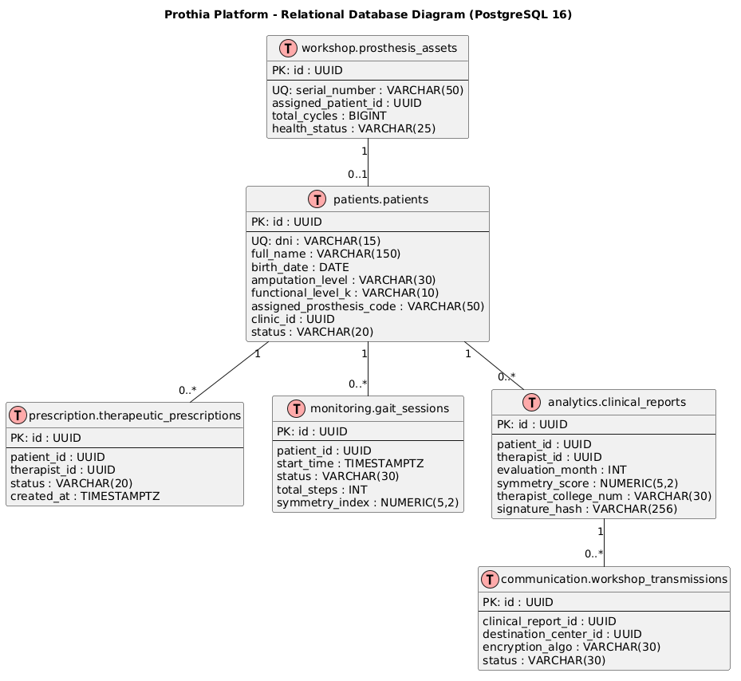
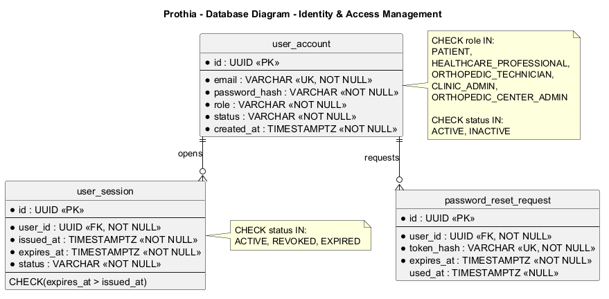
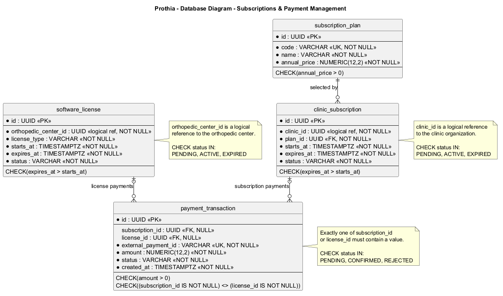
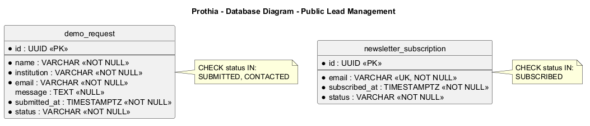

## 4.7. Software Object-Oriented Design

El diseño orientado a objetos se organiza de acuerdo con los Bounded Contexts identificados en el Design-Level EventStorming y con los módulos de soporte necesarios para mantener trazabilidad con las User Stories del Capítulo III. Los nombres de clases, atributos, métodos e interfaces se mantienen en inglés y se especifican relaciones, multiplicidades y visibilidad de miembros.

## 4.7.1. Class Diagrams

### Patients

Modela la admisión clínica y clasificación funcional del paciente amputado. El agregado Patient actúa como Aggregate Root y contiene los objetos de valor PatientId, Dni, AmputationLevel, KLevel y ProsthesisCode. Se relaciona con MedicalRecord para registrar antecedentes e historial clínico. PatientApplicationService coordina los comandos de registro, asignación de nivel funcional y vinculación de prótesis interactuando con IPatientRepository.

Class Diagram - Patients.

### Prescription

Modela la prescripción terapéutica individualizada y la dosificación de rutinas domiciliarias. La raíz de agregado TherapeuticPrescription gestiona el conjunto de ejercicios prescritos mediante la entidad PlanExercise, la cual encapsula series, repeticiones y frecuencia semanal. ThresholdProfile gestiona los límites basales configurados de inclinación coronal y fuerza de impacto de talón.

Class Diagram - Prescription.

### Monitoring

Modela la ingesta continua de señales inerciales y el control cinemático de la marcha. La raíz de agregado GaitSession coordina el ciclo de vida de la sesión (iniciada, concluida, interrumpida por enlace BLE), la calibración en cero angular y la recepción de paquetes TelemetryPacket100Hz con mediciones de inclinación coronal, ángulo sagital e impacto de talón en fuerzas G. ClinicalAlert representa los eventos emitidos ante desviaciones biomecánicas para su inspección y resolución clínica.

Class Diagram - Monitoring.

### Analytics

Modela la consolidación de series temporales, métricas de simetría bilateral, adherencia al tratamiento y formalización del informe clínico mensual. La raíz de agregado ClinicalReport encapsula las recomendaciones médicas redactadas por el fisioterapeuta, la referencia al dataset crudo exportado en formato CSV y el objeto de valor DigitalSignature con código de colegiatura profesional y hash de autenticidad.

Class Diagram - Analytics.

### Workshop

Modela el parque de dispositivos protésicos y la gestión de mantenimiento preventivo y correctivo. La raíz de agregado ProsthesisAsset supervisa el número de serie, ciclos acumulados de flexión/paso y conmutación de estado de salud (óptimo, preventivo al 60%, crítico por fatiga). La raíz de agregado MaintenanceOrder coordina el agendamiento técnico de citas, apertura de órdenes de trabajo, reemplazo de componentes (cilindro hidráulico) mediante TechnicalIntervention y conclusión del mantenimiento con restauración al estado óptimo.

Class Diagram - Workshop.

### Communication

Modela la transmisión segura y confidencial de información clínica hacia talleres y centros ortopédicos externos. La raíz de agregado WorkshopTransmission administra la configuración de módulos confidenciales para anonimización de datos sensibles del paciente, el algoritmo de cifrado aplicado, el estado de envío y el registro de confirmación de recepción técnica. Adicionalmente, InAppMessage soporta la mensajería interna entre el paciente y el equipo de rehabilitación para interconsultas.

Class Diagram - Communication.

### Identity & Access Management

El modelo concentra UserAccount, UserSession y PasswordResetRequest. IdentityService implementa IIdentityService y coordina registro, autenticación, administración de sesiones y recuperación de contraseña. UserRole, AccountStatus y UserSessionStatus representan estados y roles válidos del dominio.

Class Diagram - Identity & Access Management.

### Subscriptions & Payment Management

SubscriptionPlan representa la oferta contratada por una clínica, ClinicSubscription representa su acceso vigente y SoftwareLicense representa la licencia otorgada a un centro ortopédico. PaymentTransaction registra el resultado de cada operación de pago. SubscriptionPaymentService coordina contratación, licenciamiento, confirmación de pagos y vigencia de acceso.

Class Diagram - Subscriptions & Payment Management.

### Public Lead Management

DemoRequest y NewsletterSubscription representan los dos flujos públicos de captación utilizados en la Landing Page. PublicLeadService registra las solicitudes de demostración y las suscripciones al newsletter.

Class Diagram - Public Lead Management.

## 4.8. Database Design

El diseño de base de datos utiliza PostgreSQL como DBMS relacional y conserva la separación lógica establecida por los Bounded Contexts identificados en el Design-Level EventStorming. Los módulos de soporte mantienen su propia persistencia para conservar la trazabilidad con las User Stories especificadas en el Capítulo III.

Se utiliza lowercase_snake_case para tablas y columnas, UUID para identificadores, TIMESTAMPTZ para instantes que representan un momento real en el tiempo, DATE para fechas sin componente horario y NUMERIC para valores exactos. Los diagramas especifican claves primarias, claves foráneas internas, restricciones de unicidad, nulabilidad y reglas CHECK necesarias para mantener la integridad de los datos.

Las relaciones internas de cada Bounded Context se representan mediante claves foráneas. Cuando una entidad necesita identificar información administrada por otro contexto, se conserva únicamente el identificador como referencia lógica, evitando introducir dependencias de persistencia que mezclen responsabilidades de dominio.

### 4.8.1. Database Diagrams

#### Relational Database Model Diagram

Representa la estructura relacional integral de Prothia Platform en PostgreSQL 16, mostrando las tablas principales de cada Bounded Context y la trazabilidad de referencias lógicas entre pacientes, prescripciones, sesiones telemétricas, reportes, prótesis y transmisiones técnicas.

Database Diagram - Relational Database Model.

#### Patients

El esquema patients persiste los datos de admisión clínica de pacientes amputados y sus expedientes médicos basales mediante las tablas patients y medical_records. El DNI del paciente es único y se restringe el nivel de amputación y el nivel funcional K a valores válidos del dominio mediante restricciones CHECK.

Database Diagram - Patients.

#### Prescription

El esquema prescription persiste las prescripciones terapéuticas domiciliarias y los ejercicios dosificados mediante therapeutic_prescriptions y prescription_exercises, además de almacenar los límites basales en threshold_profiles. Se asegura unicidad por ejercicio dentro de cada plan y valores positivos para repeticiones y series.

Database Diagram - Prescription.

#### Monitoring

El esquema monitoring persiste las sesiones de marcha domiciliaria en gait_sessions, las mediciones inerciales a 100 Hz en telemetry_measurements y las alertas críticas emitidas por desviación biomecánica en clinical_alerts. Se indexa la combinación de sesión y número de secuencia para optimizar consultas temporales.

Database Diagram - Monitoring.

#### Analytics

El esquema analytics persiste los reportes clínicos mensuales en clinical_reports, registrando las puntuaciones de simetría bilateral, porcentaje de adherencia, recomendaciones médicas y la firma digital del fisioterapeuta con número de colegiatura y hash criptográfico.

Database Diagram - Analytics.

#### Workshop

El esquema workshop persiste el parque de prótesis en prosthesis_assets, controlando ciclos acumulados y límite de fatiga, las órdenes de mantenimiento en work_orders y las intervenciones técnicas con recambio de piezas en technical_interventions. El número de serie de cada prótesis es único.

Database Diagram - Workshop.

#### Communication

El esquema communication persiste las transmisiones cifradas a centros ortopédicos externos en workshop_transmissions, controlando la anonimización de DNI y acuse de recibo técnico, así como los mensajes de interconsulta en in_app_messages.

Database Diagram - Communication.

#### Identity & Access Management

El modelo persiste cuentas de usuario, sesiones y solicitudes de recuperación de contraseña. El correo de cada cuenta y el hash de cada token de recuperación son únicos. Una cuenta puede originar múltiples sesiones y solicitudes de recuperación; las sesiones controlan su periodo de vigencia y las solicitudes conservan used_at en NULL mientras no hayan sido utilizadas.

Database Diagram - Identity & Access Management.

#### Subscriptions & Payment Management

El modelo persiste planes de suscripción, suscripciones de clínicas, licencias de software y transacciones de pago. Cada suscripción referencia el plan contratado y cada transacción corresponde a una suscripción o a una licencia, pero no a ambas simultáneamente. Esta exclusión se controla mediante una restricción CHECK.

Los importes deben ser positivos y las fechas de expiración deben ser posteriores al inicio del periodo contratado.

Database Diagram - Subscriptions & Payment Management.

#### Public Lead Management

El módulo persiste las solicitudes de demostración y las suscripciones al newsletter provenientes del Landing Page. Ambos procesos son independientes. Las solicitudes conservan la institución y los datos de contacto necesarios para su seguimiento, mientras que el correo utilizado para el newsletter mantiene una restricción de unicidad.

Database Diagram - Public Lead Management.

