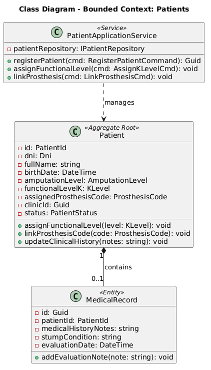
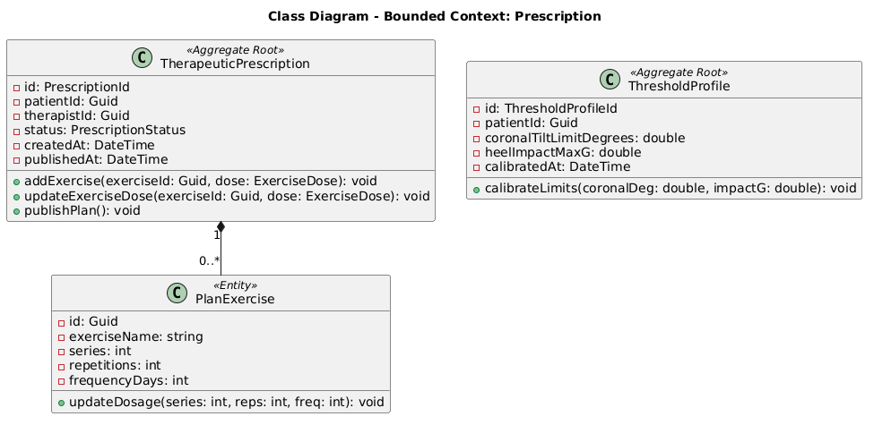
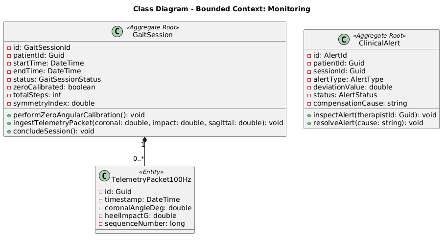
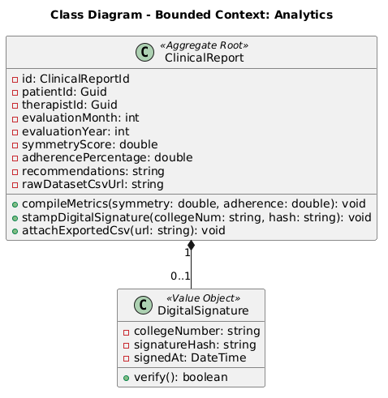
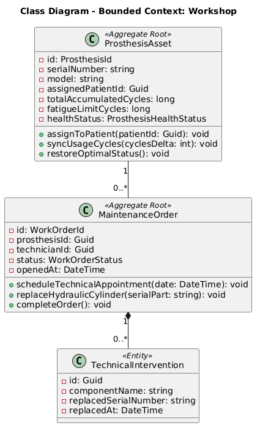
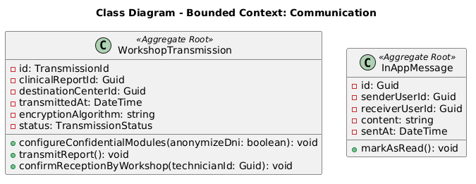
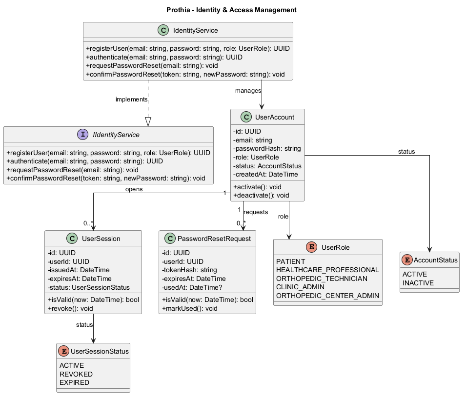
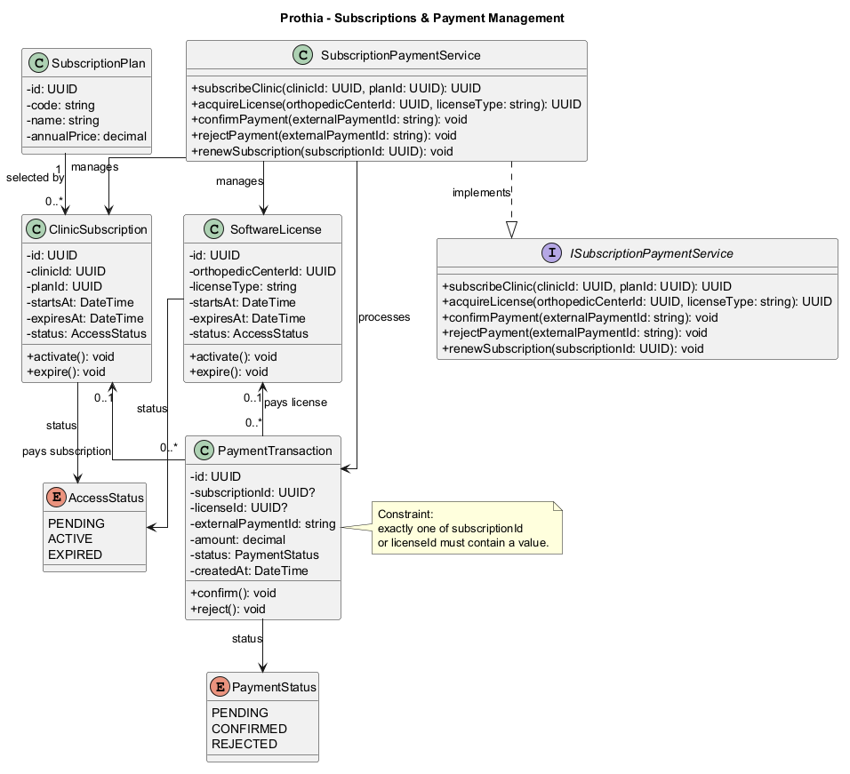
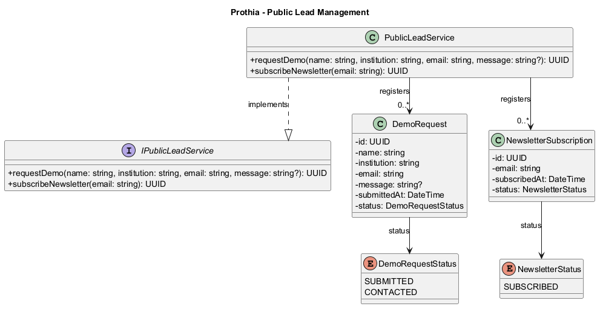

## 4.7. Software Object-Oriented Design

El diseño orientado a objetos se organiza de acuerdo con los Bounded Contexts identificados en el Design-Level EventStorming y con los módulos de soporte necesarios para mantener trazabilidad con las User Stories del Capítulo III. Los nombres de clases, atributos, métodos e interfaces se mantienen en inglés y se especifican relaciones, multiplicidades y visibilidad de miembros.

## 4.7.1. Class Diagrams

### Patients

Modela la admisión clínica y clasificación funcional del paciente amputado. El agregado Patient actúa como Aggregate Root y contiene los objetos de valor PatientId, Dni, AmputationLevel, KLevel y ProsthesisCode. Se relaciona con MedicalRecord para registrar antecedentes e historial clínico. PatientApplicationService coordina los comandos de registro, asignación de nivel funcional y vinculación de prótesis interactuando con IPatientRepository.

Class Diagram - Patients.

### Prescription

Modela la prescripción terapéutica individualizada y la dosificación de rutinas domiciliarias. La raíz de agregado TherapeuticPrescription gestiona el conjunto de ejercicios prescritos mediante la entidad PlanExercise, la cual encapsula series, repeticiones y frecuencia semanal. ThresholdProfile gestiona los límites basales configurados de inclinación coronal y fuerza de impacto de talón.

Class Diagram - Prescription.

### Monitoring

Modela la ingesta continua de señales inerciales y el control cinemático de la marcha. La raíz de agregado GaitSession coordina el ciclo de vida de la sesión (iniciada, concluida, interrumpida por enlace BLE), la calibración en cero angular y la recepción de paquetes TelemetryPacket100Hz con mediciones de inclinación coronal, ángulo sagital e impacto de talón en fuerzas G. ClinicalAlert representa los eventos emitidos ante desviaciones biomecánicas para su inspección y resolución clínica.

Class Diagram - Monitoring.

### Analytics

Modela la consolidación de series temporales, métricas de simetría bilateral, adherencia al tratamiento y formalización del informe clínico mensual. La raíz de agregado ClinicalReport encapsula las recomendaciones médicas redactadas por el fisioterapeuta, la referencia al dataset crudo exportado en formato CSV y el objeto de valor DigitalSignature con código de colegiatura profesional y hash de autenticidad.

Class Diagram - Analytics.

### Workshop

Modela el parque de dispositivos protésicos y la gestión de mantenimiento preventivo y correctivo. La raíz de agregado ProsthesisAsset supervisa el número de serie, ciclos acumulados de flexión/paso y conmutación de estado de salud (óptimo, preventivo al 60%, crítico por fatiga). La raíz de agregado MaintenanceOrder coordina el agendamiento técnico de citas, apertura de órdenes de trabajo, reemplazo de componentes (cilindro hidráulico) mediante TechnicalIntervention y conclusión del mantenimiento con restauración al estado óptimo.

Class Diagram - Workshop.

### Communication

Modela la transmisión segura y confidencial de información clínica hacia talleres y centros ortopédicos externos. La raíz de agregado WorkshopTransmission administra la configuración de módulos confidenciales para anonimización de datos sensibles del paciente, el algoritmo de cifrado aplicado, el estado de envío y el registro de confirmación de recepción técnica. Adicionalmente, InAppMessage soporta la mensajería interna entre el paciente y el equipo de rehabilitación para interconsultas.

Class Diagram - Communication.

### Identity & Access Management

El modelo concentra UserAccount, UserSession y PasswordResetRequest. IdentityService implementa IIdentityService y coordina registro, autenticación, administración de sesiones y recuperación de contraseña. UserRole, AccountStatus y UserSessionStatus representan estados y roles válidos del dominio.

Class Diagram - Identity & Access Management.

### Subscriptions & Payment Management

SubscriptionPlan representa la oferta contratada por una clínica, ClinicSubscription representa su acceso vigente y SoftwareLicense representa la licencia otorgada a un centro ortopédico. PaymentTransaction registra el resultado de cada operación de pago. SubscriptionPaymentService coordina contratación, licenciamiento, confirmación de pagos y vigencia de acceso.

Class Diagram - Subscriptions & Payment Management.

### Public Lead Management

DemoRequest y NewsletterSubscription representan los dos flujos públicos de captación utilizados en la Landing Page. PublicLeadService registra las solicitudes de demostración y las suscripciones al newsletter.

Class Diagram - Public Lead Management.

