# Capítulo V: Product Implementation, Validation & Deployment

## 5.1 Software Configuration Management

La gestión en **SeniorsInProcess (Prothia)** incluye el código fuente, documentación, prototipos y configuraciones del entorno de desarrollo de la plataforma web de monitoreo y seguimiento de rehabilitación de pacientes amputados. El proyecto contempla distintos productos digitales, incluyendo una Landing Page institucional, una aplicación web para clínicas de rehabilitación y centros ortopédicos, y servicios backend orientados al procesamiento de datos biomecánicos y de uso de prótesis en tiempo real. El equipo adopta prácticas basadas en GitFlow, Conventional Commits y Semantic Versioning, asegurando un flujo de trabajo colaborativo y organizado.

### 5.1.1. Software Development Environment Configuration

| Categoría / Actividad | Nombre del Producto | Propósito de Uso en el Proyecto | Tipo / Plataforma | Ruta de Referencia / Descarga |
|---|---|---|---|---|
| Project Management |  | Gestión e itinerario de tareas del proyecto mediante tableros organizados por estados (To-Do, In Progress, Done), clave para el seguimiento de entregables como el reporte y la landing page. | SaaS | https://trello.com |
| Team Communication |  | Plataforma principal de comunicación remota para la realización de reuniones de equipo sincrónicas, planificación de Sprints y coordinación general. | SaaS / Desktop | https://discord.com/ |
| Requirements Management |  | Estructuración de ideas, diagramación de flujos de sistema, análisis del negocio y ejecución de la sesión de Event Storming para el ecosistema IoT. | SaaS | https://miro.com |
| Requirements Management | 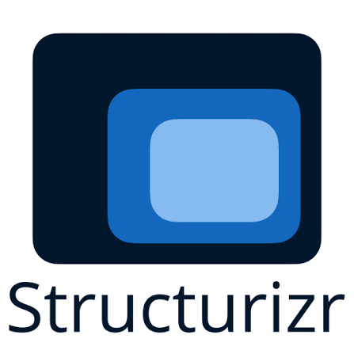 | Modelado de la arquitectura de software del sistema DomotiCore bajo el modelo C4, representando los componentes clave (dashboard, gateway, nodos IoT y servicios de monitoreo). | SaaS / Desktop | https://structurizr.com |
| Product UX/UI Design |  | Diseño visual y prototipado interactivo de las interfaces del sistema, incluyendo el dashboard centralizado, paneles de control de dispositivos y visualización de consumo energético. | SaaS / Desktop | https://www.figma.com |
| Product UX/UI Design |  | Elaboración de diagramas de flujo de trabajo, arquitectura técnica y diseño de procesos operativos del sistema. | SaaS | https://www.lucidchart.com |
| Software Development | 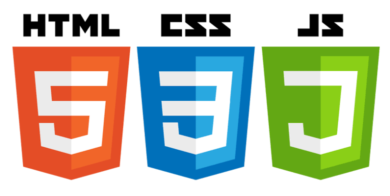 | Lenguajes y estándares base utilizados para el desarrollo del frontend web, las interfaces de usuario y la Landing Page del producto. | Lenguajes / Estándares | https://developer.mozilla.org/es/docs/Web |
| Software Development |  | Entorno de desarrollo integrado (IDE) principal utilizado para la programación, edición y depuración del código fuente del frontend. | Desktop | https://www.jetbrains.com/webstorm/download |
| Software Testing |  | Lenguaje de especificación para definir escenarios de prueba BDD (Behavior-Driven Development) basados en historias de usuario (control remoto, automatizaciones por horario y alertas de consumo). | Estándar / DSL | https://cucumber.io/docs/gherkin/reference |
| Software Documentation | 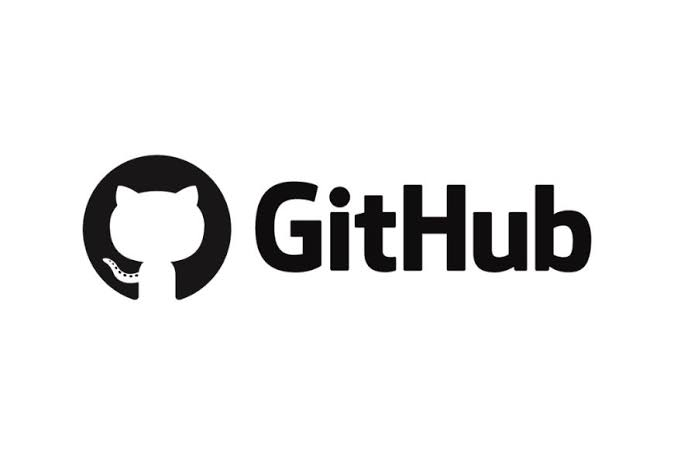 | Repositorio central del proyecto para el control de versiones distribuido, registro de commits, trabajo colaborativo y alojamiento de la documentación del sistema. | SaaS | https://github.com |
| Software Deployment |  | Servicio de alojamiento y despliegue continuo para la Landing Page pública del producto, permitiendo exponer la propuesta de valor de DomotiCore. | SaaS | https://pages.github.com |

### 5.1.2 Source Code Management

La gestión de código fuente del proyecto **Prothia (SeniorsInProcess)** se realiza mediante la plataforma **GitHub**, permitiendo un control de versiones en entorno de trabajo colaborativo. Se han definido repositorios independientes para cada producto digital.

#### 5.1.2.1 Repositories

| Product | Repository URL | Description |
| :--- | :--- | :--- |
| **Organization** | [SeniorsInProcess-Prothia-1ASI0729](https://github.com/SeniorsInProcess-Prothia-1ASI0729) --- [https://github.com/SeniorsInProcess-Prothia-1ASI0729] --- | Organización donde se ubican todos los repositorios del proyecto. |
| **Landing Page** | [Prothia-Business-Web-Page](https://github.com/upc-pre-202620-1asi0730-8155-SeniorsIP/SeniorsInProcess-Prothia-LandingPage) --- [https://github.com/upc-pre-202620-1asi0730-8155-SeniorsIP/SeniorsInProcess-Prothia-LandingPage] --- | Repositorio de la Landing Page institucional del proyecto. |
| **Frontend Web Application** | [Prothia-Front-End](https://github.com/upc-pre-202620-1asi0730-8155-SeniorsIP/SeniorsInProcess-Prothia-Frontend) --- [https://github.com/upc-pre-202620-1asi0730-8155-SeniorsIP/SeniorsInProcess-Prothia-Frontend] --- | Aplicación web para el monitoreo y seguimiento de la rehabilitación de pacientes amputados. |
| **Backend Web Services** | [Prothia-Back-end](https://github.com/upc-pre-202620-1asi0730-8155-SeniorsIP/SeniorsInProcess-Prothia-Backend) --- [https://github.com/upc-pre-202620-1asi0730-8155-SeniorsIP/SeniorsInProcess-Prothia-Backend] --- | API REST y lógica de procesamiento de datos biomecánicos y de uso de prótesis. |
| **Documentation Repository** | [Prothia-Report](https://github.com/upc-pre-202620-1asi0730-8155-SeniorsIP/SeniorsInProcess-Prothia-Report/tree/develop) --- [https://github.com/upc-pre-202620-1asi0730-8155-SeniorsIP/SeniorsInProcess-Prothia-Report/tree/develop] --- | Documentación técnica, reportes y entregables del proyecto. |
---

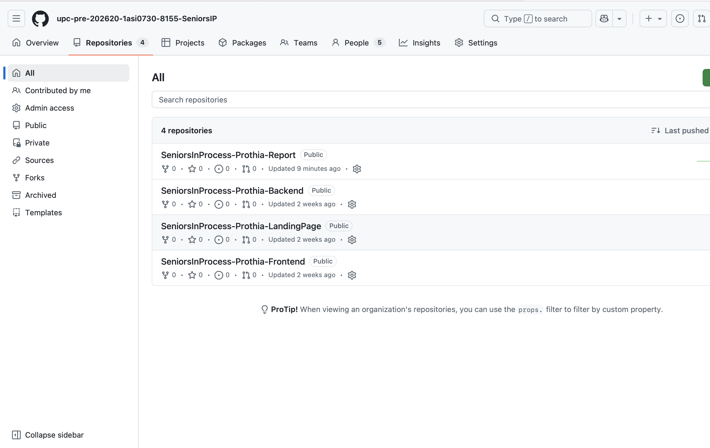

#### 5.1.2.2 GitFlow Workflow

El equipo adopta **GitFlow** como estrategia de branching para mantener la estabilidad.

* **Main Branch**: Contiene únicamente versiones estables y aprobadas del proyecto listas para producción.
    * `main`
* **Develop Branch**: Rama principal de integración donde se consolidan las funcionalidades desarrolladas antes de integrarse en producción.
    * `develop`
* **Feature Branches**: Cada nueva funcionalidad se desarrolla en una rama independiente para evitar conflictos en el código base.
    * **Naming Convention**: `feature/<feature-name>`
    * **Examples**: `feature/patient-monitoring-dashboard`, `feature/biomechanical-data-tracking`
* **Hotfix Branches**: Ramas de emergencia para corregir errores críticos detectados directamente en producción.
    * **Naming Convention**: `hotfix/<issue-description>`

#### 5.1.2.3 Semantic Versioning

El proyecto utiliza **Semantic Versioning 2.0.0** para controlar las versiones de los productos digitales de Prothia.

| Version | Description |
| :--- | :--- |
| **v1.0.0** | Primera versión estable y funcional del producto. |
| **v1.1.0** | Incorporación de nuevas funcionalidades menores. |
| **v1.1.1** | Corrección de errores menores. |
| **v2.0.0** | Cambios mayores que incluyen modificaciones estructurales incompatibles. |

#### 5.1.2.4 Conventional Commits

Se adopta el estándar de **Conventional Commits** para mantener un historial de cambios limpio y fácil de verificar por el equipo.

| Prefix | Purpose |
| :--- | :--- |
| **feat** | Implementación de nuevas funcionalidades. |
| **fix** | Corrección de errores o bugs. |
| **docs** | Actualizaciones en la documentación del repositorio. |
| **style** | Cambios que no afectan la lógica (espaciados, formatos, CSS). |
| **refactor** | Reestructuración del código existente sin cambiar su funcionalidad. |
| **test** | Corrección de pruebas unitarias o de integración. |

**Examples:**
* `feat: implement patient rehabilitation dashboard`
* `docs: update sprint 1 documentation`
* `fix: correct biomechanical data sync error`
* `style: improve clinic panel spacing`

## 5.2. Landing Page, Services & Applications Implementation

### 5.2.1. Sprint 1

Durante este primer sprint, el equipo se enfocó en la implementación de la Landing Page de Prothia, estableciendo el principal canal de comunicación pública y captación para la plataforma biomecánica.  

### 5.2.1.1. Sprint Planning 1 

En esta sección se detalla la reunión de planificación del primer sprint, donde se definieron los objetivos y la capacidad del equipo. 

| **Sprint #** | Sprint 1 |
| :--- | :--- |
| **Sprint Planning Background** | Reunión inicial para definir las prioridades del producto, enfocándonos en establecer la presencia web pública y habilitar la captación de usuarios interesados mediante la Landing Page. |
| **Date** | 2026-09-03 |
| **Time** | 20:00 PM |
| **Location** | Microsoft Teams Group Call |
| **Prepared By** | Patricio Farias, Ana Camila |
| **Attendees (to planning meeting)** | Patricio Farias, Ana Camila / Checa Burga, Oscar Diego / Dextre Flores, Leonardo Felix / Salcedo Correa, Carlos Mathhew / Barrenechea Bustamante, Rafael Andre |
| **Sprint n - 1 Review Summary** | Durante la fase preliminar, el equipo definió la arquitectura de información, elaboró los wireframes y mock-ups, y configuró los repositorios en GitHub junto con el tablero de Trello. Se revisaron y aprobaron los diseños iniciales que servirán como base para la maquetación web. |
| **Sprint n - 1 Retrospective Summary** | **Start:** Realizar sincronizaciones de avance cortas para identificar bloqueos técnicos a tiempo. **Continue:** Mantener la revisión cruzada de diseños y la buena distribución de las tareas. **Stop:** Retrasar la creación de ramas (branches) en el repositorio hasta el momento de escribir el código. |
| **Sprint Goal & User Stories** | |
| **Sprint 1 Goal** | Our focus is on implementing the core information architecture and functionalities of the Prothia landing page. We believe it delivers a clear value proposition to amputee patients, rehabilitation clinics, and orthopedic centers. This will be confirmed when visitors are able to successfully navigate the platform's features, review access plans, and submit a clinical demonstration request. |
| **Sprint 1 Velocity** | 6 |
| **Sum of Story Points** | 6 |

### 5.2.1.2. Aspect Leaders and Collaborators 

A continuación, se detalla la matriz de liderazgo y colaboración (LACX) para los aspectos clave abordados en este sprint.  

| Team Member (Last Name, First Name) | GitHub Username | Landing Page (HTML/CSS/JS) Leader (L) / Collaborator (C) | UX/UI & Prototyping Leader (L) / Collaborator (C) | Project Documentation Leader (L) / Collaborator (C) |
| :--- | :--- | :---: | :---: | :---: |
| Barrenechea Bustamante, Rafael Andre | yafussssss | C | C | C |
| Checa Burga, Oscar Diego | OscarCheca | C | C | L |
| Dextre Dextre Flores, Leonardo | Leo-dex45 | C | C | C |
| Patricio Farias, Ana Camila | anacamilapatricio-sketch | C | L | L |
| Salcedo Correa, Carlos Mathhew | Matthewnhfe | L | L | C |

### 5.2.1.3. Sprint Backlog 1 
Para organizar el flujo de trabajo, las tareas se gestionaron mediante **Trello**. A continuación se desglosan las historias de usuario priorizadas de la épica EP-09 y sus respectivas tareas. 

**Figura**

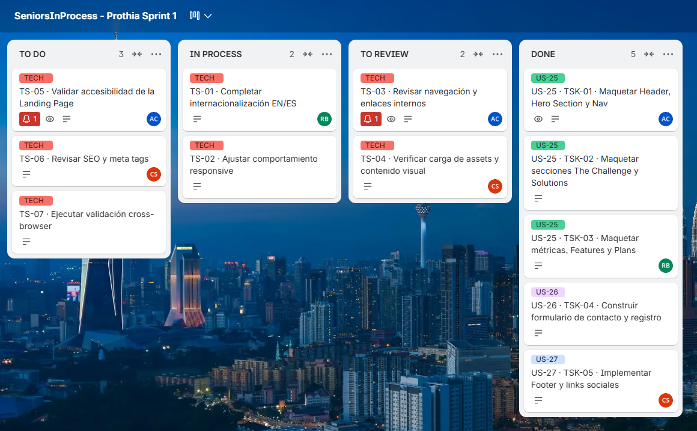

**Enlace del tablero de Trello:** 

https://trello.com/invite/b/6aabb55b023122d8fe598ee0/ATTI98b4a9da9fc821f35855872e0885a87cFED1E6E2/seniorsinprocess-prothia-sprint-1

### 5.2.1.4. Development Evidence for Sprint Review 

| Repository | Branch | Commit Id | Commit Message | Commit Message Body | Commited on (Date) |
| :--- | :--- | :--- | :--- | :--- | :--- |
| SeniorsInProcess/Prothia-Landing-Page | develop | `e5acca4` | Feat(landing): complete landing page structure and content in index.html | Estructura y contenido completos de la Landing page en index.html | 17/09/2026 |
| SeniorsInProcess/Prothia-Landing-Page | develop | `b2c7cce` | Feat(landing): complete landing page styles and responsive layout in styles.css | Completa los estilos de la Landing page y el diseño responsivo en styles.css. | 17/09/2026 |
| SeniorsInProcess/Prothia-Landing-Page | develop | `f2b24fc` | feat(landing): complete main javascript interactions and logic in main.js | Completa las interacciones y la lógica principales de JavaScript en main.js. | 17/09/2026 |
| SeniorsInProcess/Prothia-Landing-Page | develop | `a4d9681` | feat(landing): complete hero sequence animation logic in hero-sequence.js | Implementar la lógica de animación de la secuencia del hero en hero-sequence.js. | 17/09/2026 |
| SeniorsInProcess/Prothia-Landing-Page | develop | `a4d9681` | feat(landing): complete internationalization logic and language switcher in translation.js | Implementar la lógica de internacionalización y el selector de idioma en translation.js. | 17/09/2026 |

#### 5.2.1.5. Execution Evidence for Sprint Review

Capturas de pantalla de la Landing Page implementada en vistas Desktop y Mobile, acompañadas del video demostrativo de navegación e interacción del sitio.

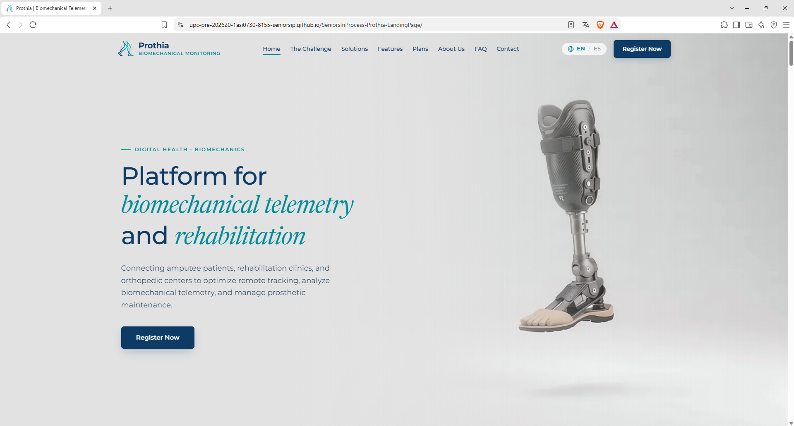

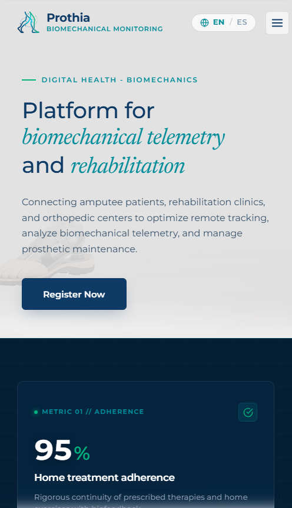

link de la landing: https://upc-pre-202620-1asi0730-8155-seniorsip.github.io/SeniorsInProcess-Prothia-LandingPage/

link del video: https://upcedupe-my.sharepoint.com/:v:/g/personal/u202421065_upc_edu_pe/IQDNRf7YFyx2S7sfhe8y7z-aAemJubaEn3IlURxzwNnz_MM?e=NuhSGo

### 5.2.1.6. Services Documentation Evidence for Sprint Review
Durante este Sprint 1, el esfuerzo del equipo se concentró de manera exclusiva en el desarrollo del Landing Page estático (HTML, CSS y JavaScript) y en establecer la identidad visual del producto. Dado que el alcance funcional de esta iteración no contempló aún el desarrollo del backend (RESTful API), no se cuenta con endpoints documentados mediante OpenAPI/Swagger para esta entrega. La documentación de servicios se abordará en los siguientes sprints, conforme se inicie la construcción de la API orientada a dominio de Prothia.

### 5.2.1.7. Software Deployment Evidence for Sprint Review
Para asegurar el acceso público a la propuesta de Prothia, el Landing Page fue desplegado utilizando GitHub Pages. Se consolidó el código estático en la rama develop del repositorio SeniorsInProcess/Prothia-Landing-Page. Desde la sección Settings de GitHub, se configuró "Build and deployment" apuntando a la rama correspondiente. El despliegue generó exitosamente la URL pública, donde se verificó la correcta carga de estilos, scripts de internacionalización y assets visuales en todos los breakpoints.

**Figura**
*Evidencia de deployment 1*

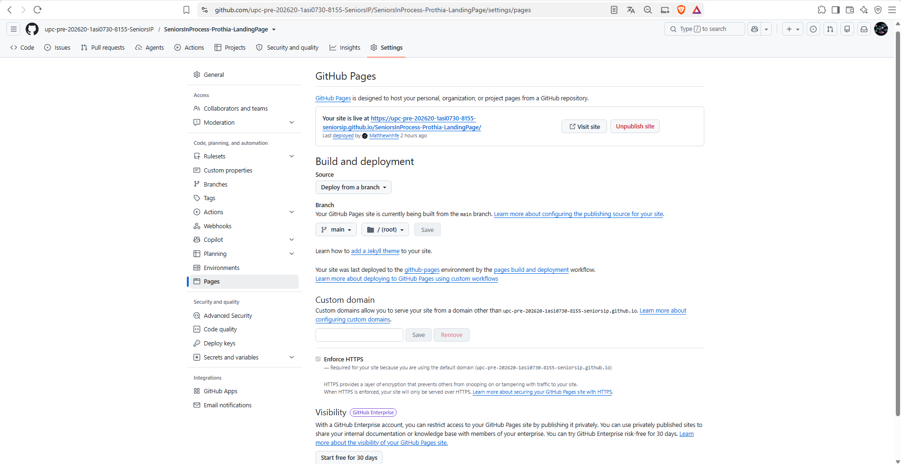

*Nota. Elaboración propia.*

**Figura**
*Evidencia de deployment 2*

### 5.2.1.8. Team Collaboration Insights during Sprint 

El trabajo en equipo durante el Sprint 1 fluyó de manera estructurada bajo el flujo de GitFlow. Cada integrante clonó el repositorio y trabajó sobre ramas feature/ específicas (ej. feature/contact-form, feature/hero-section). Al finalizar las tareas asignadas en Trello, se abrieron Pull Requests hacia la rama develop, los cuales fueron revisados activamente por Ana Camila como Team Leader antes de ser integrados. Esto garantizó que el código HTML/CSS mantuviera las convenciones establecidas en nuestras Style Guidelines y evitó conflictos significativos al unificar las vistas del Landing Page. 

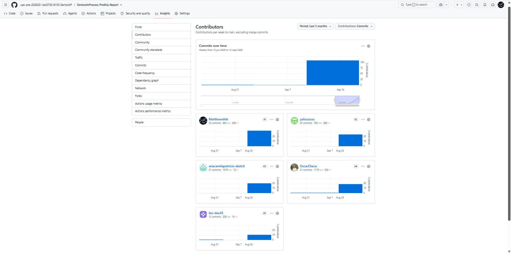

*Nota*. Elaboracion propia

### 5.2.2. Sprint 2

Durante el Sprint 2, el equipo de SeniorsInProcess concentró su trabajo en cumplir con los objetivos establecidos para el hito **TB1**: desplegar una nueva versión optimizada del sitio web estático (**Landing Page v2.0**), estructurar y desplegar la primera versión funcional de la aplicación web (**Frontend Web Application v1.0**) desarrollada con el framework Vue 3 y la biblioteca de componentes PrimeVue, y definir e implementar en entorno local los primeros servicios del **RESTful API** en ASP.NET Core, documentados bajo el estándar OpenAPI mediante Swagger UI.

#### 5.2.2.1. Sprint Planning 2

En esta sección se especifican los aspectos principales del Sprint Planning Meeting correspondiente a la segunda iteración de desarrollo del proyecto.

| Sprint # | Sprint 2 |
| :--- | :--- |
| **Sprint Planning Background** | Reunión de planificación para definir los compromisos del hito TB1. El equipo acordó actualizar y desplegar la versión 2.0 del Landing Page (integrando el simulador de facturación de planes, soporte de internacionalización completo y botones de acción que enlazan con la experiencia web) y construir la primera versión funcional de la Web Application (módulos de inicio de sesión por roles, admisión clínica de pacientes amputados y asignación inicial de prótesis), acompañada de la definición de los primeros servicios RESTful en ASP.NET Core. |
| **Date** | 2026-09-18 |
| **Time** | 20:00 |
| **Location** | Microsoft Teams Group Call (Sesión Virtual Sincrónica) |
| **Prepared By** | Patricio Farias, Ana Camila |
| **Attendees (to planning meeting)** | Patricio Farias, Ana Camila / Checa Burga, Oscar Diego / Dextre Flores, Leonardo Felix / Salcedo Correa, Carlos Mathhew / Barrenechea Bustamante, Rafael Andre |
| **Sprint n – 1 Review Summary** | Durante el Sprint 1 se concluyó y desplegó la versión 1.0 del Landing Page en GitHub Pages, logrando presentar la propuesta de valor, las métricas de impacto y la captación de prospectos. El Product Owner validó positivamente la coherencia estética con las guías de estilo, recomendando como prioridad para este segundo sprint vincular los llamados a la acción (call-to-action) directamente hacia las vistas de la Web Application e incorporar interactividad al comparador de planes. |
| **Sprint n – 1 Retrospective Summary** | **Start:** Formalizar la revisión cruzada de código mediante Pull Requests obligatorios antes de integrar en la rama develop, asegurando el cumplimiento estricto de las convenciones de codificación en C# y Vue 3. **Continue:** Mantener la comunicación fluida por Discord y la actualización continua del estado de las historias en el tablero de Trello. **Stop:** Evitar postergar la redacción de la documentación OpenAPI y las pruebas de despliegue para el final de la iteración. |
| **Sprint Goal & User Stories** | |
| **Sprint 2 Goal** | *Our focus is on delivering an enhanced interactive Landing Page and deploying the first functional release of the Prothia Web Application for clinical patient onboarding and prosthetic asset association, backed by documented local RESTful API endpoints.*  *We believe it delivers a direct and cohesive transition from public discovery to active clinical management for rehabilitation professionals, while empowering orthopedic technicians with digital prosthesis tracking.*  *This will be confirmed when visitors can interactively simulate subscription billing and toggle languages on the Landing Page, clinical staff can register amputee patients and view their clinical cards in the deployed Web Application, orthopedic specialists can associate prosthetic devices to registered patients, and developers can execute documented endpoints in Swagger with successful 200/201 response status codes.* |
| **Sprint 2 Velocity** | 21 Story Points |
| **Sum of Story Points** | 21 Story Points |

#### 5.2.2.2. Aspect Leaders and Collaborators

Para asegurar una adecuada organización interna y efectividad en la comunicación, se estructuró la matriz **LACX** (*Leadership-and-Collaboration Matrix*), estableciendo el líder (L) y los colaboradores (C) por cada aspecto técnico abordado en este Sprint 2:

| Team Member (Last Name, First Name) | GitHub Username | Frontend Web Application (Vue 3 / PrimeVue) Leader (L) / Collaborator (C) | Backend RESTful Services (ASP.NET Core) Leader (L) / Collaborator (C) | Landing Page v2.0 (HTML/CSS/JS) Leader (L) / Collaborator (C) | Project Documentation & Testing Leader (L) / Collaborator (C) |
| :--- | :--- | :---: | :---: | :---: | :---: |
| **Patricio Farias, Ana Camila** | `anacamilapatricio-sketch` | **L** | C | C | **L** |
| **Checa Burga, Oscar Diego** | `OscarCheca` | C | **L** | C | C |
| **Dextre Flores, Leonardo Felix** | `Leo-dex45` | C | C | C | **L** |
| **Salcedo Correa, Carlos Mathhew** | `Matthewnhfe` | C | C | **L** | C |
| **Barrenechea Bustamante, Rafael Andre** | `yafussssss` | C | **L** | C | C |

#### 5.2.2.3. Sprint Backlog 2

El objetivo principal del Sprint 2 es poner en operación la primera versión de la aplicación web y optimizar la experiencia interactiva del Landing Page. Para el seguimiento ágil de las historias de usuario y tareas de desarrollo, se utilizó la herramienta **Trello**. A continuación, se presenta la evidencia del tablero del sprint y la tabla de control de estado correspondiente.

**Figura**  
*Tablero de control de tareas en Trello para el Sprint 2*

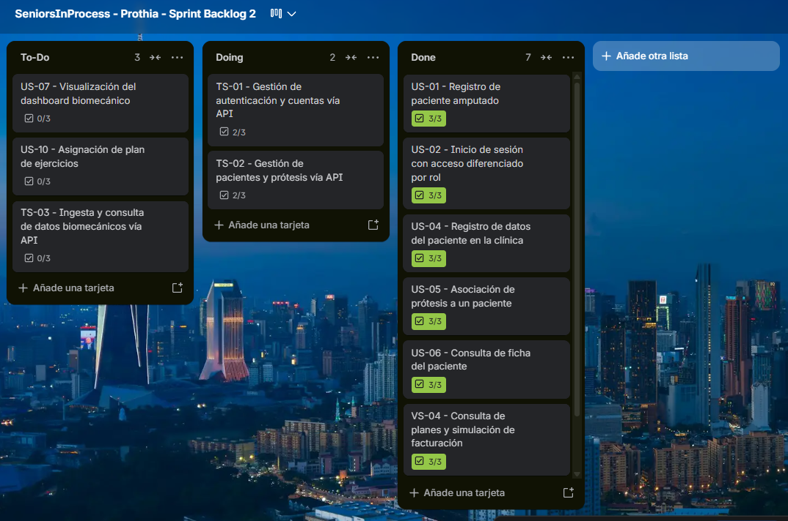

*Nota. Captura del tablero en Trello mostrando la distribución de historias de usuario entre las columnas To-Do, Doing y Done.*

**Enlace del tablero de Trello:**  
https://trello.com/invite/b/6ac4c443ac48cfe5f3483422/ATTI5559667781037e2f809ea13a3cfc44a317501C04/seniorsinprocess-prothia-sprint-backlog-2

| Sprint # | Sprint 2 | | | | | | |
| :--- | :--- | :--- | :--- | :--- | :--- | :--- | :--- |
| **User Story** | | **Work-Item / Task** | | | | | |
| **Story Id** | **Story Title** | **Task Id** | **Task Title** | **Task Description** | **Estimation (Hours)** | **Assigned To** | **Status (To-do / In-Process / To-Review / Done)** |
| **US-01** | Registro de paciente amputado | TSK-201 | Formulario de registro de usuario paciente | Diseñar e implementar en Vue 3 el formulario de registro para pacientes con validación de credenciales. | 3 | Patricio Farias, Ana Camila | Done |
| | | TSK-202 | Vinculación con almacenamiento de cuenta | Configurar el almacenamiento local del perfil y estado de registro mediante Pinia. | 2 | Dextre Flores, Leonardo Felix | Done |
| **US-02** | Inicio de sesión con acceso diferenciado por rol | TSK-203 | Diseño de interfaz de inicio de sesión y selector de rol | Crear el componente LoginView.vue en Vue 3 con pestañas para Paciente, Clínica y Ortopedia con PrimeVue. | 4 | Patricio Farias, Ana Camila | Done |
| | | TSK-204 | Configuración de Vue Router y guardias de navegación | Implementar las rutas protegidas en router/index.js según el rol seleccionado. | 4 | Dextre Flores, Leonardo Felix | Done |
| **US-04** | Registro de datos del paciente en la clínica | TSK-205 | Maquetación del formulario de alta clínica de paciente | Diseñar e implementar PatientRegisterView.vue para registrar datos clínicos, nivel de amputación y lado afectado. | 5 | Patricio Farias, Ana Camila | Done |
| | | TSK-206 | Lógica de validación de campos obligatorios | Programar reglas de validación en frontend para DNI, fecha de nacimiento y asignación de terapeuta. | 3 | Dextre Flores, Leonardo Felix | Done |
| **US-05** | Asociación de prótesis a un paciente | TSK-207 | Componente de vinculación de prótesis para ortopedias | Construir el diálogo modal ProsthesisAssignDialog.vue para seleccionar pacientes y prótesis disponibles. | 4 | Salcedo Correa, Carlos Mathhew | Done |
| | | TSK-208 | Validación de disponibilidad del activo protésico | Programar regla de control para evitar la asignación de dispositivos previamente vinculados. | 3 | Checa Burga, Oscar Diego | Done |
| **US-06** | Consulta de ficha del paciente | TSK-209 | Vista de Expediente Clínico 360 del paciente | Crear la vista PatientProfileView.vue con datos de filiación, prótesis vinculada y estado de rehabilitación. | 5 | Patricio Farias, Ana Camila | Done |
| | | TSK-210 | Formateo y renderizado de datos clínicos | Implementar tarjetas informativas de PrimeVue para el resumen clínico del paciente. | 3 | Barrenechea Bustamante, Rafael Andre | Done |
| **VS-04** | Consulta de planes y simulación de facturación | TSK-211 | Conmutador dinámico mensual/anual en Landing Page | Desarrollar en JavaScript el switch interactivo en la sección de planes con recálculo automático del ahorro anual. | 3 | Salcedo Correa, Carlos Mathhew | Done |
| **VS-09** | Cambio de idioma del portal (EN / ES) | TSK-212 | Actualización integral de diccionario de internacionalización | Enriquecer translations.js asegurando cobertura completa en inglés y español para todas las secciones. | 3 | Dextre Flores, Leonardo Felix | Done |
| **TS-01** | Gestión de autenticación y cuentas vía API | TSK-213 | Controlador de autenticación en ASP.NET Core | Desarrollar AuthController con endpoints de inicio de sesión y emisión de token de prueba. | 4 | Checa Burga, Oscar Diego | In-Process |
| **TS-02** | Gestión de pacientes y prótesis vía API | TSK-214 | Controladores de pacientes y activos protésicos | Implementar PatientsController y ProsthesesController con modelos y esquemas OpenAPI. | 4 | Barrenechea Bustamante, Rafael Andre | In-Process |

* Total de horas invertidas: 50 horas de trabajo colaborativo.

#### 5.2.2.4. Development Evidence for Sprint Review

A continuación, se resume el registro de commits representativos generados durante la implementación del Sprint 2, aplicando el estándar **Conventional Commits** y el modelo de ramificación **GitFlow** sobre los repositorios de la organización.

| Repository | Branch | Commit Id | Commit Message | Commit Message Body | Committed on (Date) |
| :--- | :--- | :--- | :--- | :--- | :--- |
| `SeniorsInProcess-Prothia-Frontend` | `feature/auth-views` | `7d1a29c` | `feat(auth): implement login view with multi-role selector and form validation` | Añade la vista de autenticación diferenciada para pacientes, clínicas y centros ortopédicos con PrimeVue. | 22/09/2026 |
| `SeniorsInProcess-Prothia-Frontend` | `feature/patient-registration` | `4b83f10` | `feat(patients): create clinical registration form and state management` | Implementa el formulario de admisión de pacientes con gestión reactiva de datos y validaciones de DNI. | 25/09/2026 |
| `SeniorsInProcess-Prothia-Frontend` | `feature/prosthesis-linking` | `8e20a44` | `feat(prosthesis): add prosthesis assignment modal for orthopedic technicians` | Agrega diálogo interactivo para vincular dispositivos protésicos disponibles al expediente del paciente. | 28/09/2026 |
| `SeniorsInProcess-Prothia-Frontend` | `feature/patient-card` | `1a59b32` | `feat(patients): render patient 360 medical profile overview card` | Diseña la tarjeta clínica integral del paciente con datos de dispositivo asociado y terapeuta a cargo. | 01/10/2026 |
| `SeniorsInProcess-Prothia-Backend` | `feature/auth-service` | `3f92c18` | `feat(auth): add authentication endpoints and token verification logic` | Expone endpoints de inicio de sesión bajo ASP.NET Core con autorización basada en roles (RBAC). | 21/09/2026 |
| `SeniorsInProcess-Prothia-Backend` | `feature/patients-api` | `9c41d87` | `feat(patients): implement CRUD endpoints and repository for patient records` | Desarrolla controladores RESTful para dar de alta y consultar pacientes vinculados a clínicas. | 24/09/2026 |
| `SeniorsInProcess-Prothia-Backend` | `feature/prostheses-api` | `5e80d21` | `feat(prosthesis): add prosthesis registration and patient assignment endpoint` | Incorpora endpoint para asignar prótesis a pacientes con validación de disponibilidad y unicidad. | 27/09/2026 |
| `SeniorsInProcess-Prothia-Backend` | `feature/swagger-docs` | `2b11e74` | `docs(api): configure OpenAPI Swagger documentation for patient and prosthesis endpoints` | Configura anotaciones XML y esquemas de respuesta OpenAPI en Swagger UI para todos los endpoints creados. | 30/09/2026 |
| `SeniorsInProcess-Prothia-LandingPage` | `feature/pricing-simulation` | `6a43f89` | `feat(pricing): add interactive monthly and annual billing switcher` | Añade el selector interactivo de tarifas con actualización de precios y ahorro anual en tiempo real. | 23/09/2026 |
| `SeniorsInProcess-Prothia-LandingPage` | `feature/app-cta-links` | `0d72c15` | `feat(nav): connect landing page action buttons to web application routes` | Vincula los botones "Register Now" y accesos por segmento directamente con la aplicación web desplegada. | 26/09/2026 |

#### 5.2.2.5. Execution Evidence for Sprint Review

Durante la revisión del Sprint 2 se verificó el funcionamiento operativo de los siguientes componentes:

1. **Landing Page (v2.0):**
   * **Simulador de Facturación (VS-04):** El visitante puede alternar entre planes mensuales y anuales mediante un conmutador animado, recalculando los costos y destacando el 20% de ahorro anual en las tarifas de clínicas y centros ortopédicos.
   * **Conexión Directa a la Web Application:** Los botones Register Now y los llamados a la acción de cada segmento objetivo redirigen hacia la aplicación web en producción.
   * **Soporte Bilingüe Completo (VS-09):** Alternancia inmediata de idioma (EN/ES) en todo el contenido estático.

2. **Frontend Web Application (v1.0 - Vue 3 / PrimeVue):**
   * **Acceso y Selección de Perfil (US-02):** Pantalla de inicio de sesión con selector interactivo de rol (Paciente, Clínica y Centro Ortopédico).
   * **Admisión de Pacientes Amputados (US-04):** Formulario para profesionales de la salud con campos validados para datos de filiación, diagnóstico clínico y nivel de amputación.
   * **Asociación de Prótesis (US-05):** Panel del técnico ortopédico donde se visualiza el inventario de prótesis y se realiza la asignación a un paciente activo.
   * **Ficha de Consulta Integral (US-06):** Vista del expediente clínico con los detalles personales del paciente, la prótesis vinculada y el estado de su rehabilitación.

**Figura**  
*Conmutador de planes y la conexión a la aplicación web en Landing Page v2.0*

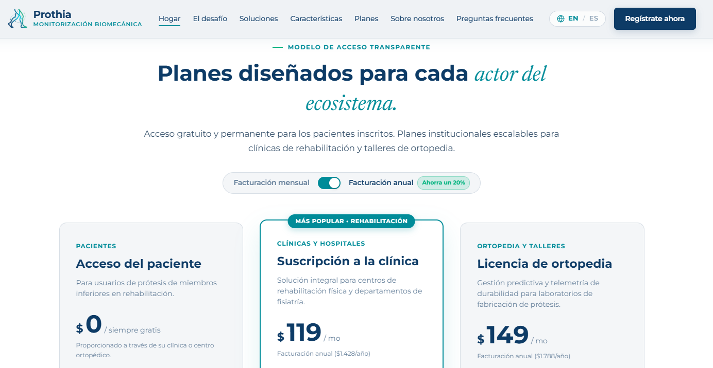

*Nota. Vista de la Landing Page v2.0 evidenciando el conmutador interactivo de planes en facturación mensual y anual.*

**Figura**  
*Autenticación y selección de roles en la aplicación web*

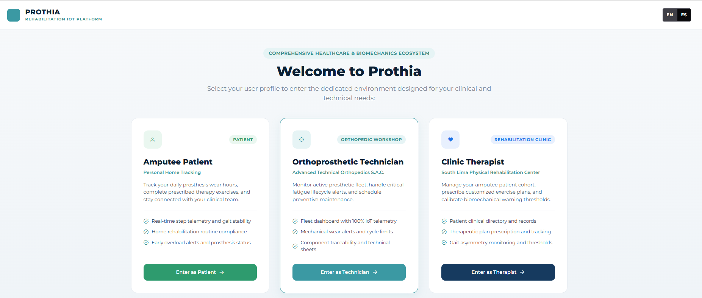

*Nota. Pantalla de inicio de sesión con selector de roles para pacientes, clínicas y centros ortopédicos.*

**Figura**  
*Formulario interactivo de registro clínico de pacientes amputados implementado con componentes PrimeVue*

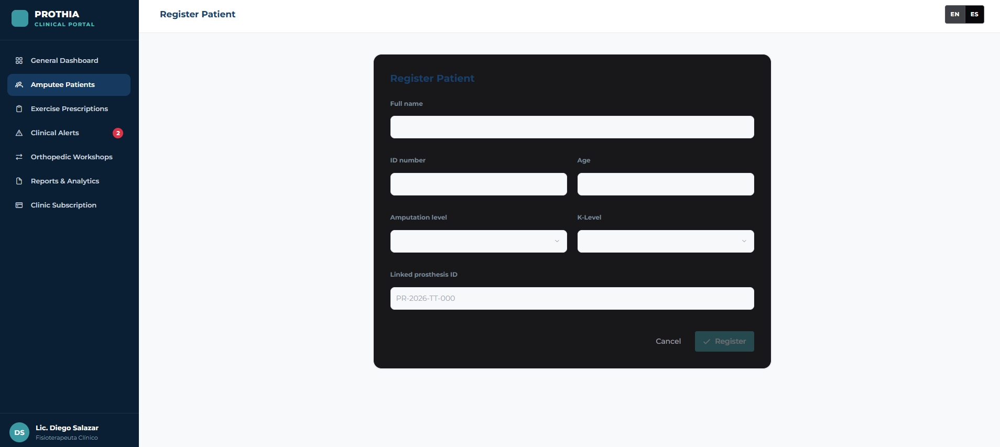

*Nota. Formulario de admisión clínica desarrollado con PrimeVue para el registro estructurado de pacientes.*

**Figura**  
*Diálogo de asignación de dispositivos protésicos disponible para el perfil del técnico ortopédico*

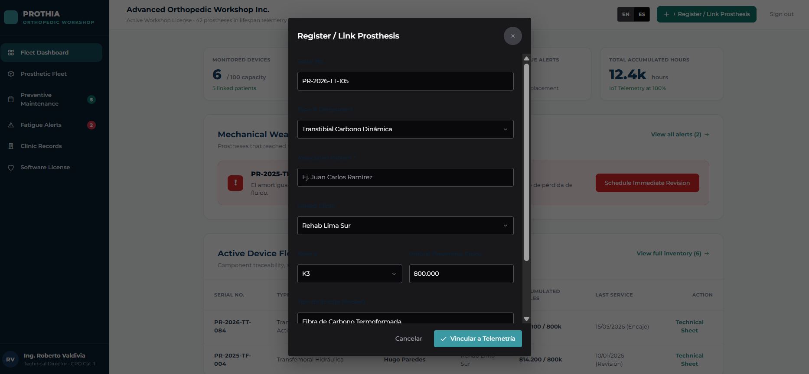

*Nota. Interfaz modal que permite al técnico ortopédico vincular prótesis disponibles al paciente seleccionado.*

**Figura**  
*Panel principal del paciente amputado (Mi Día) con métricas telemétricas y plan de ejercicios*

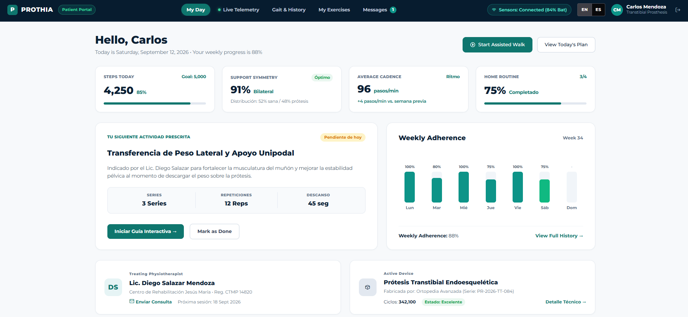

*Nota. Vista del portal del paciente mostrando el saludo personalizado, indicadores de simetría y cadencia de marcha, y el seguimiento de ejercicios prescritos en el hogar.*

* **Enlace a la Landing Page desplegada (v2.0):**  
  https://upc-pre-202620-1asi0730-8155-seniorsip.github.io/SeniorsInProcess-Prothia-LandingPage/
* **Enlace a la Web Application desplegada (v1.0):**  
  https://seniorsinprocess-prothia-app.netlify.app/
* **Enlace al video de demostración y navegación de ejecución (Sprint 2):**  
  `[Enlace a video en Microsoft Stream / SharePoint]`

#### 5.2.2.6. Services Documentation Evidence for Sprint Review

Para este Sprint 2 se implementaron y documentaron los primeros servicios del backend utilizando **ASP.NET Core** y **C#**, estructurados según los principios del estilo arquitectónico RESTful y documentados mediante la especificación **OpenAPI (Swagger UI)**.

De acuerdo con las pautas del Statement (pág. 26), en sprints previos al despliegue de Web Services en la nube (el cual se consuma formalmente en el hito AV2), la documentación interactiva se verifica mediante su URL de ejecución local.

* **URL del repositorio de Web Services:**  
  https://github.com/upc-pre-202620-1asi0730-8155-SeniorsIP/SeniorsInProcess-Prothia-Backend
* **URL de la documentación interactiva OpenAPI (Swagger Local):**  
  `https://localhost:7071/swagger/index.html` 
* **Identificadores de commits vinculados a documentación:** `3f92c18`, `9c41d87`, `5e80d21`, `2b11e74`.

A continuación, se detalla la relación de endpoints implementados, sus sintaxis de llamada, parámetros requeridos y modelos de respuesta:

| Endpoint / Recurso | Verbo HTTP | Sintaxis de Llamada | Parámetros (Query / Route / Body) | Ejemplo y Explicación del Response | Código de Estado |
| :--- | :--- | :--- | :--- | :--- | :---: |
| **Autenticación de Usuario** | `POST` | `/api/v1/auth/sign-in` | **Body (JSON):** `{ "email": "diego.salazar@rehabsur.pe", "password": "Password123*", "role": "HEALTHCARE_PROFESSIONAL" }` | Retorna token de sesión e información básica del usuario: `{ "token": "eyJhbGciOiJIUzI1NiIsIn...", "userId": "a1b2c3d4-...", "role": "HEALTHCARE_PROFESSIONAL" }` *Permite autenticar y autorizar accesos por rol.* | `200 OK` |
| **Registrar Paciente** | `POST` | `/api/v1/patients` | **Body (JSON):** `{ "fullName": "Carlos Mendoza Arias", "identificationNumber": "45892104", "amputationLevel": "Transtibial", "affectedSide": "Derecha", "clinicId": "3fa85f64-..." }` | Retorna el recurso creado con su identificador: `{ "id": "b1a2c3d4-e5f6-7a8b-9c0d-1e2f3a4b5c6d", "fullName": "Carlos Mendoza Arias", "status": "ACTIVE", "createdAt": "2026-09-24T15:30:00Z" }` *Confirma el alta del paciente en la clínica.* | `201 Created` |
| **Consultar Expediente del Paciente** | `GET` | `/api/v1/patients/{id}` | **Route:** `id` (UUID): Identificador único del paciente. | Retorna la ficha clínica con prótesis vinculada: `{ "id": "b1a2c3d4-...", "fullName": "Carlos Mendoza Arias", "identificationNumber": "45892104", "amputationLevel": "Transtibial", "prosthesis": { "serialNumber": "PR-2026-TT-084", "type": "Transtibial Carbono" } }` *Facilita la consulta de datos del paciente.* | `200 OK` |
| **Registrar Prótesis** | `POST` | `/api/v1/prostheses` | **Body (JSON):** `{ "serialNumber": "PR-2026-TT-084", "type": "Transtibial Carbono", "orthopedicCenterId": "5c6d7e8f-..." }` | Retorna la prótesis dada de alta en el inventario: `{ "id": "f9e8d7c6-...", "serialNumber": "PR-2026-TT-084", "status": "AVAILABLE" }` *Registra el componente protésico.* | `201 Created` |
| **Asociar Prótesis a Paciente** | `POST` | `/api/v1/prostheses/{id}/assignments` | **Route:** `id` (UUID): ID de la prótesis. **Body (JSON):** `{ "patientId": "b1a2c3d4-..." }` | Retorna la confirmación del enlace: `{ "prosthesisId": "f9e8d7c6-...", "patientId": "b1a2c3d4-...", "status": "ASSIGNED", "assignedAt": "2026-09-27T11:00:00Z" }` *Asocia unívocamente la prótesis con el paciente.* | `200 OK` |

**Figura**  
*Vista general de endpoints documentados en Swagger UI (OpenAPI)*

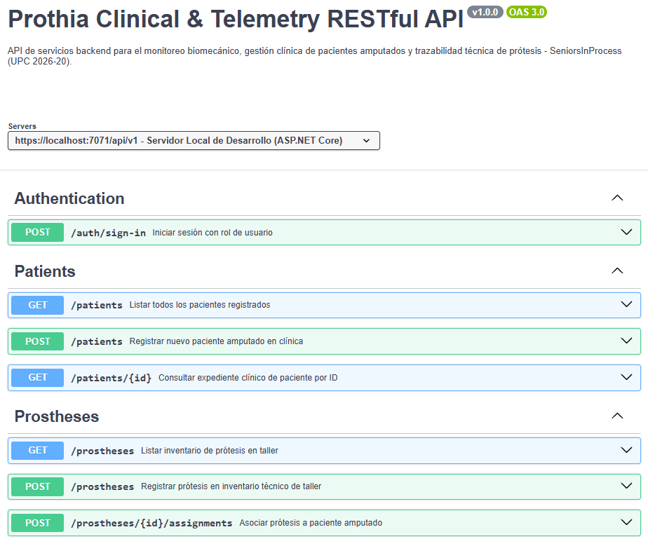

*Nota. Catálogo estructurado de endpoints RESTful para autenticación, gestión de pacientes y prótesis bajo la especificación OpenAPI.*

**Figura**  
*Interacción y ejecución de endpoints con datos de muestra y respuesta HTTP (Swagger UI)*

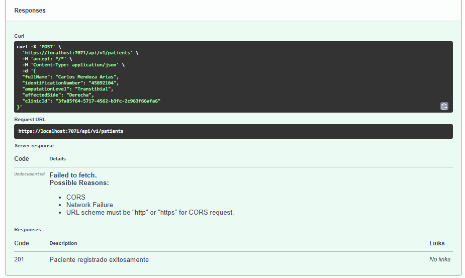

*Nota. Prueba de ejecución interactiva del endpoint de registro de pacientes mostrando datos de entrada en JSON y respuesta HTTP 201 Created.*

#### 5.2.2.7. Software Deployment Evidence for Sprint Review

Durante este Sprint 2 se realizaron las actividades de configuración y verificación de despliegue para los productos digitales del alcance de TB1, satisfaciendo los requerimientos de publicación en entornos productivos y cloud providers:

##### 1. Despliegue de la Nueva Versión de la Landing Page (v2.0)
* **Plataforma:** GitHub Pages.
* **Repositorio y Rama de Despliegue:** `SeniorsInProcess-Prothia-LandingPage` (rama `main`).
* **Procedimiento:** Las ramas `feature/pricing-simulation` y `feature/app-cta-links` fueron integradas en `develop` tras pruebas de renderizado en diferentes resoluciones. Posteriormente se generó un Pull Request hacia la rama `main`, la cual ejecuta el flujo automático de publicación de GitHub Pages desde la raíz (`/root`).
* **URL Pública:**  
  https://upc-pre-202620-1asi0730-8155-seniorsip.github.io/SeniorsInProcess-Prothia-LandingPage/

**Figura**  
*Configuración de despliegue en GitHub Pages para Landing Page v2.0*

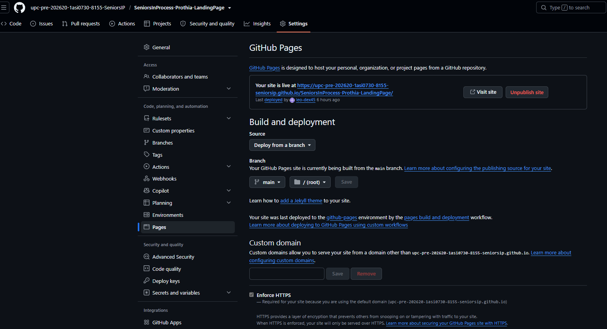

*Nota. Panel de administración en GitHub Settings confirmando el despliegue exitoso de la versión 2.0 del Landing Page.*

##### 2. Despliegue de la Primera Versión de la Frontend Web Application (v1.0)
* **Plataforma:** Netlify Cloud Hosting Platform (Cloud Provider).
* **Repositorio y Rama de Despliegue:** `SeniorsInProcess-Prothia-Frontend` (rama `main` / `dist`).
* **Procedimiento:**
  1. Se empaquetaron y compilaron los artefactos estáticos optimizados de la aplicación desarrollada en Vue 3 y Vite (`npm run build`), centralizados en la carpeta `dist`.
  2. Se configuró el servicio de alojamiento bajo arquitectura Jamstack Cloud con soporte de aprovisionamiento de certificados SSL/TLS y compresión de recursos.
  3. Se validó la carga de las vistas de selección de roles, admisión clínica de pacientes y paneles de control, comprobando que la aplicación responda de manera óptima tanto en navegadores de escritorio como móviles.
* **URL Pública:**  
  https://seniorsinprocess-prothia-app.netlify.app/

**Figura**  
*Panel de control de despliegue en la plataforma Cloud para la aplicación web*

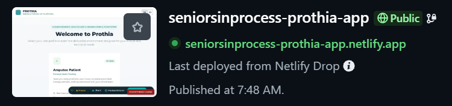

*Nota. Evidencia de publicación y estado operativo de la primera versión funcional de la Web Application en la plataforma Cloud.*

#### 5.2.2.8. Team Collaboration Insights during Sprint

Durante el desarrollo del Sprint 2, el equipo consolidó la aplicación del marco de trabajo ágil Scrum y las buenas prácticas de ingeniería de software con GitFlow:

1. **Gestión de Ramas y Commits:**  
   Se mantuvieron protegidas las ramas `main` y `develop`. Las asignaciones se trabajaron de forma aislada en ramas `feature/<nombre-funcionalidad>`, utilizando mensajes bajo la convención de **Conventional Commits** (`feat:`, `fix:`, `docs:`, `style:`, `refactor:`), lo que facilitó la trazabilidad entre el código y los identificadores de tareas de Trello.

2. **Revisiones de Código (Pull Requests):**  
   Para integrar cualquier cambio hacia `develop`, se requirió la aprobación de al menos un revisor técnico del equipo (Oscar Checa en la capa backend o Ana Camila Patricio en la capa frontend), garantizando que los componentes de Vue 3 cumplieran con la guía de estilo de Vue y que los controladores de ASP.NET Core respetaran la separación por capas.

3. **Métricas de Colaboración:**  
   A través de la sección de *Insights / Contributors* en GitHub, se constata una participación equilibrada y activa de los cinco integrantes en los repositorios del proyecto, evidenciando un esfuerzo constante a lo largo de las semanas de desarrollo.

**Figura**  
*Métricas de colaboración y commits en GitHub Insights para el Sprint 2*

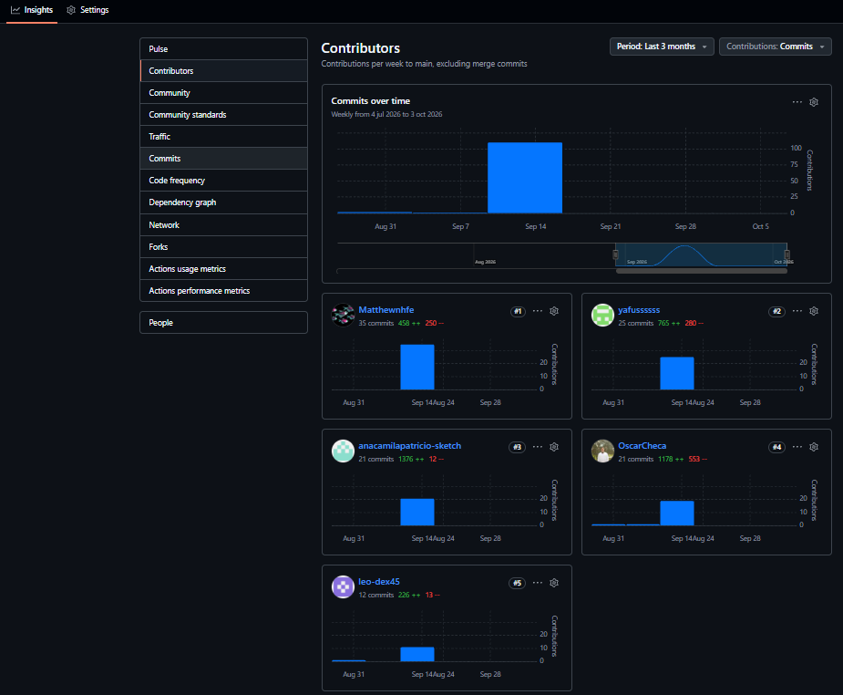

*Nota. Registro de contribuciones y frecuencia de commits de los integrantes del equipo durante el Sprint 2 obtenido desde GitHub Insights.*
