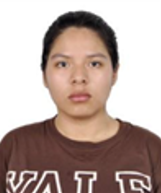
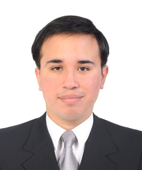
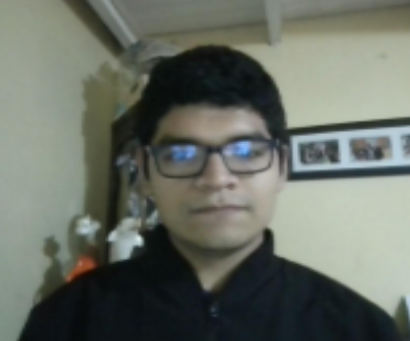
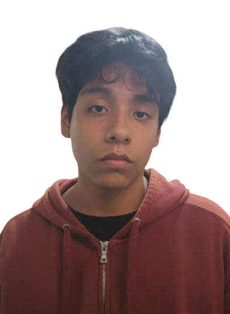

# Capítulo I: Introducción

## 1.1 Startup Profile

### 1.1.1 Descripción de la Startup

Somos una startup peruana denominada **SeniorsInProcess**, creada por estudiantes de la carrera de Ingeniería de Software de la Universidad Peruana de Ciencias Aplicadas (UPC), cuyo objetivo principal es mejorar el monitoreo y seguimiento de la rehabilitación de pacientes amputados mediante el uso de tecnología y análisis de datos biomecánicos.

Nuestra misión es reducir la brecha de comunicación e información entre los pacientes amputados, las clínicas de rehabilitación y los centros ortopédicos, facilitando un proceso de adaptación a la prótesis más seguro, personalizado y basado en datos. Buscamos que los profesionales de la salud puedan conocer cómo los pacientes utilizan sus prótesis en su vida cotidiana y puedan realizar un seguimiento oportuno de su evolución fuera de las instalaciones de la clínica.

Para cumplir con este propósito, hemos desarrollado una plataforma web de monitoreo y seguimiento de rehabilitación que permite recopilar datos biomecánicos y de uso de la prótesis en tiempo real. La información obtenida es procesada y presentada mediante la plataforma web a los diferentes actores involucrados, permitiendo a las clínicas supervisar el progreso del paciente y realizar un seguimiento más eficiente de los ejercicios de rehabilitación.

Asimismo, la solución permite la participación de los centros ortopédicos, brindándoles acceso a información relacionada con el uso y mantenimiento de las prótesis. De esta manera, Prothia busca integrar en una misma plataforma a los principales actores del proceso de rehabilitación, facilitando el intercambio de información y contribuyendo a una mejor adaptación del paciente a su prótesis.

El modelo de negocio de SeniorsInProcess se basa principalmente en una suscripción anual dirigida a las clínicas de rehabilitación, mediante la cual estas instituciones obtienen acceso a la plataforma y pueden proporcionar su uso como parte del tratamiento de sus pacientes amputados. Por otro lado, a los centros ortopédicos se les ofrece una licencia de software que les permite utilizar la plataforma para la gestión de las prótesis, así como acceder a información relacionada con su uso y necesidades de mantenimiento.

De esta manera, SeniorsInProcess busca generar valor para cada uno de sus segmentos objetivo: pacientes amputados, clínicas de rehabilitación y centros ortopédicos, proporcionando información que facilite la toma de decisiones, mejore el seguimiento de la rehabilitación y permita una gestión más eficiente de las prótesis.

### 1.1.2. Perfiles de integrantes del equipo

| **Integrante**            | **Ana Camila Patricio Farias**        									    |
| :------------------------ | :-------------------------------------------------------------------------------- |
| **Código del Estudiante** | u20241i469                                   										|
| **Carrera**               | Ingeniería de Software                       										|
| **Descripción**           | Mi nombre es Camila Patricio. Tengo 20 años, soy estudiante de Ingeniería de Software y considero que mis principales fortalezas son la responsabilidad, el compromiso y la disposición para aprender constantemente. Puedo aportar a mi grupo habilidades en programación, análisis de problemas y búsqueda de soluciones creativas. Además, me caracterizo por trabajar en equipo de manera colaborativa y organizada. Mi propósito es aportar mis conocimientos y esfuerzo para que logremos juntos los objetivos de nuestro proyecto.   												|
| **Foto**                  |  |

---
| **Integrante**            | **Oscar Diego Checa Burga**        									    |
| :------------------------ | :-------------------------------------------------------------------------------- |
| **Código del Estudiante** |                                    				U20231E492					|
| **Carrera**               | Ingeniería de Software                       										|
| **Descripción**           |  Mi nombre es Oscar Diego Checa Burga con código de alumno u20231e492. Soy estudiante de la carrera de ingeniería de software de 5to ciclo, interesado en el desarrollo de soluciones tecnológicas. Destaco por mi trabajo en equipo y comunicación constante. Tengo conocimiento en base de datos, desarrollo de aplicaciones y programación. Me gusta ir adaptándome a las nuevas tecnologías y aprender de estas, para poder desarrollar más en el ámbito profesional.  												|
| **Foto**                  |  |

---
| **Integrante**            | **Leonardo Felix Dextre Flores**        									    |
| :------------------------ | :-------------------------------------------------------------------------------- |
| **Código del Estudiante** |  U202421823                                  										|
| **Carrera**               | Ingeniería de Software                       										|
| **Descripción**           | Soy Leonardo Dextre, tengo 23 años, actualmente estoy cursando el cuarto ciclo de mi carrera ingeniería de software en la UPC. Entre mis habilidades más destacadas es saber un poco de programación especialmente en C++ y un poco en Python. Además, tengo básico conocimiento en programas de Microsoft como el Excel. Mis pasatiempos son ver películas y jugar videojuegos. Mi objetivo con el curso es aprender más cosas acerca de mi carrera y poder aplicarlo en mi futuro laboral como profesional.			|
| **Foto**                  |  |

---
| **Integrante**            | **Carlos Mathhew Salcedo Correa**        									    |
| :------------------------ | :-------------------------------------------------------------------------------- |
| **Código del Estudiante** | U202421065                                   										|
| **Carrera**               | Ingeniería de Software                       										|
| **Descripción**           | Soy Carlos Salcedo, tengo 18 años y actualmente curso el cuarto ciclo de la carrera de Ingeniería de Software en la Universidad Peruana de Ciencias Aplicadas (UPC). Cuento con conocimientos de nivel básico a intermedio en el lenguaje de programación C++, así como habilidades básicas en diseño. Además, tengo afinidad por el arte, especialmente el dibujo, y un fuerte interés por la música. Me considero una persona comprometida, responsable y con disposición constante para aprender. Mi objetivo en este curso es profundizar en los temas relacionados con mi carrera, fortalecer mis habilidades y prepararme para aplicarlas de manera efectiva en mi futuro profesional.   	   												|
| **Foto**                  |  |

---
| **Integrante**            | **Rafael Barrenechea Bustamante**        									    |
| :------------------------ | :-------------------------------------------------------------------------------- |
| **Código del Estudiante** |                                    										|
| **Carrera**               | Ingeniería de Software                       										|
| **Descripción**           |    												|
| **Foto**                  |  |

---

### 1.2.1 Antecedentes y Problemática

**What / ¿QUÉ?**

Se presenta una falta de monitoreo y seguimiento continuo durante el proceso de rehabilitación de pacientes amputados que utilizan prótesis. Una vez que el paciente recibe su prótesis, gran parte del proceso de adaptación y realización de ejercicios ocurre fuera de la clínica, lo que dificulta que los profesionales puedan conocer cómo utiliza la prótesis en su vida cotidiana, si realiza correctamente los ejercicios indicados o si presenta posturas y movimientos inadecuados.

**When / ¿CUÁNDO?**

El problema se manifiesta principalmente después de que el paciente recibe la prótesis y continúa con su proceso de rehabilitación en el hogar. Durante este periodo, los profesionales de la clínica tienen una visibilidad limitada sobre las actividades que realiza el paciente fuera de las sesiones presenciales, dificultando la identificación oportuna de problemas durante su adaptación.

**Where / ¿DÓNDE?**

La problemática se presenta principalmente en el entorno doméstico del paciente, donde se desarrolla una parte importante de la adaptación y rehabilitación con la prótesis. También involucra a las clínicas de rehabilitación y centros ortopédicos, debido a que estos actores necesitan información sobre el progreso, uso y estado de la prótesis para brindar un mejor seguimiento y servicio.

**Who / ¿QUIÉN?**

Afecta principalmente a los pacientes amputados que utilizan una prótesis y necesitan realizar ejercicios y actividades de adaptación fuera de la clínica. También impacta a los profesionales de las clínicas de rehabilitación, quienes requieren información sobre el desempeño del paciente para realizar un seguimiento adecuado, y a los centros ortopédicos, que necesitan conocer el uso y comportamiento de las prótesis para facilitar su mantenimiento y gestión.

**Why / ¿POR QUÉ?**

Sucede debido a la falta de herramientas que permitan recopilar y compartir información objetiva sobre el uso de la prótesis y el desempeño biomecánico del paciente durante sus actividades cotidianas. Actualmente, gran parte del seguimiento depende de las sesiones presenciales, la observación del profesional y la información que el propio paciente comunica, lo que puede limitar la visibilidad sobre su evolución fuera de la clínica.

**How / ¿CÓMO?**

El problema se presenta porque los datos sobre el uso de la prótesis, los movimientos y el desempeño del paciente durante la rehabilitación en el hogar no se recopilan de manera continua ni se encuentran centralizados para los diferentes actores involucrados. Como consecuencia, los profesionales pueden tener dificultades para detectar posturas incorrectas, ejercicios realizados inadecuadamente o patrones de uso que requieran atención, mientras que los centros ortopédicos cuentan con información limitada para realizar un seguimiento del mantenimiento y uso de las prótesis.

**How Much / ¿CUÁNTO?**

La magnitud del problema se relaciona con la cantidad de tiempo que el paciente realiza su rehabilitación fuera de la clínica, durante el cual los profesionales cuentan con información limitada sobre su desempeño. Esta falta de visibilidad puede generar un seguimiento discontinuo y dificultar la detección temprana de problemas de adaptación, posturas incorrectas o un uso inadecuado de la prótesis. Para establecer un porcentaje o valor cuantitativo específico, será necesario realizar una validación con pacientes, clínicas y centros ortopédicos.

### 1.2.2 Lean UX Process

#### 1.2.2.1 Lean UX Problem Statements

El estado actual del proceso de rehabilitación y seguimiento post-protésico de pacientes amputados se ha enfocado principalmente en evaluaciones presenciales puntuales dentro de clínicas de rehabilitación, donde la recopilación de datos biomecánicos y el control de los ejercicios están limitados al tiempo de consulta.

Lo que los productos y servicios existentes no logran abordar es la falta de visibilidad continua sobre el desempeño del paciente en el hogar y la ausencia de una comunicación integrada y centralizada en tiempo real entre los tres actores clave del ecosistema: el paciente, la clínica de rehabilitación y el centro ortopédico. Esto genera un seguimiento discontinuo, incertidumbre sobre la ejecución correcta de las rutinas cotidianas y decisiones de ajuste protésico basadas en percepciones subjetivas en lugar de datos objetivos.

Nuestra plataforma Prothia abordará esta brecha mediante una solución web centralizada que recopila, procesa y visualiza información biomecánica y métricas de uso de prótesis en tiempo real, conectando el monitoreo en el hogar con la supervisión profesional. Nuestro enfoque inicial estará dirigido a pacientes amputados en etapa de rehabilitación doméstica, clínicas de rehabilitación física que requieren monitorear el progreso del paciente y centros ortopédicos encargados del diseño y ajuste técnico de la prótesis.

Sabremos que hemos tenido éxito cuando observemos:

1. **En los pacientes:** Un incremento en la adherencia y correcta ejecución de sus ejercicios de rehabilitación en el hogar, reflejado en un uso continuo del dispositivo.

2. **En las clínicas de rehabilitación:** Una reducción en los tiempos de evaluación y una toma de decisiones terapéuticas basada en reportes biomecánicos objetivos.

3. **En los centros ortopédicos:** Una optimización en la comunicación e intercambio de datos para la calibración y ajuste preciso de las prótesis.

#### 1.2.2.2 Lean UX Assumptions

**A. Business Assumptions**

- **Creemos que nuestros clientes necesitan:** Contar con información objetiva y centralizada sobre el proceso de rehabilitación, el uso de las prótesis y el desempeño de los pacientes fuera de las sesiones presenciales.
- **Creemos que estas necesidades se resolverán mediante:** Una plataforma web que recopile datos biomecánicos y de uso de la prótesis, los procese y los presente de manera comprensible a las clínicas de rehabilitación y centros ortopédicos.
- **Creemos que nuestros primeros clientes serán:** Clínicas de rehabilitación que atienden pacientes amputados y centros ortopédicos involucrados en la fabricación, adaptación y mantenimiento de prótesis.
- **Creemos que el principal valor para nuestros clientes será:** Disponer de información continua sobre el uso de la prótesis y la evolución del paciente, permitiendo mejorar el seguimiento de la rehabilitación y facilitar la toma de decisiones.
- **Creemos que los usuarios obtendrán beneficios adicionales como:** Un seguimiento más personalizado, detección oportuna de posibles problemas durante la rehabilitación, mejor comunicación entre los actores involucrados y una gestión más eficiente del mantenimiento de las prótesis.
- **Creemos que adquiriremos nuestros primeros clientes mediante:** Contacto directo con clínicas de rehabilitación y centros ortopédicos, demostraciones del funcionamiento de la plataforma, validación con profesionales y pruebas piloto con pacientes.
- **Creemos que nuestro modelo de ingresos será:** Una suscripción anual dirigida a clínicas de rehabilitación, quienes proporcionarán el acceso a la plataforma como parte del tratamiento de sus pacientes. Adicionalmente, se ofrecerán licencias de software a centros ortopédicos.
- **Creemos que nuestros principales competidores serán:** Soluciones de monitoreo de rehabilitación, sistemas de seguimiento de pacientes y tecnologías especializadas en prótesis que permitan recopilar información sobre el desempeño y uso de dispositivos protésicos.
- **Creemos que nuestra principal ventaja competitiva será:** La integración en una misma plataforma de los pacientes, las clínicas de rehabilitación y los centros ortopédicos, permitiendo compartir información sobre rehabilitación, uso y mantenimiento de las prótesis.
- **Creemos que el mayor riesgo del producto será:** La dificultad de integrar sensores y sistemas de medición biomecánica con diferentes tipos de prótesis, así como lograr la adopción de la plataforma por parte de las clínicas y pacientes.
- **Creemos que podremos mitigar este riesgo mediante:** El desarrollo progresivo de la solución, pruebas piloto con usuarios reales, compatibilidad con diferentes dispositivos de medición y una plataforma intuitiva que facilite su utilización por parte de los diferentes actores.

**B. Business Outcome Assumptions**

- Creemos que Prothia permitirá mejorar la visibilidad de las clínicas sobre el proceso de rehabilitación realizado por los pacientes fuera de sus instalaciones.
- Creemos que lograremos que las clínicas incorporen el monitoreo mediante la plataforma como parte del tratamiento de sus pacientes.
- Creemos que alcanzaremos una adopción inicial de la plataforma mediante programas piloto con clínicas y centros ortopédicos.
- Creemos que lograremos una retención elevada de las clínicas mediante una plataforma útil, intuitiva y que genere información relevante para el seguimiento de sus pacientes.
- Creemos que los centros ortopédicos percibirán valor en la solución al disponer de información sobre el uso y mantenimiento de las prótesis.
- Creemos que Prothia se diferenciará mediante la integración de información de rehabilitación, uso y mantenimiento dentro de una misma plataforma.

**C. User Outcome & Benefit Assumptions**

- **Creemos que los pacientes** podrán realizar su proceso de rehabilitación con un seguimiento más continuo y personalizado.
- **Creemos que los pacientes** tendrán mayor conocimiento sobre su desempeño y uso de la prótesis durante sus actividades cotidianas.
- **Creemos que las clínicas** podrán identificar con mayor facilidad posibles posturas, movimientos o patrones de uso que requieran atención profesional.
- **Creemos que los profesionales** podrán tomar decisiones basadas en información recopilada durante las actividades del paciente fuera de la clínica.
- **Creemos que los centros ortopédicos** podrán acceder a información relacionada con el uso de las prótesis y utilizarla para mejorar el seguimiento de mantenimiento.
- **Creemos que los tres actores** podrán mejorar la comunicación y el intercambio de información mediante una plataforma centralizada.

**D. User Assumptions**

- **Creemos que los usuarios serán:** Pacientes amputados en proceso de adaptación y rehabilitación, profesionales de clínicas de rehabilitación y especialistas de centros ortopédicos.
- **Creemos que el producto formará parte de:** El proceso de rehabilitación, seguimiento y adaptación del paciente a su prótesis, complementando las sesiones presenciales mediante el monitoreo realizado durante las actividades cotidianas.
- **Creemos que el principal problema que desean resolver es:** La falta de información continua sobre el desempeño del paciente y el uso de la prótesis fuera de la clínica.
- **Creemos que el uso más frecuente del producto será:** Consultar el progreso de la rehabilitación, revisar datos biomecánicos, monitorear el uso de la prótesis, identificar posibles movimientos o posturas inadecuadas y consultar información relacionada con el mantenimiento.
- **Creemos que las características más importantes para los usuarios serán:** Un dashboard de monitoreo, visualización de datos biomecánicos, seguimiento del progreso, historial de uso de la prótesis, alertas y acceso diferenciado según el tipo de usuario.
- **Creemos que los usuarios esperarán una interfaz:** Clara, intuitiva, accesible y fácil de utilizar, que permita comprender la información recopilada sin requerir conocimientos técnicos avanzados.

**E. Feature Assumptions**

- Creemos que un **Dashboard Centralizado** permitirá a las clínicas visualizar el progreso y desempeño de sus pacientes desde una única plataforma.
- Creemos que el **Monitoreo Biomecánico** permitirá recopilar información sobre movimientos, posturas y otros indicadores relacionados con el uso de la prótesis.
- Creemos que el **Seguimiento de Rehabilitación** permitirá a los profesionales revisar la evolución del paciente y comparar su desempeño durante diferentes periodos.
- Creemos que las **Alertas** permitirán identificar patrones o comportamientos que puedan requerir una revisión por parte del profesional.
- Creemos que el **Historial de Uso** permitirá a los centros ortopédicos consultar información relevante sobre el uso de las prótesis para facilitar su mantenimiento.
- Creemos que el **Acceso Diferenciado** permitirá mostrar información y funcionalidades específicas según si el usuario es paciente, profesional de una clínica o especialista de una ortopedia.

#### 1.2.2.3 Lean UX Hypothesis Statements

**Monitoreo de la Rehabilitación**

**Creemos que** al recopilar y procesar datos biomecánicos relacionados con los movimientos y posturas de los pacientes amputados para los profesionales de rehabilitación, estos podrán realizar un seguimiento más continuo del proceso de adaptación a la prótesis, mejorando la visibilidad de los profesionales sobre el desempeño del paciente fuera de las sesiones presenciales.

**Sabremos que** tenemos razón **cuando** los profesionales de las clínicas de rehabilitación indiquen que la información recopilada por la plataforma les permite comprender mejor el comportamiento y progreso del paciente durante su rehabilitación, y cuando se observe un uso recurrente de la plataforma para consultar y realizar seguimiento del progreso de los pacientes.

**Detección de Movimientos y Posturas Inadecuadas**

**Creemos que** al recopilar y procesar datos biomecánicos relacionados con los movimientos y posturas del paciente amputado para los profesionales de rehabilitación, estos podrán identificar posibles patrones inadecuados durante el proceso de adaptación a la prótesis, logrando detectar oportunamente situaciones que requieran una evaluación o intervención profesional.

**Sabremos que** tenemos razón **cuando** los profesionales consideren útil la información biomecánica presentada por la plataforma y cuando puedan identificar comportamientos que anteriormente no podían observar durante las actividades realizadas fuera de la clínica.

**Comunicación entre Actores**

**Creemos que** al centralizar la información del paciente y del uso de la prótesis en una única plataforma para pacientes, clínicas de rehabilitación y centros ortopédicos, estos actores podrán compartir información de manera más eficiente, logrando reducir la brecha de comunicación y mejorar la coordinación durante el proceso de rehabilitación y adaptación.

**Sabremos que** tenemos razón cuando los usuarios indiquen que pueden acceder a la información que necesitan sin depender exclusivamente de comunicaciones manuales y cuando se observe un uso frecuente de la plataforma por parte de los diferentes actores.

**Seguimiento y Mantenimiento de la Prótesis**

**Creemos que** al proporcionar a los centros ortopédicos información relacionada con el uso y comportamiento de las prótesis, los especialistas responsables de su fabricación, adaptación y mantenimiento podrán realizar un seguimiento más informado de las condiciones de uso de los dispositivos, facilitando la identificación de posibles necesidades de mantenimiento y mejorando la gestión de las prótesis.

**Sabremos que** tenemos razón cuando los especialistas consideren útil la información de uso proporcionada por la plataforma para realizar el seguimiento de las prótesis y utilicen estos datos como apoyo para sus decisiones relacionadas con el mantenimiento y la atención de los dispositivos.

#### 1.2.2.4 Lean UX Canvas

| Business Problem | Solutions | Business Outcomes |
|---|---|---|
| El proceso actual de rehabilitación de pacientes amputados presenta una limitada visibilidad sobre el desempeño del paciente fuera de las sesiones presenciales. Después de recibir la prótesis, los pacientes realizan gran parte de su adaptación y ejercicios en el hogar, donde los profesionales de las clínicas no pueden observar continuamente si los ejercicios se realizan correctamente, cómo se utiliza la prótesis o si existen posturas y movimientos inadecuados. Asimismo, la información relacionada con la rehabilitación, el uso y el mantenimiento de la prótesis puede encontrarse dispersa entre el paciente, la clínica y el centro ortopédico. Prothia busca resolver esta problemática mediante una plataforma web que recopila, procesa y presenta datos biomecánicos y de uso de la prótesis, permitiendo mejorar el seguimiento del paciente y la comunicación entre los diferentes actores involucrados. | • **Dashboard de monitoreo:** Visualización centralizada de información sobre el progreso del paciente, uso de la prótesis y datos biomecánicos. • **Monitoreo biomecánico:** Recopilación de información relacionada con movimientos, posturas y desempeño del paciente durante sus actividades. • **Seguimiento de rehabilitación:** Registro y visualización de la evolución del paciente durante el proceso de adaptación a la prótesis. • **Alertas:** Identificación de patrones o situaciones que puedan requerir una revisión por parte del profesional. • **Historial de uso:** Registro de información relacionada con el uso de la prótesis para facilitar su seguimiento y mantenimiento. • **Acceso diferenciado:** Funcionalidades e información adaptadas a pacientes, clínicas de rehabilitación y centros ortopédicos. | • Mejorar la visibilidad de las clínicas sobre el proceso de rehabilitación realizado fuera de sus instalaciones. • Facilitar la identificación oportuna de posibles movimientos o posturas inadecuadas. • Mejorar la comunicación y el intercambio de información entre pacientes, clínicas y centros ortopédicos. • Facilitar el seguimiento del uso y mantenimiento de las prótesis. • Incrementar el valor percibido del servicio de rehabilitación mediante un seguimiento basado en datos. • Lograr la adopción de la plataforma por parte de clínicas y centros ortopédicos mediante un modelo de suscripción y licenciamiento. |

| Users | User Outcomes & Benefits |
|---|---|
| • **Pacientes amputados:** *"Quiero realizar mi rehabilitación y adaptación a la prótesis de manera adecuada y contar con un seguimiento que permita a los profesionales conocer mi progreso incluso cuando estoy en casa."* • **Clínicas de rehabilitación:** *"Necesito conocer cómo evolucionan mis pacientes fuera de las sesiones presenciales para poder realizar un seguimiento más completo y tomar mejores decisiones durante su rehabilitación."* • **Centros ortopédicos:** *"Necesito conocer cómo se utiliza la prótesis para facilitar su seguimiento y mantenimiento y brindar un mejor servicio al paciente."* | • **Pacientes amputados:** Podrán contar con un seguimiento más continuo de su proceso de rehabilitación y adaptación a la prótesis. Beneficios: mayor acompañamiento, seguimiento personalizado y posibilidad de recibir una atención basada en información sobre su desempeño. • **Clínicas de rehabilitación:** Podrán acceder a información sobre el desempeño del paciente fuera de las sesiones presenciales. Beneficios: mayor visibilidad, mejor seguimiento, identificación de posibles problemas y toma de decisiones basada en datos. • **Centros ortopédicos:** Podrán consultar información relacionada con el uso de las prótesis. Beneficios: mejor seguimiento del dispositivo, apoyo para la gestión del mantenimiento y mayor conocimiento sobre las condiciones de uso. |

| Hypotheses | What's the most important thing we need to learn first? | What's the least amount of work we need to do to learn the next most important thing? |
|---|---|---|
| • Creemos que las clínicas de rehabilitación necesitan mayor visibilidad sobre el desempeño de sus pacientes fuera de las sesiones presenciales. • Creemos que los datos biomecánicos y de uso de la prótesis pueden proporcionar información relevante para mejorar el seguimiento de la rehabilitación. • Creemos que los pacientes estarán dispuestos a utilizar una solución de monitoreo como parte de su proceso de rehabilitación si esta no representa una dificultad adicional. • Creemos que los centros ortopédicos percibirán valor en acceder a información sobre el uso y mantenimiento de las prótesis. • Creemos que centralizar la información de los tres actores permitirá mejorar la comunicación y coordinación durante el proceso de rehabilitación. | • ¿Las clínicas consideran que la falta de información sobre el paciente fuera de las sesiones representa un problema relevante? • ¿Qué datos biomecánicos consideran más útiles los profesionales para realizar el seguimiento? • ¿Los pacientes aceptarían utilizar sensores o mecanismos de monitoreo durante sus actividades cotidianas? • ¿Qué información necesitan los centros ortopédicos para mejorar el seguimiento y mantenimiento de las prótesis? • ¿Los diferentes actores consideran útil contar con una plataforma centralizada para compartir información? | • Realizar entrevistas con profesionales de clínicas de rehabilitación y especialistas de centros ortopédicos para identificar sus principales necesidades de información. • Entrevistar a pacientes amputados para conocer sus dificultades durante la adaptación y rehabilitación en el hogar. • Diseñar un prototipo de alta fidelidad en Figma con dashboard, seguimiento de rehabilitación y visualización de datos biomecánicos. • Crear una simulación básica de datos biomecánicos para validar cómo se visualizaría la información en la plataforma. • Ejecutar pruebas de usabilidad con usuarios representativos de los tres segmentos para identificar dificultades y validar las funcionalidades principales. |

## 1.3 Segmentos Objetivos

### Segmento 1: Pacientes Amputados

Corresponde a los usuarios finales de la solución, conformado por personas que han sufrido una amputación y utilizan una prótesis como parte de su proceso de recuperación y adaptación. Estos pacientes realizan una parte importante de su rehabilitación fuera de las instalaciones de la clínica, principalmente en sus hogares, donde deben realizar ejercicios y actividades orientadas a mejorar su movilidad y adaptación al dispositivo. En su rutina pueden enfrentar dificultades para realizar correctamente los ejercicios, mantener posturas adecuadas o identificar problemas relacionados con el uso de la prótesis, especialmente cuando no cuentan con supervisión profesional constante.

En este contexto, valoran soluciones que les permitan contar con un mayor acompañamiento durante su proceso de rehabilitación sin necesidad de acudir constantemente a la clínica. Para este segmento, Prothia representa una herramienta que permite complementar las sesiones presenciales mediante el monitoreo del uso de la prótesis y la recopilación de información que puede ser revisada por los profesionales responsables de su rehabilitación.

**Características demográficas e información estadística de sustento:**

Según la Primera Encuesta Nacional Especializada sobre Discapacidad del Instituto Nacional de Estadística e Informática (INEI), en el Perú existen 1 millón 575 mil 402 personas con algún tipo de discapacidad, lo que representa el 5,2% de la población total del país. De este grupo, la discapacidad motora —dificultad para moverse, caminar o usar brazos y piernas— es la que más afecta, alcanzando 932 mil personas (59,2% del total con discapacidad).

Dentro de este segmento con discapacidad motora, el 56,4% son mujeres (525 mil 719 personas) y el 43,6% son hombres (406 mil 274 personas). Respecto al origen de la limitación, esta se presenta principalmente por edad avanzada (32,5%), enfermedad crónica (24,4%), causas genéticas o congénitas (9,8%), accidentes comunes fuera del hogar (4,9%), accidentes en el hogar (4,6%) y accidentes de tránsito (4,0%).

A nivel de causas específicas de amputación, un estudio del Instituto Nacional de Rehabilitación (Callao, Perú) revisó 1,290 historias clínicas de pacientes amputados atendidos entre 2003 y 2007, de los cuales 108 casos correspondieron a amputaciones por accidentes de trabajo. Asimismo, otro estudio publicado en la Revista Peruana de Medicina Experimental y Salud Pública documentó las características clínico-epidemiológicas de amputaciones de miembro inferior por pie diabético en hospitales de la costa norte peruana entre 1990 y 2000, lo que confirma al pie diabético como otra causa relevante de amputación en el país, además de los accidentes laborales y de tránsito.

Este segmento se concentra principalmente en adultos y adultos mayores, dado que la edad avanzada es la principal causa de discapacidad motora reportada por el INEI, aunque también incluye a población económicamente activa afectada por accidentes de trabajo o de tránsito.

### Segmento 2: Clínicas de Rehabilitación

Corresponde al segmento principal al que se dirige el modelo de negocio de Prothia, conformado por clínicas y profesionales especializados en la rehabilitación de pacientes amputados. Estas instituciones son responsables de acompañar al paciente durante su proceso de adaptación y recuperación, pero presentan limitaciones para conocer su desempeño cuando este se encuentra fuera de las sesiones presenciales. Necesitan información que les permita realizar un seguimiento más completo, identificar posibles dificultades y evaluar la evolución del paciente durante el tratamiento.

En este contexto, valoran herramientas que permitan complementar la observación presencial con información recopilada durante las actividades cotidianas del paciente. Prothia representa para este segmento una plataforma que permite centralizar la información de sus pacientes, visualizar datos biomecánicos y de uso de las prótesis y realizar un seguimiento más continuo de la rehabilitación. La clínica obtiene acceso mediante una suscripción anual a la plataforma y puede proporcionar el acceso a sus pacientes como parte del tratamiento.

**Características demográficas e información estadística de sustento:**

En Lima existe una oferta amplia y fragmentada de centros de rehabilitación física, que incluye tanto establecimientos privados especializados en traumatología, ortopedia y fisioterapia, como servicios públicos, entre ellos el Centro de Medicina Física y Rehabilitación de EsSalud. Directorios comerciales de la ciudad listan más de una decena de centros de rehabilitación física activos solo en distritos como Pueblo Libre, La Molina, Jesús María, San Miguel y Surquillo, varios de los cuales ofrecen explícitamente tratamiento pre y post quirúrgico para amputaciones y adaptación de prótesis.

No se identificó un registro público centralizado que cuantifique con precisión el número total de clínicas de rehabilitación a nivel nacional especializadas en pacientes amputados, por lo que se recomienda validar esta cifra directamente mediante entrevistas con asociaciones del sector (Colegio Médico del Perú, Sociedad Peruana de Medicina Física y Rehabilitación) o mediante un registro del MINSA, como parte de la siguiente etapa de investigación.

### Segmento 3: Centros Ortopédicos

Corresponde a los establecimientos especializados en la fabricación, adaptación y mantenimiento de prótesis para pacientes amputados. Estos centros necesitan conocer las condiciones de uso de los dispositivos para facilitar su seguimiento y mantenimiento, así como contar con información que pueda contribuir a comprender el comportamiento de la prótesis durante las actividades cotidianas del usuario. Actualmente, parte de esta información puede depender de las observaciones realizadas durante las visitas del paciente o de la comunicación entre el usuario y el especialista.

En este contexto, los centros ortopédicos valoran soluciones que les permitan acceder a información sobre el uso de las prótesis y mantener un registro que facilite su gestión. Prothia representa una herramienta que permite complementar la información técnica de la prótesis con datos relacionados con su utilización, brindando a las ortopedias acceso a la plataforma mediante un modelo de licenciamiento de software.

**Características demográficas e información estadística de sustento:**

El mercado de centros ortopédicos en Lima está compuesto principalmente por negocios especializados en la venta de productos ortopédicos, prótesis externas, corsés y otros dispositivos de rehabilitación, distribuidos en distritos como La Victoria, Cercado de Lima y María Auxiliadora, según directorios comerciales locales. Estos establecimientos suelen operar de forma independiente, sin un sistema compartido que centralice la información sobre el uso o mantenimiento de las prótesis que fabrican o ajustan.

Al igual que en el caso de las clínicas de rehabilitación, no se encontró una fuente oficial que cuantifique el número total de centros ortopédicos a nivel nacional o de Lima Metropolitana, por lo que este dato deberá obtenerse mediante entrevistas directas con el sector o consultando registros del Ministerio de Salud (MINSA) o asociaciones de técnicos ortopedistas, como parte de la validación del modelo de negocio.