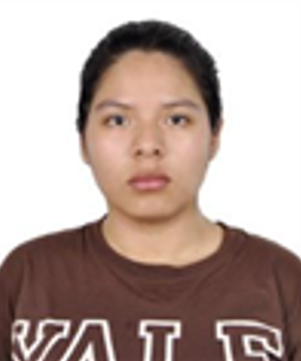
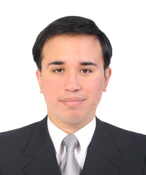
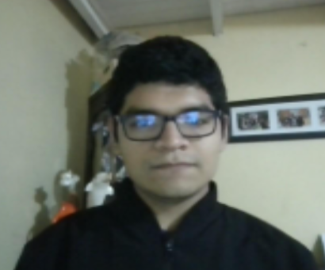
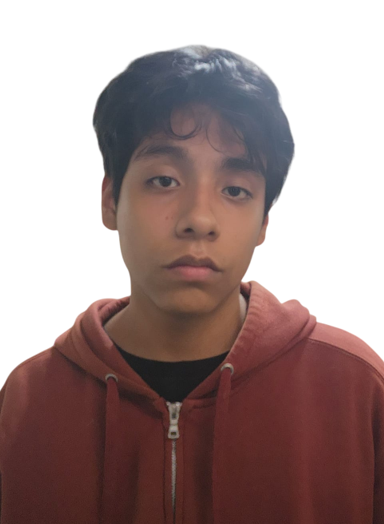
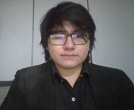

# Capítulo I: Introducción

## 1.1 Startup Profile

### 1.1.1 Descripción de la Startup

Somos una startup peruana denominada **SeniorsInProcess**, creada por estudiantes de la carrera de Ingeniería de Software de la Universidad Peruana de Ciencias Aplicadas (UPC), cuyo objetivo principal es mejorar el monitoreo y seguimiento de la rehabilitación de pacientes amputados mediante el uso de tecnología y análisis de datos biomecánicos.

Nuestra misión es reducir la brecha de comunicación e información entre los pacientes amputados, las clínicas de rehabilitación y los centros ortopédicos, facilitando un proceso de adaptación a la prótesis más seguro, personalizado y basado en datos. Buscamos que los profesionales de la salud puedan conocer cómo los pacientes utilizan sus prótesis en su vida cotidiana y puedan realizar un seguimiento oportuno de su evolución fuera de las instalaciones de la clínica.

Para cumplir con este propósito, hemos desarrollado una plataforma web de monitoreo y seguimiento de rehabilitación que permite recopilar datos biomecánicos y de uso de la prótesis en tiempo real. La información obtenida es procesada y presentada mediante la plataforma web a los diferentes actores involucrados, permitiendo a las clínicas supervisar el progreso del paciente y realizar un seguimiento más eficiente de los ejercicios de rehabilitación.

Asimismo, la solución permite la participación de los centros ortopédicos, brindándoles acceso a información relacionada con el uso y mantenimiento de las prótesis. De esta manera, Prothia busca integrar en una misma plataforma a los principales actores del proceso de rehabilitación, facilitando el intercambio de información y contribuyendo a una mejor adaptación del paciente a su prótesis.

El modelo de negocio de SeniorsInProcess se basa principalmente en una suscripción anual dirigida a las clínicas de rehabilitación, mediante la cual estas instituciones obtienen acceso a la plataforma y pueden proporcionar su uso como parte del tratamiento de sus pacientes amputados. Por otro lado, a los centros ortopédicos se les ofrece una licencia de software que les permite utilizar la plataforma para la gestión de las prótesis, así como acceder a información relacionada con su uso y necesidades de mantenimiento.

De esta manera, SeniorsInProcess busca generar valor para cada uno de sus segmentos objetivo: pacientes amputados, clínicas de rehabilitación y centros ortopédicos, proporcionando información que facilite la toma de decisiones, mejore el seguimiento de la rehabilitación y permita una gestión más eficiente de las prótesis.

### 1.1.2. Perfiles de integrantes del equipo

| **Integrante**            | **Ana Camila Patricio Farias**        									    |
| :------------------------ | :-------------------------------------------------------------------------------- |
| **Código del Estudiante** | u20241i469                                   										|
| **Carrera**               | Ingeniería de Software                       										|
| **Descripción**           | Mi nombre es Camila Patricio. Tengo 20 años, soy estudiante de Ingeniería de Software y considero que mis principales fortalezas son la responsabilidad, el compromiso y la disposición para aprender constantemente. Puedo aportar a mi grupo habilidades en programación, análisis de problemas y búsqueda de soluciones creativas. Además, me caracterizo por trabajar en equipo de manera colaborativa y organizada. Mi propósito es aportar mis conocimientos y esfuerzo para que logremos juntos los objetivos de nuestro proyecto.   												|
| **Foto**                  |  |

---
| **Integrante**            | **Oscar Diego Checa Burga**        									    |
| :------------------------ | :-------------------------------------------------------------------------------- |
| **Código del Estudiante** |                                    				U20231E492					|
| **Carrera**               | Ingeniería de Software                       										|
| **Descripción**           |  Mi nombre es Oscar Diego Checa Burga con código de alumno u20231e492. Soy estudiante de la carrera de ingeniería de software de 5to ciclo, interesado en el desarrollo de soluciones tecnológicas. Destaco por mi trabajo en equipo y comunicación constante. Tengo conocimiento en base de datos, desarrollo de aplicaciones y programación. Me gusta ir adaptándome a las nuevas tecnologías y aprender de estas, para poder desarrollar más en el ámbito profesional.  												|
| **Foto**                  |  |

---
| **Integrante**            | **Leonardo Felix Dextre Flores**        									    |
| :------------------------ | :-------------------------------------------------------------------------------- |
| **Código del Estudiante** |  U202421823                                  										|
| **Carrera**               | Ingeniería de Software                       										|
| **Descripción**           | Soy Leonardo Dextre, tengo 23 años, actualmente estoy cursando el cuarto ciclo de mi carrera ingeniería de software en la UPC. Entre mis habilidades más destacadas es saber un poco de programación especialmente en C++ y un poco en Python. Además, tengo básico conocimiento en programas de Microsoft como el Excel. Mis pasatiempos son ver películas y jugar videojuegos. Mi objetivo con el curso es aprender más cosas acerca de mi carrera y poder aplicarlo en mi futuro laboral como profesional.			|
| **Foto**                  |  |

---
| **Integrante**            | **Carlos Mathhew Salcedo Correa**        									    |
| :------------------------ | :-------------------------------------------------------------------------------- |
| **Código del Estudiante** | U202421065                                   										|
| **Carrera**               | Ingeniería de Software                       										|
| **Descripción**           | Soy Carlos Salcedo, tengo 18 años y actualmente curso el cuarto ciclo de la carrera de Ingeniería de Software en la Universidad Peruana de Ciencias Aplicadas (UPC). Cuento con conocimientos de nivel básico a intermedio en el lenguaje de programación C++, así como habilidades básicas en diseño. Además, tengo afinidad por el arte, especialmente el dibujo, y un fuerte interés por la música. Me considero una persona comprometida, responsable y con disposición constante para aprender. Mi objetivo en este curso es profundizar en los temas relacionados con mi carrera, fortalecer mis habilidades y prepararme para aplicarlas de manera efectiva en mi futuro profesional.   	   												|
| **Foto**                  |  |

---
| **Integrante**            | **Rafael Andre Barrenechea Bustamante**        									    |
| :------------------------ | :-------------------------------------------------------------------------------- |
| **Código del Estudiante** | u202417417                                   										|
| **Carrera**               | Ingeniería de Software                       										|
| **Descripción**           | Soy Rafael André Barrenechea Bustamante, estudiante del quinto ciclo de la carrera de Ingeniería de Software. Una de mis principales cualidades es la capacidad para diseñar experiencias de usuario intuitivas y desarrollar componentes tecnológicos adaptados a las necesidades del proyecto. En el equipo, contribuiré con mis conocimientos en tecnologías como C++, Python y TypeScript, así como en el prototipado de interfaces, trabajando eficientemente para cumplir con todos los objetivos que se demanden. |
| **Foto**                  |  |

---

### 1.2.1 Antecedentes y Problemática

**What / ¿QUÉ?**

Se presenta una falta de monitoreo y seguimiento continuo durante el proceso de rehabilitación de pacientes amputados que utilizan prótesis. Una vez que el paciente recibe su prótesis, gran parte del proceso de adaptación y realización de ejercicios ocurre fuera de la clínica, lo que dificulta que los profesionales puedan conocer cómo utiliza la prótesis en su vida cotidiana, si realiza correctamente los ejercicios indicados o si presenta posturas y movimientos inadecuados.

**When / ¿CUÁNDO?**

El problema se manifiesta principalmente después de que el paciente recibe la prótesis y continúa con su proceso de rehabilitación en el hogar. Durante este periodo, los profesionales de la clínica tienen una visibilidad limitada sobre las actividades que realiza el paciente fuera de las sesiones presenciales, dificultando la identificación oportuna de problemas durante su adaptación.

**Where / ¿DÓNDE?**

La problemática se presenta principalmente en el entorno doméstico del paciente, donde se desarrolla una parte importante de la adaptación y rehabilitación con la prótesis. También involucra a las clínicas de rehabilitación y centros ortopédicos, debido a que estos actores necesitan información sobre el progreso, uso y estado de la prótesis para brindar un mejor seguimiento y servicio.

**Who / ¿QUIÉN?**

Afecta principalmente a los pacientes amputados que utilizan una prótesis y necesitan realizar ejercicios y actividades de adaptación fuera de la clínica. También impacta a los profesionales de las clínicas de rehabilitación, quienes requieren información sobre el desempeño del paciente para realizar un seguimiento adecuado, y a los centros ortopédicos, que necesitan conocer el uso y comportamiento de las prótesis para facilitar su mantenimiento y gestión.

**Why / ¿POR QUÉ?**

Sucede debido a la falta de herramientas que permitan recopilar y compartir información objetiva sobre el uso de la prótesis y el desempeño biomecánico del paciente durante sus actividades cotidianas. Actualmente, gran parte del seguimiento depende de las sesiones presenciales, la observación del profesional y la información que el propio paciente comunica, lo que puede limitar la visibilidad sobre su evolución fuera de la clínica.

**How / ¿CÓMO?**

El problema se presenta porque los datos sobre el uso de la prótesis, los movimientos y el desempeño del paciente durante la rehabilitación en el hogar no se recopilan de manera continua ni se encuentran centralizados para los diferentes actores involucrados. Como consecuencia, los profesionales pueden tener dificultades para detectar posturas incorrectas, ejercicios realizados inadecuadamente o patrones de uso que requieran atención, mientras que los centros ortopédicos cuentan con información limitada para realizar un seguimiento del mantenimiento y uso de las prótesis.

**How Much / ¿CUÁNTO?**

La magnitud del problema se relaciona con la cantidad de tiempo que el paciente realiza su rehabilitación fuera de la clínica, durante el cual los profesionales cuentan con información limitada sobre su desempeño. Esta falta de visibilidad puede generar un seguimiento discontinuo y dificultar la detección temprana de problemas de adaptación, posturas incorrectas o un uso inadecuado de la prótesis. Para establecer un porcentaje o valor cuantitativo específico, será necesario realizar una validación con pacientes, clínicas y centros ortopédicos.

### 1.2.2 Lean UX Process

#### 1.2.2.1 Lean UX Problem Statements

Actualmente, el seguimiento y la rehabilitación de pacientes amputados se centran en evaluaciones presenciales puntuales en clínicas de rehabilitación y en controles periódicos en centros ortopédicos, por lo que la supervisión de los ejercicios y la evaluación del uso de la prótesis dependen del tiempo de consulta y del reporte subjetivo del paciente. Los productos y servicios existentes no logran dar visibilidad continua sobre el desempeño del paciente y el uso de su prótesis fuera de la clínica, ni conectar en una misma plataforma al paciente, la clínica y el centro ortopédico, lo que genera un seguimiento discontinuo y decisiones de rehabilitación, ajuste y mantenimiento basadas en percepciones y no en datos objetivos. Prothia busca cubrir esta necesidad mediante una plataforma web que recopile, procese y visualice datos biomecánicos y de uso de la prótesis, y que conecte el monitoreo durante las actividades cotidianas del paciente con la supervisión de los profesionales de rehabilitación y de los especialistas ortopédicos. Nuestro enfoque inicial estará dirigido a pacientes amputados en proceso de adaptación y rehabilitación, Profesionales de Terapia Física y Rehabilitación; y Técnicos Ortoprotesistas. Sabremos que la solución es exitosa cuando los pacientes mantengan el uso de la plataforma y de la prótesis a los 30 y 90 días con sesiones de monitoreo cada semana, los profesionales consulten los datos de cada paciente activo al menos una vez por semana y basen sus decisiones en reportes biomecánicos objetivos, y los técnicos ortoprotesistas programen ajustes, revisiones y mantenimiento a partir del uso real de las prótesis.

#### 1.2.2.2 Lean UX Assumptions

**A. Business Assumptions**

### Business Assumptions

- **Creemos que** las clínicas de rehabilitación y los centros ortopédicos que atienden pacientes amputados carecen de información objetiva sobre el desempeño del paciente y el uso de la prótesis fuera de la consulta, y que adoptarían una solución digital si se integra a su rutina de seguimiento.
- **Creemos que** un modelo de suscripción anual para clínicas y licencias de software para centros ortopédicos es viable, siempre que el servicio demuestre mejoras medibles en el seguimiento y la eficiencia operativa.
- **Creemos que** nuestra ventaja será integrar en una sola plataforma a pacientes, clínicas y centros ortopédicos, frente a herramientas aisladas de monitoreo, seguimiento o de fabricantes de prótesis.
- **Creemos que** nuestro equipo, con competencias en software, análisis de datos biomecánicos y sector salud, podrá construir y dar soporte a la solución, y que las alianzas con clínicas y centros ortopédicos que validen el uso clínico y faciliten el acceso al mercado permitirán mitigar los mayores riesgos: la integración de sensores con distintas prótesis y la adopción por parte de clínicas y pacientes.

**B. Business Outcome Assumptions**

• **Creemos que** lograremos una adopción inicial de la plataforma, con 3 a 5 instituciones que completan el piloto en los primeros 6 meses y 50% o más que decide continuar con una suscripción o licencia, si las clínicas y los centros ortopédicos perciben mejoras concretas en su seguimiento durante el piloto.
• **Creemos que** lograremos que los profesionales de terapia física y rehabilitación incorporen el monitoreo como parte de su tratamiento, con 30% o más de sus pacientes amputados registrados y al menos una consulta semanal de datos por paciente activo, si los profesionales perciben que los datos les ayudan a decidir mejor.
• **Creemos que** lograremos que los pacientes usen la plataforma de forma sostenida, con retención de uso a los 30 y 90 días, si perciben avances en su rehabilitación y en el uso de su prótesis durante las primeras semanas.
• **Creemos que** lograremos una alta retención de clínicas, con una renovación anual de 80% o más, si el servicio demuestra mejoras medibles en el seguimiento clínico y en la eficiencia operativa.
• **Creemos que** podemos alcanzar la sostenibilidad financiera si logramos consolidar una base de clínicas y centros ortopédicos con suscripciones y licencias recurrentes, y mantener un costo de adquisición bajo gracias a los casos de éxito de los pilotos.

**C. User Assumptions**

• **Creemos que** cada clínica de rehabilitación cuenta con profesionales (fisioterapeutas, médicos fisiatras) responsables del seguimiento de los pacientes, y que cada centro ortopédico cuenta con técnicos ortoprotesistas responsables de adaptar y mantener las prótesis. Junto con los pacientes amputados, son los principales usuarios de Prothia.
• **Creemos que** estos usuarios necesitan acceder a información actualizada sobre el desempeño del paciente y el uso de la prótesis entre los controles presenciales.
• **Creemos que** actualmente el seguimiento depende de la consulta y del reporte subjetivo del paciente, y que la información de clínicas y centros ortopédicos está separada, lo que dificulta su análisis y seguimiento.
• **Creemos que** quienes pagarán serán las clínicas y los centros ortopédicos, mientras que el paciente será quien use la plataforma con más frecuencia, y que el técnico ortoprotesista instalará y vinculará los sensores a la prótesis (por validar).
• **Creemos que** los usuarios pueden adaptarse a una plataforma web, incluso con distintos niveles de familiaridad con la tecnología, siempre que la interfaz sea simple, clara y accesible.

**D. User Outcome & Benefit Assumptions**

• **Creemos que** los pacientes podrán conocer su progreso y el uso de su prótesis en sus actividades cotidianas, corregir hábitos y mantenerse motivados, con la tranquilidad de que su equipo clínico observa su avance incluso fuera de las sesiones presenciales.
• **Creemos que** los profesionales de rehabilitación podrán identificar a tiempo posturas, movimientos o patrones de uso que requieren atención, y tomar decisiones clínicas basadas en datos objetivos y no solo en lo observado en consulta.
• **Creemos que** los técnicos ortoprotesistas podrán anticipar el mantenimiento y los ajustes de las prótesis a partir de su uso real, y programar revisiones de forma oportuna.
• **Creemos que** pacientes, clínicas y centros ortopédicos percibirán una comunicación más fluida, con menos pérdida de datos y menos duplicidad de esfuerzos, al compartir la información en una plataforma centralizada.

**E. Feature Assumptions**

• **Creemos que** lograremos que las clínicas consulten los datos al menos una vez por semana por paciente activo si los profesionales de rehabilitación logran visualizar el progreso de todos sus pacientes y priorizar la atención de quienes más la necesitan con un dashboard centralizado de monitoreo.
• **Creemos que** lograremos una adopción inicial de 3 a 5 instituciones piloto, con 50% o más que continúa, si los profesionales logran contar con datos objetivos sobre el desempeño del paciente en sus actividades reales con un módulo de monitoreo biomecánico que registre movimientos, posturas e indicadores de uso de la prótesis mediante sensores o dispositivos portátiles compatibles con distintas prótesis.
• **Creemos que** lograremos una renovación anual de clínicas de 80% o más si los profesionales logran revisar la evolución de cada paciente y comparar su desempeño entre periodos con un módulo de seguimiento de rehabilitación.
• **Creemos que** lograremos que al menos 70% de las alertas sean revisadas por el profesional en 48 horas (propuesta) si los profesionales logran detectar a tiempo patrones de uso, posturas o movimientos que requieren atención con alertas automáticas con umbrales definidos por el profesional.
• **Creemos que** lograremos retención de uso de los pacientes a los 30 y 90 días, con sesiones semanales de monitoreo fuera de la clínica, si los pacientes logran conocer su propio desempeño y el uso de su prótesis con una vista de progreso personal.
• **Creemos que** lograremos que los centros ortopédicos contraten y renueven licencias si los técnicos ortoprotesistas logran anticipar mantenimiento y ajustes con un historial de uso de la prótesis que permita agendar revisiones.
• **Creemos que** lograremos que los tres actores estén activos en cada institución piloto si pacientes, profesionales y técnicos logran ver solo lo relevante para su rol e intercambiar información con un acceso diferenciado por tipo de usuario.

#### 1.2.2.3 Lean UX Hypothesis Statements

- **Creemos que** lograremos que las clínicas incorporen el monitoreo como parte habitual de su tratamiento, con al menos 1 consulta semanal de datos por paciente activo y 30% o más de los pacientes amputados de cada clínica piloto registrados, si los profesionales de rehabilitación logran visualizar el progreso y el desempeño de todos sus pacientes en un solo lugar, priorizar la atención de quienes más la necesitan y decidir con evidencia, con un dashboard centralizado de monitoreo que muestre el estado y la evolución de cada paciente.

- **Creemos que** lograremos una adopción inicial de la plataforma, con 3 a 5 instituciones que completan el piloto en 6 meses y 50% o más que continúa con suscripción o licencia, si los profesionales de rehabilitación logran contar con datos objetivos sobre el desempeño del paciente durante sus actividades reales, y no solo con lo observado en consulta o el reporte subjetivo, con un módulo de monitoreo biomecánico que, mediante sensores o dispositivos portátiles compatibles con distintas prótesis, registre movimientos, posturas e indicadores de uso de la prótesis.

- **Creemos que** lograremos una alta retención de clínicas, con una renovación anual de 80% o más y baja cancelación en el primer año, si los profesionales de rehabilitación logran revisar la evolución de cada paciente, comparar su desempeño entre periodos y ajustar el tratamiento con base en evidencia, con un módulo de seguimiento de rehabilitación que permita consultar el historial de cada paciente y comparar periodos.

- **Creemos que** lograremos una alta retención de clínicas, al demostrar valor medible en la detección temprana de problemas (propuesta: al menos 70% de las alertas revisadas por el profesional en 48 horas), si los profesionales de rehabilitación logran detectar a tiempo patrones de uso, posturas o movimientos que requieren atención, antes de que generen complicaciones o retrasos, con un sistema de alertas automáticas con umbrales definidos por el profesional.
H5. Vista de progreso para el paciente

- **Creemos que** lograremos un uso sostenido de la plataforma por parte de los pacientes, con retención de uso a los 30 y 90 días (propuesta: 60% y 40%) y sesiones semanales de monitoreo fuera de la clínica (propuesta: al menos 3), si los pacientes amputados en proceso de rehabilitación logran un mayor conocimiento de su propio desempeño y del uso de su prótesis, que les permita corregir hábitos y mantenerse motivados, con una vista de progreso personal que muestre su desempeño y el uso de su prótesis en sus actividades cotidianas.

- **Creemos que** lograremos un crecimiento sostenible mediante la contratación y renovación de licencias por parte de los centros ortopédicos (propuesta: renovación de 80% o más), si los técnicos ortoprotesistas logran anticipar mantenimiento y ajustes a partir del uso real de cada prótesis, con un historial de uso de la prótesis que permita consultar cómo se utiliza cada dispositivo, agendar revisiones y registrar el mantenimiento.

- **Creemos que** lograremos una adopción inicial de la plataforma y su uso por los tres actores (propuesta: al menos un usuario activo por semana de cada rol en el 100% de las instituciones piloto), si pacientes, profesionales de clínicas y técnicos ortoprotesistas logran una comunicación e intercambio de información más fluidos, viendo solo lo relevante para su rol, con un acceso diferenciado por tipo de usuario que muestre a cada rol solo la información y las funcionalidades pertinentes y permita el intercambio de datos entre clínicas y centros.

#### 1.2.2.4 Lean UX Canvas

<table width="100%">
  <thead>
    <tr>
      <th width="30%" align="left" valign="top">Business Problem</th>
      <th width="35%" align="left" valign="top">Solutions</th>
      <th width="35%" align="left" valign="top">Business Outcomes</th>
    </tr>
  </thead>
  <tbody>
    <tr>
      <td valign="top">
        El seguimiento y la rehabilitación de pacientes amputados se basa en evaluaciones presenciales puntuales y controles periódicos, por lo que hay poca visibilidad sobre el desempeño del paciente y el uso de la prótesis fuera de la clínica. Los profesionales no pueden observar si los ejercicios se realizan correctamente, cómo se utiliza la prótesis ni si existen posturas o movimientos inadecuados, y sus decisiones dependen del reporte subjetivo del paciente. Además, la información sobre rehabilitación, uso y mantenimiento se encuentra dispersa entre el paciente, la clínica y el centro ortopédico. Prothia busca resolver esta problemática mediante una plataforma web que recopila, procesa y presenta datos biomecánicos y de uso de la prótesis, conectando a los tres actores.
      </td>
      <td valign="top">
        • <b>Dashboard centralizado de monitoreo:</b> visualización del progreso y desempeño de todos los pacientes en un solo lugar.  
        • <b>Monitoreo biomecánico:</b> recopilación de datos sobre movimientos, posturas e indicadores de uso de la prótesis durante las actividades cotidianas.  
        • <b>Seguimiento de rehabilitación:</b> evolución del paciente y comparación de su desempeño entre periodos.  
        • <b>Alertas automáticas:</b> detección de patrones, posturas o movimientos que requieren revisión.  
        • <b>Vista de progreso para el paciente:</b> acceso del paciente a su propio desempeño y uso de la prótesis.  
        • <b>Historial de uso de la prótesis:</b> registro del uso real de cada dispositivo para programar revisiones y mantenimiento.  
        • <b>Acceso diferenciado:</b> información y funcionalidades según el tipo de usuario.
      </td>
      <td valign="top">
        • <b>Adopción inicial:</b> 3 a 5 instituciones completan pilotos en 6 meses y 50% o más continúa con suscripción o licencia.  
        • <b>Incorporación al tratamiento:</b> 30% o más de los pacientes amputados de cada clínica piloto registrados y consulta de datos al menos una vez por semana por paciente activo.  
        • <b>Uso sostenido de pacientes:</b> retención de uso a los 30 y 90 días y sesiones semanales de monitoreo fuera de la clínica.  
        • <b>Retención de clínicas:</b> renovación anual de 80% o más.  
        • <b>Crecimiento sostenible:</b> costo de adquisición por cliente, ingresos recurrentes y relación valor de vida/costo de adquisición.
      </td>
    </tr>
  </tbody>
</table>

 

<table width="100%">
  <thead>
    <tr>
      <th width="50%" align="left" valign="top">Users</th>
      <th width="50%" align="left" valign="top">User Outcomes &amp; Benefits</th>
    </tr>
  </thead>
  <tbody>
    <tr>
      <td valign="top">
        • <b>Pacientes amputados:</b> <i>"Quiero realizar mi rehabilitación y adaptación a la prótesis de manera adecuada y saber que mi equipo clínico conoce mi progreso incluso cuando estoy fuera de la clínica."</i>  
        • <b>Profesionales de terapia física y rehabilitación (clínicas):</b> <i>"Necesito conocer cómo evolucionan mis pacientes entre sesiones para detectar problemas a tiempo y tomar decisiones basadas en datos objetivos."</i>  
        • <b>Técnicos ortoprotesistas (centros ortopédicos):</b> <i>"Necesito conocer cómo se utiliza realmente cada prótesis para programar ajustes y mantenimiento de forma oportuna y brindar un mejor servicio."</i>
      </td>
      <td valign="top">
        • <b>Pacientes amputados:</b> rehabilitación más efectiva y con mayor autonomía. Beneficios: seguimiento continuo y personalizado, mayor conocimiento de su desempeño y del uso de la prótesis, corrección de hábitos y motivación.  
        • <b>Profesionales de terapia física y rehabilitación:</b> acceso a información del desempeño del paciente fuera de las sesiones. Beneficios: detección temprana de problemas antes de que generen complicaciones, decisiones clínicas basadas en evidencia y mayor eficiencia del seguimiento.  
        • <b>Técnicos ortoprotesistas:</b> acceso al uso real de cada prótesis. Beneficios: anticipar mantenimiento y ajustes, programar revisiones de forma oportuna y personalizada.  
        • <b>Los tres actores:</b> comunicación e intercambio de información más fluidos, con menos pérdida de datos y duplicidad de esfuerzos.
      </td>
    </tr>
  </tbody>
</table>

 

<table width="100%">
  <thead>
    <tr>
      <th width="36%" align="left" valign="top">Hypotheses</th>
      <th width="32%" align="left" valign="top">What's the most important thing we need to learn first?</th>
      <th width="32%" align="left" valign="top">What's the least amount of work we need to do to learn the next most important thing?</th>
    </tr>
  </thead>
  <tbody>
    <tr>
      <td valign="top">
        • <b>Dashboard:</b> lograremos que las clínicas incorporen el monitoreo al tratamiento si los profesionales pueden decidir con evidencia y priorizar pacientes con un dashboard centralizado.  
        • <b>Monitoreo biomecánico:</b> lograremos adopción inicial si los profesionales cuentan con datos objetivos del desempeño real del paciente.  
        • <b>Seguimiento:</b> lograremos alta retención de clínicas si pueden comparar la evolución del paciente entre periodos.  
        • <b>Alertas:</b> lograremos alta retención de clínicas si detectan a tiempo patrones o posturas que requieren atención.  
        • <b>Vista de progreso:</b> lograremos uso sostenido de los pacientes si conocen su desempeño y se mantienen motivados.  
        • <b>Historial de uso:</b> lograremos crecimiento sostenible si los técnicos ortoprotesistas anticipan mantenimiento y ajustes.  
        • <b>Acceso diferenciado:</b> lograremos adopción por los tres actores si cada uno ve solo lo relevante para su rol.
      </td>
      <td valign="top">
        • ¿Los profesionales consideran que la falta de información fuera de las sesiones es un problema relevante y estarían dispuestos a pagar por resolverlo?  
        • ¿Los pacientes aceptarían usar sensores durante sus actividades cotidianas y mantendrían el uso a 30 y 90 días?  
        • ¿Qué datos biomecánicos consideran más útiles los profesionales para el seguimiento?  
        • ¿Qué información sobre uso necesitan los técnicos ortoprotesistas para programar mantenimiento?  
        • ¿Los tres actores consideran útil una plataforma centralizada para compartir información?
      </td>
      <td valign="top">
        • Entrevistar a profesionales de clínicas y técnicos ortoprotesistas sobre sus necesidades de información y su disposición a pagar.  
        • Entrevistar a pacientes amputados sobre sus dificultades en la rehabilitación fuera de la clínica y su aceptación de sensores.  
        • Diseñar un prototipo de alta fidelidad en Figma con dashboard, seguimiento de rehabilitación y vista de progreso del paciente.  
        • Crear una simulación básica de datos biomecánicos para validar cómo se visualizaría la información.  
        • Ejecutar pruebas de usabilidad con usuarios representativos de los tres segmentos para validar las funcionalidades principales.
      </td>
    </tr>
  </tbody>
</table>

## 1.3 Segmentos Objetivos

### Segmento 1: Pacientes Amputados

Corresponde a los usuarios finales de la solución, conformado por personas que han sufrido una amputación y utilizan una prótesis como parte de su proceso de recuperación y adaptación. Estos pacientes realizan una parte importante de su rehabilitación fuera de las instalaciones de la clínica, principalmente en sus hogares, donde deben realizar ejercicios y actividades orientadas a mejorar su movilidad y adaptación al dispositivo. En su rutina pueden enfrentar dificultades para realizar correctamente los ejercicios, mantener posturas adecuadas o identificar problemas relacionados con el uso de la prótesis, especialmente cuando no cuentan con supervisión profesional constante.

En este contexto, valoran soluciones que les permitan contar con un mayor acompañamiento durante su proceso de rehabilitación sin necesidad de acudir constantemente a la clínica. Para este segmento, Prothia representa una herramienta que permite complementar las sesiones presenciales mediante el monitoreo del uso de la prótesis y la recopilación de información que puede ser revisada por los profesionales responsables de su rehabilitación.

**Características demográficas e información estadística de sustento:**

Según la Primera Encuesta Nacional Especializada sobre Discapacidad del Instituto Nacional de Estadística e Informática (INEI), en el Perú existen 1 millón 575 mil 402 personas con algún tipo de discapacidad, lo que representa el 5,2% de la población total del país. De este grupo, la discapacidad motora —dificultad para moverse, caminar o usar brazos y piernas— es la que más afecta, alcanzando 932 mil personas (59,2% del total con discapacidad).

Dentro de este segmento con discapacidad motora, el 56,4% son mujeres (525 mil 719 personas) y el 43,6% son hombres (406 mil 274 personas). Respecto al origen de la limitación, esta se presenta principalmente por edad avanzada (32,5%), enfermedad crónica (24,4%), causas genéticas o congénitas (9,8%), accidentes comunes fuera del hogar (4,9%), accidentes en el hogar (4,6%) y accidentes de tránsito (4,0%).

A nivel de causas específicas de amputación, un estudio del Instituto Nacional de Rehabilitación (Callao, Perú) revisó 1,290 historias clínicas de pacientes amputados atendidos entre 2003 y 2007, de los cuales 108 casos correspondieron a amputaciones por accidentes de trabajo. Asimismo, otro estudio publicado en la Revista Peruana de Medicina Experimental y Salud Pública documentó las características clínico-epidemiológicas de amputaciones de miembro inferior por pie diabético en hospitales de la costa norte peruana entre 1990 y 2000, lo que confirma al pie diabético como otra causa relevante de amputación en el país, además de los accidentes laborales y de tránsito.

Este segmento se concentra principalmente en adultos y adultos mayores, dado que la edad avanzada es la principal causa de discapacidad motora reportada por el INEI, aunque también incluye a población económicamente activa afectada por accidentes de trabajo o de tránsito.

### Segmento 2: Profesionales de Terapia Física y Rehabilitación

Corresponde al segmento principal al que se dirige el modelo de negocio de Prothia, conformado por clínicas y profesionales especializados en la rehabilitación de pacientes amputados. Estas instituciones son responsables de acompañar al paciente durante su proceso de adaptación y recuperación, pero presentan limitaciones para conocer su desempeño cuando este se encuentra fuera de las sesiones presenciales. Necesitan información que les permita realizar un seguimiento más completo, identificar posibles dificultades y evaluar la evolución del paciente durante el tratamiento.

En este contexto, valoran herramientas que permitan complementar la observación presencial con información recopilada durante las actividades cotidianas del paciente. Prothia representa para este segmento una plataforma que permite centralizar la información de sus pacientes, visualizar datos biomecánicos y de uso de las prótesis y realizar un seguimiento más continuo de la rehabilitación. La clínica obtiene acceso mediante una suscripción anual a la plataforma y puede proporcionar el acceso a sus pacientes como parte del tratamiento.

**Características demográficas e información estadística de sustento:**

En Lima existe una oferta amplia y fragmentada de centros de rehabilitación física, que incluye tanto establecimientos privados especializados en traumatología, ortopedia y fisioterapia, como servicios públicos, entre ellos el Centro de Medicina Física y Rehabilitación de EsSalud. Directorios comerciales de la ciudad listan más de una decena de centros de rehabilitación física activos solo en distritos como Pueblo Libre, La Molina, Jesús María, San Miguel y Surquillo, varios de los cuales ofrecen explícitamente tratamiento pre y post quirúrgico para amputaciones y adaptación de prótesis.

No se identificó un registro público centralizado que cuantifique con precisión el número total de clínicas de rehabilitación a nivel nacional especializadas en pacientes amputados, por lo que se recomienda validar esta cifra directamente mediante entrevistas con asociaciones del sector (Colegio Médico del Perú, Sociedad Peruana de Medicina Física y Rehabilitación) o mediante un registro del MINSA, como parte de la siguiente etapa de investigación.

### Segmento 3: Técnicos Ortoprotesistas

Corresponde a los establecimientos especializados en la fabricación, adaptación y mantenimiento de prótesis para pacientes amputados. Estos centros necesitan conocer las condiciones de uso de los dispositivos para facilitar su seguimiento y mantenimiento, así como contar con información que pueda contribuir a comprender el comportamiento de la prótesis durante las actividades cotidianas del usuario. Actualmente, parte de esta información puede depender de las observaciones realizadas durante las visitas del paciente o de la comunicación entre el usuario y el especialista.

En este contexto, los centros ortopédicos valoran soluciones que les permitan acceder a información sobre el uso de las prótesis y mantener un registro que facilite su gestión. Prothia representa una herramienta que permite complementar la información técnica de la prótesis con datos relacionados con su utilización, brindando a las ortopedias acceso a la plataforma mediante un modelo de licenciamiento de software.

**Características demográficas e información estadística de sustento:**

El mercado de centros ortopédicos en Lima está compuesto principalmente por negocios especializados en la venta de productos ortopédicos, prótesis externas, corsés y otros dispositivos de rehabilitación, distribuidos en distritos como La Victoria, Cercado de Lima y María Auxiliadora, según directorios comerciales locales. Estos establecimientos suelen operar de forma independiente, sin un sistema compartido que centralice la información sobre el uso o mantenimiento de las prótesis que fabrican o ajustan.

Al igual que en el caso de las clínicas de rehabilitación, no se encontró una fuente oficial que cuantifique el número total de centros ortopédicos a nivel nacional o de Lima Metropolitana, por lo que este dato deberá obtenerse mediante entrevistas directas con el sector o consultando registros del Ministerio de Salud (MINSA) o asociaciones de técnicos ortopedistas, como parte de la validación del modelo de negocio.
