# Capítulo II: Requirements Elicitation & Analysis 

## 2.1. Competidores. 

### Competidor 1: DyCare (ReHub)
DyCare es una empresa de salud digital que ha desarrollado ReHub, una plataforma de telerehabilitación asistida por inteligencia artificial y visión computacional para el tratamiento de afecciones musculoesqueléticas. Proporciona herramientas para la prescripción de ejercicios personalizados, guía interactiva con biofeedback en tiempo real para el paciente desde su hogar y un panel clínico para monitorear la adherencia y evolución del tratamiento. Esta plataforma es reconocida en el sector de la fisioterapia digital por permitir a las clínicas y aseguradoras optimizar el seguimiento remoto sin requerir hardware adicional complejo.

### Competidor 2: Ottobock Digital Solutions
Ottobock Digital Solutions es la división tecnológica del fabricante global de prótesis y órtesis Ottobock, la cual ofrece herramientas digitales y aplicaciones móviles (como connectgo, connectgo.pro y Cockpit) conectadas por Bluetooth a sus prótesis controladas por microprocesador. Proporciona funcionalidades para que los técnicos ortopédicos calibren y configuren modos de movimiento, al tiempo que permite a los usuarios monitorear el estado del dispositivo, el nivel de batería y métricas básicas de actividad física diaria. Esta suite es conocida por su alto nivel de precisión técnica y por facilitar el mantenimiento y control directo de dispositivos protésicos de alta gama.

### Competidor 3: SWORD Health
SWORD Health es una plataforma integral de terapia física digital y telerehabilitación predictiva enfocada en el tratamiento del dolor y la recuperación posquirúrgica. Su solución combina sensores de movimiento inerciales portátiles con un terapeuta digital impulsado por IA (Phoenix), el cual guía y corrige al paciente en tiempo real durante cada sesión mientras un equipo de fisioterapeutas clínicos supervisa su progreso de forma remota a través de la nube. Esta plataforma es ampliamente reconocida en el mercado corporativo y de aseguradoras de salud por reducir significativamente la deserción en las terapias domiciliarias y disminuir costos médicos asociados a cirugías o tratamientos tradicionales.

---
## 2.1.1. Análisis competitivo.

<table>
  <thead>
    <tr>
      <th colspan="6">Competitive Analysis Landscape</th>
    </tr>
    <tr>
      <th colspan="2">¿Por qué llevar a cabo este análisis?</th>
      <th colspan="4">Identificar las soluciones existentes de telerehabilitación y monitoreo de prótesis en el mercado, contrastando sus propuestas de valor frente al enfoque integrado de SeniorsInProcess (paciente–clínica–ortopedia) para detectar ventajas competitivas y oportunidades de posicionamiento.</th>
    </tr>
    <tr>
      <th colspan="2"></th>
      <th>SeniorsInProcess (Prothia)  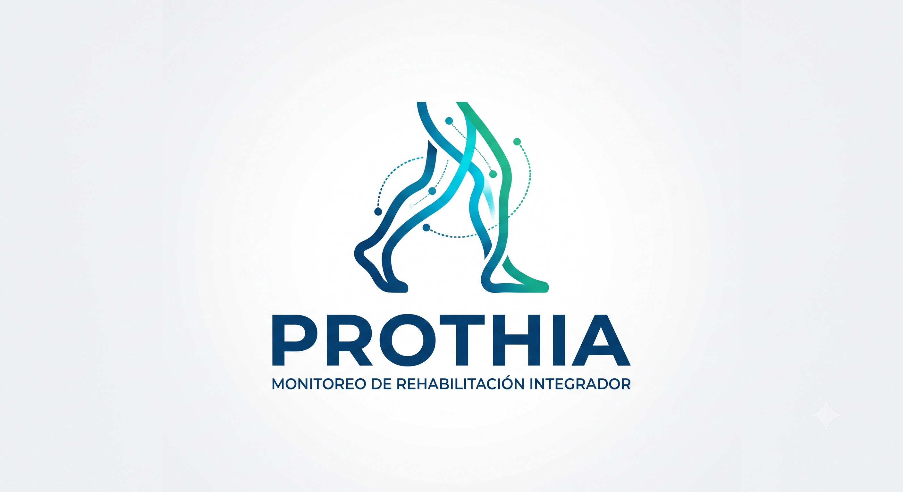</th>
      <th>DyCare (Rehub)  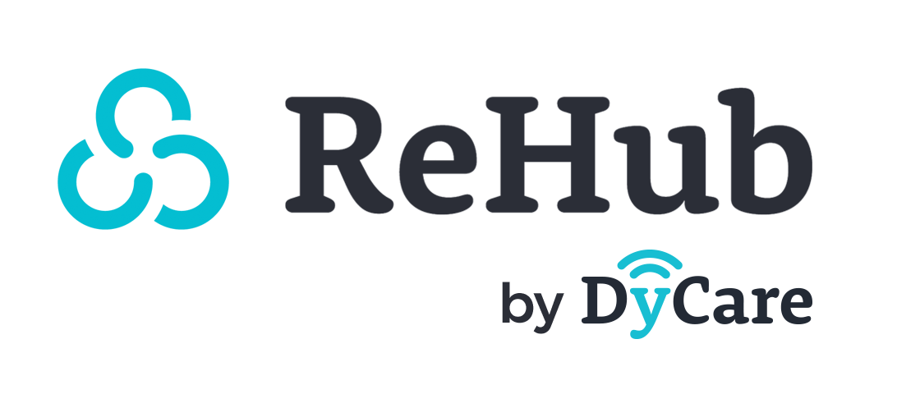</th>
      <th>Ottobock Digital Solutions  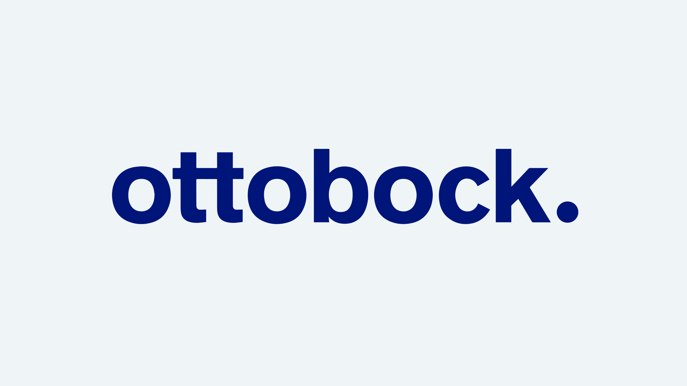</th>
      <th>SWORD Health  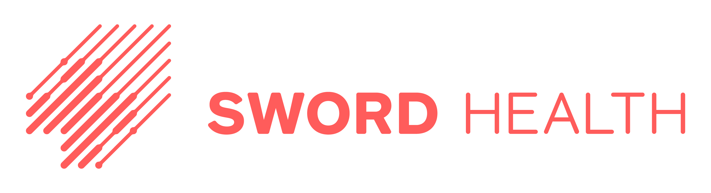</th>
    </tr>
  </thead>
  <tbody>
    <!-- SECCIÓN: Perfil -->
    <tr>
      <td rowspan="2"><b>Perfil</b></td>
      <td><b>Overview</b></td>
      <td>Plataforma web integral de monitoreo biomecánico y seguimiento remoto de rehabilitación para amputados, articulando clínica, paciente y ortopedia.</td>
      <td>Empresa de salud digital (HealthTech) especializada en software de telerehabilitación y análisis de movimiento en tiempo real para lesiones musculoesqueléticas</td>
      <td>Gigante global en diseño, fabricación y soluciones digitales de prótesis/ortesis inteligentes con apps de configuración y telemetría de dispositivos.</td>
      <td>Unicornio de terapia física digital enfocado en la rehabilitación remota guiada por sensores corporales (Digital Therapist) y supervisada por fisioterapeutas.</td>
    </tr>
    <tr>
      <td><b>Ventaja competitiva ¿Qué valor ofrece a los clientes?</b></td>
      <td>Integración en una sola plataforma la clínica, el centro ortopédico y el paciente, permitiendo cruzar datos biomecánicos con historial y mantenimiento protésico</td>
      <td>Algoritmos de visión computacional propios sin hardware obligatorio (+60 puntos anatómicos) y biofeedback visual inmediato de ejercicios.</td>
      <td>Marca de referencia mundial, integración nativa de microprocesadores y sensores mecánicos propietarios en la misma prótesis física.</td>
      <td>Solución integral llave en mano con sensores de movimiento portátiles propietarios, alta adherencia terapéutica y validaciones clínicas masivas.</td>
    </tr>
    <!-- SECCIÓN: Perfil de Marketing -->
    <tr>
      <td rowspan="2"><b>Perfil de Marketing</b></td>
      <td><b>Mercado objetivo</b></td>
      <td>Clínicas de rehabilitación física especializadas, centros de confección ortopédica y pacientes amputados (enfoque inicial en Perú y LATAM).</td>
      <td>Clínicas de fisioterapia, hospitales, aseguradoras de salud y mutuas laborales en Europa y Latinoamérica.</td>
      <td>Ortesistas/protesistas certificados (CPO), clínicas de ortopedia especializada y usuarios de dispositivos protésicos avanzados a nivel global.</td>
      <td>Aseguradoras médicas, grandes corporaciones/empleadores que buscan reducir costos de bajas laborales y pacientes con dolencias musculoesqueléticas.</td>
    </tr>
    <tr>
      <td><b>Estrategias de marketing</b></td>
      <td>Ventas directas B2B a clínicas y ortopedias, pilotos de validación clínica, alianzas académicas/universitarias y demostraciones de producto.</td>
      <td>Inbound marketing médico, acuerdos B2B con mutuas/aseguradoras, participación en ferias sanitarias y pruebas gratuitas para centros clínicos.</td>
      <td>Venta cruzada atada a la compra de prótesis físicas de alta gama, capacitación médica continua y congresos internacionales de ortopedia.</td>
      <td>Modelo B2B2C centrado en beneficios corporativos para empresas ("employer benefits"), reducción demostrada de costos médicos y marketing institucional de alto impacto.</td>
    </tr>
    <!-- SECCIÓN: Perfil de Producto -->
    <tr>
      <td rowspan="3"><b>Perfil de Producto</b></td>
      <td><b>Productos & Servicios</b></td>
      <td>Plataforma web centralizada con dashboard de métricas biomecánicas, alertas de posturas/ejercicios, seguimiento clínico e historial de uso protésico.</td>
      <td>Software Rehub: plataforma de telerehabilitación con IA, biblioteca de más de 3,500 ejercicios terapéuticos y corrección postural en tiempo real.</td>
      <td>Ecosistema de apps (Cockpit, connectgo, Myo Plus) para configuración de modos, nivel de batería, lectura de mioelectrodos y mantenimiento.</td>
      <td>Kit de sensores de movimiento inerciales portátiles, tableta con software de ejercicios interactivos y portal web para el terapeuta clínico.</td>
    </tr>
    <tr>
      <td><b>Precios & Costos</b></td>
      <td>Suscripción anual para clínicas de rehabilitación y licencias de software para centros ortopédicos.</td>
      <td>Planes SaaS recurrentes por número de fisioterapeutas/pacientes activos o contratos corporativos a gran escala con aseguradoras.</td>
      <td>Las aplicaciones básicas son gratuitas/incluidas con el hardware protésico; licencias clínicas avanzadas integradas al costo de las prótesis biónicas.</td>
      <td>Modelo de tarificación por empleado/miembro cubierto (PEPM) o cobro por episodio de tratamiento rehabilitador a las aseguradoras.</td>
    </tr>
    <tr>
      <td><b>Canales de distribución (Web y/o Móvil)</b></td>
      <td>Plataforma Web (SaaS accesible por navegador para clínica/ortopedia) con portal web/móvil responsivo para el paciente.</td>
      <td>Web (portal clínico) y aplicación móvil/tableta (iOS y Android) para pacientes.</td>
      <td>Aplicaciones móviles nativas en Google Play Store y Apple App Store sincronizadas por Bluetooth a los componentes.</td>
      <td>Hardware físico enviado directamente al domicilio del paciente junto a aplicaciones móviles y portal en la nube para los profesionales.</td>
    </tr>
    <!-- SECCIÓN: Análisis SWOT -->
    <tr>
      <td rowspan="5"><b>Análisis SWOT</b></td>
      <td colspan="5">Realice esto para su startup y sus competidores. Sus fortalezas deberían apoyar sus oportunidades y contribuir a lo que ustedes definen como su posible ventaja competitiva.</td>
    </tr>
    <tr>
      <td><b>Fortalezas</b></td>
      <td>
        • Enfoque de nicho centrado específicamente en amputados. 
        • Conexión directa entre la clínica y la ortopedia para mantenimiento. 
        • Arquitectura web accesible y adaptable a diversas prótesis.
      </td>
      <td>
        • Certificación como dispositivo médico (CE Clase IIa). 
        • IA de visión computacional madura y sin hardware adicional requerido. 
        • Biblioteca masiva de ejercicios terapéuticos.
      </td>
      <td>
        • Presencia de marca y red de distribución líder en el mundo. 
        • Hardware y software integrados de fábrica con alta precisión. 
        • Solidez financiera y patentes propietarias.
      </td>
      <td>
        • Solución clínica y tecnológicamente validada a gran escala. 
        • Respaldada por fuerte capitalización y alianzas con grandes aseguradoras. 
        • Experiencia de usuario (UX) simplificada para el paciente.
      </td>
    </tr>
    <tr>
      <td><b>Debilidades</b></td>
      <td>
        • Etapa temprana de desarrollo. 
        • Requiere validar la compatibilidad e integración con diversos sensores. 
        • Menor presupuesto inicial para marketing y homologación médica.
      </td>
      <td>
        • No está especializada en dinámicas de adaptación ni encaje protésico. 
        • No integra a los fabricantes u ortopedias en la gestión técnica del dispositivo.
      </td>
      <td>
        • Ecosistema cerrado (funciona únicamente con dispositivos y componentes Ottobock). 
        • No profundiza en el plan diario de ejercicios fisioterapéuticos en casa.
      </td>
      <td>
        • Solución de alto costo orientada a mercados masivos, poco adaptable a realidades sanitarias de países en desarrollo. 
        • Poca personalización para amputados.
      </td>
    </tr>
    <tr>
      <td><b>Oportunidades</b></td>
      <td>
        • Alta demanda insatisfecha de telemonitoreo protésico asequible en Perú y la región. 
        • Alianzas estratégicas con clínicas locales y talleres ortopédicos. 
        • Reducción de costos de telemedicina postoperatoria.
      </td>
      <td>
        • Expansión de contratos con sistemas públicos de salud y aseguradoras privadas para descongestionar listas de espera. 
        • Incorporación de nuevos módulos de patologías.
      </td>
      <td>
        • Incorporación de analítica predictiva de marcha y desgaste de componentes para ofrecer servicios de mantenimiento programado.
      </td>
      <td>
        • Penetración en nuevos mercados internacionales a través de planes de salud corporativos y convenios con mutuas de trabajo.
      </td>
    </tr>
    <tr>
      <td><b>Amenazas</b></td>
      <td>
        • Resistencia inicial al cambio por parte de profesionales de la salud tradicionales. 
        • Tiempos prolongados de decisión de compra en clínicas y ortopedias. 
        • Barreras en adquisición de sensores biomecánicos compatibles.
      </td>
      <td>
        • Competidores de bajo costo basados en apps móviles sin suscripción corporativa. 
        • Regulaciones crecientes sobre IA y manejo de datos clínicos (RGPD/MDR).
      </td>
      <td>
        • Nuevos fabricantes emergentes de componentes protésicos de código abierto o costo reducido. 
        • Falta de interoperabilidad de sus datos con sistemas de salud de terceros.
      </td>
      <td>
        • Entrada de gigantes de la tecnología médica (MedTech) al sector de la telerehabilitación musculoesquelética. 
        • Cambios en políticas de reembolso de aseguradoras de salud.
      </td>
    </tr>
  </tbody>
</table>

---
### 2.1.2. Estrategias y tácticas frente a competidores
Hemos identificado diversas estrategias y tácticas para diferenciarnos y competir efectivamente con otros actores del mercado de la telerehabilitación y las soluciones tecnológicas protésicas. A continuación, se detallan las principales:

**Estrategias de Diferenciación:**
* **Ecosistema Integrado:** A diferencia de competidores como DyCare (Rehub), que se enfocan en la relación terapeuta-paciente para rehabilitación musculoesquelética general, Prothia articula en una sola plataforma web a las clínicas de rehabilitación, los centros ortopédicos y los pacientes amputados. Esto permite cruzar datos de evolución motriz con métricas de uso y mantenimiento técnico del dispositivo protésico. 
* **Plataforma Multimarca e Interoperable:** Frente a competidores directos como Ottobock Digital Solutions, cuyos sistemas de software están cerrados exclusivamente a sus propios componentes biónicos, Prothia se posiciona como una solución agnóstica. Nuestra plataforma está diseñada para registrar y analizar datos biomecánicos sin importar la marca o fabricante de la prótesis utilizada por el paciente. 
* **Visualización Biomecánica Simplificada:** La plataforma prioriza una interfaz intuitiva con dashboards claros y alertas automáticas de posturas o patrones de marcha incorrectos. Esto permite que tanto el paciente en su hogar como el fisioterapeuta puedan interpretar la información de inmediato sin requerir conocimientos avanzados de ingeniería biomecánica. 

**Tácticas de Marketing:**
* **Demostraciones Clínicas y Pruebas Piloto B2B:** Implementaremos contacto directo con directores de centros de rehabilitación y talleres ortopédicos en Lima, ofreciendo demostraciones en vivo y programas piloto controlados con pacientes reales. Esta táctica nos permite validar la utilidad clínica de la plataforma y acelerar la confianza en el producto frente a competidores internacionales que carecen de presencia local. 
* **Contenido Especializado y Difusión Científica:** Desarrollaremos casos de estudio, artículos y material informativo sobre la importancia del seguimiento domiciliario en pacientes amputados, difundidos en redes profesionales (como LinkedIn) y eventos del sector salud. De esta manera, nos posicionamos como referentes técnicos en rehabilitación protésica basada en datos. 

**Expansión y Adaptabilidad:**
* **Enfoque Local Inicial y Expansión Regional:** A diferencia de soluciones globales como Ottobock o SWORD Health, Prothia comenzará su validación e implementación en clínicas y centros ortopédicos de Lima, adaptándose a los flujos de trabajo y presupuestos de la realidad sanitaria peruana antes de expandirse a nivel nacional y latinoamericano. 
* **Alianzas Estratégicas con Centros Ortopédicos y de Rehabilitación Locales:** Estableceremos convenios de colaboración mutua con ortopedias y especialistas locales para co-diseñar módulos clave (como el historial de uso y mantenimiento preventivo), garantizando una adopción fluida y un soporte técnico directo que las plataformas extranjeras no pueden ofrecer en el mercado local.

---
## 2.2. Entrevistas. 

### 2.2.1. Diseño de entrevistas. 
En esta sección, se han planteado diversas preguntas dirigidas a nuestros segmentos objetivos con el objetivo de obtener información relevante, como opiniones o descripciones. Estos datos serán fundamentales para el desarrollo de nuestra solución.

**Preguntas para el Segmento Objetivo 1 – Pacientes Amputados:**
1. ¿Cuál es su edad, estado civil y en qué distrito o ciudad reside?
2. ¿A qué se dedica actualmente y con quiénes vive en su hogar?
3. ¿Hace cuánto tiempo utiliza una prótesis y de qué tipo es (mecánica, hidráulica, mioeléctrica)? 
4. ¿Podrías detallar qué tipo de amputación tienes o qué extremidad se vio afectada?
5. ¿Con qué frecuencia asiste a sus sesiones presenciales de terapia física o rehabilitación? 
6. ¿Qué ejercicios o rutinas le indica su terapeuta para realizar en casa y con qué regularidad los practica? 
7. ¿Qué dificultades o molestias (como dolor, fatiga o desbalances) suele experimentar al realizar sus ejercicios o al caminar solo en casa? 
8. ¿Cómo sabe si está realizando correctamente los movimientos o si mantiene una postura adecuada sin la presencia del profesional? 
9. ¿Cómo se comunica habitualmente con su clínica o con su ortopedia cuando presenta dudas o problemas con el uso de su dispositivo? 
10. ¿Utiliza actualmente su celular, computadora u otra herramienta tecnológica para llevar el registro de su salud o terapias?
11. ¿Qué tan valioso le resultaría contar con una plataforma que le muestre en tiempo real si realiza bien sus movimientos y alerte a su médico si hay errores? 
12. ¿Qué dispositivos (computadora, tableta o teléfono inteligente) utiliza con mayor frecuencia y preferiría para interactuar con esta solución? 
13. En su opinión, ¿qué características o funciones son indispensables para que usted decida usar diariamente esta plataforma? 
14. ¿Qué factores o situaciones harían que usted se desmotive o deje de utilizar una aplicación de seguimiento de su prótesis?

**Preguntas para el Segmento Objetivo 2 – Clínicas de Rehabilitación:**
1. ¿Cuál es su edad, profesión o cargo en la institución y en qué ciudad labora?
2. ¿Hace cuántos años trabaja en el área de rehabilitación física y cuántos pacientes amputados atienden periódicamente en su centro? 
3. ¿Cómo estructuran y coordinan actualmente el plan de rehabilitación y adaptación protésica fuera de las consultas presenciales? 
4. ¿Cómo supervisan y registran el progreso biomecánico o la adherencia del paciente cuando este realiza sus ejercicios en el hogar? 
5. ¿Cuáles son los principales problemas o riesgos que detectan cuando los pacientes no cuentan con seguimiento continuo en sus domicilios? 
6. ¿Qué mecanismos o canales emplean actualmente para compartir información médica con los centros ortopédicos que confeccionan las prótesis? 
7. ¿Utilizan en su clínica algún software clínico, sistema de telemedicina o herramienta digital para evaluar métricas biomecánicas? 
8. ¿Qué tan valioso resultaría para su equipo disponer de un dashboard centralizado que muestre datos biomecánicos y de uso de la prótesis en tiempo real? 
9. ¿Qué impacto tendría en su trabajo contar con alertas automáticas ante posturas incorrectas o compensaciones musculares de los pacientes? 
10. ¿Estaría su clínica dispuesta a adquirir una suscripción anual por una solución digital que optimice el seguimiento y aumente el valor clínico del servicio? 
11. ¿Qué módulos o indicadores considera estrictamente indispensables para que su equipo médico adopte una plataforma de este tipo? 
12. ¿A través de qué dispositivos preferirían los profesionales de su centro acceder a la plataforma (navegador web en PC, laptops, tabletas)? 
13. ¿Qué barreras o problemas operativos podrían desincentivar el uso continuado de este software en su institución? 

**Preguntas para el Segmento Objetivo 3 – Centros Ortopédicos:**
1. ¿Cuál es su edad, especialidad técnica o cargo y en qué ciudad opera su centro ortopédico?
2. ¿A qué se dedica específicamente su taller y cuántas prótesis adaptan o fabrican mensualmente? 
3. ¿Cómo organizan actualmente el calendario de ajustes, revisiones periódicas y mantenimiento de las prótesis entregadas? 
4. ¿Llevan un historial técnico o registro estructurado del estado físico y vida útil de cada componente protésico? ¿Cómo lo gestionan? 
5. ¿Qué dificultades enfrentan para saber con certeza el uso real, desgaste y esfuerzo al que los usuarios someten las prótesis en su vida cotidiana? 
6. ¿Cómo fluye actualmente la comunicación técnica entre su taller y los médicos o fisioterapeutas a cargo de la rehabilitación del paciente? 
7. ¿Han utilizado previamente algún software de gestión de prótesis o telemetría para componentes ortopédicos? Si fue así, ¿cuál fue su experiencia? 
8. ¿Qué tan beneficioso sería para su centro disponer de un portal con el historial de uso y horas de actividad del dispositivo en tiempo real? 
9. ¿De qué manera ayudaría a su negocio recibir alertas preventivas sobre necesidad de mantenimiento o calibración de las piezas? 
10. ¿Estaría su centro ortopédico dispuesto a pagar una licencia de software para optimizar la trazabilidad, posventa y servicio técnico de sus prótesis? 
11. ¿Qué funcionalidades técnicas considera fundamentales para que una herramienta digital sea útil en la rutina de un protesista u ortesista? 
12. ¿En qué dispositivos (computadoras de escritorio del taller, laptops de evaluación o smartphones) necesitarían utilizar la herramienta? 

### 2.2.2. Registro de entrevistas.
## Segmento objetivo 1 - Pacientes amputados

## Entrevista 1 – Enrique Diaz

### Datos Generales
* **Nombres y Apellidos:** Enrique Diaz Aguero
* **Edad:** 26 años
* **Distrito de Residencia:** Lince (Lima)
* **Estado Civil:** Soltero
* **Ocupación:** Asistente administrativo (modalidad teletrabajo)
* **Condición Médica:** Amputación transtibial en la pierna derecha (uso de prótesis mecánica convencional desde hace 2 años).

### Detalles de la Entrevista
* **Fecha de entrevista:** 08/09/2026
* **Inicio de la entrevista:** 0:05
* **Duración de la entrevista:** 7:16
* **Enlace:** [Ver grabación en Microsoft Stream](https://upcedupe-my.sharepoint.com/:v:/g/personal/u202421823_upc_edu_pe/IQA4Y6sSavVkQJHK0xa8PFadASZ2VAnlsnRKd5NUOaA3Mi8?e=QFKKzj&nav=eyJyZWZlcnJhbEluZm8iOnsicmVmZXJyYWxBcHAiOiJTdHJlYW1XZWJBcHAiLCJyZWZlcnJhbFZpZXciOiJTaGFyZURpYWxvZy1MaW5rIiwicmVmZXJyYWxBcHBQbGF0Zm9ybSI6IldlYiIsInJlZmVycmFsTW9kZSI6InZpZXcifX0%3D)

          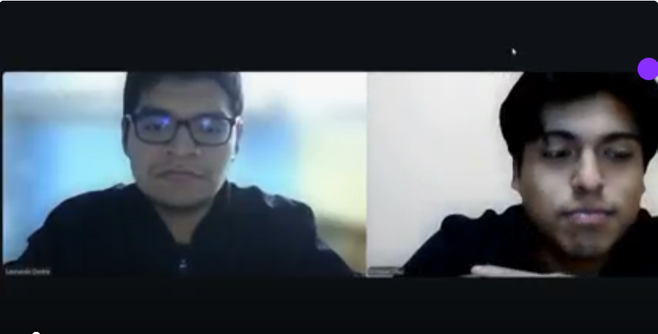
        

### Resumen de la entrevista

Enrique es un joven de 26 años que reside en Lince, trabaja como asistente administrativo de forma remota y utiliza una prótesis transtibial mecánica debido a un accidente sufrido hace más de dos años. Su movilidad representa un desafío logístico y económico, ya que las molestias físicas y el tráfico a menudo lo obligan a gastar en taxis en lugar de usar el transporte público.

A esto se suma la dificultad para cumplir con sus ejercicios diarios de rehabilitación en casa debido a la fatiga laboral, la desmotivación y la falta de supervisión profesional en tiempo real. Al intentar corregirse solo frente al espejo, experimenta inseguridad, dolores por malas posturas y frustración ante una atención clínica a distancia deficiente que suele exigirle visitas presenciales para resolver dudas, haciéndole perder tiempo valioso.

De personalidad práctica y celoso de su privacidad, Enrique es un usuario estrictamente Mobile-First que utiliza un smartphone Android, pero es muy cauto con el consumo de datos, batería y espacio de almacenamiento. Actualmente evita las aplicaciones de salud por percibirlas complejas, pesadas o intrusivas, prefiriendo organizar sus citas de forma analógica y comunicarse con su ortopedia a través de WhatsApp.

Cualquier solución tecnológica orientada a él debe ser sumamente intuitiva, ligera y estar enfocada en ahorrarle gastos y traslados innecesarios. Es fundamental que la herramienta respete su independencia y tranquilidad mental; no debe generarle ansiedad mediante notificaciones excesivas ni transmitirle la sensación de un monitoreo constante que lo haga sentir evaluado o vigilado.

## Entrevista 2 – Juan Ramirez

### Datos Generales
* **Nombres y Apellidos:** Juan Ramirez
* **Edad:** 30 años
* **Distrito de Residencia:** San Miguel (Lima)
* **Estado Civil:** Soltero
* **Ocupación:** Desarrollador de software freelance
* **Condición Médica:** Amputación transtibial en la pierna izquierda.

### Detalles de la Entrevista
* **Fecha de entrevista:** 08/09/2026
* **Inicio de la entrevista:** 0:05
* **Duración de la entrevista:** 7:04
* **Enlace:** [Ver grabación en Microsoft Stream](https://upcedupe-my.sharepoint.com/:v:/g/personal/u20241i469_upc_edu_pe/IQAzHTWm8DPMQr6fwiwnHtPBAbVV96Ay50rhZqgU8XjvNWU?e=UumKiW)

          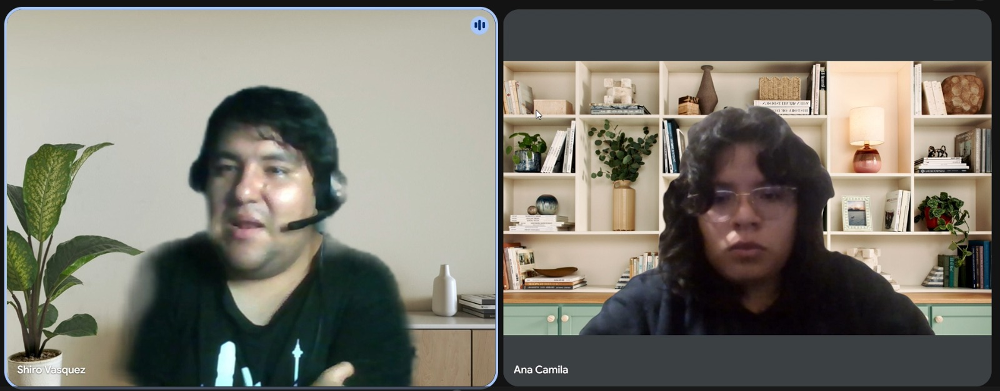
        

### Resumen de la entrevista

Juan Ramirez es un paciente residente en Lima San Miguel que cuenta con una amputación de tipo transtibial en una de sus extremidades inferiores, manteniendo intacta la articulación de la rodilla y utilizando una prótesis mecánica con respuesta dinámica para desplazarse. Convive estrechamente con su familia y su principal meta es recuperar plenamente la independencia motriz, buscando volver a caminar con firmeza y seguridad en su entorno cotidiano sin el temor constante a caídas o desbalances. Respecto a su rehabilitación, pasó de un esquema inicial intensivo presencial de varias veces por semana a controles espaciados de apenas una vez al mes, trasladando el peso de su adaptación motriz al hogar mediante ejercicios prescritos de equilibrio y fortalecimiento del muñón.

En el desarrollo de sus terapias autónomas en casa, enfrenta una marcada sensación de incertidumbre y aislamiento clínico, ya que no cuenta con supervisión profesional continua y solo recibe retroalimentación médica durante sus breves consultas mensuales. Este distanciamiento le genera el temor constante a provocarse sobrecargas musculares, presión excesiva en el muñón, dolores lumbares compensatorios o microlesiones articulares por afianzar vicios posturales al caminar. Aunque ha recurrido por iniciativa propia a espejos de cuerpo completo y a grabarse videos caseros para enviárselos a su fisioterapeuta, experimenta una fuerte frustración al no tener certeza biomecánica inmediata de si se está inclinando hacia los lados o marchando de forma inadecuada.

En cuanto a sus canales de interacción y comunicación médica, coordina sus dudas o eventuales malestares a través de mensajería y notas de voz por WhatsApp o llamadas telefónicas, reservando las citas presenciales únicamente para ajustes mecánicos del encaje protésico o dolores persistentes. En su rutina diaria muestra un manejo fluido y constante de entornos digitales y dispositivos como computadoras y smartphones a través de navegadores web como Google Chrome. Sin embargo, recalca que el proceso de rehabilitación se percibe lento y desmotivador al no disponer de herramientas accesibles que cuantifiquen su desempeño diario ni le confirmen objetivamente si su estabilidad y patrón de marcha están progresando.

Por estas razones, Juan considera imprescindible una solución tecnológica que le brinde acompañamiento en tiempo real durante sus rutinas en el hogar, alertándolo mediante señales visuales o sonoras ante desviaciones posturales para corregirse al instante. Su mayor motivación es acceder a métricas claras y gráficos de progreso que midan día a día la evolución de su equilibrio, devolviéndole la confianza para dar pasos firmes. Finalmente, advierte que la plataforma debe estar optimizada para el uso cotidiano, señalando que procesos de calibración lentos, dificultades técnicas o notificaciones excesivamente invasivas provocarían el abandono inmediato de la herramienta.

## Segmento objetivo 2 - Clínicas de Rehabilitación

## Entrevista 1 – Diego Salazar

### Datos Generales
* **Nombres y Apellidos:** Diego Salazar Mendoza
* **Edad:** 28 años
* **Distrito de Residencia:** No indicado en la entrevista
* **Estado Civil:** No indicado en la entrevista
* **Ocupación:** Fisioterapeuta - Licenciado en Tecnología Médica en la especialidad de Terapia Física y Rehabilitación
* **Centro de trabajo:** Centro de rehabilitación ubicado en Jesús María (Lima)

### Detalles de la Entrevista
* **Fecha de entrevista:** 07/09/2026
* **Inicio de la entrevista:** 0:06
* **Duración de la entrevista:** 7:09
* **Enlace:** [Ver grabación en Microsoft Stream](https://upcedupe-my.sharepoint.com/:v:/g/personal/u202417417_upc_edu_pe/IQDvLPFj-g2JTbIKiBEH2lV-AUU6a_4ASF_teV4sFwI9Q0A?e=2hwLvE)

          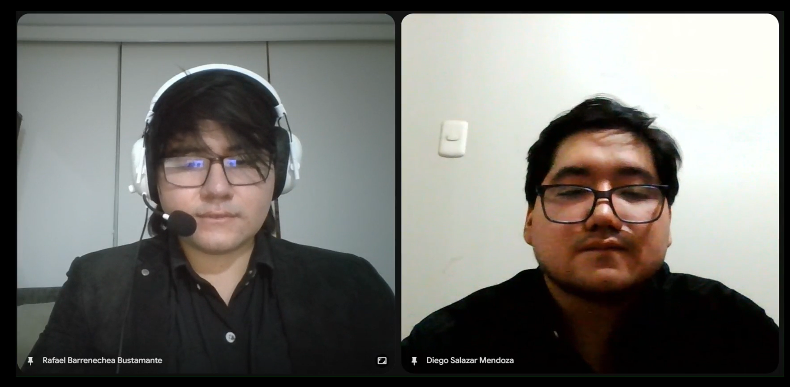
        

### Resumen de la entrevista

Diego es un fisioterapeuta de 28 años que trabaja en un centro de rehabilitación ubicado en Jesús María y cuenta con aproximadamente cinco años de experiencia profesional, de los cuales alrededor de tres han estado relacionados directamente con la atención de pacientes amputados. Actualmente supervisa personalmente entre 6 y 10 pacientes amputados, mientras que el centro puede atender aproximadamente entre 15 y 20 pacientes activos dependiendo de la etapa de rehabilitación en la que se encuentren.

Durante las sesiones presenciales, los pacientes aprenden ejercicios de equilibrio, fortalecimiento, transferencia de peso y actividades relacionadas con la marcha, que posteriormente deben continuar realizando desde sus hogares. Para reforzar las indicaciones, los profesionales utilizan principalmente WhatsApp mediante fotografías, videos o instrucciones escritas.

Una de las principales dificultades identificadas por Diego es la falta de información objetiva sobre lo que ocurre entre una sesión presencial y otra. El seguimiento depende principalmente de lo que el paciente comunica cuando regresa a la clínica o de los videos que algunos pacientes envían voluntariamente. Esto dificulta conocer con precisión si los ejercicios fueron realizados con la frecuencia indicada o si los movimientos fueron ejecutados correctamente.

Dentro de la clínica se registran las sesiones realizadas, los ejercicios, las dificultades presentadas, el dolor y aspectos relacionados con la marcha. Sin embargo, fuera de la clínica se dispone de mucha menos información. Actualmente utilizan un sistema para registrar información clínica, Excel para algunos controles internos y herramientas como correo electrónico, teléfono y WhatsApp para comunicarse. No cuentan con una plataforma específica que permita monitorear información biomecánica de los pacientes amputados mientras realizan sus actividades de rehabilitación en casa.

La comunicación con los centros ortopédicos también se realiza principalmente mediante llamadas, WhatsApp o informes. La clínica y el centro ortopédico manejan su información de manera independiente, por lo que actualmente no existe un sistema compartido que permita consultar de forma centralizada la información clínica y técnica relacionada con el paciente y su prótesis.

Diego considera que una plataforma de seguimiento podría aportar valor a su trabajo al permitirle conocer lo que ocurre entre las sesiones, siempre que la información presentada sea fácil de interpretar. Entre las funcionalidades que considera indispensables se encuentran una ficha organizada del paciente, el plan de ejercicios, el seguimiento de su cumplimiento, una sección para revisar la evolución, el historial biomecánico y un sistema de alertas. También considera útil disponer de mecanismos para enviar observaciones al paciente y comunicarse con el centro ortopédico cuando sea necesario.

Respecto a la adquisición de una suscripción anual, Diego señala que esta decisión correspondería principalmente a la administración de la clínica. Desde su posición como fisioterapeuta considera que podría recomendar una herramienta de este tipo, aunque primero necesitaría comprobar mediante su uso que funciona correctamente y que realmente proporciona información útil para el seguimiento de los pacientes.

## Entrevista 2 – Ana Mercedes

### Datos Generales
* **Nombres y Apellidos:** Ana Mercedes
* **Edad:** 38 años
* **Distrito de Residencia:** Magdalena, Lima
* **Estado Civil:** Soltera
* **Ocupación:** Fisioterapeuta

### Detalles de la Entrevista
* **Fecha de entrevista:** 08/09/2026
* **Inicio de la entrevista:** 0:06
* **Duración de la entrevista:** 6:12
* **Enlace:** [Ver grabación en Microsoft Stream](https://upcedupe-my.sharepoint.com/:v:/g/personal/u20241i469_upc_edu_pe/IQAtPUreiQjuQLqNalSOE_vFAYbEAznSdDj_Bniyhw4DBiM?e=Vx0kfU)

          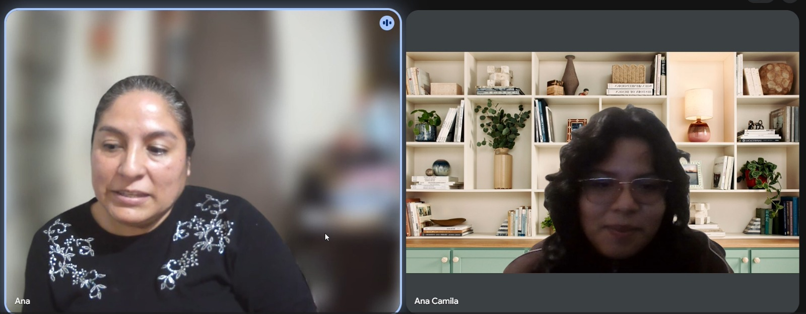
        

### Resumen de la entrevista
Ana Mercedes es una fisioterapeuta con amplia trayectoria clínica en Lima que atiende periódicamente a pacientes amputados y supervisa sus procesos de recuperación física y motriz. Durante la evaluación, la especialista enfatiza que el seguimiento extrahospitalario se coordina de manera rudimentaria mediante llamadas telefónicas y mensajería por WhatsApp, citando a los pacientes al centro únicamente ante alertas puntuales. Su principal motivación profesional radica en garantizar la eficacia clínica del tratamiento y prevenir recaídas o lesiones secundarias derivadas de una mala adaptación protésica, buscando elevar la calidad y el prestigio del servicio terapéutico que brinda su institución.

Uno de sus mayores puntos de dolor y frustración es la evidente «ceguera clínica en el hogar», ya que la supervisión fuera de la consulta depende exclusivamente de lo que el paciente relata de memoria o de videos caseros ocasionales. Señala que no disponer de mediciones biomecánicas objetivas continuas ni de una plataforma centralizada propicia que los usuarios adopten vicios posturales, desvíos en la marcha y compensaciones musculares lesivas en otras partes del cuerpo, incrementando drásticamente el riesgo de deserción terapéutica. A su vez, denuncia una marcada falta de interoperabilidad con los centros ortopédicos externos, dependiendo de correos electrónicos, informes manuales o chats informales cuando se detecta la necesidad de calibrar o ajustar la prótesis.

Respecto a las herramientas actuales, la profesional cuenta con un sólido conocimiento clínico y biomecánico, pero manifiesta una disponibilidad de tiempo administrativo muy reducida y un uso limitado de software médico, ya que la clínica solo maneja registros clínicos básicos sin capacidades de telemetría de marcha. Ante este panorama, considera fundamental contar con un dashboard centralizado que recolecte datos objetivos en tiempo real (como cadencia, simetría de apoyo, postura y horas de uso de la prótesis), acompañado de alertas automáticas tempranas ante movimientos erróneos. Esta solución permitiría intervenir a tiempo, priorizar a los pacientes críticos, automatizar la generación de reportes clínicos fundamentados y evitar tecnologías de laboratorio extranjeras que resultan costosas y poco aplicables a la cotidianidad del paciente.

Por último, afirma que la institución vería viable la contratación de una suscripción anual siempre que la herramienta demuestre resultados clínicos medibles y mantenga una relación costo-beneficio coherente. En cuanto al ecosistema tecnológico de adopción, los profesionales operarían la plataforma primordialmente a través del navegador web (Chrome) en computadoras de escritorio o laptops de la clínica, valorando altamente una versión adaptable a tabletas para consultar datos durante las evaluaciones en sala. Por el contrario, interfaces complejas que exijan excesivo tiempo de carga operativa, fallos técnicos recurrentes o la falta de garantías en la privacidad de los datos constituirían barreras definitivas para el uso continuado del sistema.

## Entrevista 3 – Carmen Salazar

### Datos Generales
* **Nombres y Apellidos:** Carmen Salazar
* **Edad:** 70 años
* **Distrito de Residencia:** Jesus Maria, Lima
* **Estado Civil:** Casada
* **Ocupación:** Médica especialista en Rehabilitación

### Detalles de la Entrevista
* **Fecha de entrevista:** 10/09/2026
* **Inicio de la entrevista:** 0:06
* **Duración de la entrevista:** 6:12
* **Enlace:** [Ver grabación en Microsoft Stream](https://upcedupe-my.sharepoint.com/:v:/g/personal/u20231e492_upc_edu_pe/IQCWxy6QvfuNSKu_7js1U36ZAd6DOtGrnOhD94BkyWLj0X4?e=XvFjy6&nav=eyJyZWZlcnJhbEluZm8iOnsicmVmZXJyYWxBcHAiOiJTdHJlYW1XZWJBcHAiLCJyZWZlcnJhbFZpZXciOiJTaGFyZURpYWxvZy1MaW5rIiwicmVmZXJyYWxBcHBQbGF0Zm9ybSI6IldlYiIsInJlZmVycmFsTW9kZSI6InZpZXcifX0%3D)

          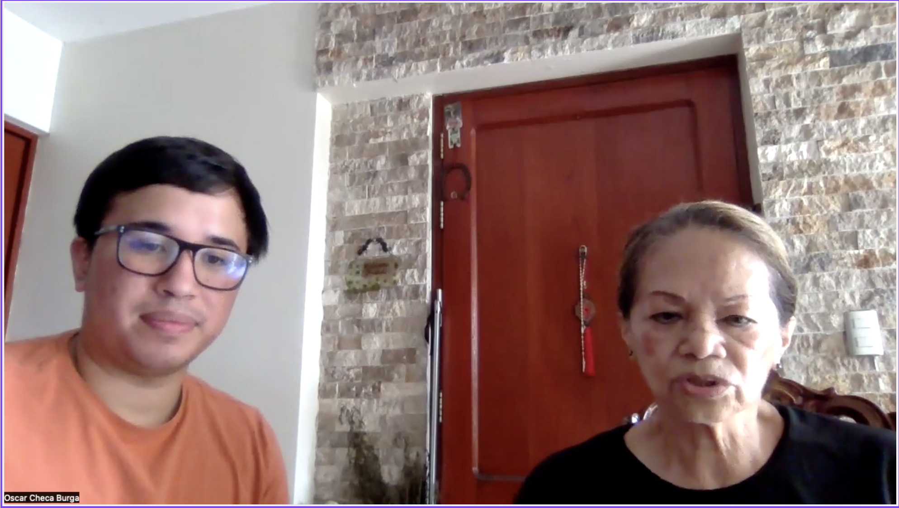
        

### Resumen de la entrevista
La Sra. Carmen es una médica especialista en Rehabilitación de 70 años que ejerce como Directora Médica en una clínica de Lima. Cuenta con más de 40 años de experiencia asistencial, caracterizándose por una personalidad sabia, observadora y pragmática, abierta a adoptar tecnología si esta respalda su criterio clínico tradicional con datos objetivos.

En su día a día atiende periódicamente a pacientes amputados, pero enfrenta la dificultad de no saber cómo realizan los ejercicios en casa. La falta de este control provoca que los pacientes adopten malas posturas, sufran dolor lumbar o dejen de usar la prótesis, lo que complica la rehabilitación y satura la consulta presencial.

En el aspecto tecnológico, es una usuaria tradicional de oficina: prefiere trabajar en computadoras de escritorio con navegadores web y pantallas grandes de letra clara, aunque entiende que sus terapeutas más jóvenes prefieran tabletas en el gimnasio. Sus canales de interacción actuales son la historia clínica digital del centro y la comunicación directa por teléfono o WhatsApp con los ortopedistas.

Para que la clínica invierta en una suscripción anual, la solución debe ser simple y rápida de usar. Requiere un panel visual claro con sistema de semáforos (verde, amarillo y rojo), reportes exportables para la historia médica y métricas clave de horas de uso y alineación de la marcha, garantizando que el sistema ahorre tiempo y mejore la salud del paciente sin burocracia.

## Segmento objetivo 3 - Centros Ortopédicos

## Entrevista 1 – Miguel Sanchez

### Datos Generales
* **Nombres y Apellidos:** Miguel Sanchez Castillo
* **Edad:** 57 años
* **Distrito de Residencia:** Pueblo Libre (Lima)
* **Estado Civil:** Casado
* **Ocupación:** Protesista-ortesista

### Detalles de la Entrevista
* **Fecha de entrevista:** 09/09/2026
* **Inicio de la entrevista:** 0:07
* **Duración de la entrevista:** 5:24
* **Enlace:** [Ver grabación en Microsoft Stream](https://upcedupe-my.sharepoint.com/:v:/g/personal/u20231e492_upc_edu_pe/IQDGRUcxI0alSJHZDbz9Bg3DAV4u6lDCnPcz6e3rXbwwUAM?nav=eyJyZWZlcnJhbEluZm8iOnsicmVmZXJyYWxBcHAiOiJPbmVEcml2ZUZvckJ1c2luZXNzIiwicmVmZXJyYWxBcHBQbGF0Zm9ybSI6IldlYiIsInJlZmVycmFsTW9kZSI6InZpZXciLCJyZWZlcnJhbFZpZXciOiJNeUZpbGVzTGlua0NvcHkifX0&e=SYgj6s)

          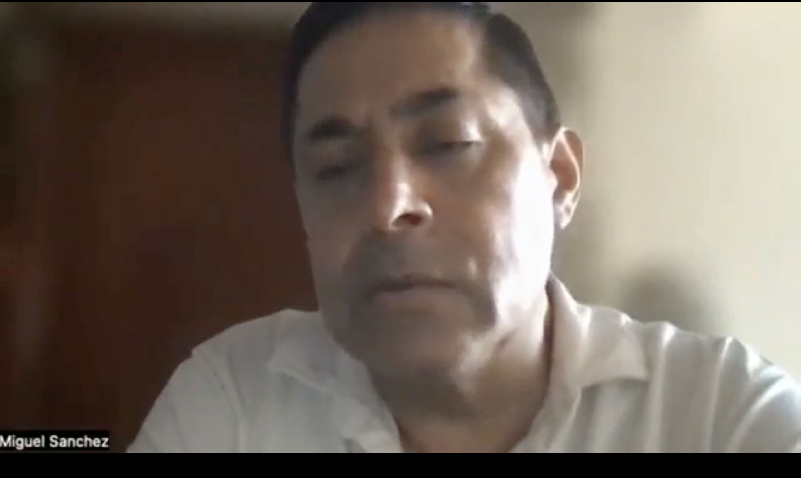
        

### Resumen de la entrevista

Miguel es un protesista-ortesista de 57 años que dirige un taller ortopédico en Lima con más de 25 años de experiencia en la confección y alineación de prótesis mecánicas y mecatrónicas. Su personalidad es resolutiva, metódica y comercialmente enfocada: equilibra el rigor de la calibración técnica con la búsqueda de rentabilidad operativa y fidelización de sus clientes.

Su principal problema operativo radica en la falta de trazabilidad del uso real de los dispositivos una vez entregados. Al no contar con métricas sobre fatiga de materiales o volumen de marcha, depende de lo que el paciente le relata o de visitas presenciales reactivas cuando la prótesis ya presenta ruidos, holguras graves o fallas estructurales. Esto dificulta la validación objetiva de garantías frente a los fabricantes y limita su capacidad para ofrecer mantenimientos preventivos programados.

En cuanto a tecnología e infraestructura, es un usuario de esquema mixto: utiliza computadoras de escritorio en la recepción u oficina para el control de inventarios y fichas técnicas, y requiere laptops o tabletas en la pista de alineación para realizar calibraciones mientras observa al paciente caminar. Aunque utiliza software propietario de marcas internacionales para configurar componentes específicos, carece de un sistema unificado para la gestión posventa.

Cualquier solución digital dirigida a su taller debe ser directa, ágil y de alto valor operativo. Requiere funcionalidades de trazabilidad de componentes (lote y números de serie), telemetría básica (horas de uso activo y nivel de carga) y un módulo de alertas automáticas para reajuste de pernos o lubricación. La plataforma debe permitirle transformar su taller en un centro de posventa preventivo, respaldar sus diagnósticos con reportes exportables para médicos o aseguradoras y justificar el pago de una licencia de software mediante el aumento de ingresos por mantenimiento técnico.

## Entrevista 2 – Juan Carlos Salcedo

### Datos Generales
**Nombres y Apellidos:** Juan Carlos
* **Edad:** 47 años
* **Distrito de Residencia:** Lima (Centro ortopédico ubicado en Av. 28 de Julio)
* **Estado Civil:** Casado
* **Ocupación:** Técnico ortoprotesista

### Detalles de la Entrevista
* **Fecha de entrevista:** 16/09/2026
* **Inicio de la entrevista:** 0:05
* **Duración de la entrevista:** 5:36
* **Enlace:** [Ver grabación en Microsoft Stream](https://upcedupe-my.sharepoint.com/:v:/g/personal/u202421065_upc_edu_pe/IQBupHk2utw5R4eg3jkeRzJcAbA0gRfEZmGtE8kOBRssVUk?e=DDU3pI)

          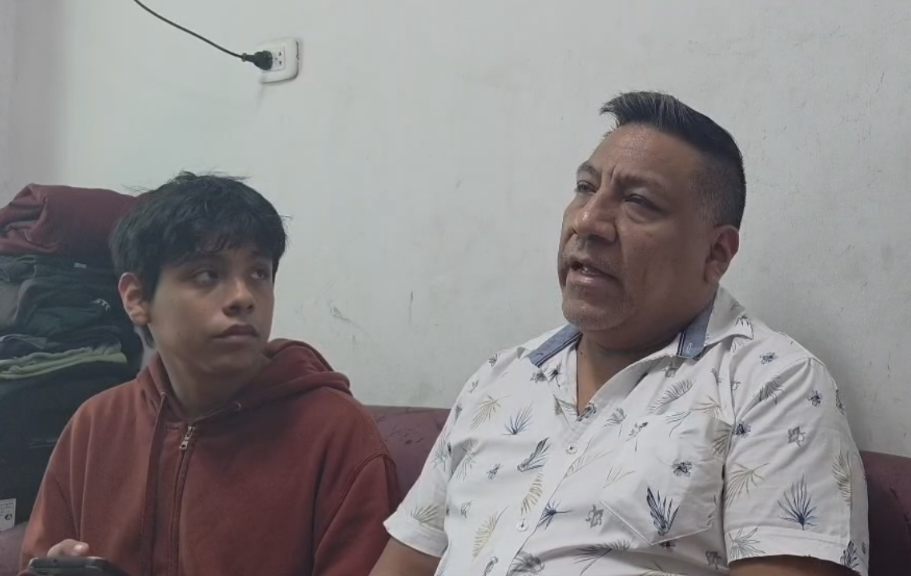
        

### Resumen de la entrevista

Juan Carlos es un técnico ortoprotesista de 47 años que gestiona su centro ortopédico en la avenida 28 de Julio, en Lima, enfocado en el diseño, alineación y confección a medida de prótesis de miembro inferior y órtesis personalizadas, con una producción promedio de 6 a 10 dispositivos mensuales. Demuestra un perfil técnico, pragmático y orientado a la seguridad del paciente, combinando la precisión artesanal del taller con el interés por estandarizar la atención posventa y optimizar los flujos de servicio de su negocio independiente.

Su principal cuello de botella operativo es la falta de certeza sobre el esfuerzo mecánico, ciclos de impacto y volumen real de marcha al que los usuarios someten las prótesis en su cotidianidad. Actualmente, depende de agendas manuales, recordatorios por WhatsApp y el testimonio subjetivo del paciente, lo que provoca que las revisiones sean reactivas y ocurran solo cuando los componentes ya presentan desgaste severo o desajustes críticos. Además, la comunicación técnica con fisioterapeutas y médicos tratantes es fragmentada y se limita a documentos físicos o mensajes dispersos, careciendo de un historial unificado sobre la evolución del muñón y la alineación.

En el ámbito tecnológico, maneja una dinámica mixta: emplea la computadora de escritorio para el registro administrativo y hojas de cálculo, pero considera imprescindible el uso de smartphones en el taller y sala de marcha para capturar evidencia visual inmediata (fotos de alineación y estado de la piel). Si bien ha interactuado con aplicaciones Bluetooth puntuales para configurar rodillas o pies electrónicos específicos, no dispone de una plataforma integral que centralice telemetría ni historiales técnicos de vida útil de componentes.

Cualquier propuesta tecnológica viable debe ser ligera, intuitiva y ajustada a la realidad económica de un taller ortopédico local. Prioriza herramientas que incorporen registro de números de serie y caducidad técnica de piezas (liners, rodillas, pies), métricas de actividad (horas de uso e impactos) y alertas automáticas de calibración y mantenimiento preventivo. Estaría dispuesto a pagar una suscripción si la herramienta demuestra un retorno tangible: disminución de disputas por garantías, aumento en la recurrencia de servicios de mantenimiento programado y generación de reportes biomecánicos objetivos para fundamentar cambios de piezas ante aseguradoras y médicos.

### 2.2.3. Análisis de entrevistas.
---

## 2.3. Needfinding. 

### 2.3.1. User Personas. 
En esta sección se presentan las fichas de User Personas construidas a partir de los datos recolectados del análisis de entrevistas a nuestros segmentos objetivos. Estas fichas permiten representar de forma clara y estratégica los perfiles de cada segmento objetivo, considerando sus metas, habilidades, motivaciones y dificultades. De esta manera se integra la perspectiva del usuario y tendencias del sector para identificar oportunidades en el mercado y ofrecer una solución alineada a lo que el usuario necesita.

**Segmento Objetivo 1: Paciente Amputado**

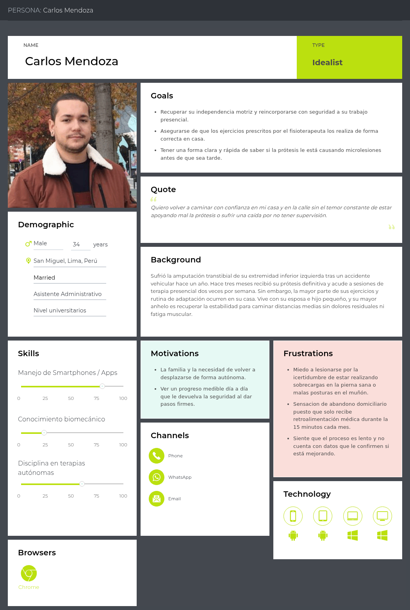

**Segmento Objetivo 2: Clínica de Rehabilitación**

**Segmento Objetivo 3: Centro Ortopédico**

---
### 2.3.2. User Task Matrix

En esta sección se presenta el **User Task Matrix**, construido a partir de los *User Persona* que representan a los tres segmentos clave identificados:

- **Segmento 1:** Pacientes amputados (representado por Carlos Mendoza).
- **Segmento 2:** Clínicas de rehabilitación (representado por Valeria Ríos).
- **Segmento 3:** Centros ortopédicos (representado por Miguel Torres).

Las tareas fueron identificadas a partir del análisis cualitativo de entrevistas, y cada una fue evaluada según su frecuencia y nivel de importancia para los respectivos perfiles.

| Tarea / Task | Carlos Mendoza (Paciente) - Frecuencia | Carlos Mendoza (Paciente) - Importancia | Valeria Ríos (Clínica) - Frecuencia | Valeria Ríos (Clínica) - Importancia | Miguel Torres (Ortopedia) - Frecuencia | Miguel Torres (Ortopedia) - Importancia |
| :--- | :---: | :---: | :---: | :---: | :---: | :---: |
| Colocación y ajuste del socket de la prótesis | Alta | Alta | Baja | Media | Media | Alta |
| Ejecutar rutinas de ejercicios prescritos en el hogar | Alta | Alta | - | - | - | - |
| Monitorear sensaciones de dolor, fatiga o roce en el muñón | Alta | Alta | Media | Media | - | - |
| Prescribir y estructurar planes de rehabilitación física | - | - | Alta | Alta | - | - |
| Evaluar la marcha, simetría y postura del paciente | Media | Media | Alta | Alta | Media | Media |
| Detectar y corregir vicios posturales o compensaciones | Media | Media | Alta | Alta | Baja | Media |
| Registrar evolución clínica y cumplimiento terapéutico | - | - | Alta | Alta | - | - |
| Alinear componentes mecánicos de la prótesis | Baja | Media | Baja | Media | Alta | Alta |
| Inspeccionar desgaste físico y holgura de componentes | Baja | Media | Baja | Baja | Alta | Alta |
| Programar calendario de mantenimiento preventivo | Baja | Media | Baja | Baja | Media | Alta |
| Realizar reparaciones correctivas o ajustes de emergencia | Baja | Alta | - | - | Alta | Alta |
| Coordinar información técnica entre clínica y ortopedia | - | - | Media | Alta | Media | Alta |
| Comunicar dudas sobre uso o reportar desperfectos | Media | Alta | Alta | Media | Media | Media |

#### Análisis:
A través del **User Task Matrix**, podemos identificar las frecuencias e importancias entre los diferentes segmentos que presentamos y usar esta información como guía.

Las tareas clave con mayor frecuencia e importancia para **Carlos Mendoza** son la colocación y ajuste del socket, la ejecución diaria de ejercicios y el monitoreo de sensaciones de molestia o dolor en el muñón, lo que refleja su necesidad constante de seguridad y autonomía durante la rehabilitación en casa.

Por su parte, **Valeria Ríos** prioriza con alta frecuencia e importancia la prescripción de rutinas, la evaluación de la marcha y la detección temprana de compensaciones posturales para asegurar la efectividad del tratamiento clínico.

En contraste, **Miguel Torres** enfoca su labor en tareas de alta relevancia técnica como la alineación de piezas, la inspección de desgaste de componentes y la programación de mantenimientos preventivos.

A pesar de sus distintos roles operativos, los tres grupos coinciden en la importancia crítica de la correcta adaptación física de la prótesis y la necesidad de una comunicación técnica fluida ante desperfectos. Esto evidencia una oportunidad integral para centralizar el monitoreo de la marcha, anticipar fallas mecánicas y asegurar un seguimiento continuo y coordinado entre el hogar, la clínica y el taller ortopédico.
---

### 2.3.3. User Journey Mapping. 
En esta sección se presentan los User Journey Maps de los tres segmentos objetivo. Cada mapa refleja el recorrido actual que estos usuarios realizan para cumplir sus objetivos sin contar aún con una solución tecnológica integrada, mostrando los puntos críticos, emociones, tareas clave y oportunidades de mejora. Estos recorridos nos permiten entender los desafíos que enfrentan los usuarios día a día.

**Segmento Objetivo 1: Paciente Amputado**

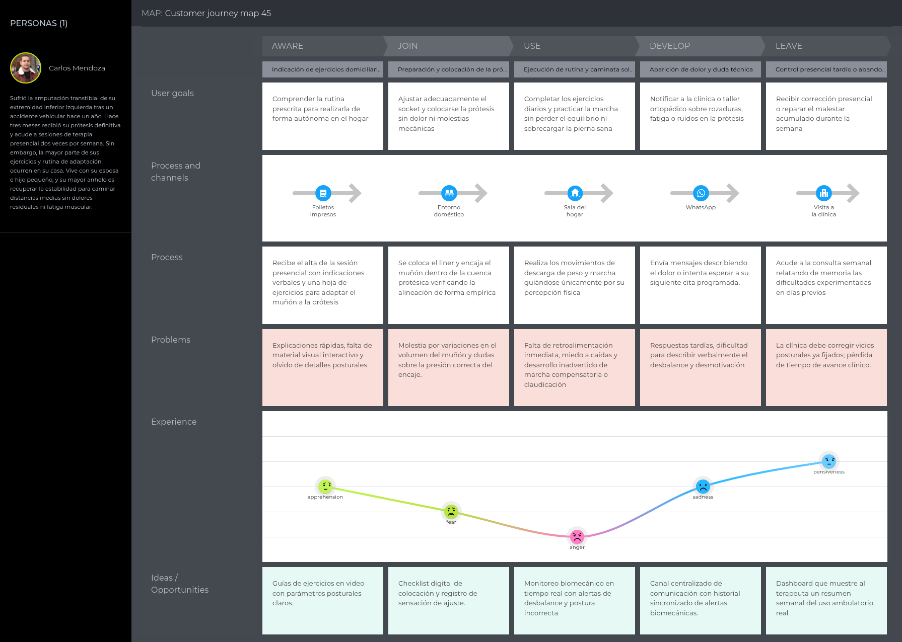

**Segmento Objetivo 2: Clínica de Rehabilitación**

**Segmento Objetivo 3: Centro Ortopédico**

---
### 2.3.4. Empathy Mapping. 
En esta sección se presentan los Empathy Maps. Estos nos ayudarán a comprender las experiencias, emociones y pensamientos que expresan los usuarios de cada segmento objetivo.

**Segmento Objetivo 1: Paciente Amputado**

**Segmento objetivo 2:**

**Segmento Objetivo 3: Centro Ortopédico**

---
## 2.4. Big Picture EventStorming

En esta sección se presenta el trabajo realizado durante la sesión de Big Picture Event Storming, enfocada en comprender el dominio general del negocio. Para ello se utilizaron post-its en Miro para mapear los eventos significativos que ocurren en el flujo operativo actual. Ello nos permitió identificar procesos clave, actores involucrados, relaciones entre eventos, y oportunidades de mejora para el desarrollo de nuestra solución.

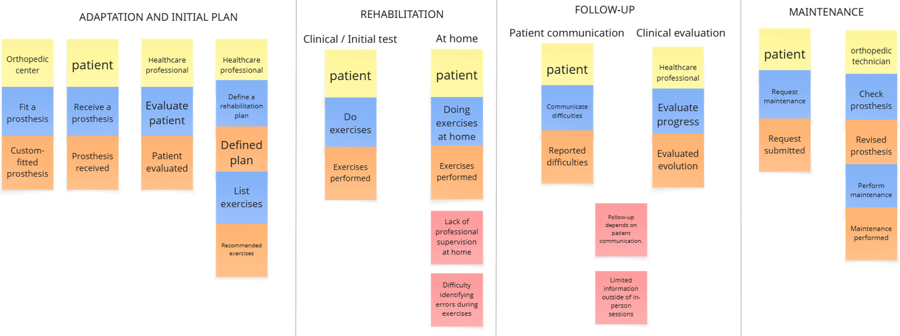

<https://miro.com/app/board/uXjVGbuSqec=/?share_link_id=610103626578>
---
## 2.5. Ubiquitous Language

El Ubiquitous Language reúne los términos principales del dominio de Prothia para que el equipo utilice un mismo significado durante el análisis, diseño e implementación. Los términos se mantienen en inglés y sus definiciones se presentan en español.

| Término | Definición |
|---|---|
| **Amputee Patient** | Persona que ha sufrido una amputación, utiliza una prótesis y participa en un proceso de adaptación y rehabilitación. |
| **Rehabilitation Clinic** | Institución o equipo profesional responsable de evaluar, planificar y realizar seguimiento al proceso de rehabilitación del paciente. |
| **Orthopedic Center** | Establecimiento especializado en la fabricación, adaptación, revisión y mantenimiento de prótesis. |
| **Prosthesis** | Dispositivo utilizado por el paciente para sustituir total o parcialmente una extremidad y apoyar su movilidad. |
| **Rehabilitation Plan** | Conjunto de objetivos y actividades definidas para acompañar la recuperación y adaptación del paciente. |
| **Exercise Plan** | Conjunto de ejercicios asignados a un paciente, incluyendo frecuencia y repeticiones esperadas. |
| **Exercise Completion** | Registro que indica que un paciente realizó un ejercicio perteneciente a su plan vigente. |
| **Adherence** | Nivel de cumplimiento del paciente respecto de los ejercicios y actividades indicadas en su plan de rehabilitación. |
| **Biomechanical Data** | Información obtenida durante el movimiento o uso de la prótesis y utilizada para analizar el desempeño del paciente. |
| **Biomechanical Session** | Periodo de actividad durante el cual se recopilan y procesan datos biomecánicos relacionados con un paciente. |
| **Posture Assessment** | Evaluación del movimiento o postura del paciente a partir de datos biomecánicos y parámetros establecidos. |
| **Biomechanical History** | Conjunto cronológico de registros biomecánicos asociados a un paciente. |
| **Rehabilitation Progress** | Evolución del paciente a partir del cumplimiento de ejercicios y la información registrada durante su rehabilitación. |
| **Clinical Alert** | Aviso generado cuando se identifica una condición biomecánica que requiere la revisión de un profesional de la clínica. |
| **Alert Threshold** | Valor o rango configurado para determinar cuándo un indicador biomecánico debe generar una alerta. |
| **Technical History** | Registro de intervenciones, revisiones y observaciones realizadas sobre una prótesis. |
| **Maintenance** | Actividad de revisión, ajuste o intervención realizada para conservar el funcionamiento adecuado de una prótesis. |
| **Preventive Maintenance** | Mantenimiento programado antes de la aparición de una falla, según fecha o condiciones de uso. |
| **Maintenance Alert** | Aviso dirigido al centro ortopédico cuando una prótesis alcanza una condición que requiere revisión o mantenimiento. |
| **Patient Information Sharing** | Acción mediante la cual la clínica habilita información relevante del paciente al centro ortopédico responsable de su prótesis. |
| **Subscription** | Modalidad de acceso anual utilizada por una clínica para utilizar Prothia. |
| **Software License** | Modalidad de acceso utilizada por un centro ortopédico para emplear las funcionalidades de Prothia. |
| **Demo Request** | Solicitud realizada por un visitante interesado en conocer el funcionamiento de Prothia antes de una posible contratación. |
| **Biomechanical Monitoring** | Seguimiento de información biomecánica generada durante el uso de la prótesis y las actividades de rehabilitación. |
| **Prosthesis Usage** | Información relacionada con el uso acumulado y condiciones de utilización de una prótesis. |
| **B2B** | B2B (Business-to-Business) es un modelo de negocio en el que una empresa vende productos, servicios o soluciones a otras empresas en lugar de hacerlo al consumidor final. |
