# Capítulo II: Requirements Elicitation & Analysis 

## 2.1. Competidores. 

### Competidor 1: DyCare (ReHub)
DyCare es una empresa de salud digital que ha desarrollado ReHub, una plataforma de telerehabilitación asistida por inteligencia artificial y visión computacional para el tratamiento de afecciones musculoesqueléticas. Proporciona herramientas para la prescripción de ejercicios personalizados, guía interactiva con biofeedback en tiempo real para el paciente desde su hogar y un panel clínico para monitorear la adherencia y evolución del tratamiento. Esta plataforma es reconocida en el sector de la fisioterapia digital por permitir a las clínicas y aseguradoras optimizar el seguimiento remoto sin requerir hardware adicional complejo.

### Competidor 2: Ottobock Digital Solutions
Ottobock Digital Solutions es la división tecnológica del fabricante global de prótesis y órtesis Ottobock, la cual ofrece herramientas digitales y aplicaciones móviles (como connectgo, connectgo.pro y Cockpit) conectadas por Bluetooth a sus prótesis controladas por microprocesador. Proporciona funcionalidades para que los técnicos ortopédicos calibren y configuren modos de movimiento, al tiempo que permite a los usuarios monitorear el estado del dispositivo, el nivel de batería y métricas básicas de actividad física diaria. Esta suite es conocida por su alto nivel de precisión técnica y por facilitar el mantenimiento y control directo de dispositivos protésicos de alta gama.

### Competidor 3: SWORD Health
SWORD Health es una plataforma integral de terapia física digital y telerehabilitación predictiva enfocada en el tratamiento del dolor y la recuperación posquirúrgica. Su solución combina sensores de movimiento inerciales portátiles con un terapeuta digital impulsado por IA (Phoenix), el cual guía y corrige al paciente en tiempo real durante cada sesión mientras un equipo de fisioterapeutas clínicos supervisa su progreso de forma remota a través de la nube. Esta plataforma es ampliamente reconocida en el mercado corporativo y de aseguradoras de salud por reducir significativamente la deserción en las terapias domiciliarias y disminuir costos médicos asociados a cirugías o tratamientos tradicionales.

---
## 2.1.1. Análisis competitivo.

<table>
  <thead>
    <tr>
      <th colspan="6">Competitive Analysis Landscape</th>
    </tr>
    <tr>
      <th colspan="2">¿Por qué llevar a cabo este análisis?</th>
      <th colspan="4">Identificar las soluciones existentes de telerehabilitación y monitoreo de prótesis en el mercado, contrastando sus propuestas de valor frente al enfoque integrado de SeniorsInProcess (paciente–clínica–ortopedia) para detectar ventajas competitivas y oportunidades de posicionamiento.</th>
    </tr>
    <tr>
      <th colspan="2"></th>
      <th>SeniorsInProcess (Prothia)  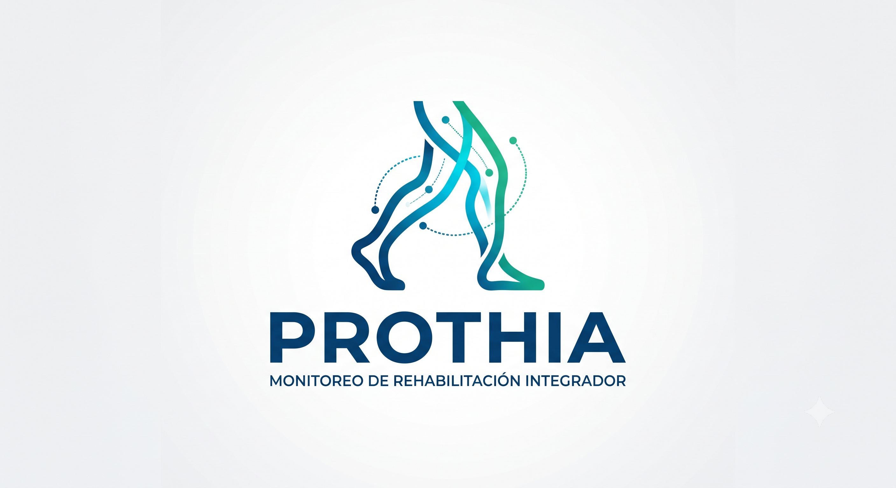</th>
      <th>DyCare (Rehub)  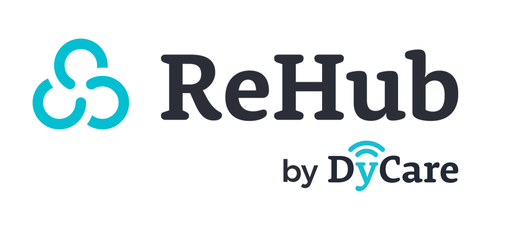</th>
      <th>Ottobock Digital Solutions  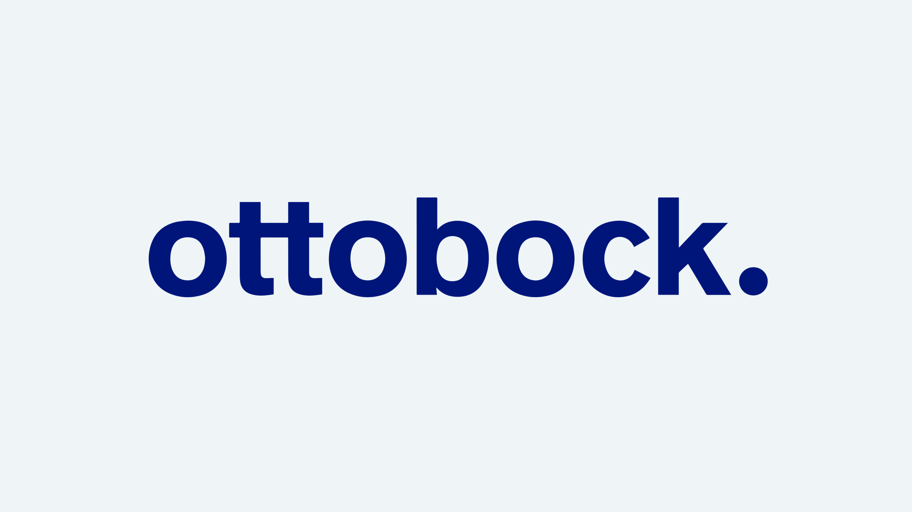</th>
      <th>SWORD Health  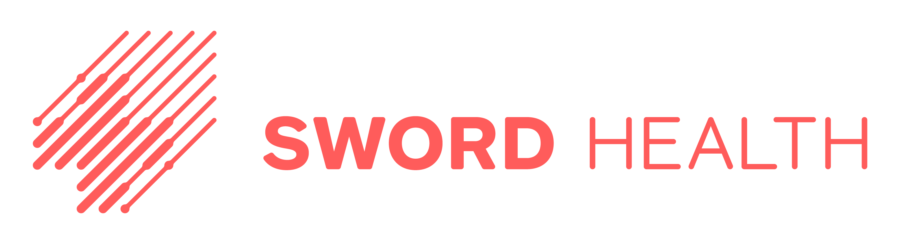</th>
    </tr>
  </thead>
  <tbody>
    <!-- SECCIÓN: Perfil -->
    <tr>
      <td rowspan="2"><b>Perfil</b></td>
      <td><b>Overview</b></td>
      <td>Plataforma web integral de monitoreo biomecánico y seguimiento remoto de rehabilitación para amputados, articulando clínica, paciente y ortopedia.</td>
      <td>Empresa de salud digital (HealthTech) especializada en software de telerehabilitación y análisis de movimiento en tiempo real para lesiones musculoesqueléticas</td>
      <td>Gigante global en diseño, fabricación y soluciones digitales de prótesis/ortesis inteligentes con apps de configuración y telemetría de dispositivos.</td>
      <td>Unicornio de terapia física digital enfocado en la rehabilitación remota guiada por sensores corporales (Digital Therapist) y supervisada por fisioterapeutas.</td>
    </tr>
    <tr>
      <td><b>Ventaja competitiva ¿Qué valor ofrece a los clientes?</b></td>
      <td>Integración en una sola plataforma la clínica, el centro ortopédico y el paciente, permitiendo cruzar datos biomecánicos con historial y mantenimiento protésico</td>
      <td>Algoritmos de visión computacional propios sin hardware obligatorio (+60 puntos anatómicos) y biofeedback visual inmediato de ejercicios.</td>
      <td>Marca de referencia mundial, integración nativa de microprocesadores y sensores mecánicos propietarios en la misma prótesis física.</td>
      <td>Solución integral llave en mano con sensores de movimiento portátiles propietarios, alta adherencia terapéutica y validaciones clínicas masivas.</td>
    </tr>
    <!-- SECCIÓN: Perfil de Marketing -->
    <tr>
      <td rowspan="2"><b>Perfil de Marketing</b></td>
      <td><b>Mercado objetivo</b></td>
      <td>Clínicas de rehabilitación física especializadas, centros de confección ortopédica y pacientes amputados (enfoque inicial en Perú y LATAM).</td>
      <td>Clínicas de fisioterapia, hospitales, aseguradoras de salud y mutuas laborales en Europa y Latinoamérica.</td>
      <td>Ortesistas/protesistas certificados (CPO), clínicas de ortopedia especializada y usuarios de dispositivos protésicos avanzados a nivel global.</td>
      <td>Aseguradoras médicas, grandes corporaciones/empleadores que buscan reducir costos de bajas laborales y pacientes con dolencias musculoesqueléticas.</td>
    </tr>
    <tr>
      <td><b>Estrategias de marketing</b></td>
      <td>Ventas directas B2B a clínicas y ortopedias, pilotos de validación clínica, alianzas académicas/universitarias y demostraciones de producto.</td>
      <td>Inbound marketing médico, acuerdos B2B con mutuas/aseguradoras, participación en ferias sanitarias y pruebas gratuitas para centros clínicos.</td>
      <td>Venta cruzada atada a la compra de prótesis físicas de alta gama, capacitación médica continua y congresos internacionales de ortopedia.</td>
      <td>Modelo B2B2C centrado en beneficios corporativos para empresas ("employer benefits"), reducción demostrada de costos médicos y marketing institucional de alto impacto.</td>
    </tr>
    <!-- SECCIÓN: Perfil de Producto -->
    <tr>
      <td rowspan="3"><b>Perfil de Producto</b></td>
      <td><b>Productos & Servicios</b></td>
      <td>Plataforma web centralizada con dashboard de métricas biomecánicas, alertas de posturas/ejercicios, seguimiento clínico e historial de uso protésico.</td>
      <td>Software Rehub: plataforma de telerehabilitación con IA, biblioteca de más de 3,500 ejercicios terapéuticos y corrección postural en tiempo real.</td>
      <td>Ecosistema de apps (Cockpit, connectgo, Myo Plus) para configuración de modos, nivel de batería, lectura de mioelectrodos y mantenimiento.</td>
      <td>Kit de sensores de movimiento inerciales portátiles, tableta con software de ejercicios interactivos y portal web para el terapeuta clínico.</td>
    </tr>
    <tr>
      <td><b>Precios & Costos</b></td>
      <td>Suscripción anual para clínicas de rehabilitación y licencias de software para centros ortopédicos.</td>
      <td>Planes SaaS recurrentes por número de fisioterapeutas/pacientes activos o contratos corporativos a gran escala con aseguradoras.</td>
      <td>Las aplicaciones básicas son gratuitas/incluidas con el hardware protésico; licencias clínicas avanzadas integradas al costo de las prótesis biónicas.</td>
      <td>Modelo de tarificación por empleado/miembro cubierto (PEPM) o cobro por episodio de tratamiento rehabilitador a las aseguradoras.</td>
    </tr>
    <tr>
      <td><b>Canales de distribución (Web y/o Móvil)</b></td>
      <td>Plataforma Web (SaaS accesible por navegador para clínica/ortopedia) con portal web/móvil responsivo para el paciente.</td>
      <td>Web (portal clínico) y aplicación móvil/tableta (iOS y Android) para pacientes.</td>
      <td>Aplicaciones móviles nativas en Google Play Store y Apple App Store sincronizadas por Bluetooth a los componentes.</td>
      <td>Hardware físico enviado directamente al domicilio del paciente junto a aplicaciones móviles y portal en la nube para los profesionales.</td>
    </tr>
    <!-- SECCIÓN: Análisis SWOT -->
    <tr>
      <td rowspan="5"><b>Análisis SWOT</b></td>
      <td colspan="5">Realice esto para su startup y sus competidores. Sus fortalezas deberían apoyar sus oportunidades y contribuir a lo que ustedes definen como su posible ventaja competitiva.</td>
    </tr>
    <tr>
      <td><b>Fortalezas</b></td>
      <td>
        • Enfoque de nicho centrado específicamente en amputados. 
        • Conexión directa entre la clínica y la ortopedia para mantenimiento. 
        • Arquitectura web accesible y adaptable a diversas prótesis.
      </td>
      <td>
        • Certificación como dispositivo médico (CE Clase IIa). 
        • IA de visión computacional madura y sin hardware adicional requerido. 
        • Biblioteca masiva de ejercicios terapéuticos.
      </td>
      <td>
        • Presencia de marca y red de distribución líder en el mundo. 
        • Hardware y software integrados de fábrica con alta precisión. 
        • Solidez financiera y patentes propietarias.
      </td>
      <td>
        • Solución clínica y tecnológicamente validada a gran escala. 
        • Respaldada por fuerte capitalización y alianzas con grandes aseguradoras. 
        • Experiencia de usuario (UX) simplificada para el paciente.
      </td>
    </tr>
    <tr>
      <td><b>Debilidades</b></td>
      <td>
        • Etapa temprana de desarrollo. 
        • Requiere validar la compatibilidad e integración con diversos sensores. 
        • Menor presupuesto inicial para marketing y homologación médica.
      </td>
      <td>
        • No está especializada en dinámicas de adaptación ni encaje protésico. 
        • No integra a los fabricantes u ortopedias en la gestión técnica del dispositivo.
      </td>
      <td>
        • Ecosistema cerrado (funciona únicamente con dispositivos y componentes Ottobock). 
        • No profundiza en el plan diario de ejercicios fisioterapéuticos en casa.
      </td>
      <td>
        • Solución de alto costo orientada a mercados masivos, poco adaptable a realidades sanitarias de países en desarrollo. 
        • Poca personalización para amputados.
      </td>
    </tr>
    <tr>
      <td><b>Oportunidades</b></td>
      <td>
        • Alta demanda insatisfecha de telemonitoreo protésico asequible en Perú y la región. 
        • Alianzas estratégicas con clínicas locales y talleres ortopédicos. 
        • Reducción de costos de telemedicina postoperatoria.
      </td>
      <td>
        • Expansión de contratos con sistemas públicos de salud y aseguradoras privadas para descongestionar listas de espera. 
        • Incorporación de nuevos módulos de patologías.
      </td>
      <td>
        • Incorporación de analítica predictiva de marcha y desgaste de componentes para ofrecer servicios de mantenimiento programado.
      </td>
      <td>
        • Penetración en nuevos mercados internacionales a través de planes de salud corporativos y convenios con mutuas de trabajo.
      </td>
    </tr>
    <tr>
      <td><b>Amenazas</b></td>
      <td>
        • Resistencia inicial al cambio por parte de profesionales de la salud tradicionales. 
        • Tiempos prolongados de decisión de compra en clínicas y ortopedias. 
        • Barreras en adquisición de sensores biomecánicos compatibles.
      </td>
      <td>
        • Competidores de bajo costo basados en apps móviles sin suscripción corporativa. 
        • Regulaciones crecientes sobre IA y manejo de datos clínicos (RGPD/MDR).
      </td>
      <td>
        • Nuevos fabricantes emergentes de componentes protésicos de código abierto o costo reducido. 
        • Falta de interoperabilidad de sus datos con sistemas de salud de terceros.
      </td>
      <td>
        • Entrada de gigantes de la tecnología médica (MedTech) al sector de la telerehabilitación musculoesquelética. 
        • Cambios en políticas de reembolso de aseguradoras de salud.
      </td>
    </tr>
  </tbody>
</table>

---
### 2.1.2. Estrategias y tácticas frente a competidores
Hemos identificado diversas estrategias y tácticas para diferenciarnos y competir efectivamente con otros actores del mercado de la telerehabilitación y las soluciones tecnológicas protésicas. A continuación, se detallan las principales:

**Estrategias de Diferenciación:**
* **Ecosistema Integrado:** A diferencia de competidores como DyCare (Rehub), que se enfocan en la relación terapeuta-paciente para rehabilitación musculoesquelética general, Prothia articula en una sola plataforma web a las clínicas de rehabilitación, los centros ortopédicos y los pacientes amputados. Esto permite cruzar datos de evolución motriz con métricas de uso y mantenimiento técnico del dispositivo protésico. 
* **Plataforma Multimarca e Interoperable:** Frente a competidores directos como Ottobock Digital Solutions, cuyos sistemas de software están cerrados exclusivamente a sus propios componentes biónicos, Prothia se posiciona como una solución agnóstica. Nuestra plataforma está diseñada para registrar y analizar datos biomecánicos sin importar la marca o fabricante de la prótesis utilizada por el paciente. 
* **Visualización Biomecánica Simplificada:** La plataforma prioriza una interfaz intuitiva con dashboards claros y alertas automáticas de posturas o patrones de marcha incorrectos. Esto permite que tanto el paciente en su hogar como el fisioterapeuta puedan interpretar la información de inmediato sin requerir conocimientos avanzados de ingeniería biomecánica. 

**Tácticas de Marketing:**
* **Demostraciones Clínicas y Pruebas Piloto B2B:** Implementaremos contacto directo con directores de centros de rehabilitación y talleres ortopédicos en Lima, ofreciendo demostraciones en vivo y programas piloto controlados con pacientes reales. Esta táctica nos permite validar la utilidad clínica de la plataforma y acelerar la confianza en el producto frente a competidores internacionales que carecen de presencia local. 
* **Contenido Especializado y Difusión Científica:** Desarrollaremos casos de estudio, artículos y material informativo sobre la importancia del seguimiento domiciliario en pacientes amputados, difundidos en redes profesionales (como LinkedIn) y eventos del sector salud. De esta manera, nos posicionamos como referentes técnicos en rehabilitación protésica basada en datos. 

**Expansión y Adaptabilidad:**
* **Enfoque Local Inicial y Expansión Regional:** A diferencia de soluciones globales como Ottobock o SWORD Health, Prothia comenzará su validación e implementación en clínicas y centros ortopédicos de Lima, adaptándose a los flujos de trabajo y presupuestos de la realidad sanitaria peruana antes de expandirse a nivel nacional y latinoamericano. 
* **Alianzas Estratégicas con Centros Ortopédicos y de Rehabilitación Locales:** Estableceremos convenios de colaboración mutua con ortopedias y especialistas locales para co-diseñar módulos clave (como el historial de uso y mantenimiento preventivo), garantizando una adopción fluida y un soporte técnico directo que las plataformas extranjeras no pueden ofrecer en el mercado local.

---
## 2.2. Entrevistas. 

### 2.2.1. Diseño de entrevistas. 
En esta sección, se han planteado diversas preguntas dirigidas a nuestros segmentos objetivos con el objetivo de obtener información relevante, como opiniones o descripciones. Estos datos serán fundamentales para el desarrollo de nuestra solución.

**Preguntas para el Segmento Objetivo 1 – Pacientes Amputados:**
1. ¿Cuál es su edad, estado civil y en qué distrito o ciudad reside?
2. ¿A qué se dedica actualmente y con quiénes vive en su hogar?
3. ¿Hace cuánto tiempo utiliza una prótesis y de qué tipo es (mecánica, hidráulica, mioeléctrica)? 
4. ¿Podrías detallar qué tipo de amputación tienes o qué extremidad se vio afectada?
5. ¿Con qué frecuencia asiste a sus sesiones presenciales de terapia física o rehabilitación? 
6. ¿Qué ejercicios o rutinas le indica su terapeuta para realizar en casa y con qué regularidad los practica? 
7. ¿Qué dificultades o molestias (como dolor, fatiga o desbalances) suele experimentar al realizar sus ejercicios o al caminar solo en casa? 
8. ¿Cómo sabe si está realizando correctamente los movimientos o si mantiene una postura adecuada sin la presencia del profesional? 
9. ¿Cómo se comunica habitualmente con su clínica o con su ortopedia cuando presenta dudas o problemas con el uso de su dispositivo? 
10. ¿Utiliza actualmente su celular, computadora u otra herramienta tecnológica para llevar el registro de su salud o terapias?
11. ¿Qué tan valioso le resultaría contar con una plataforma que le muestre en tiempo real si realiza bien sus movimientos y alerte a su médico si hay errores? 
12. ¿Qué dispositivos (computadora, tableta o teléfono inteligente) utiliza con mayor frecuencia y preferiría para interactuar con esta solución? 
13. En su opinión, ¿qué características o funciones son indispensables para que usted decida usar diariamente esta plataforma? 
14. ¿Qué factores o situaciones harían que usted se desmotive o deje de utilizar una aplicación de seguimiento de su prótesis?

**Preguntas para el Segmento Objetivo 2 – Profesionales de Terapia Física y Rehabilitación:**
1. ¿Cuál es su edad, profesión o cargo en la institución y en qué ciudad labora?
2. ¿Hace cuántos años trabaja en el área de rehabilitación física y cuántos pacientes amputados atienden periódicamente en su centro? 
3. ¿Cómo estructuran y coordinan actualmente el plan de rehabilitación y adaptación protésica fuera de las consultas presenciales? 
4. ¿Cómo supervisan y registran el progreso biomecánico o la adherencia del paciente cuando este realiza sus ejercicios en el hogar? 
5. ¿Cuáles son los principales problemas o riesgos que detectan cuando los pacientes no cuentan con seguimiento continuo en sus domicilios? 
6. ¿Qué mecanismos o canales emplean actualmente para compartir información médica con los centros ortopédicos que confeccionan las prótesis? 
7. ¿Utilizan en su clínica algún software clínico, sistema de telemedicina o herramienta digital para evaluar métricas biomecánicas? 
8. ¿Qué tan valioso resultaría para su equipo disponer de un dashboard centralizado que muestre datos biomecánicos y de uso de la prótesis en tiempo real? 
9. ¿Qué impacto tendría en su trabajo contar con alertas automáticas ante posturas incorrectas o compensaciones musculares de los pacientes? 
10. ¿Estaría su clínica dispuesta a adquirir una suscripción anual por una solución digital que optimice el seguimiento y aumente el valor clínico del servicio? 
11. ¿Qué módulos o indicadores considera estrictamente indispensables para que su equipo médico adopte una plataforma de este tipo? 
12. ¿A través de qué dispositivos preferirían los profesionales de su centro acceder a la plataforma (navegador web en PC, laptops, tabletas)? 
13. ¿Qué barreras o problemas operativos podrían desincentivar el uso continuado de este software en su institución? 

**Preguntas para el Segmento Objetivo 3 – Técnicos Ortoprotesistas:**
1. ¿Cuál es su edad, especialidad técnica o cargo y en qué ciudad opera su centro ortopédico?
2. ¿A qué se dedica específicamente su taller y cuántas prótesis adaptan o fabrican mensualmente? 
3. ¿Cómo organizan actualmente el calendario de ajustes, revisiones periódicas y mantenimiento de las prótesis entregadas? 
4. ¿Llevan un historial técnico o registro estructurado del estado físico y vida útil de cada componente protésico? ¿Cómo lo gestionan? 
5. ¿Qué dificultades enfrentan para saber con certeza el uso real, desgaste y esfuerzo al que los usuarios someten las prótesis en su vida cotidiana? 
6. ¿Cómo fluye actualmente la comunicación técnica entre su taller y los médicos o fisioterapeutas a cargo de la rehabilitación del paciente? 
7. ¿Han utilizado previamente algún software de gestión de prótesis o telemetría para componentes ortopédicos? Si fue así, ¿cuál fue su experiencia? 
8. ¿Qué tan beneficioso sería para su centro disponer de un portal con el historial de uso y horas de actividad del dispositivo en tiempo real? 
9. ¿De qué manera ayudaría a su negocio recibir alertas preventivas sobre necesidad de mantenimiento o calibración de las piezas? 
10. ¿Estaría su centro ortopédico dispuesto a pagar una licencia de software para optimizar la trazabilidad, posventa y servicio técnico de sus prótesis? 
11. ¿Qué funcionalidades técnicas considera fundamentales para que una herramienta digital sea útil en la rutina de un protesista u ortesista? 
12. ¿En qué dispositivos (computadoras de escritorio del taller, laptops de evaluación o smartphones) necesitarían utilizar la herramienta? 

### 2.2.2. Registro de entrevistas.

## Segmento objetivo 1 - Pacientes amputados

## Entrevista 1 – Enrique Diaz

### Datos Generales
* **Nombres y Apellidos:** Enrique Diaz Aguero
* **Edad:** 26 años
* **Distrito de Residencia:** Lince (Lima)
* **Estado Civil:** Soltero
* **Ocupación:** Asistente administrativo (modalidad teletrabajo)
* **Condición Médica:** Amputación transtibial en la pierna derecha (uso de prótesis mecánica convencional desde hace 2 años).

### Detalles de la Entrevista
* **Fecha de entrevista:** 08/09/2026
* **Inicio de la entrevista:** 0:05
* **Duración de la entrevista:** 7:16
* **Enlace:** https://tinyurl.com/2ezssk23

          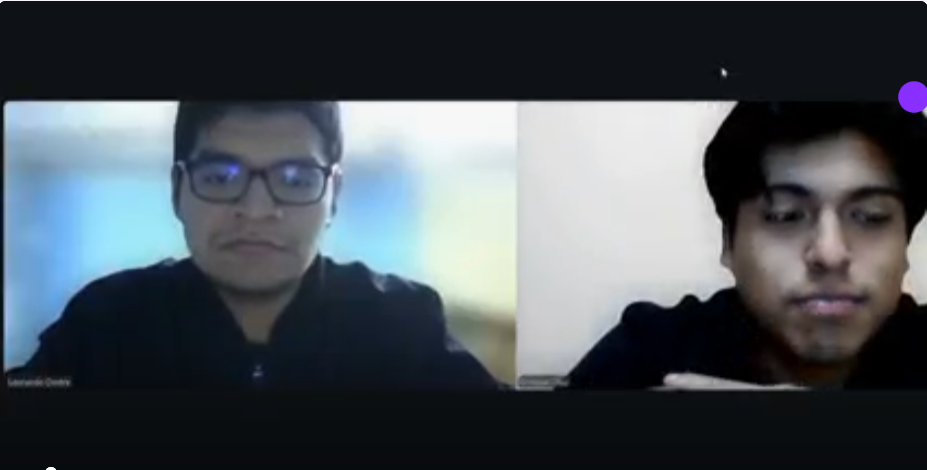
        

### Resumen de la entrevista

El entrevistado es Enrique Díaz, un joven de 26 años de edad, de estado civil soltero, que reside en el distrito de Lince en Lima, Perú, y labora actualmente como asistente administrativo desempeñándose en la modalidad de teletrabajo la mayor parte del tiempo, viviendo solo en su departamento. En cuanto a su condición física, Enrique tiene una amputación transtibial en la pierna derecha por debajo de la rodilla como secuela de un accidente de tránsito ocurrido hace poco más de dos años, momento desde el cual utiliza una prótesis mecánica convencional. Respecto a su rehabilitación, en las etapas iniciales concurría a terapia presencial dos veces por semana, pero en la actualidad redujo su asistencia a una vez cada quince días debido a las severas dificultades de movilidad y traslado en la ciudad: habitualmente intenta movilizarse en transporte público a través del Corredor Azul para mitigar gastos, aunque cuando el tráfico es excesivo o presenta molestias físicas se ve forzado a costear servicios de taxi, lo que incrementa significativamente su presupuesto de transporte. En su hogar tiene asignada una rutina diaria de descarga de peso, ejercicios de equilibrio apoyado frente a una silla y caminatas cortas en línea recta, no obstante, reconoce que por agotamiento laboral o desgana los ejecuta de manera interdiaria. Al ejercitarse o caminar solo experimenta fricción e irritación cutánea generada por el roce del encaje de la prótesis, así como dolores en la espalda baja al finalizar el día debido a que compensa de forma asimétrica el peso corporal cargándolo hacia la pierna contralateral o pisando de manera desalineada.

A nivel subjetivo, emocional y postural, Enrique refleja una marcada incertidumbre y falta de seguridad al entrenar fuera del entorno clínico, dependiendo casi en su totalidad de su memoria para evocar las instrucciones del terapeuta y colocándose frente al espejo de su habitación para intentar autocorregirse, admitiendo que si siente dolor asume empíricamente que lo está haciendo mal, pero sin tener a nadie que lo supervise en ese instante. En lo referente a sus canales de interacción, marcas e influencias, su principal referente de consulta médica es su terapeuta físico licenciado y los técnicos del taller ortopédico; para comunicarse con la clínica utiliza WhatsApp enviando mensajes de texto y videos cortos, canal donde a menudo experimenta demoras en las respuestas por la alta demanda de atención del personal de salud, mientras que ante ruidos anómalos o desajustes mecánicos en el encaje debe llamar directamente al taller, viéndose casi siempre obligado a acudir de manera presencial y perder toda la mañana en traslados y revisiones. En sus hábitos tecnológicos, muestra un perfil tradicional y de mínima complejidad digital: no utiliza aplicaciones de salud existentes por considerarlas enredadas, poco intuitivas o redactadas en inglés, prefiriendo un método analógico como anotar sus citas médicas a mano en un cuaderno y colocar notas visibles en la refrigeradora.

En cuanto a dispositivos y conectividad, su herramienta primordial y de uso permanente es su celular smartphone con sistema operativo Android, mientras que la computadora la reserva exclusivamente para cumplir con su jornada laboral de oficina, por lo que prefiere interactuar con cualquier solución tecnológica únicamente a través del teléfono móvil. Respecto a la propuesta de valor de una plataforma de monitoreo en tiempo real con alertas médicas, valora positivamente que el especialista supervise su evolución para evitar traslados innecesarios, pero manifiesta aprensión, dudas de privacidad y ansiedad ante un monitoreo constante, temiendo sentirse vigilado durante todo el día o experimentar la sensación de estar fracasando en su tratamiento cada vez que el sistema notifique un error a su médico. Para adoptar y utilizar diariamente la aplicación, establece como requisitos indispensables una interfaz extremadamente simple con tipografía grande, botones claros, videos demostrativos muy cortos que guíen los ejercicios sin depender de la memoria, y una optimización rigurosa de recursos que no consuma su plan de datos móviles ni agote la batería de su dispositivo, la cual suele mantener al límite. Por último, los factores determinantes que provocarían su desmotivación y abandono definitivo del sistema son la inestabilidad de la aplicación (cierres inesperados o congelamientos continuos), la imposición de cuestionarios largos y diarios sobre su estado anímico, el alto peso de instalación que sature el almacenamiento interno de su celular quitándole espacio para fotos y chats, y la presencia de notificaciones push estresantes, ruidosas o repetitivas cada pocos minutos, datos empíricos que permiten estructurar su arquetipo como un usuario pragmático, enfocado en el canal móvil, con recursos de hardware y conectividad ajustados, y una necesidad prioritaria de simplicidad, respeto a su autonomía y bajo nivel de estrés digital.

## Entrevista 2 – Juan Ramirez

### Datos Generales
* **Nombres y Apellidos:** Juan Ramirez
* **Edad:** 30 años
* **Distrito de Residencia:** San Miguel (Lima)
* **Estado Civil:** Soltero
* **Ocupación:** Desarrollador de software freelance
* **Condición Médica:** Amputación transtibial en la pierna izquierda.

### Detalles de la Entrevista
* **Fecha de entrevista:** 08/09/2026
* **Inicio de la entrevista:** 0:05
* **Duración de la entrevista:** 7:04
* **Enlace:** https://tinyurl.com/3p23ymt4

          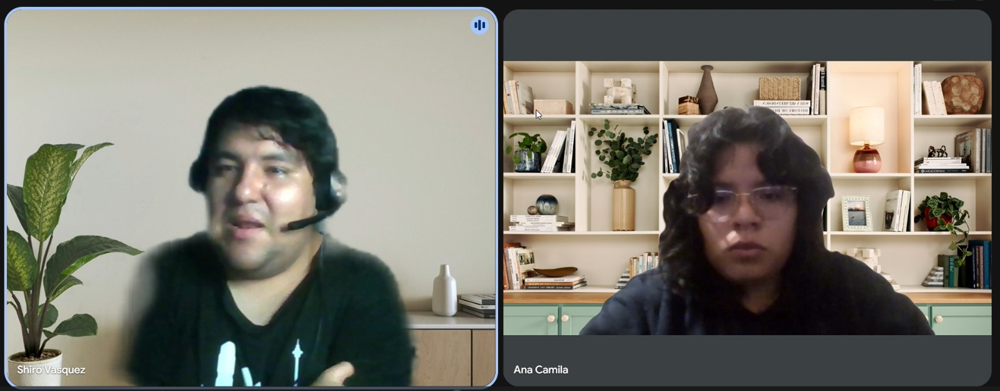
        

### Resumen de la entrevista

El entrevistado es Juan Ramirez, un hombre de 30 años de edad, de estado civil soltero y residente en la ciudad de Lima, Perú. En el ámbito laboral, se desempeña como ingeniero y desarrollador de software bajo la modalidad freelance desde su casa, donde convive con su familia compartiendo de manera colaborativa las responsabilidades del hogar. A nivel clínico y funcional, Juan presenta una amputación de tipo transtibial en una de sus extremidades inferiores, conservando la articulación de la rodilla completamente funcional e intacta. Para su movilidad cotidiana utiliza una prótesis mecánica con capacidad de respuesta dinámica adaptada a diferentes tipos de suelo, adquisición que califica de manera muy positiva debido a la comodidad que le brinda al caminar. Respecto a su trayectoria de rehabilitación, ha tenido un proceso progresivo: al principio asistía a tres sesiones presenciales de fisioterapia por semana, luego pasó a una frecuencia quincenal y actualmente acude una vez al mes para realizar chequeos y controles rutinarios de avance con su terapeuta. Para complementar este proceso de manera autónoma, su fisioterapeuta le indicó realizar ejercicios focalizados en el equilibrio y en el fortalecimiento muscular del muñón. No obstante, durante la práctica en solitario o en caminatas prolongadas por la casa, Juan manifiesta experimentar dolores y molestias como sensación de presión directa sobre el muñón, fatiga muscular recurrente y una sobrecarga notable en la zona lumbar de la espalda baja al intentar compensar el peso corporal para mantener el centro de gravedad (describiendo que en etapas tempranas su marcha era inestable o «como pingüino»).

Frente a la necesidad de validar si ejecuta adecuadamente las rutinas posturales sin la presencia del profesional, Juan demostró una personalidad analítica, autodidacta y orientada a la resolución empírica de problemas: inicialmente utilizó un espejo de cuerpo completo y posteriormente implementó grabaciones en video para revisar su postura en distintos momentos y compartirlas en sus consultas; sin embargo, reconoce con honestidad que aún siente incertidumbre al no tener al especialista a su lado, dudando con frecuencia si su cuerpo se encuentra balanceado o inclinado involuntariamente hacia la derecha o la izquierda. En cuanto a sus canales de interacción y comunicación digital, cuando surgen dudas médicas utiliza primordialmente WhatsApp a través de mensajes de texto y notas de voz evitando saturar a si fisioterapeuta, recurriendo de inmediato a agendar citas presenciales si el dolor se vuelve persistente. En relación con el ecosistema tecnológico, los dispositivos y los hábitos de uso, Juan interactúa de forma predominante con su computadora personal, considerándola su entorno principal y más familiar por su oficio como programador, por encima del teléfono móvil. En su navegación web diaria e interacción con plataformas como YouTube, destaca el uso estricto de herramientas bloqueadoras de anuncios (AdBlockers), evidenciando un perfil con baja tolerancia al ruido visual, a la saturación de interfaz y a las interrupciones publicitarias.

Respecto a su círculo de influencia, su fisioterapeuta representa su máxima figura de referencia técnica (expresando que sus recomendaciones están «escritas en piedra»), sumado al apoyo de su entorno familiar. Al evaluar la viabilidad de una solución digital o plataforma especializada, Juan considera que sería de altísimo valor contar con una herramienta en tiempo real que le corrija la postura y alerte a su médico, motivado principalmente por el temor a fijar vicios de marcha que deriven en lesiones osteomusculares graves a largo plazo. Como especificaciones y requerimientos clave para adoptar la solución a diario, prefiere interactuar desde la computadora y solicita retroalimentación inmediata mediante señales visuales o auditivas (por ejemplo, advertencias claras como «vuelve a la derecha» o «inclínate a la izquierda»), combinadas con un panel de registro de progreso que muestre gráficas cronológicas de su balance y evolución física. Por último, identifica como factores determinantes de desmotivación y abandono del software los procesos de calibración lentos —argumentando que si el sistema demora en calibrar pierde toda utilidad práctica— y la presencia de notificaciones intrusivas o invasivas, aspectos que rechaza categóricamente. 

## Entrevista 3 – Miguel Suarez

### 1. Datos Generales del Entrevistado

* **Nombres y Apellidos:** Miguel Suarez Casas
* **Edad:** 25 años
* **Distrito de Residencia:** San Martín de Porres (Lima)
* **Estado Civil:** Soltero
* **Ocupación:** Asistente administrativo (modalidad teletrabajo)
* **Condición Médica:** Amputación transfemoral en la pierna derecha (uso de prótesis mecánica desde hace aproximadamente 3 años).

### 2. Evidencia de la Entrevista

* **Fecha de entrevista:** 08/09/2026
* **Inicio de la entrevista:** 0:05
* **Duración de la entrevista:** 5:10
* **Enlace:** https://tinyurl.com/23hvbfxw

          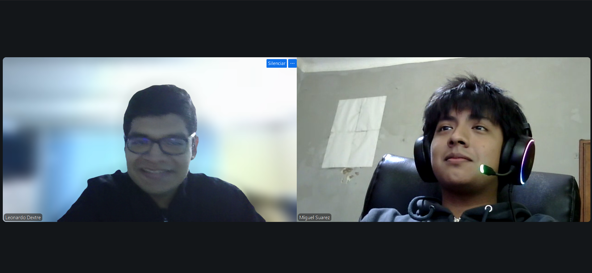
        

### 3. Resumen de la Entrevista

El entrevistado es una persona de 30 años de edad, de estado civil soltero, que reside en el distrito de San Martín de Porres en Lima, Perú, y labora actualmente como asistente administrativo bajo la modalidad de trabajo remoto, viviendo en el hogar familiar junto con sus padres y su hermano menor. En cuanto a su condición biomédica, presenta una amputación transfemoral en la pierna derecha por encima de la rodilla y utiliza desde hace aproximadamente tres años una prótesis mecánica que califica como funcional, aunque reconoce limitaciones biomecánicas al caminar por períodos prolongados debido a la exigencia de coordinar la articulación protésica. En el ámbito de su rehabilitación clínica, asiste a sesiones presenciales de fisioterapia con una frecuencia de una vez por semana, régimen que considera insuficiente para corregir las deficiencias o molestias acumuladas a lo largo de los días, pero que no puede incrementar debido a las limitaciones de tiempo y a los costos económicos asociados a los traslados recurrentes por la ciudad. Como parte de su tratamiento ambulatorio en el hogar, tiene prescrita una pauta casi diaria de ejercicios enfocados en el fortalecimiento muscular, equilibrio, movilidad y adaptación al dispositivo, aunque admite que en la práctica los ejecuta entre tres y cuatro veces por semana. Al ejercitarse o desplazarse solo en casa, experimenta fatiga marcada y desbalances corporales, requiriendo un nivel constante de atención sobre la dinámica de la rodilla protésica tras varias horas de uso, enfrentando la incertidumbre cotidiana de no saber si está caminando con un patrón correcto o si genera una sobrecompensación asimétrica perjudicial con su pierna contralateral sana.

A nivel subjetivo, actitudinal y de percepción de autoeficacia, el entrevistado muestra un perfil reflexivo, consciente de sus límites técnicos pero con una fuerte necesidad de validación experta, ya que para evaluar su desempeño en el hogar depende exclusivamente de su memoria respecto a las indicaciones verbales del terapeuta y de la autoobservación. Aunque ha intentado grabarse en video con su teléfono móvil, señala que este método resulta impráctico y poco resolutivo, pues carece de conocimientos biomecánicos especializados para determinar si la alineación postural y la trayectoria de la rodilla protésica son las adecuadas. En lo concerniente a sus canales de interacción, marcas y figuras de influencia, su principal referente y autoridad de consulta es su terapeuta físico, mientras que a nivel de comunicación utiliza la plataforma de mensajería WhatsApp o llamadas telefónicas directas para contactar a la clínica ortopédica, enfrentando dificultades habituales por demoras en los tiempos de respuesta y la complejidad de explicar síntomas o desajustes mecánicos a través de texto. Respecto a sus hábitos tecnológicos y manejo de dispositivos, emplea principalmente el teléfono inteligente tanto para mantenerse en contacto con el personal de salud como para consultar videos puntuales de ejercicios, sin utilizar hasta el momento aplicaciones dedicadas de salud ni llevar bitácoras o registros formales sobre sus terapias y tiempos de uso de la prótesis.

Frente al entorno de hardware, el entrevistado reserva la computadora exclusivamente para cumplir con sus obligaciones laborales remotas de oficina y prioriza de manera contundente el smartphone como el dispositivo indispensable para interactuar con una solución digital de rehabilitación, fundamentando su elección en la portabilidad y la posibilidad de manipular el móvil directamente en el espacio físico donde entrena. Ante la propuesta de una plataforma de telemonitoreo en tiempo real con alertas hacia el especialista, manifiesta una actitud receptiva y valora su utilidad para optimizar la técnica de los ejercicios y vigilar la cinemática de la rodilla protésica; no obstante, condiciona su confianza a un alto rigor técnico, señalando que desconfiaría de un sistema con alertas constantes ante falsos positivos y exigiendo estrictos estándares de privacidad y seguridad en el traspaso de datos hacia el médico. Para incorporar y mantener el uso diario de la herramienta, demanda una interfaz intuitiva y fácil de usar, un sistema de retroalimentación que registre su progreso histórico, indicaciones claras sobre la corrección del movimiento, alertas precisas ante fallos mecánicos o de ejecución y un diseño ligero que no consuma de manera excesiva la batería ni el plan de datos móviles. Finalmente, los factores que provocarían su desmotivación y abandono definitivo del producto son la imprecisión en las mediciones, la saturación por alertas excesivas, la complejidad operativa de la interfaz y la falta de impacto perceptible tras semanas de uso, datos recolectados que permiten consolidar su arquetipo como un usuario móvil, altamente analítico, enfocado en la precisión técnica, celoso de la privacidad de su información clínica y que exige una herramienta práctica que demuestre avances tangibles sin fricciones de conectividad o falsas alarmas.

## Segmento objetivo 2 - Profesionales de Terapia Física y Rehabilitación

## Entrevista 1 – Diego Salazar

### Datos Generales
* **Nombres y Apellidos:** Diego Salazar Mendoza
* **Edad:** 28 años
* **Distrito de Residencia:** Lima, Perú
* **Estado Civil:** Soltero
* **Ocupación:** Licenciado en Tecnología Médica en la especialidad de Terapia Física y Rehabilitación
* **Centro de trabajo:** Centro de rehabilitación ubicado en Jesús María (Lima)

### Detalles de la Entrevista
* **Fecha de entrevista:** 07/09/2026
* **Inicio de la entrevista:** 0:06
* **Duración de la entrevista:** 7:09
* **Enlace:** https://tinyurl.com/mwx4b4s6

          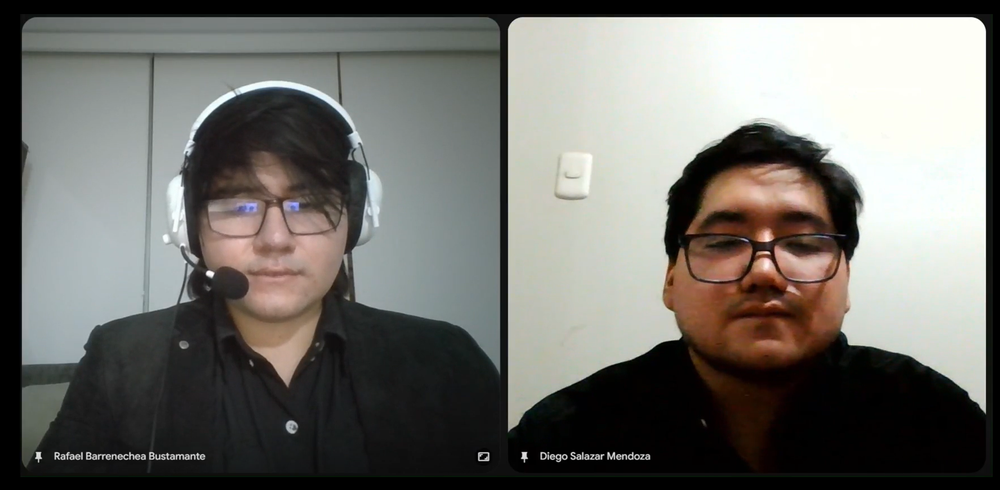
        

### Resumen de la entrevista

El entrevistado es Diego Salazar Mendoza, un profesional de 28 años de edad, licenciado en Tecnología Médica con especialidad en Terapia Física y Rehabilitación, quien labora actualmente como fisioterapeuta en un centro de rehabilitación ubicado en el distrito de Jesús María, en Lima, Perú. En dicho establecimiento atiende a pacientes traumatológicos, postoperatorios y personas con amputaciones que se encuentran en proceso de adaptación a una prótesis. En cuanto a su trayectoria profesional, cuenta con aproximadamente cinco años de experiencia general en el área de rehabilitación y cerca de tres años enfocado específicamente en el tratamiento de pacientes amputados, manejando de forma directa y personalizada una carga de seis a diez pacientes amputados, dentro de una población global del centro que oscila entre quince y veinte pacientes activos en periodos determinados. Diego enfatiza que el proceso de rehabilitación no es estándar ni homogéneo, ya que cada paciente evoluciona a ritmos enteramente distintos aun cuando presenten amputaciones con características anatómicas similares. Cuando el usuario recibe su prótesis y debe continuar con su tratamiento ambulatorio en el hogar, el protocolo que sigue consiste en enseñar y practicar previamente los ejercicios en la sesión clínica presencial, pautando el volumen de repeticiones y la frecuencia de rutinas enfocadas en equilibrio, fortalecimiento muscular, transferencia de peso y marcha. Para el soporte fuera de la consulta, entrega indicaciones escritas y se apoya en material visual como fotografías o videos cortos explicativos.

A nivel de canales de interacción, marcas y herramientas digitales cotidianas, el medio principal y más recurrente que utiliza para enviar el material terapéutico a los pacientes es WhatsApp, debido a su universalidad y facilidad de acceso, aunque reconoce que la supervisión remota presenta una severa limitación metodológica: la clínica depende casi con exclusividad del reporte verbal y subjetivo que el paciente brinda al regresar a consulta, sin contar con un mecanismo de control para saber con certeza cuántas repeticiones ejecutó o con qué precisión técnica las realizó, dándose solo de manera esporádica el caso de pacientes que graban y envían videos por iniciativa propia. En el ámbito institucional, el centro registra internamente en su sistema clínico formal los ejercicios realizados, las complicaciones observadas, la presencia de dolor y el patrón de marcha durante las sesiones presenciales, pero carece por completo de indicadores objetivos para medir la evolución en el hogar. Asimismo, el equipo profesional utiliza hojas de cálculo de Microsoft Excel para controles de gestión interna, y recurre a llamadas telefónicas, correo electrónico y mensajes de WhatsApp para coordinar incidencias técnicas con los centros ortopédicos; sin embargo, no existe un software compartido ni una base de datos integrada entre la clínica y los talleres ortopédicos, manejando cada institución su información de manera fragmentada e inconexa.

En el aspecto subjetivo, analítico y actitudinal, Diego muestra un perfil profesional pragmático, observador, riguroso con el tratamiento individualizado y con una alta disposición hacia la incorporación de herramientas tecnológicas que optimicen su labor asistencial, siempre y cuando estas no añadan sobrecarga cognitiva y presenten la información clínica de forma clara y fácil de interpretar. Ante la propuesta de una plataforma web de telemonitoreo con datos biomecánicos en tiempo real, el cumplimiento de ejercicios y la emisión de alertas, califica la solución como sumamente valiosa para cerrar la brecha de desinformación que ocurre entre una sesión presencial y la siguiente. Para considerar el sistema como indispensable y adoptarlo en su flujo de trabajo, exige requerimientos funcionales específicos: una ficha de paciente bien estructurada, un gestor de planes de ejercicios asignados con visualización de cumplimiento efectivo, una sección de evolución temporal, un módulo de historial biomecánico, un sistema de alertas ante desalineaciones o fallos, y mecanismos integrados de mensajería bidireccional tanto para enviar correcciones directas al paciente como para comunicarse con el técnico ortopédico. Desde la perspectiva institucional y de viabilidad comercial de una suscripción anual, precisa con honestidad que la decisión final de compra recae en el área administrativa de la clínica, pero manifiesta que desde su rol como fisioterapeuta recomendaría la plataforma para su adquisición institucional siempre que demuestre eficacia clínica y sea sometida previamente a un periodo de prueba o validación práctica, datos recolectados que aportan evidencia cuantitativa y cualitativa para estructurar el arquetipo de terapeuta clínico como un usuario profesional joven, analítico, demandante de interfaces interpretables y centrado en la trazabilidad objetiva del paciente.

## Entrevista 2 – Ana Mercedes

### Datos Generales
* **Nombres y Apellidos:** Ana Mercedes
* **Edad:** 38 años
* **Distrito de Residencia:** Magdalena, Lima
* **Estado Civil:** Soltera
* **Ocupación:** Fisioterapeuta

### Detalles de la Entrevista
* **Fecha de entrevista:** 08/09/2026
* **Inicio de la entrevista:** 0:06
* **Duración de la entrevista:** 6:12
* **Enlace:** https://tinyurl.com/44yuywb7

          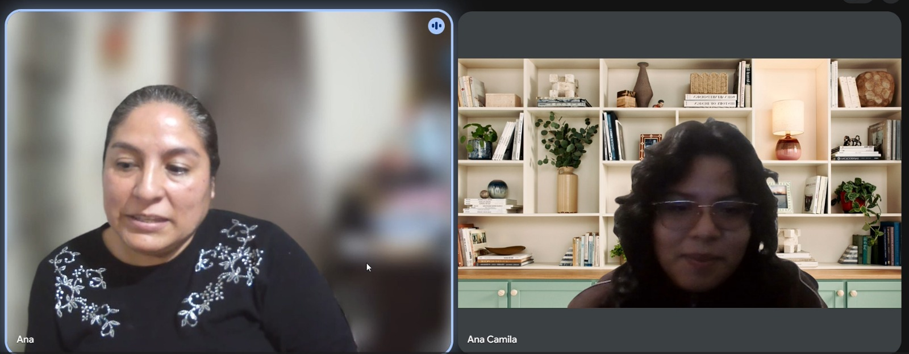
        

### Resumen de la entrevista
La entrevistada es Ana Mercedes, una profesional de 38 años de edad, de ocupación fisioterapeuta especializada en rehabilitación física, quien se desempeña laboralmente en una clínica de rehabilitación en la ciudad de Lima. En su trayectoria profesional cuenta con aproximadamente diez años de experiencia en el área de medicina física y rehabilitación, gestionando de manera periódica en su centro médico la atención ambulatoria de una cohorte de quince a veinte pacientes con amputaciones de extremidades. En lo relativo a la estructura y los flujos de coordinación técnica fuera del entorno hospitalario, el seguimiento ambulatorio se gestiona de forma descentralizada mediante canales convencionales como llamadas telefónicas y la aplicación de mensajería instantánea WhatsApp, a través de los cuales el paciente reporta verbalmente la ejecución de sus rutinas y se evalúa la necesidad de programar una nueva cita de control presencial en la sede. Actualmente, la supervisión de la adherencia al tratamiento y el progreso biomecánico en el hogar depende primordialmente del testimonio subjetivo del usuario y, de manera esporádica, de videos caseros que los pacientes graban y remiten por mensajería; no obstante, la institución carece de instrumentación biomédica para mediciones cinemáticas continuas y no dispone de una base de datos centralizada que permita consolidar y analizar formalmente dichos registros. Esta brecha de información remota genera riesgos clínicos considerables identificados por la especialista, tales como la ejecución incorrecta de los ejercicios pautados, el desarrollo inadvertido de compensaciones musculoesqueléticas nocivas en otras zonas corporales y una notable deserción o pérdida paulatina de adherencia terapéutica debido a la falta de un mecanismo de fiscalización constante.

A nivel de articulación interinstitucional, marcas y canales de interacción, el intercambio de datos clínicos con los talleres y centros ortopédicos encargados de la confección de las prótesis se canaliza mediante informes médicos formales, correo electrónico institucional y WhatsApp en casos puntuales, activándose casi con exclusividad cuando se requiere solicitar ajustes técnicos o modificaciones biomecánicas en el encaje o componentes del dispositivo. En el ámbito de su ecosistema tecnológico, si bien la clínica emplea sistemas informáticos estandarizados para el registro de historias clínicas y fichas administrativas, no cuenta con plataformas de telemedicina especializada ni herramientas digitales dedicadas al monitoreo y cuantificación de métricas biomecánicas en tiempo real. Desde una perspectiva subjetiva y analítica, la especialista valora positivamente la incorporación de un panel de control o dashboard centralizado, argumentando que otorgaría una perspectiva holística del paciente, agilizaría la toma de decisiones clínicas y permitiría detectar alteraciones en la marcha sin supeditar el criterio médico a la asistencia presencial. Asimismo, destaca que la implementación de alertas tempranas y automatizadas ante posturas viciadas o compensaciones musculares optimizaría el tiempo operativo de revisión del equipo de salud, habilitando una intervención oportuna antes de que los desbalances biomecánicos devengan en lesiones de mayor gravedad. En el plano financiero y de viabilidad corporativa, afirma que la clínica evaluaría favorablemente la contratación de un modelo de suscripción anual, condicionando dicha inversión a que el software evidencie resultados clínicos tangibles, ofrezca una usabilidad sencilla y mantenga una relación costo-beneficio coherente con el valor asistencial generado tanto para la institución como para los usuarios.

En cuanto a requerimientos funcionales y entorno de hardware, considera estrictamente indispensables módulos analíticos enfocados en el análisis cinemático de la marcha, la alineación postural, el registro del tiempo efectivo de uso de la prótesis, la tasa de adherencia al plan de ejercicios en el hogar, un sistema de alertas automáticas y la emisión de reportes descargables vinculados a la historia clínica. Respecto a los dispositivos de interacción, prioriza como entorno primario de trabajo las computadoras de escritorio y ordenadores portátiles de la clínica para la gestión administrativa y de escritorio, pero demanda de forma complementaria una versión adaptable e intuitiva para tabletas electrónicas, permitiendo a los terapeutas consultar y contrastar información de campo durante las sesiones de evaluación física. Finalmente, los principales obstáculos y barreras operativas que provocarían el rechazo o desuso de una plataforma tecnológica son una interfaz de usuario compleja, fallos técnicos recurrentes, una excesiva carga temporal en la digitación o ingreso manual de datos por parte del personal sanitario, la falta de capacitación previa a los colaboradores y cualquier vulnerabilidad que comprometa los protocolos de confidencialidad, ciberseguridad y privacidad de los historiales médicos de los pacientes, evidencias recolectadas que permiten construir el arquetipo de usuario clínico como un perfil médico con amplia experiencia asistencial, alta orientación a la evidencia biomecánica cuantitativa, saturación operativa y una imperiosa necesidad de soluciones interoperables, seguras y de rápida adopción clínica.

## Entrevista 3 – Carmen Salazar

### Datos Generales
* **Nombres y Apellidos:** Carmen Salazar
* **Edad:** 70 años
* **Distrito de Residencia:** Jesus Maria, Lima
* **Estado Civil:** Casada
* **Ocupación:** Médica especialista en Rehabilitación

### Detalles de la Entrevista
* **Fecha de entrevista:** 10/09/2026
* **Inicio de la entrevista:** 0:06
* **Duración de la entrevista:** 6:12
* **Enlace:** https://tinyurl.com/5xxj6njv

          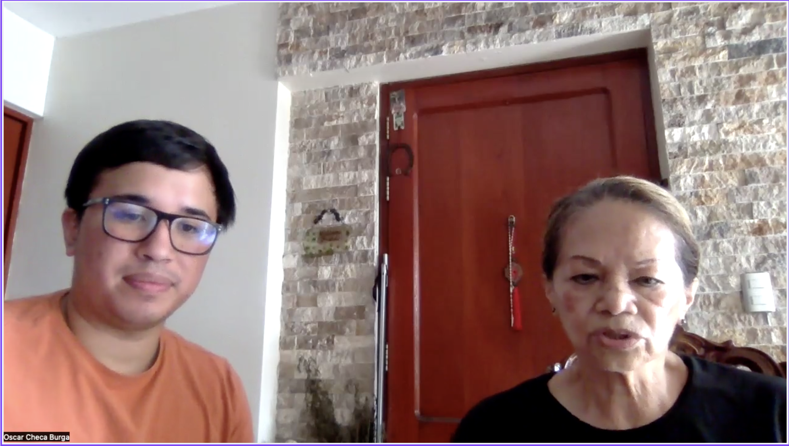
        

### Resumen de la entrevista
La Sra. Carmen, médica especialista en Rehabilitación de 70 años y actual Directora Médica de una clínica en Lima, cuenta con más de 40 años de experiencia trabajando en el área asistencial. A lo largo de su trayectoria ha tenido contacto frecuente con pacientes que requieren procesos de rehabilitación física, entre ellos pacientes amputados que necesitan un seguimiento constante durante su adaptación y uso de prótesis. A partir de la entrevista, se pudo identificar que uno de los principales retos dentro de su trabajo está relacionado con el seguimiento de los pacientes fuera de las instalaciones de la clínica. Actualmente, el proceso de rehabilitación se encuentra bastante centrado en las consultas presenciales, donde los especialistas pueden evaluar directamente al paciente, observar su postura, revisar su marcha y realizar las recomendaciones correspondientes. Sin embargo, una vez que el paciente regresa a su domicilio, existe poca visibilidad sobre cómo continúa realizando sus ejercicios y actividades indicadas.

La Sra. Carmen señaló que esta situación representa una dificultad importante, debido a que no siempre es posible saber si los ejercicios indicados están siendo realizados correctamente o si el paciente está siguiendo las recomendaciones entregadas durante la consulta. En algunos casos, los pacientes pueden modificar la postura para compensar determinadas molestias, realizar movimientos incorrectos o disminuir progresivamente el uso de la prótesis. Estos comportamientos pueden pasar desapercibidos durante un periodo considerable de tiempo y recién ser identificados cuando el paciente regresa a una consulta presencial. Uno de los riesgos que más preocupa es que una mala ejecución de los ejercicios o una postura incorrecta pueda generar consecuencias adicionales para el paciente. Por ejemplo, pueden aparecer molestias o dolores lumbares, problemas derivados de una mala distribución del peso, dificultades en la marcha o una menor adaptación a la prótesis. Además, si el paciente experimenta molestias y no recibe una orientación oportuna, existe el riesgo de que reduzca el tiempo de utilización de la prótesis o incluso deje de utilizarla. Esto termina afectando directamente el proceso de rehabilitación y puede hacer que el tratamiento requiera más tiempo.

Actualmente, la comunicación con otros profesionales involucrados en el proceso, especialmente los ortopedistas encargados de la confección y adaptación de las prótesis, se realiza principalmente mediante los canales de comunicación que ya utiliza la clínica. Entre ellos destacan la historia clínica digital y la comunicación directa mediante llamadas telefónicas o WhatsApp. Si bien estos medios permiten coordinar determinadas situaciones, la información puede encontrarse distribuida en diferentes canales y no necesariamente estar disponible de manera centralizada y estructurada para todos los profesionales involucrados. Respecto al uso de tecnología, la Sra. Carmen tiene una relación principalmente tradicional con las herramientas digitales. Utiliza computadoras de escritorio, navegadores web y sistemas de oficina, por lo que se siente más cómoda trabajando en pantallas grandes donde pueda visualizar claramente la información. Considera importante que cualquier plataforma destinada al personal médico tenga una interfaz sencilla, con textos legibles y una organización que permita encontrar rápidamente los datos relevantes. A pesar de esta preferencia, Carmen no se encuentra cerrada al uso de nuevas tecnologías. Por el contrario, considera que una herramienta digital podría ser bastante útil si permite complementar su experiencia clínica con información objetiva. Para ella, la tecnología no debería sustituir la evaluación ni el criterio del médico, sino proporcionar datos que ayuden a confirmar una sospecha, identificar una evolución desfavorable o decidir qué pacientes necesitan una revisión más detallada.

En este sentido, la posibilidad de contar con un dashboard centralizado sería de gran utilidad. La Sra. Carmen considera especialmente importante que la información pueda visualizarse de manera rápida y sencilla, evitando tener que revisar grandes cantidades de datos o ingresar a diferentes sistemas. Un panel centralizado permitiría conocer el estado de los pacientes y detectar rápidamente aquellos casos que requieran atención. Una funcionalidad que podría facilitar considerablemente este proceso sería el uso de un sistema de semáforos. Mediante indicadores de color verde, amarillo y rojo, el personal médico podría identificar rápidamente la situación de cada paciente. El color verde podría representar una evolución adecuada y un seguimiento normal; el amarillo permitiría identificar pacientes que requieren observación o seguimiento adicional; mientras que el rojo permitiría priorizar aquellos casos donde existan indicadores de riesgo o una posible necesidad de intervención. Asimismo, las alertas automáticas ante determinados problemas serían especialmente útiles. Por ejemplo, si el sistema identifica una postura incorrecta, una alteración en la marcha o algún patrón que pueda indicar una compensación muscular, el profesional podría recibir una alerta y revisar el caso antes de la siguiente consulta presencial. Esto permitiría pasar de un modelo principalmente reactivo, donde el problema se detecta cuando el paciente llega a consulta, a uno más preventivo, donde determinados riesgos puedan identificarse con anticipación.

Otro aspecto relevante para Carmen es la posibilidad de obtener métricas objetivas relacionadas con el uso de la prótesis y el progreso del paciente. Entre los indicadores que considera importantes se encuentran las horas de uso de la prótesis y los datos relacionados con la alineación de la marcha. Estos datos permitirían conocer mejor el comportamiento del paciente fuera de la clínica y complementar la información obtenida durante las evaluaciones presenciales. También considera importante que los datos obtenidos puedan convertirse en reportes útiles para el trabajo médico. La posibilidad de exportar información para incorporarla a la historia clínica permitiría evitar la duplicación de registros y facilitaría la documentación de la evolución del paciente. Desde su perspectiva, una plataforma de este tipo tendría mayor valor si la información recopilada puede integrarse fácilmente al flujo de trabajo existente en la clínica. En relación con la adquisición de una solución digital, la Sra. Carmen considera que la clínica podría evaluar una suscripción anual siempre que la plataforma demuestre un beneficio concreto. La inversión tendría sentido si permite ahorrar tiempo al personal médico, mejorar el seguimiento de los pacientes y aportar información que tenga un verdadero valor clínico. No considera conveniente incorporar una herramienta que simplemente agregue más tareas administrativas o que obligue a los profesionales a registrar manualmente grandes cantidades de información. Por ello, la facilidad de uso aparece como uno de los factores más importantes para la adopción. La solución tendría que ser rápida, intuitiva y requerir la menor cantidad posible de pasos para acceder a los datos importantes. Carmen, debido a su experiencia y perfil profesional, prioriza la funcionalidad y la claridad por encima de interfaces demasiado complejas o cargadas de elementos visuales.

En cuanto a los dispositivos, su preferencia personal se orienta principalmente hacia computadoras de escritorio y navegadores web, especialmente por el tamaño de pantalla y la facilidad para visualizar información médica. Sin embargo, reconoce que otros profesionales de la clínica, particularmente los terapeutas más jóvenes que trabajan directamente con los pacientes durante las sesiones de rehabilitación, podrían preferir utilizar tabletas. Por ello, una plataforma accesible desde diferentes dispositivos podría facilitar su adopción entre los distintos perfiles profesionales. Finalmente, uno de los principales factores que podría desincentivar el uso continuo de la plataforma sería que el sistema resulte complicado, lento o implique una carga adicional de trabajo. También sería importante evitar que los profesionales tengan que ingresar constantemente información de manera manual o utilizar procesos burocráticos que no aporten directamente al tratamiento. Para Carmen, la tecnología debe adaptarse al flujo de trabajo de los profesionales y no obligarlos a modificar completamente su manera de trabajar.

En conclusión, la entrevista permitió identificar que la principal necesidad de la Sra. Carmen se encuentra en mejorar la visibilidad del proceso de rehabilitación fuera de la consulta presencial. Actualmente existe una brecha de información entre lo que el médico observa durante la consulta y lo que realmente sucede cuando el paciente realiza sus ejercicios y utiliza su prótesis en casa. Una plataforma que permita recopilar datos biomecánicos, monitorear el uso de la prótesis, generar alertas y presentar la información mediante un dashboard sencillo podría ayudar a reducir esta brecha. 

Para Carmen, el verdadero valor de la solución no estaría únicamente en incorporar tecnología, sino en utilizarla como una herramienta de apoyo para su criterio médico. La plataforma debería permitirle identificar rápidamente qué pacientes evolucionan correctamente, cuáles requieren seguimiento y cuáles presentan señales que ameritan una evaluación. De esta manera, la solución podría contribuir a optimizar el tiempo de los profesionales, reducir consultas innecesarias y, principalmente, mejorar el seguimiento y la calidad de la rehabilitación de los pacientes amputados.

## Segmento objetivo 3 - Técnicos Ortoprotesistas

## Entrevista 1 – Miguel Sanchez

### Datos Generales
* **Nombres y Apellidos:** Miguel Sanchez Castillo
* **Edad:** 57 años
* **Distrito de Residencia:** Pueblo Libre (Lima)
* **Estado Civil:** Casado
* **Ocupación:** Protesista-ortesista

### Detalles de la Entrevista
* **Fecha de entrevista:** 09/09/2026
* **Inicio de la entrevista:** 0:07
* **Duración de la entrevista:** 5:24
* **Enlace:** https://tinyurl.com/2asw539n

          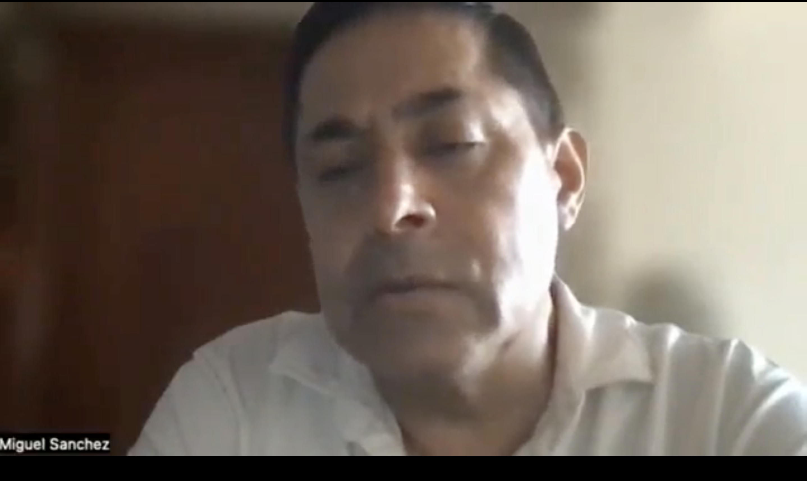
        

### Resumen de la entrevista

El entrevistado es Miguel Sánchez Castro, un profesional de 57 años de edad, proyectista y protesista-ortesista graduado, quien se desempeña como director técnico de un centro ortopédico que opera en la ciudad de Lima desde hace más de veinticinco años. En su taller se especializan en la alineación, ensamblaje y adaptación de prótesis mecánicas, mioeléctricas y biomecánicas para miembros superiores e inferiores, alcanzando un volumen de producción y adaptación de diez a quince prótesis mensuales. Respecto a los protocolos de mantenimiento y servicio técnico, el centro estructura un calendario preventivo pautando revisiones al primer mes de la entrega del dispositivo y posteriormente a los tres y seis meses para el seguimiento respectivo; sin embargo, en la práctica el flujo de asistencia de los usuarios resulta sumamente irregular. Para el control del historial de los componentes, la institución gestiona un sistema híbrido compuesto por fichas técnicas digitales almacenadas en la computadora del taller y carpetas físicas por cada paciente, donde asientan marcas, números de serie, fechas de entrega y el recambio de repuestos efectuado en cada mantenimiento. La principal limitación técnica y operativa que enfrentan para dimensionar el desgaste real de los dispositivos radica en la carencia de métricas objetivas de uso, dependiendo exclusivamente del relato verbal del paciente al acudir al taller, lo cual genera discrepancias al subestimar o sobreestimar el nivel real de actividad y las horas de marcha a las que se somete el dispositivo en la vida cotidiana.

En lo concerniente a los canales de interacción, marcas y comunicación técnica, el intercambio de información con los médicos y fisioterapeutas a cargo de la rehabilitación es fluido pero informal, realizándose mediante llamadas directas, correos electrónicos o mensajes de WhatsApp para coordinar correcciones de alineación o recambios de encaje (socket). En su bagaje tecnológico previo, el centro ha utilizado software propietario de calibración y configuración integrado en rodillas mecatrónicas de marcas internacionales para la alineación inicial, pero nunca ha implementado una plataforma de telemetría continua para la monitorización técnica remota de prótesis convencionales. A nivel subjetivo, estratégico y comercial, Miguel demuestra un perfil directivo maduro, metódico, orientado a la eficiencia operativa y al aseguramiento de la calidad, valorando de forma contundente la incorporación de un portal con telemetría en tiempo real que registre horas de actividad del dispositivo. Argumenta que esta tecnología transformaría el modelo de negocio del taller de un enfoque reactivo—limitado a reparar piezas cuando ya están rotas—hacia un servicio preventivo, profesionalizado y rentable, facilitando la verificación del apego del paciente, la programación oportuna de servicios postventa y la validación de garantías de componentes sobre la base de datos reales de esfuerzo y no de suposiciones. En términos de viabilidad financiera, confirma que el centro ortopédico estaría totalmente dispuesto a pagar una licencia de software siempre que represente un costo operativo razonable, justifique un retorno claro de inversión, reduzca reclamos improcedentes de garantía y fidelice a los clientes.

En cuanto a los requisitos funcionales y especificaciones de hardware, considera indispensables módulos que midan horas de uso activo, estimación de pasos diarios, picos de carga mecánica y un sistema de alertas preventivas que anticipe fallas antes de la rotura del dispositivo. Finalmente, para la interacción con la plataforma demanda un esquema técnico mixto: requiere el uso de laptops o tabletas electrónicas para el trabajo de campo junto a la mesa de alineación y durante las pruebas dinámicas en la pista de marcha con el paciente, mientras que la computadora de escritorio resulta imprescindible para la administración central, la gestión de inventario de repuestos y la emisión formal de reportes técnicos. Estos datos recolectados evidencian con solidez el arquetipo de ortopedista técnico y directivo: un profesional con décadas de experiencia en biomecánica aplicada que busca superar la informalidad operativa mediante datos cuantitativos de telemetría, demandando herramientas multiplataforma robustas que optimicen la trazabilidad técnica y la rentabilidad del servicio

## Entrevista 2 – Juan Carlos Salcedo

### Datos Generales
**Nombres y Apellidos:** Juan Carlos
* **Edad:** 47 años
* **Distrito de Residencia:** Lima (Centro ortopédico ubicado en Av. 28 de Julio)
* **Estado Civil:** Casado
* **Ocupación:** Técnico ortoprotesista

### Detalles de la Entrevista
* **Fecha de entrevista:** 16/09/2026
* **Inicio de la entrevista:** 0:05
* **Duración de la entrevista:** 5:36
* **Enlace:** https://tinyurl.com/bdhm2vcm

          
        

### Resumen de la entrevista

El entrevistado es Juan Carlos Salcedo, un especialista técnico y ortopedista dedicado a la adaptación, entrega y seguimiento biomecánico de prótesis para pacientes con amputación. Respecto al protocolo asistencial postentrega que aplica en su práctica clínica, establece un esquema preventivo de control cada tres meses, fundamentando esta periodicidad en que el muñón experimenta cambios volumétricos y morfológicos continuos una vez que el usuario comienza a caminar y a trabajar con la prótesis; asimismo, a medida que la persona perfecciona su patrón de marcha y adquiere mayor destreza física, se hace indispensable reajustar los parámetros de alineación del dispositivo para mantener la efectividad biomecánica y los resultados esperados. En cuanto a las dificultades observadas durante la rehabilitación en el hogar, identifica como principal obstáculo la falta de constancia y disciplina de los usuarios, señalando que muchos cumplen con los ejercicios y cuidados durante los primeros dos o tres días, pero al cuarto o quinto día comienzan a distraerse o desatender las rutinas. A este factor comportamental se suma la fuerte dependencia del entorno familiar: muchos pacientes no pueden trasladarse de forma autónoma y requieren asistencia directa de un pariente, quien con frecuencia enfrenta limitaciones de tiempo debido a compromisos laborales, la atención de los hijos, la cocina y diversas responsabilidades domésticas, lo que desencadena un incumplimiento recurrente en los objetivos de rehabilitación ambulatoria y genera una evolución altamente variable fuera de la clínica.

En el ámbito de la tecnología, los canales de interacción y las herramientas digitales, Juan Carlos refiere que no disponen de una plataforma digital estructurada para el monitoreo clínico de sus pacientes, manejando el contacto a distancia de forma básica mediante videollamadas o cámaras convencionales, las cuales considera suficientes y sencillas para facilitar la comunicación interpersonal. A nivel subjetivo, actitudinal y de criterio profesional, demuestra un perfil observador, clínico, empático con las dinámicas familiares y marcadamente enfocado en la variabilidad anatómica de cada individuo. Subraya que, mientras la prótesis cumple una función técnica mecánica estándar, el comportamiento biológico del muñón es heterogéneo y cambiante entre personas: existen usuarios que desarrollan alergias cutáneas o molestias por sobrepresión, y sobre todo fluctuaciones volumétricas drásticas a lo largo de una misma jornada donde el muñón puede hincharse o adelgazarse sustancialmente desde la mañana hasta la noche, alterando directamente el ajuste del encaje y la estabilidad protésica.

Frente a la conceptualización de una herramienta tecnológica especializada para rehabilitación y seguimiento, el entrevistado muestra una actitud abierta, proactiva y orientada a la innovación asistencial, expresando plena disposición para integrar una solución digital en su práctica profesional con el fin de brindar mejores recursos terapéuticos que permitan al paciente visualizar su propia evolución y sentirse respaldado. En cuanto a los requerimientos funcionales indispensables, propone un modelo análogo a las aplicaciones comerciales de salud y actividad física diaria, sugiriendo métricas cuantitativas como el conteo y registro progresivo de pasos diarios para evaluar objetivamente el nivel de movilidad y avance en la marcha. De manera prioritaria y única dentro del ámbito protésico, plantea la necesidad de una funcionalidad capaz de censar o monitorear las variaciones en el volumen y perímetro del muñón en distintos momentos del día para anticipar desajustes mecánicos. Finalmente, identifica como la principal barrera operativa y de adopción digital la brecha etaria y tecnológica presente en un segmento significativo de la población atendida, particularmente los pacientes con amputaciones secundarias a diabetes mellitus, quienes en su mayoría son personas adultas mayores de la tercera edad que carecen de la destreza necesaria para manipular dispositivos móviles o plataformas complejas. Estas evidencias cualitativas y cuantitativas permiten fundamentar el arquetipo de ortopedista y técnico protésico como un profesional con enfoque biomédico centrado en el cuidado del muñón, promotor de la innovación accesible, que demanda métricas cuantitativas de actividad física diaria y requiere interfaces adaptadas a usuarios de la tercera edad y a sus cuidadores familiares.

## Entrevista 3 – Jose Riveros Veliz

### Datos Generales
**Nombres y Apellidos:** Jose Riveros
* **Edad:** 30 años
* **Distrito de Residencia:** Lima (Centro ortopédico ubicado en Lima Metropolitana)
* **Estado Civil:** Soltero
* **Ocupación:** Técnico ortoprotesista (Encargado de taller)
 **Enlace:** https://tinyurl.com/2p4uysyj

### Detalles de la Entrevista
* **Fecha de entrevista:** 16/09/2026
* **Inicio de la entrevista:** 0:05
* **Duración de la entrevista:** 4:20

          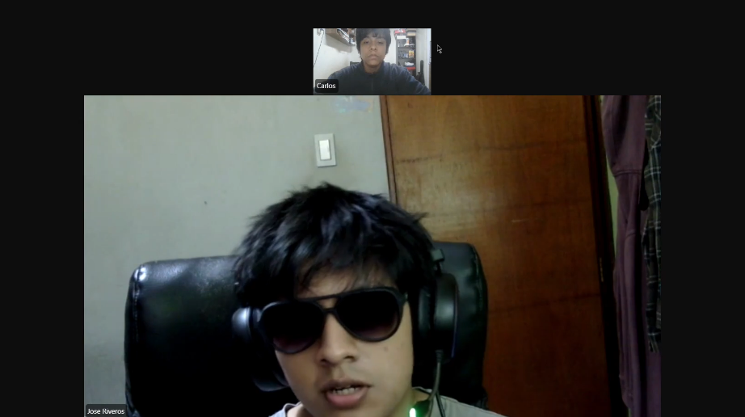
        

### Resumen de la entrevista

El entrevistado es José Rivero, un profesional de 30 años de edad, técnico ortoprotesista que se desempeña como encargado de taller en un centro ortopédico ubicado en la ciudad de Lima. En sus funciones operativas, lidera la fabricación, adaptación y ajuste de prótesis tanto para miembros superiores como inferiores, gestionando un volumen mensual de cuatro a seis dispositivos nuevos, además de atender de forma continua servicios de alineación, modificación de encajes o sockets y tareas de mantenimiento técnico. Respecto al protocolo de seguimiento postentrega, el centro programa revisiones técnicas a los quince días, al mes y a los seis meses; no obstante, la coordinación de este calendario se realiza de forma manual y fragmentada mediante agendas físicas y la aplicación de mensajería instantánea WhatsApp, supeditando casi siempre la revisión a que el propio paciente experimente molestias físicas y decida comunicarse de manera reactiva. Para llevar la trazabilidad de los componentes ortopédicos, el taller utiliza un método administrativo híbrido y básico que combina fichas en papel con hojas de cálculo de Microsoft Excel, donde registran números de serie y fechas de entrega, pero reconociendo la severa limitación técnica de que estos soportes no permiten monitorear el desgaste progresivo, la vida útil residual ni el uso mecánico real que experimenta cada pieza en la cotidianidad. La mayor dificultad técnica que enfrenta radica en la carencia total de mediciones objetivas de actividad, debiendo confiar ciegamente en el testimonio verbal del usuario durante la consulta, sin conocer con exactitud el volumen de pasos diarios que realiza, la tipología de los terrenos por los que transita ni las sobrecargas mecánicas a las que somete el dispositivo ortopédico en su rutina diaria.

A nivel de canales de interacción, marcas y comunicación interprofesional, el flujo de intercambio técnico con los médicos y fisioterapeutas a cargo de la rehabilitación física es sumamente informal y desarticulado, sustentándose en llamadas telefónicas, mensajes de WhatsApp o mensajes verbales informales que el propio paciente transmite entre la clínica de rehabilitación y el taller ortopédico. En cuanto a sus antecedentes tecnológicos y manejo de software, el entrevistado reporta haber utilizado únicamente aplicaciones móviles propietarias de marcas específicas—mencionando expresamente a Ottobock para la configuración y calibración de rodillas inteligentes vía Bluetooth—, valorando su utilidad técnica inicial pero criticando fuertemente su arquitectura cerrada, ya que resultan incompatibles con dispositivos mecánicos convencionales y carecen de un enfoque multimarca para la gestión integral del taller. Desde el plano subjetivo, profesional y de visión de negocio, José muestra un perfil técnico joven, pragmático, analítico y enfocado en la modernización de los procesos de servicio técnico, señalando que la disponibilidad de un portal con telemetría en tiempo real sobre las horas de uso y la actividad física del paciente representaría un avance de alto impacto para migrar de un modelo de taller reactivo—que se limita a reparar roturas ya consumadas—hacia un esquema de mantenimiento preventivo basado en el esfuerzo mecánico acumulado. Asimismo, destaca que la recepción de alertas tempranas sobre necesidad de calibración o sustitución de componentes evitaría accidentes y roturas imprevistas que pongan en riesgo la integridad física del usuario, permitiendo programar recambios con anticipación y fidelizar a los clientes mediante un servicio postventa profesionalizado. En cuanto a la viabilidad económica y comercial, afirma que el centro ortopédico estaría dispuesto a pagar una licencia de software siempre que esta mantenga un precio razonable, accesible a la realidad del mercado local peruano y justificado por el ahorro operativo de tiempo y la optimización del servicio postventa.

En el ámbito de las especificaciones funcionales y el entorno de hardware, considera estrictamente indispensables herramientas que incluyan un inventario de trazabilidad de componentes vinculado al número de serie, métricas objetivas de conteo de pasos diarios y horas efectivas de marcha, un motor de alertas automatizadas de mantenimiento preventivo y un canal de comunicación directo y estructurado con los fisioterapeutas tratantes. Finalmente, respecto a las plataformas y dispositivos para interactuar con el sistema, exige un esquema operativo mixto: computadoras de escritorio o laptops dentro del taller para la administración profunda, control técnico y emisión formal de reportes, complementadas con acceso ágil desde teléfonos inteligentes (smartphones) para realizar consultas rápidas de datos mientras se ejecutan pruebas dinámicas de marcha en el taller. Esta información recolectada aporta evidencia empírica directa para fundamentar el arquetipo de técnico ortoprotesista y encargado de taller como un usuario joven, operativo y metódico, que busca erradicar la informalidad de la comunicación clínica y la gestión manual mediante telemetría objetiva multimarca, exigiendo una plataforma accesible tanto en entornos web de escritorio como en interfaces móviles de rápida consulta.

### 2.2.3. Análisis de entrevistas.

#### Segmento objetivo 1: Pacientes amputados

A partir de las entrevistas realizadas a Enrique Diaz, Juan Ramirez y Miguel Suarez, se identifican los siguientes patrones comunes:

**Características Objetivas (Demografía, Salud y Entorno Tecnológico)**

* **Demografía y Estado Civil:** El 100% (3/3) son de género masculino, solteros y residen en Lima Metropolitana (Lince, San Miguel y San Martín de Porres). Las edades oscilan entre los 26 y 30 años, con una media de 28.7 años.

* **Ocupación y Modalidad Laboral:** El 100% (3/3) labora de manera remota desde casa (66.7% en áreas administrativas y 33.3% como desarrollador de software). Asimismo, el 66.7% (2/3) convive con familiares directos con quienes comparte tareas y el 33.3% vive de forma independiente.

* **Condición Médica y Tipo de Prótesis:** El 100% (3/3) presenta amputación en miembros inferiores y utiliza prótesis mecánicas (el 66.7% transtibial y el 33.3% transfemoral), con una antigüedad de uso entre 2 y 3 años.

* **Frecuencia de Terapias Presenciales:** El 100% (3/3) ha espaciado sus visitas presenciales por barreras de costo y tiempo de transporte público: el 33.3% asiste una vez por semana, el 33.3% cada 15 días y el 33.3% una vez al mes para control.

* **Dispositivos y Canales de Comunicación:** El 100% (3/3) utiliza WhatsApp (mensajes de texto y notas de voz) como canal prioritario para contactar a su clínica/terapeuta. En cuanto a hardware para una solución de salud, el 66.7% (2/3) prefiere interactuar exclusivamente desde un smartphone (Android) por portabilidad durante el ejercicio, mientras que el 33.3% (1/3) prefiere la computadora de escritorio/laptop por su oficio en tecnología.

**Características Subjetivas (Comportamiento, Dolores y Percepciones)**

* **Molestias Biomecánicas:** El 100% (3/3) experimenta fatiga muscular, sobrecarga y dolor en la espalda baja (zona lumbar) debido a la compensación asimétrica del peso corporal al caminar sin supervisión. Adicionalmente, el 66.7% (2/3) sufre dolor o presión en el muñón e irritación de la piel por fricción con el encaje.

* **Incertidumbre y Falta de Supervisión Postural:** El 100% (3/3) reconoce inseguridad al no saber si ejecuta bien los ejercicios en casa. El 66.7% recurrió a grabarse en video con el celular y el 66.7% a espejos de cuerpo entero, pero todos señalan que estos métodos no les dan certeza biomecánica sobre desvíos a la izquierda/derecha.

* **Adherencia a Rutinas en el Hogar:** Solo el 33.3% (1/3) mantiene constancia casi diaria; el 66.7% (2/3) admite realizar sus ejercicios de forma interdiaria o de 3 a 4 veces por semana a causa del cansancio laboral o desmotivación.

* **Percepción de la Solución y Requerimientos Clave:** El 100% (3/3) considera de alto valor un sistema con alertas de postura en tiempo real y gráficos de progreso para evitar vicios de marcha.

* **Factores de Rechazo y Abandono:** El 100% (3/3) abandonaría la plataforma ante alertas excesivas o falsos positivos. El 66.7% (2/3) señala el alto consumo de datos móviles y batería del celular como motivo crítico de deserción, y el 66.7% rechaza cuestionarios largos diarios o calibraciones lentas del sistema. Asimismo, el 33.3% teme a la invasión de su privacidad y a la ansiedad de sentirse vigilado.

#### Segmento objetivo 2: Profesionales de Terapia Física y Rehabilitación

A partir de las entrevistas realizadas a Diego Salazar, Ana Mercedes y Carmen Salazar, se identifican los siguientes patrones comunes:

**Características Objetivas (Perfil Profesional, Centro y Procesos)**

* **Perfil Demográfico y Especialidad:** El 100% (3/3) cuenta con titulación médica o licenciatura en Medicina Física / Terapia Física y Rehabilitación en Lima (Jesús María y Magdalena). La experiencia profesional abarca desde 5 hasta más de 40 años (promedio de 18.3 años en el sector).

* **Volumen de Pacientes Amputados:** En los centros de los entrevistados, el volumen de atención oscila entre 15 y 20 pacientes amputados activos de manera periódica por institución (100%).

* **Canales de Seguimiento Ambulatorio:** El 100% (3/3) depende exclusivamente de canales informales (WhatsApp, llamadas y notas) y de lo que el paciente relata verbalmente al volver a consulta para saber qué hace en casa. Ninguno cuenta con herramientas digitales que capturen métricas biomecánicas remotas (0% de penetración de telemetría ambulatoria).

* **Comunicación Interinstitucional con Ortopedias:** El 100% (3/3) mantiene una comunicación fragmentada con los centros ortopédicos mediante WhatsApp, informes escritos y llamadas telefónicas, sin bases de datos unificadas ni expedientes compartidos.

* **Entorno de Hardware Preferido:** El 100% (3/3) prioriza computadoras de escritorio o laptops para la gestión administrativa del historial clínico en pantalla grande, pero el 66.7% (2/3) demanda complementariamente compatibilidad con tabletas táctiles para llevar el control en sala durante la evaluación física directa del paciente.

**Características Subjetivas (Riesgos Clínicos, Criterio y Funcionalidades)**

* **Riesgos Clínicos Percibidos por Falta de Monitoreo:** El 100% (3/3) identifica como riesgo crítico el desarrollo inadvertido de compensaciones musculares lesivas, dolor lumbar crónico y la disminución progresiva del uso de la prótesis o abandono de la terapia física por desmotivación.

* **Valor de un Dashboard Centralizado con Alertas:** El 100% (3/3) valora positivamente un panel de control con métricas en tiempo real. El 100% enfatiza la necesidad de un sistema de alertas automáticas tempranas para priorizar a pacientes en riesgo. El 33.3% sugiere específicamente una interfaz con semaforización (verde, amarillo y rojo) para triaje rápido.

* **Módulos Indispensables Requeridos:** El 100% (3/3) exige seguimiento del patrón de marcha/alineación, medición del tiempo/horas de uso real de la prótesis, cumplimiento del plan de ejercicios y capacidad de exportar reportes clínicos para integrarlos al expediente médico.

* **Disposición Comercial y Barreras Operativas:** El 100% (3/3) ve viable la adquisición de una suscripción institucional anual, sujeta a demostración clínica de efectividad. Por otro lado, el 100% (3/3) define como barrera de rechazo definitiva cualquier plataforma que implique digitación manual excesiva, sobrecarga burocrática, lentitud operativa o interfaces saturadas.

#### Segmento objetivo 3: Técnicos Ortoprotesistas

A partir de las entrevistas realizadas a Miguel Sanchez, Juan Carlos Salcedo y Jose Riveros Veliz, se identifican los siguientes patrones comunes:

**Características Objetivas (Especialidad, Capacidad de Taller y Gestión)**

* **Perfil Técnico y Demografía:** El 100% (3/3) son protesistas-ortesistas de género masculino con centros operativos en Lima Metropolitana, cuyas edades se ubican entre los 30 y 57 años (promedio de 44.7 años).

* **Capacidad Productiva del Taller:** El 100% (3/3) fabrica, ajusta y adapta prótesis de extremidades inferiores y superiores. El volumen mensual varía entre 4 y 15 dispositivos nuevos al mes, sumado a labores constantes de alineación, rectificación de encajes (sockets) y mantenimiento.

* **Frecuencia de Mantenimiento:** El 100% (3/3) fija esquemas preventivos de control postentrega (a los 15 días, 1 mes, 3 meses o 6 meses), pero reconocen que el cumplimiento por parte de los usuarios es totalmente irregular y reactivo (acuden casi siempre cuando la pieza se rompe o surge dolor).

* **Trazabilidad de Componentes y Estado Actual:** El 100% (3/3) gestiona historiales técnicos mediante fichas manuales en papel o registros en Microsoft Excel (número de serie y fecha de entrega), admitiendo que desconocen por completo el desgaste mecánico acumulado y las horas de esfuerzo real de la pieza.

* **Antecedentes con Software Especializado:** El 66.7% (2/3) ha interactuado únicamente con aplicaciones cerradas de fabricantes internacionales (como Ottobock vía Bluetooth para rodillas mecatrónicas), pero destacan que son ecosistemas cerrados y carecen de software multimarca para prótesis mecánicas. El 33.3% reporta no contar con ninguna plataforma digital.

**Características Subjetivas (Visión de Negocio, Cuidado del Muñón y Hardware)**

* **Impacto Comercial y Mantenimiento Preventivo:** El 100% (3/3) afirma que un portal de telemetría transformaría el taller de un esquema netamente reactivo a un modelo postventa preventivo y planificado. Esto permitiría anticipar roturas, programar recambios de repuestos y validar garantías de piezas con base en datos reales.

* **Variabilidad Anatómica y Necesidad de Datos Objetivos:** El 100% (3/3) señala la necesidad de métricas objetivas (conteo de pasos diarios y horas activas de marcha). El 33.3% añade como factor determinante el monitoreo de variaciones volumétricas del muñón, el cual se inflama o adelgaza durante el día modificando el encaje protésico.

* **Brecha de Adopción Identificada:** El 33.3% (1/3) subraya que un porcentaje importante de usuarios son adultos mayores con diabetes, segmento que enfrenta una alta brecha digital y requiere interfaces sumamente sencillas asistidas por sus familias.

* **Disposición a Pago de Licencia:** El 66.7% (2/3) confirma explícitamente la disposición de pagar una licencia comercial de software para su taller, siempre que el precio sea razonable para el mercado local y justifique un retorno claro de inversión por fidelización y reducción de garantías improcedentes. El 33.3% restante se muestra favorable a su uso como herramienta de innovación clínica.

* **Hardware Requerido:** El 66.7% (2/3) demanda un esquema de hardware mixto: computadoras de escritorio para la administración, inventario de componentes y reportes técnicos, y laptops o dispositivos móviles/tabletas para consultas rápidas al pie de la mesa de alineación y durante pruebas dinámicas de marcha.

## 2.3. Needfinding. 

### 2.3.1. User Personas. 
En esta sección se presentan las fichas de User Personas construidas a partir de los datos recolectados del análisis de entrevistas a nuestros segmentos objetivos. Estas fichas permiten representar de forma clara y estratégica los perfiles de cada segmento objetivo, considerando sus metas, habilidades, motivaciones y dificultades. De esta manera se integra la perspectiva del usuario y tendencias del sector para identificar oportunidades en el mercado y ofrecer una solución alineada a lo que el usuario necesita.

**Segmento 1:** Carlos Mendoza: Asistente administrativo.

 **Segmento 2:** Valeria Rios: Jefa de Terapia Física y Rehabilitación.

**Segmento 3:** Miguel Torres: Ortoprotésico.

---
### 2.3.2. User Task Matrix

El User Task Matrix permite mapear y categorizar de forma estructurada las actividades y tareas esenciales que llevan a cabo los distintos perfiles de usuario para alcanzar sus metas cotidianas, operativas y clínicas. Cabe precisar que estas tareas representan actividades reales del dominio del problema y son ejecutadas por los segmentos de manera agnóstica e independiente a la existencia o adopción de una plataforma de software específica.

Para la estructuración de esta matriz se han considerado los tres User Personas representativos de los segmentos objetivo de Prothia:

* **Carlos Mendoza (Paciente Amputado):** Representa a los usuarios que atraviesan el proceso de rehabilitación y adaptación motriz en su entorno doméstico tras la colocación de su prótesis.
* **Valeria Rios (Jefa de Terapia Física y Rehabilitación):** Representa al cuerpo médico y asistencial encargado de prescribir rutinas, supervisar la evolución cinemática y evaluar la condición biomecánica de los pacientes.
* **Miguel Torres (Ortoprotésico):** Representa a los técnicos y especialistas encargados del diseño, fabricación, ensamblaje, alineación y mantenimiento preventivo/correctivo de los dispositivos protésicos.

Las escalas empleadas para clasificar las tareas en la matriz son las siguientes:

* **Frecuencia:** Muy alta (múltiples veces al día), Alta (diaria), Media (semanal / quincenal), Baja (mensual o trimestral), Rara vez (anual o por evento imprevisto).
* **Importancia:** Crítica (indispensable para la salud, integridad física o continuidad del tratamiento), Alta (esencial para el cumplimiento de objetivos), Media (relevante para la gestión y seguimiento), Baja (secundaria u opcional).

| Tarea (Task) | Carlos Mendoza (Paciente) - Frecuencia | Carlos Mendoza (Paciente) - Importancia | Valeria Rios (Terapeuta) - Frecuencia | Valeria Rios (Terapeuta) - Importancia | Miguel Torres (Ortoprotésico) - Frecuencia | Miguel Torres (Ortoprotésico) - Importancia |
| :--- | :--- | :--- | :--- | :--- | :--- | :--- |
| 1. Colocación, ajuste e inspección del encaje (socket) y muñón | Muy alta | Crítica | Baja | Alta | Baja | Alta |
| 2. Ejecución de ejercicios de fortalecimiento, equilibrio y marcha | Alta | Crítica | Rara vez | Media | Rara vez | Baja |
| 3. Monitoreo y autoobservación postural para evitar vicios y caídas | Muy alta | Crítica | Baja | Media | Rara vez | Baja |
| 4. Registro y reporte de sensaciones de dolor, fatiga o rozaduras | Alta | Alta | Media | Alta | Baja | Media |
| 5. Asistencia y participación en sesiones presenciales de terapia física | Media | Alta | Alta | Crítica | Rara vez | Baja |
| 6. Evaluación biomecánica presencial de postura, apoyo y marcha | Rara vez | Alta | Alta | Crítica | Baja | Alta |
| 7. Prescripción y ajuste de planes de ejercicio terapéutico | Rara vez | Media | Alta | Crítica | Rara vez | Baja |
| 8. Revisión y análisis de la evolución clínica del paciente | Baja | Media | Alta | Crítica | Rara vez | Media |
| 9. Documentación y actualización del historial clínico del paciente | Rara vez | Baja | Alta | Alta | Rara vez | Baja |
| 10. Fabricación, adaptación, alineación y entrega de prótesis | Rara vez | Crítica | Rara vez | Alta | Media | Crítica |
| 11. Evaluación del desgaste físico, fatiga de materiales y holguras | Baja | Media | Rara vez | Media | Media | Crítica |
| 12. Ejecución de mantenimientos preventivos y cambio de consumibles | Rara vez | Alta | Rara vez | Baja | Media | Crítica |
| 13. Calibración mecánica de articulaciones y alineación dinámica | Rara vez | Alta | Rara vez | Media | Media | Crítica |
| 14. Registro y trazabilidad de componentes y piezas entregadas | Rara vez | Baja | Rara vez | Baja | Alta | Alta |
| 15. Coordinación interinstitucional clínica–taller ortopédico | Baja | Media | Media | Alta | Media | Alta |
| 16. Traslado físico hacia los centros de atención especializada | Media | Media | Rara vez | Baja | Rara vez | Baja |

#### Análisis:
A través del **User Task Matrix**, podemos identificar las frecuencias e importancias entre los diferentes segmentos que presentamos y usar esta información como guía.

Las tareas clave con mayor frecuencia e importancia para **Carlos Mendoza** son la colocación y ajuste del socket, la ejecución diaria de ejercicios y el monitoreo de sensaciones de molestia o dolor en el muñón, lo que refleja su necesidad constante de seguridad y autonomía durante la rehabilitación en casa.

Por su parte, **Valeria Ríos** prioriza con alta frecuencia e importancia la prescripción de rutinas, la evaluación de la marcha y la detección temprana de compensaciones posturales para asegurar la efectividad del tratamiento clínico.

En contraste, **Miguel Torres** enfoca su labor en tareas de alta relevancia técnica como la alineación de piezas, la inspección de desgaste de componentes y la programación de mantenimientos preventivos.

A pesar de sus distintos roles operativos, los tres grupos coinciden en la importancia crítica de la correcta adaptación física de la prótesis y la necesidad de una comunicación técnica fluida ante desperfectos. Esto evidencia una oportunidad integral para centralizar el monitoreo de la marcha, anticipar fallas mecánicas y asegurar un seguimiento continuo y coordinado entre el hogar, la clínica y el taller ortopédico.
---

### 2.3.3. User Journey Mapping. 
En esta sección se presentan los User Journey Maps de los tres segmentos objetivo. Cada mapa refleja el recorrido actual que estos usuarios realizan para cumplir sus objetivos sin contar aún con una solución tecnológica integrada, mostrando los puntos críticos, emociones, tareas clave y oportunidades de mejora. Estos recorridos nos permiten entender los desafíos que enfrentan los usuarios día a día.

**Segmento Objetivo 1:** Carlos Mendoza: Asistente administrativo.

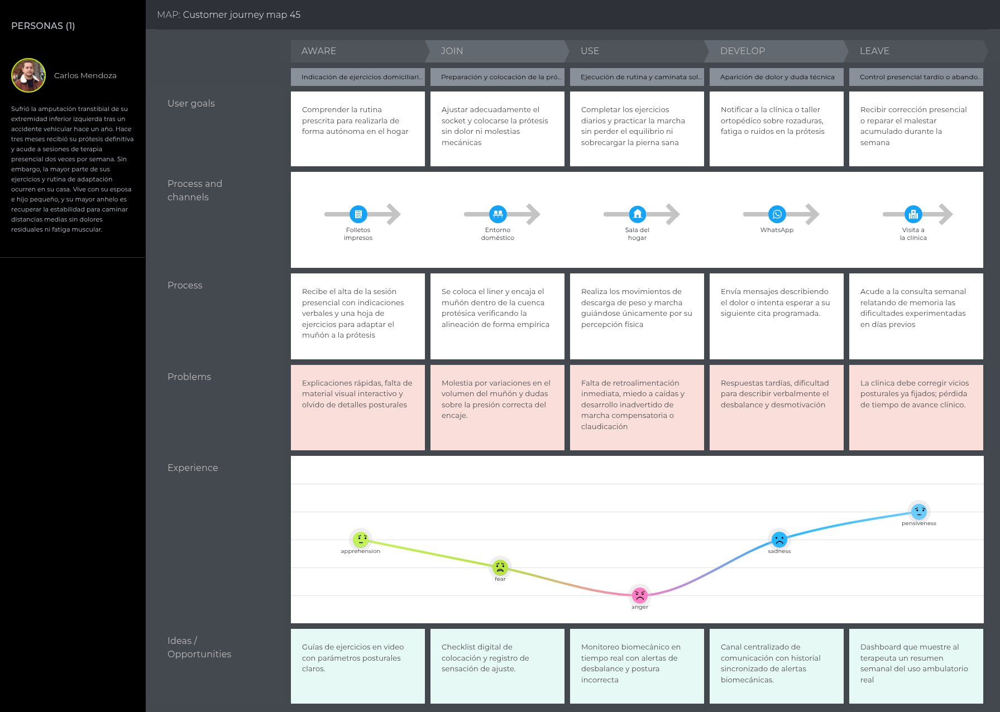

**Segmento Objetivo 2:** Valeria Rios: Jefa de Terapia Física y Rehabilitación.

**Segmento Objetivo 3:** Miguel Torres: Ortoprotésico.

---
### 2.3.4. Empathy Mapping. 
En esta sección se presentan los Empathy Maps. Estos nos ayudarán a comprender las experiencias, emociones y pensamientos que expresan los usuarios de cada segmento objetivo.

**Segmento Objetivo 1:** Carlos Mendoza: Asistente administrativo.

**Segmento Objetivo 2:** Valeria Rios: Jefa de Terapia Física y Rehabilitación.

**Segmento Objetivo 3:** Miguel Torres: Ortoprotésico.

---
## 2.4. Big Picture EventStorming

**1- Colocación de eventos del dominio**

En esta primera fase los integrantes del equipo colocaron eventos que se relacionan al dominio del negocio, denotados por tarjetas naranjas

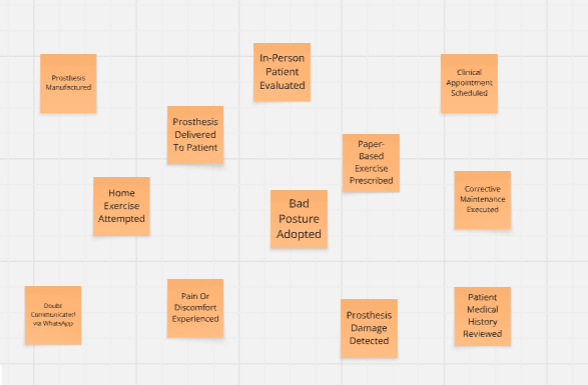

**2- Ordenamiento de los eventos**

En esta fase los integrantes del equipo ordenaron los eventos hasta formar una secuencia cronológica.

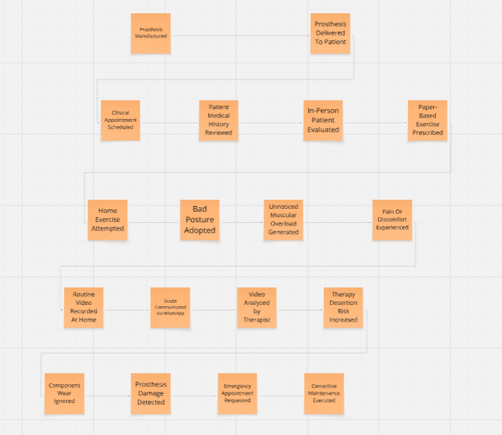

**3- Colocación de actores y sistemas externos**

En esta fase los integrantes del grupo agregaron a los eventos unas tarjetas de color amarillo que representan a los actores de algunas series de eventos y otras tarjetas azules que representan a los sistemas externos involucrados.

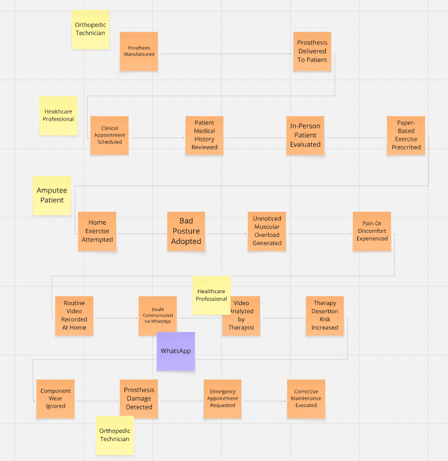

**4- Identificación de problemas en la secuencia**

En esta última fase los integrantes identificaron problemas que podrían ocurrir durante la secuencia de eventos y representaron tales problemas mediante tarjetas rosadas.

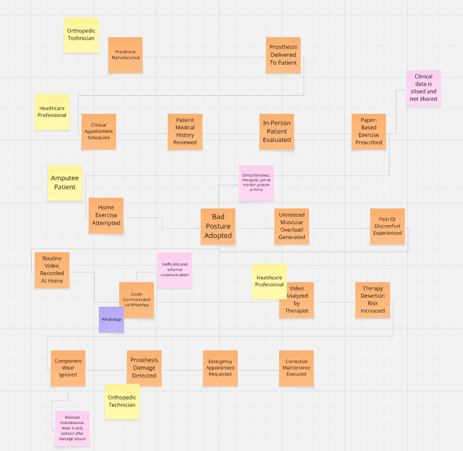

A partir de este proceso, identificamos lo siguiente:

**Procesos clave:**
* Fabricación y entrega de la prótesis al paciente.
* Evaluación clínica y prescripción de rutinas de rehabilitación.
* Ejecución de ejercicios en el hogar y comunicación de dudas.
* Detección de daños estructurales y ejecución de mantenimiento correctivo.

**Problemas:**
* Existe una "ceguera clínica" debido a la imposibilidad de supervisar la postura del paciente durante los ejercicios domiciliarios.
* La comunicación de dolores o dudas se realiza por canales informales (WhatsApp), lo que dificulta un seguimiento médico estructurado.
* El mantenimiento actual es puramente reactivo, ya que el desgaste de los componentes se ignora hasta que ocurre un daño físico en la prótesis.
* Los datos clínicos y técnicos se encuentran aislados entre las clínicas de rehabilitación y los centros ortopédicos.

**Oportunidades:**
* Integrar sensores biomecánicos para capturar datos telemétricos en tiempo real durante la rutina domiciliaria.
* Generar alertas clínicas tempranas cuando el sistema detecte patrones de marcha anormales o vicios posturales.
* Digitalizar y unificar el historial de uso de la prótesis para permitir a los centros ortopédicos programar mantenimientos preventivos.
* Crear un ecosistema interoperable que conecte a pacientes, clínicas y técnicos ortopédicos en un solo flujo de información.

https://miro.com/app/board/uXjVGbuSqec=/?share_link_id=610103626578

---
## 2.5. Ubiquitous Language

El Ubiquitous Language reúne los términos principales del dominio de Prothia para que el equipo utilice un mismo significado durante el análisis, diseño e implementación. Los términos se mantienen en inglés y sus definiciones se presentan en español.

| Término | Definición |
|---|---|
| **Amputee Patient** | Persona que ha sufrido una amputación, utiliza una prótesis y participa en un proceso de adaptación y rehabilitación. |
| **Rehabilitation Clinic** | Institución o equipo profesional responsable de evaluar, planificar y realizar seguimiento al proceso de rehabilitación del paciente. |
| **Orthopedic Center** | Establecimiento especializado en la fabricación, adaptación, revisión y mantenimiento de prótesis. |
| **Prosthesis** | Dispositivo utilizado por el paciente para sustituir total o parcialmente una extremidad y apoyar su movilidad. |
| **Rehabilitation Plan** | Conjunto de objetivos y actividades definidas para acompañar la recuperación y adaptación del paciente. |
| **Exercise Plan** | Conjunto de ejercicios asignados a un paciente, incluyendo frecuencia y repeticiones esperadas. |
| **Exercise Completion** | Registro que indica que un paciente realizó un ejercicio perteneciente a su plan vigente. |
| **Adherence** | Nivel de cumplimiento del paciente respecto de los ejercicios y actividades indicadas en su plan de rehabilitación. |
| **Biomechanical Data** | Información obtenida durante el movimiento o uso de la prótesis y utilizada para analizar el desempeño del paciente. |
| **Biomechanical Session** | Periodo de actividad durante el cual se recopilan y procesan datos biomecánicos relacionados con un paciente. |
| **Posture Assessment** | Evaluación del movimiento o postura del paciente a partir de datos biomecánicos y parámetros establecidos. |
| **Biomechanical History** | Conjunto cronológico de registros biomecánicos asociados a un paciente. |
| **Rehabilitation Progress** | Evolución del paciente a partir del cumplimiento de ejercicios y la información registrada durante su rehabilitación. |
| **Clinical Alert** | Aviso generado cuando se identifica una condición biomecánica que requiere la revisión de un profesional de la clínica. |
| **Alert Threshold** | Valor o rango configurado para determinar cuándo un indicador biomecánico debe generar una alerta. |
| **Technical History** | Registro de intervenciones, revisiones y observaciones realizadas sobre una prótesis. |
| **Maintenance** | Actividad de revisión, ajuste o intervención realizada para conservar el funcionamiento adecuado de una prótesis. |
| **Preventive Maintenance** | Mantenimiento programado antes de la aparición de una falla, según fecha o condiciones de uso. |
| **Maintenance Alert** | Aviso dirigido al centro ortopédico cuando una prótesis alcanza una condición que requiere revisión o mantenimiento. |
| **Patient Information Sharing** | Acción mediante la cual la clínica habilita información relevante del paciente al centro ortopédico responsable de su prótesis. |
| **Biomechanical Monitoring** | Seguimiento de información biomecánica generada durante el uso de la prótesis y las actividades de rehabilitación. |
| **Prosthesis Usage** | Información relacionada con el uso acumulado y condiciones de utilización de una prótesis. |

