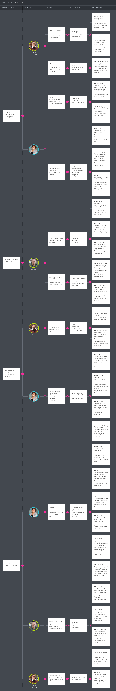

# Capítulo III: Requirements Specification

## 3.1. User Stories.

Las historias de usuario para este proyecto se crearon en colaboración con el equipo de desarrollo, enfocándose en las necesidades principales de tres tipos de usuarios: paciente amputado, la clínica de rehabilitación y el centro ortopédico

Para mantener la organización, las historias se agruparon en épicas según sus funcionalidades. Los criterios de aceptación de cada historia se definieron utilizando la sintaxis Gherkin, asegurando que el equipo comprendiera el problema desde la perspectiva del usuario final.

<table>
  <thead>
    <tr>
      <th>Epic / Story ID</th>
      <th>Título</th>
      <th>Descripción</th>
      <th>Criterios de Aceptación</th>
      <th>Relacionado con (Epic ID)</th>
    </tr>
  </thead>
  <tbody>
    <!-- EP-01 -->
    <tr>
      <td><b>EP-01</b></td>
      <td><b>Gestión de Cuentas de Usuario</b></td>
      <td>Esta épica se centra en todo lo necesario para que los pacientes, profesionales de clínicas y técnicos de centros ortopédicos puedan crear, acceder y administrar sus cuentas de forma segura en la plataforma, con acceso diferenciado según su rol.</td>
      <td></td>
      <td></td>
    </tr>
    <tr>
      <td>US-01</td>
      <td>Registro de paciente amputado</td>
      <td>Como paciente amputado, quiero registrarme en la plataforma para poder acceder a mi seguimiento de rehabilitación.</td>
      <td>
        <b>Escenario 1: Registro exitoso</b> 
        Dado que el paciente ingresa todos los datos obligatorios de registro correctamente, 
        Cuando envía el formulario de registro, 
        Entonces su cuenta es creada y queda asociada al rol de paciente.  
        <b>Escenario 2: Registro con correo ya utilizado</b> 
        Dado que el paciente intenta registrarse con un correo electrónico ya registrado en el sistema, 
        Cuando envía el formulario de registro, 
        Entonces el sistema muestra un mensaje indicando que el correo ya existe y no crea la cuenta.
      </td>
      <td>EP-01</td>
    </tr>
    <tr>
      <td>US-02</td>
      <td>Inicio de sesión con acceso diferenciado por rol</td>
      <td>Como usuario registrado, quiero iniciar sesión en la plataforma para acceder a las funcionalidades correspondientes a mi rol (paciente, profesional de clínica o técnico ortopédico).</td>
      <td>
        <b>Escenario 1: Inicio de sesión exitoso</b> 
        Dado que el usuario ingresa credenciales válidas, 
        Cuando envía el formulario de inicio de sesión, 
        Entonces el sistema le concede acceso a las funcionalidades correspondientes a su rol.  
        <b>Escenario 2: Inicio de sesión con credenciales inválidas</b> 
        Dado que el usuario ingresa una contraseña incorrecta, 
        Cuando envía el formulario de inicio de sesión, 
        Entonces el sistema deniega el acceso y muestra un mensaje de error.
      </td>
      <td>EP-01</td>
    </tr>
    <tr>
      <td>US-03</td>
      <td>Recuperación de contraseña</td>
      <td>Como usuario registrado, quiero recuperar mi contraseña para volver a acceder a mi cuenta en caso de olvido.</td>
      <td>
        <b>Escenario 1: Solicitud de recuperación válida</b> 
        Dado que el usuario ingresa un correo electrónico registrado en el sistema, 
        Cuando solicita la recuperación de contraseña, 
        Entonces el sistema envía un enlace de restablecimiento al correo indicado.  
        <b>Escenario 2: Solicitud con correo no registrado</b> 
        Dado que el usuario ingresa un correo electrónico que no está registrado, 
        Cuando solicita la recuperación de contraseña, 
        Entonces el sistema muestra un mensaje indicando que el correo no existe.
      </td>
      <td>EP-01</td>
    </tr>
    <!-- EP-02 -->
    <tr>
      <td><b>EP-02</b></td>
      <td><b>Gestión de Pacientes y Prótesis</b></td>
      <td>Esta épica abarca el registro y la administración de la información de los pacientes amputados y de las prótesis que utilizan, permitiendo vincular cada dispositivo con su respectivo paciente y centro ortopédico.</td>
      <td></td>
      <td></td>
    </tr>
    <tr>
      <td>US-04</td>
      <td>Registro de datos del paciente en la clínica</td>
      <td>Como profesional de clínica, quiero registrar los datos clínicos de un paciente amputado para llevar un control de su proceso de rehabilitación.</td>
      <td>
        <b>Escenario 1: Registro exitoso de paciente</b> 
        Dado que el profesional ingresa los datos obligatorios del paciente, 
        Cuando confirma el registro, 
        Entonces el paciente queda asociado a la clínica.  
        <b>Escenario 2: Registro con datos incompletos</b> 
        Dado que el profesional omite un dato obligatorio del paciente, 
        Cuando intenta confirmar el registro, 
        Entonces el sistema muestra un mensaje indicando que faltan datos y no guarda el registro.
      </td>
      <td>EP-02</td>
    </tr>
    <tr>
      <td>US-05</td>
      <td>Asociación de prótesis a un paciente</td>
      <td>Como técnico ortopédico, quiero asociar una prótesis a un paciente para llevar el registro de qué dispositivo utiliza.</td>
      <td>
        <b>Escenario 1: Asociación exitosa</b> 
        Dado que el técnico selecciona un paciente y una prótesis disponible, 
        Cuando confirma la asociación, 
        Entonces la prótesis queda vinculada al paciente.  
        <b>Escenario 2: Prótesis ya asociada a otro paciente</b> 
        Dado que la prótesis seleccionada ya está asociada a otro paciente,
        Cuando el técnico intenta confirmar la asociación, 
        Entonces el sistema muestra un mensaje indicando que la prótesis no está disponible.
      </td>
      <td>EP-02</td>
    </tr>
    <tr>
      <td>US-06</td>
      <td>Consulta de ficha del paciente</td>
      <td>Como profesional de clínica, quiero consultar la ficha de un paciente para conocer su historial clínico y de prótesis.</td>
      <td>
        <b>Escenario 1: Consulta exitosa</b> 
        Dado que el profesional selecciona un paciente registrado en su clínica, 
        Cuando accede a la ficha del paciente, 
        Entonces el sistema muestra la información clínica y de prótesis asociada.  
        <b>Regla de negocio:</b> Solo los profesionales autorizados de la clínica a la que pertenece el paciente pueden consultar su ficha.
      </td>
      <td>EP-02</td>
    </tr>
    <!-- EP-03 -->
    <tr>
      <td><b>EP-03</b></td>
      <td><b>Monitoreo Biomecánico en Tiempo Real</b></td>
      <td>Esta épica comprende la recopilación, el procesamiento y la visualización de los datos biomecánicos generados por el uso de la prótesis, permitiendo a los profesionales de la clínica observar el desempeño del paciente fuera de las sesiones presenciales.</td>
      <td></td>
      <td></td>
    </tr>
    <tr>
      <td>US-07</td>
      <td>Visualización del dashboard biomecánico</td>
      <td>Como profesional de clínica, quiero visualizar un dashboard con los datos biomecánicos recientes de un paciente para evaluar su desempeño.</td>
      <td>
        <b>Escenario 1: Datos disponibles</b> 
        Dado que el paciente cuenta con datos biomecánicos registrados, 
        Cuando el profesional accede al dashboard del paciente, 
        Entonces el sistema muestra los datos biomecánicos más recientes.  
        <b>Escenario 2: Sin datos registrados</b> 
        Dado que el paciente no cuenta con datos biomecánicos registrados, 
        Cuando el profesional accede al dashboard del paciente, 
        Entonces el sistema muestra un mensaje indicando que no hay información disponible.
      </td>
      <td>EP-03</td>
    </tr>
    <tr>
      <td>US-08</td>
      <td>Consulta del historial de datos biomecánicos</td>
      <td>Como paciente, quiero consultar el historial de mis datos biomecánicos para conocer la evolución de mi desempeño.</td>
      <td>
        <b>Escenario 1: Historial disponible</b> 
        Dado que el paciente cuenta con registros biomecánicos previos, 
        Cuando accede a su historial, 
        Entonces el sistema muestra los registros ordenados cronológicamente.  
        <b>Escenario 2: Filtro por rango de fechas</b> 
        Dado que el paciente selecciona un rango de fechas específico, 
        Cuando solicita el historial filtrado, 
        Entonces el sistema muestra únicamente los registros comprendidos en ese rango.
      </td>
      <td>EP-03</td>
    </tr>
    <tr>
      <td>US-09</td>
      <td>Identificación de postura o movimiento inadecuado</td>
      <td>Como paciente, quiero recibir información sobre si mi postura o movimiento fue adecuado durante el uso de la prótesis para corregir mi desempeño.</td>
      <td>
        <b>Escenario 1: Postura inadecuada detectada</b> 
        Dado que el sistema procesa los datos biomecánicos de una sesión, 
        Cuando identifica un patrón fuera de los parámetros establecidos, 
        Entonces registra el evento como postura inadecuada.  
        <b>Escenario 2: Postura dentro de parámetros normales</b> 
        Dado que el sistema procesa los datos biomecánicos de una sesión, 
        Cuando los valores se encuentran dentro de los parámetros establecidos, 
        Entonces registra el evento como postura adecuada.
      </td>
      <td>EP-03</td>
    </tr>
    <!-- EP-04 -->
    <tr>
      <td><b>EP-04</b></td>
      <td><b>Seguimiento de Rehabilitación y Ejercicios</b></td>
      <td>Esta épica cubre la asignación, el registro y el seguimiento de los planes de ejercicios de rehabilitación indicados a los pacientes, así como el monitoreo de su adherencia y progreso.</td>
      <td></td>
      <td></td>
    </tr>
    <tr>
      <td>US-10</td>
      <td>Asignación de plan de ejercicios</td>
      <td>Como profesional de clínica, quiero asignar un plan de ejercicios personalizado a un paciente para guiar su rehabilitación en casa.</td>
      <td>
        <b>Escenario 1: Asignación exitosa</b> 
        Dado que el profesional define los ejercicios y la frecuencia del plan, 
        Cuando confirma la asignación, 
        Entonces el plan queda vinculado al paciente.  
        <b>Escenario 2: Plan sin ejercicios definidos</b> 
        Dado que el profesional intenta asignar un plan sin ningún ejercicio definido, 
        Cuando confirma la asignación, 
        Entonces el sistema muestra un mensaje indicando que debe incluir al menos un ejercicio.
      </td>
      <td>EP-04</td>
    </tr>
    <tr>
      <td>US-11</td>
      <td>Registro de cumplimiento de ejercicios</td>
      <td>Como paciente, quiero registrar la realización de los ejercicios indicados para llevar constancia de mi adherencia al plan de rehabilitación.</td>
      <td>
        <b>Escenario 1: Registro exitoso</b> 
        Dado que el paciente completa un ejercicio de su plan asignado, 
        Cuando registra su cumplimiento, 
        Entonces el sistema actualiza el estado del ejercicio como realizado.  
        <b>Escenario 2: Registro fuera del plan vigente</b> 
        Dado que el paciente intenta registrar un ejercicio que no pertenece a su plan vigente, 
        Cuando intenta guardar el registro, 
        Entonces el sistema muestra un mensaje indicando que el ejercicio no corresponde a su plan actual.
      </td>
      <td>EP-04</td>
    </tr>
    <tr>
      <td>US-12</td>
      <td>Consulta del progreso de rehabilitación</td>
      <td>Como profesional de clínica, quiero consultar el progreso de rehabilitación de mis pacientes para evaluar la efectividad del tratamiento.</td>
      <td>
        <b>Escenario 1: Progreso disponible</b> 
        Dado que el paciente cuenta con registros de cumplimiento de ejercicios, 
        Cuando el profesional consulta su progreso, 
        Entonces el sistema muestra el porcentaje de adherencia y la evolución del paciente.  
        <b>Escenario 2: Paciente sin registros</b> 
        Dado que el paciente no cuenta con registros de cumplimiento, 
        Cuando el profesional consulta su progreso, 
        Entonces el sistema muestra un mensaje indicando que no hay información de progreso disponible.
      </td>
      <td>EP-04</td>
    </tr>
    <!-- EP-05 -->
    <tr>
      <td><b>EP-05</b></td>
      <td><b>Sistema de Alertas y Notificaciones</b></td>
      <td>Esta épica se centra en la generación y gestión de alertas automáticas relacionadas con posturas incorrectas, patrones de uso inadecuados o eventos críticos detectados durante la rehabilitación del paciente.</td>
      <td></td>
      <td></td>
    </tr>
    <tr>
      <td>US-13</td>
      <td>Recepción de alerta por postura incorrecta</td>
      <td>Como profesional de clínica, quiero recibir una alerta cuando se detecte una postura incorrecta en un paciente para intervenir oportunamente.</td>
      <td>
        <b>Escenario 1: Alerta generada</b> 
        Dado que el sistema detecta una postura inadecuada durante una sesión, 
        Cuando se genera el evento crítico, 
        Entonces se envía una alerta al profesional responsable del paciente.  
        <b>Escenario 2: Postura dentro de parámetros normales</b> 
        Dado que el sistema detecta que la postura se encuentra dentro de los parámetros normales, 
        Cuando finaliza el procesamiento de la sesión, 
        Entonces no se genera ninguna alerta.
      </td>
      <td>EP-05</td>
    </tr>
    <tr>
      <td>US-14</td>
      <td>Configuración de umbrales de alerta</td>
      <td>Como profesional de clínica, quiero configurar los umbrales que determinan cuándo se genera una alerta para adaptar el sistema a las necesidades de cada paciente.</td>
      <td>
        <b>Escenario 1: Configuración exitosa</b> 
        Dado que el profesional define un nuevo umbral para un indicador biomecánico, 
        Cuando guarda la configuración, 
        Entonces el sistema aplica el nuevo umbral a las siguientes evaluaciones del paciente.  
        <b>Regla de negocio:</b> Los umbrales configurados solo pueden ser modificados por profesionales autorizados de la clínica del paciente.
      </td>
      <td>EP-05</td>
    </tr>
    <tr>
      <td>US-15</td>
      <td>Consulta del historial de alertas</td>
      <td>Como profesional de clínica, quiero consultar el historial de alertas generadas para un paciente para revisar los eventos críticos registrados.</td>
      <td>
        <b>Escenario 1: Historial disponible</b> 
        Dado que el paciente cuenta con alertas registradas, 
        Cuando el profesional consulta el historial de alertas, 
        Entonces el sistema muestra las alertas ordenadas por fecha.  
        <b>Escenario 2: Sin alertas registradas</b> 
        Dado que el paciente no cuenta con alertas registradas, 
        Cuando el profesional consulta el historial de alertas, 
        Entonces el sistema muestra un mensaje indicando que no existen alertas.
      </td>
      <td>EP-05</td>
    </tr>
    <!-- EP-06 -->
    <tr>
      <td><b>EP-06</b></td>
      <td><b>Gestión de Mantenimiento de Prótesis</b></td>
      <td>Esta épica comprende el registro del historial técnico de las prótesis y la programación del mantenimiento preventivo y correctivo por parte de los centros ortopédicos.</td>
      <td></td>
      <td></td>
    </tr>
    <tr>
      <td>US-16</td>
      <td>Registro de historial técnico de la prótesis</td>
      <td>Como técnico ortopédico, quiero registrar el historial técnico de una prótesis para llevar control de su estado y componentes.</td>
      <td>
        <b>Escenario 1: Registro exitoso</b> 
        Dado que el técnico ingresa los datos de una intervención técnica realizada a la prótesis, 
        Cuando guarda el registro, 
        Entonces el historial técnico de la prótesis se actualiza.  
        <b>Escenario 2: Registro con campos obligatorios vacíos</b> 
        Dado que el técnico omite un campo obligatorio del registro técnico, 
        Cuando intenta guardarlo, 
        Entonces el sistema muestra un mensaje indicando que deben completarse todos los campos obligatorios.
      </td>
      <td>EP-06</td>
    </tr>
    <tr>
      <td>US-17</td>
      <td>Programación de mantenimiento preventivo</td>
      <td>Como técnico ortopédico, quiero programar una fecha de mantenimiento preventivo para una prótesis para anticiparme a posibles fallas.</td>
      <td>
        <b>Escenario 1: Programación exitosa</b> 
        Dado que el técnico selecciona una prótesis y una fecha futura de mantenimiento, 
        Cuando confirma la programación, 
        Entonces la fecha de mantenimiento queda registrada en el sistema.  
        <b>Escenario 2: Programación con fecha pasada</b> 
        Dado que el técnico selecciona una fecha anterior a la fecha actual, 
        Cuando intenta confirmar la programación, 
        Entonces el sistema muestra un mensaje indicando que la fecha no es válida.
      </td>
      <td>EP-06</td>
    </tr>
    <tr>
      <td>US-18</td>
      <td>Recepción de alerta de mantenimiento requerido</td>
      <td>Como técnico ortopédico, quiero recibir una alerta cuando una prótesis requiera mantenimiento para gestionar oportunamente su atención.</td>
      <td>
        <b>Escenario 1: Alerta generada por uso acumulado</b> 
        Dado que el uso acumulado de una prótesis supera el umbral establecido para mantenimiento, 
        Cuando el sistema evalúa el estado del dispositivo, 
        Entonces se envía una alerta de mantenimiento al centro ortopédico responsable.  
        <b>Escenario 2: Uso dentro de parámetros normales</b> 
        Dado que el uso acumulado de la prótesis se encuentra dentro de los parámetros normales, 
        Cuando el sistema evalúa el estado del dispositivo, 
        Entonces no se genera ninguna alerta de mantenimiento.
      </td>
      <td>EP-06</td>
    </tr>
    <!-- EP-07 -->
    <tr>
      <td><b>EP-07</b></td>
      <td><b>Comunicación entre Actores</b></td>
      <td>Esta épica abarca los mecanismos que permiten el intercambio de información y mensajes entre pacientes, clínicas de rehabilitación y centros ortopédicos dentro de la plataforma.</td>
      <td></td>
      <td></td>
    </tr>
    <tr>
      <td>US-19</td>
      <td>Envío de mensajes entre paciente y clínica</td>
      <td>Como paciente, quiero enviar un mensaje a mi clínica de rehabilitación para resolver dudas sobre mi tratamiento.</td>
      <td>
        <b>Escenario 1: Envío exitoso</b> 
        Dado que el paciente redacta un mensaje dirigido a su clínica, 
        Cuando lo envía, 
        Entonces el mensaje queda disponible para el profesional responsable.  
        <b>Escenario 2: Envío sin contenido</b> 
        Dado que el paciente intenta enviar un mensaje sin contenido, 
        Cuando presiona la opción de enviar, 
        Entonces el sistema no permite el envío y muestra un mensaje indicando que el campo no puede estar vacío.
      </td>
      <td>EP-07</td>
    </tr>
    <tr>
      <td>US-20</td>
      <td>Compartir información del paciente entre clínica y centro ortopédico</td>
      <td>Como profesional de clínica, quiero compartir información relevante del paciente con el centro ortopédico correspondiente para coordinar el mantenimiento de la prótesis.</td>
      <td>
        <b>Escenario 1: Compartición exitosa</b> 
        Dado que el profesional selecciona la información del paciente que desea compartir, 
        Cuando confirma el envío al centro ortopédico, 
        Entonces el centro ortopédico recibe acceso a la información compartida.  
        <b>Regla de negocio:</b> Solo puede compartirse la información del paciente con el centro ortopédico responsable de su prótesis.
      </td>
      <td>EP-07</td>
    </tr>
    <tr>
      <td>US-21</td>
      <td>Consulta de notificaciones generales</td>
      <td>Como usuario de la plataforma, quiero consultar mis notificaciones generales para mantenerme informado sobre eventos relevantes de mi cuenta.</td>
      <td>
        <b>Escenario 1: Notificaciones disponibles</b> 
        Dado que el usuario cuenta con notificaciones pendientes, 
        Cuando accede a su bandeja de notificaciones, 
        Entonces el sistema muestra las notificaciones ordenadas por fecha.  
        <b>Escenario 2: Sin notificaciones pendientes</b> 
        Dado que el usuario no cuenta con notificaciones pendientes, 
        Cuando accede a su bandeja de notificaciones, 
        Entonces el sistema muestra un mensaje indicando que no hay notificaciones nuevas.
      </td>
      <td>EP-07</td>
    </tr>
    <!-- EP-08 -->
    <tr>
      <td><b>EP-08</b></td>
      <td><b>Suscripciones y Licenciamiento</b></td>
      <td>Esta épica cubre la gestión de los planes de suscripción anual para clínicas de rehabilitación y las licencias de software para centros ortopédicos, incluyendo su contratación, renovación y estado.</td>
      <td></td>
      <td></td>
    </tr>
    <tr>
      <td>US-22</td>
      <td>Contratación de suscripción anual</td>
      <td>Como administrador de clínica, quiero contratar una suscripción anual para que mi institución acceda a la plataforma.</td>
      <td>
        <b>Escenario 1: Contratación exitosa</b> 
        Dado que el administrador selecciona un plan de suscripción y completa el pago correspondiente, 
        Cuando confirma la contratación, 
        Entonces la clínica obtiene acceso activo a la plataforma por el periodo contratado.  
        <b>Escenario 2: Pago rechazado</b> 
        Dado que el pago del administrador es rechazado por la pasarela de pagos, 
        Cuando intenta confirmar la contratación, 
        Entonces el sistema muestra un mensaje indicando que la suscripción no pudo activarse.
      </td>
      <td>EP-08</td>
    </tr>
    <tr>
      <td>US-23</td>
      <td>Adquisición de licencia de software</td>
      <td>Como administrador de centro ortopédico, quiero adquirir una licencia de software para utilizar la plataforma en la gestión de prótesis.</td>
      <td>
        <b>Escenario 1: Adquisición exitosa</b> 
        Dado que el administrador selecciona un tipo de licencia y completa el pago correspondiente, 
        Cuando confirma la adquisición, 
        Entonces el centro ortopédico obtiene acceso activo a la plataforma.  
        <b>Escenario 2: Licencia ya vigente</b> 
        Dado que el centro ortopédico ya cuenta con una licencia vigente, 
        Cuando el administrador intenta adquirir una nueva licencia, 
        Entonces el sistema muestra un mensaje indicando que ya existe una licencia activa.
      </td>
      <td>EP-08</td>
    </tr>
    <tr>
      <td>US-24</td>
      <td>Consulta del estado de suscripción o licencia</td>
      <td>Como administrador, quiero consultar el estado de mi suscripción o licencia para conocer su vigencia y condiciones.</td>
      <td>
        <b>Escenario 1: Estado activo</b> 
        Dado que la suscripción o licencia del administrador se encuentra vigente, 
        Cuando consulta su estado, 
        Entonces el sistema muestra la fecha de vencimiento y el plan contratado.  
        <b>Escenario 2: Estado vencido</b> 
        Dado que la suscripción o licencia del administrador ha vencido, 
        Cuando consulta su estado, 
        Entonces el sistema muestra un mensaje indicando que debe renovarla para continuar con el acceso.
      </td>
      <td>EP-08</td>
    </tr>
    <!-- EP-09 -->
    <tr>
      <td><b>EP-09</b></td>
      <td><b>Landing Page y Captación de Usuarios</b></td>
      <td>Esta épica se centra en el sitio web estático informativo dirigido a visitantes, cuyo objetivo es dar a conocer la propuesta de valor de la plataforma y captar nuevos clientes potenciales.</td>
      <td></td>
      <td></td>
    </tr>
    <tr>
      <td>US-25</td>
      <td>Visualización de información de la plataforma</td>
      <td>Como visitante, quiero conocer las características y beneficios de la plataforma para evaluar si se ajusta a las necesidades de mi institución.</td>
      <td>
        <b>Escenario 1: Visualización exitosa</b> 
        Dado que el visitante ingresa a la página principal del sitio web, 
        Cuando navega por las secciones informativas, 
        Entonces el sistema muestra el contenido correspondiente a la propuesta de valor de la plataforma.  
        <b>Regla de negocio:</b> El contenido informativo debe estar disponible sin necesidad de registro o inicio de sesión.
      </td>
      <td>EP-09</td>
    </tr>
    <tr>
      <td>US-26</td>
      <td>Solicitud de demostración de la plataforma</td>
      <td>Como visitante del segmento clínicas de rehabilitación, quiero solicitar una demostración de la plataforma para conocer su funcionamiento antes de contratarla.</td>
      <td>
        <b>Escenario 1: Solicitud exitosa</b> 
        Dado que el visitante completa el formulario de solicitud de demostración con datos válidos, 
        Cuando lo envía, 
        Entonces el sistema registra la solicitud y confirma su recepción al visitante.  
        <b>Escenario 2: Solicitud con datos incompletos</b> 
        Dado que el visitante omite un campo obligatorio del formulario, 
        Cuando intenta enviarlo, 
        Entonces el sistema muestra un mensaje indicando que deben completarse los campos obligatorios.
      </td>
      <td>EP-09</td>
    </tr>
    <tr>
      <td>US-27</td>
      <td>Suscripción al boletín informativo</td>
      <td>Como visitante, quiero suscribirme al boletín informativo del sitio web para recibir novedades sobre la plataforma.</td>
      <td>
        <b>Escenario 1: Suscripción exitosa</b> 
        Dado que el visitante ingresa un correo electrónico válido en el formulario de suscripción, 
        Cuando confirma la suscripción, 
        Entonces el sistema registra el correo en la lista de boletín.  
        <b>Escenario 2: Correo ya suscrito</b> 
        Dado que el correo ingresado ya se encuentra registrado en la lista de boletín, 
        Cuando el visitante confirma la suscripción, 
        Entonces el sistema muestra un mensaje indicando que el correo ya está suscrito.
      </td>
      <td>EP-09</td>
    </tr>
    <!-- EP-10 -->
    <tr>
      <td><b>EP-10</b></td>
      <td><b>Reportes y Analítica</b></td>
      <td>Esta épica comprende la generación de reportes, indicadores agregados y exportación de información relacionada con el progreso de los pacientes y el uso de las prótesis.</td>
      <td></td>
      <td></td>
    </tr>
    <tr>
      <td>US-28</td>
      <td>Generación de reporte de progreso del paciente</td>
      <td>Como profesional de clínica, quiero generar un reporte del progreso de rehabilitación de un paciente para documentar su evolución.</td>
      <td>
        <b>Escenario 1: Generación exitosa</b> 
        Dado que el paciente cuenta con información suficiente de progreso registrada, 
        Cuando el profesional solicita la generación del reporte, 
        Entonces el sistema genera el reporte con la información correspondiente al periodo seleccionado.  
        <b>Escenario 2: Información insuficiente</b> 
        Dado que el paciente no cuenta con información suficiente para el periodo seleccionado, 
        Cuando el profesional solicita la generación del reporte, 
        Entonces el sistema muestra un mensaje indicando que no hay datos suficientes para generar el reporte.
      </td>
      <td>EP-10</td>
    </tr>
    <tr>
      <td>US-29</td>
      <td>Exportación de datos históricos del paciente</td>
      <td>Como profesional de clínica, quiero exportar los datos históricos de un paciente para compartirlos con otros profesionales o instituciones.</td>
      <td>
        <b>Escenario 1: Exportación exitosa</b> 
        Dado que el profesional selecciona un paciente y un rango de fechas con datos disponibles, 
        Cuando solicita la exportación, 
        Entonces el sistema genera un archivo descargable con la información seleccionada.  
        <b>Escenario 2: Rango sin datos disponibles</b> 
        Dado que el rango de fechas seleccionado no contiene datos registrados, 
        Cuando el profesional solicita la exportación, 
        Entonces el sistema muestra un mensaje indicando que no existen datos para exportar.
      </td>
      <td>EP-10</td>
    </tr>
    <tr>
      <td>US-30</td>
      <td>Visualización de indicadores agregados de la clínica</td>
      <td>Como administrador de clínica, quiero visualizar indicadores agregados sobre todos los pacientes atendidos para evaluar el desempeño general de la institución.</td>
      <td>
        <b>Escenario 1: Indicadores disponibles</b> 
        Dado que la clínica cuenta con pacientes con información registrada, 
        Cuando el administrador accede al panel de indicadores agregados, 
        Entonces el sistema muestra las métricas consolidadas correspondientes.  
        <b>Escenario 2: Clínica sin pacientes registrados</b> 
        Dado que la clínica no cuenta con pacientes registrados, 
        Cuando el administrador accede al panel de indicadores agregados, 
        Entonces el sistema muestra un mensaje indicando que no hay datos disponibles.
      </td>
      <td>EP-10</td>
    </tr>
    <!-- SECCION TECHNICAL STORIES -->
    <tr>
      <th>Epic / Story ID</th>
      <th>Título</th>
      <th>Descripción</th>
      <th>Criterios de Aceptación</th>
      <th>Relacionado con (Epic ID)</th>
    </tr>
    <tr>
      <td>TS-01</td>
      <td>Gestión de autenticación y cuentas vía API</td>
      <td>Como developer, busco implementar los endpoints RESTful necesarios para el registro, autenticación y recuperación de contraseña de los usuarios de la plataforma.</td>
      <td>
        <b>Escenario 1: Registro exitoso vía API</b> 
        Dado que se envía una solicitud POST al endpoint de registro con datos válidos, 
        Cuando el servidor procesa la solicitud, 
        Entonces responde con un código 201 y los datos del usuario creado.  
        <b>Escenario 2: Registro con correo duplicado vía API</b> 
        Dado que se envía una solicitud POST al endpoint de registro con un correo ya existente, 
        Cuando el servidor procesa la solicitud, 
        Entonces responde con un código 409 y un mensaje de error correspondiente.
      </td>
      <td>EP-01</td>
    </tr>
    <tr>
      <td>TS-02</td>
      <td>Gestión de pacientes y prótesis vía API</td>
      <td>Como developer, busco implementar los endpoints RESTful que permitan crear, consultar y asociar pacientes y prótesis dentro de la plataforma.</td>
      <td>
        <b>Escenario 1: Asociación exitosa de prótesis vía API</b> 
        Dado que se envía una solicitud POST al endpoint de asociación con un paciente y una prótesis disponibles, 
        Cuando el servidor procesa la solicitud, 
        Entonces responde con un código 200 y confirma la asociación realizada.  
        <b>Escenario 2: Asociación con prótesis no disponible vía API</b> 
        Dado que se envía una solicitud POST al endpoint de asociación con una prótesis ya asignada a otro paciente, 
        Cuando el servidor procesa la solicitud, 
        Entonces responde con un código 409 y un mensaje indicando que la prótesis no está disponible.
      </td>
      <td>EP-02</td>
    </tr>
    <tr>
      <td>TS-03</td>
      <td>Ingesta y consulta de datos biomecánicos vía API</td>
      <td>Como developer, busco implementar un endpoint RESTful que reciba los datos biomecánicos generados por los sensores de la prótesis y los exponga para su consulta.</td>
      <td>
        <b>Escenario 1: Recepción exitosa de datos biomecánicos</b> 
        Dado que se envía una solicitud POST con datos biomecánicos válidos de un paciente, 
        Cuando el servidor procesa la solicitud, 
        Entonces responde con un código 201 y almacena el registro correspondiente.  
        <b>Escenario 2: Recepción de datos con formato inválido</b> 
        Dado que se envía una solicitud POST con datos biomecánicos en un formato no soportado, 
        Cuando el servidor procesa la solicitud, 
        Entonces responde con un código 400 y un mensaje de error de validación.
      </td>
      <td>EP-03</td>
    </tr>
    <tr>
      <td>TS-04</td>
      <td>Gestión de planes de ejercicios vía API</td>
      <td>Como developer, busco implementar los endpoints RESTful que permitan asignar planes de ejercicios y registrar el cumplimiento por parte del paciente.</td>
      <td>
        <b>Escenario 1: Registro exitoso de cumplimiento</b> 
        Dado que se envía una solicitud PUT al endpoint de cumplimiento con un ejercicio válido del plan vigente, 
        Cuando el servidor procesa la solicitud, 
        Entonces responde con un código 200 y actualiza el estado del ejercicio.  
        <b>Escenario 2: Registro de ejercicio fuera del plan vigente</b> 
        Dado que se envía una solicitud PUT al endpoint de cumplimiento con un ejercicio que no pertenece al plan vigente del paciente, 
        Cuando el servidor procesa la solicitud, 
        Entonces responde con un código 400 y un mensaje de error correspondiente.
      </td>
      <td>EP-04</td>
    </tr>
    <tr>
      <td>TS-05</td>
      <td>Gestión de alertas críticas vía API</td>
      <td>Como developer, busco implementar un mecanismo que exponga las alertas críticas detectadas en los pacientes a través de una API RESTful, para activar notificaciones automáticas al profesional responsable.</td>
      <td>
        <b>Escenario 1: Envío de notificación al detectar alerta</b> 
        Dado que se procesa una alerta crítica generada a partir de los datos de un paciente, 
        Cuando se genera una notificación al profesional responsable, 
        Entonces se envía la alerta correspondiente.  
        <b>Escenario 2: Alerta detectada sin notificación activa</b> 
        Dado que el servicio de notificaciones se encuentra deshabilitado, 
        Cuando se genera una alerta crítica, 
        Entonces no se envía la notificación, y se registra el evento en el historial.
      </td>
      <td>EP-05</td>
    </tr>
    <tr>
      <td>TS-06</td>
      <td>Gestión de mantenimiento de prótesis vía API</td>
      <td>Como developer, busco implementar los endpoints RESTful que permitan registrar el historial técnico de las prótesis y programar su mantenimiento preventivo.</td>
      <td>
        <b>Escenario 1: Programación exitosa de mantenimiento</b> 
        Dado que se envía una solicitud POST al endpoint de mantenimiento con una fecha futura válida, 
        Cuando el servidor procesa la solicitud, 
        Entonces responde con un código 201 y registra la programación.  
        <b>Escenario 2: Programación con fecha inválida</b> 
        Dado que se envía una solicitud POST al endpoint de mantenimiento con una fecha anterior a la actual, 
        Cuando el servidor procesa la solicitud, 
        Entonces responde con un código 400 y un mensaje de error de validación.
      </td>
      <td>EP-06</td>
    </tr>
    <tr>
      <td>TS-07</td>
      <td>Mensajería entre actores vía API</td>
      <td>Como developer, busco implementar los endpoints RESTful que permitan el envío y la consulta de mensajes entre pacientes, clínicas y centros ortopédicos.</td>
      <td>
        <b>Escenario 1: Envío exitoso de mensaje</b> 
        Dado que se envía una solicitud POST al endpoint de mensajería con contenido válido y un destinatario existente, 
        Cuando el servidor procesa la solicitud, 
        Entonces responde con un código 201 y el mensaje queda disponible para el destinatario.  
        <b>Escenario 2: Envío con destinatario inexistente</b> 
        Dado que se envía una solicitud POST al endpoint de mensajería con un destinatario que no existe en el sistema, 
        Cuando el servidor procesa la solicitud, 
        Entonces responde con un código 404 y un mensaje de error correspondiente.
      </td>
      <td>EP-07</td>
    </tr>
    <tr>
      <td>TS-08</td>
      <td>Gestión de suscripciones y licencias vía API</td>
      <td>Como developer, busco implementar los endpoints RESTful que permitan contratar, consultar y renovar suscripciones de clínicas y licencias de centros ortopédicos.</td>
      <td>
        <b>Escenario 1: Activación exitosa de suscripción</b> 
        Dado que se envía una solicitud POST al endpoint de suscripciones con un pago confirmado, 
        Cuando el servidor procesa la solicitud, 
        Entonces responde con un código 201 y activa el acceso a la plataforma.  
        <b>Escenario 2: Pago rechazado en la suscripción</b> 
        Dado que se envía una solicitud POST al endpoint de suscripciones con un pago rechazado por la pasarela, 
        Cuando el servidor procesa la solicitud, 
        Entonces responde con un código 402 y un mensaje indicando que el pago no fue procesado.
      </td>
      <td>EP-08</td>
    </tr>
    <tr>
      <td>TS-09</td>
      <td>Captación de leads del landing page vía API</td>
      <td>Como developer, busco implementar los endpoints RESTful que permitan registrar las solicitudes de demostración y las suscripciones al boletín informativo desde el sitio web estático.</td>
      <td>
        <b>Escenario 1: Registro exitoso de solicitud de demo</b> 
        Dado que se envía una solicitud POST al endpoint de solicitudes de demo con datos completos y válidos, 
        Cuando el servidor procesa la solicitud, 
        Entonces responde con un código 201 y registra la solicitud.  
        <b>Escenario 2: Registro de correo duplicado en boletín</b> 
        Dado que se envía una solicitud POST al endpoint de suscripción al boletín con un correo ya registrado, 
        Cuando el servidor procesa la solicitud, 
        Entonces responde con un código 409 y un mensaje indicando que el correo ya está suscrito.
      </td>
      <td>EP-09</td>
    </tr>
    <tr>
      <td>TS-10</td>
      <td>Generación de reportes y exportación de datos vía API</td>
      <td>Como developer, busco implementar los endpoints RESTful que permitan generar reportes de progreso y exportar los datos históricos de los pacientes.</td>
      <td>
        <b>Escenario 1: Generación exitosa de reporte</b> 
        Dado que se envía una solicitud GET al endpoint de reportes con un paciente y periodo válidos, 
        Cuando el servidor procesa la solicitud, 
        Entonces responde con un código 200 y el archivo de reporte generado.  
        <b>Escenario 2: Solicitud de reporte sin datos suficientes</b> 
        Dado que se envía una solicitud GET al endpoint de reportes con un periodo sin datos registrados, 
        Cuando el servidor procesa la solicitud, 
        Entonces responde con un código 204 indicando que no hay contenido disponible para el reporte.
      </td>
      <td>EP-10</td>
    </tr>
  </tbody>
</table>

---
## 3.2. Impact Mapping.

El equipo desarrolló un Impact Mapping en colaboración utilizando la herramienta UXPressia. Este mapa se creó para conectar los objetivos de negocio directamente con los requisitos funcionales de la plataforma.

---
## 3.3. Product Backlog
Para el desarrollo de nuestra plataforma, hemos creado un Product Backlog que funciona como una lista completa de todas las funcionalidades, características e incluso tareas técnicas necesarias para avanzar en el proyecto.

Para mantener el proyecto organizado, usamos la escala de Fibonacci (1, 2, 3, 5, 8) para estimar el esfuerzo de cada tarea. Esta escala de Story Points nos ayuda a priorizar y planificar de la siguiente manera:

1: Tareas sencillas y rápidas. 2: Tareas de complejidad moderada. 3: Tareas que requieren más tiempo y esfuerzo. 5: Tareas complejas. 8: Tareas de alta complejidad que impactan varias áreas del proyecto.

| Orden | User Story Id | Título | Descripción | Story Points |
| :---: | :---: | :--- | :--- | :---: |
| 1 | US-25 | Visualización de información de la plataforma | Como visitante, quiero conocer las características y beneficios de la plataforma para evaluar si se ajusta a las necesidades de mi institución. | 2 |
| 2 | US-26 | Solicitud de demostración de la plataforma | Como visitante del segmento clínicas de rehabilitación, quiero solicitar una demostración de la plataforma para conocer su funcionamiento antes de contratarla. | 3 |
| 3 | US-27 | Suscripción al boletín informativo | Como visitante, quiero suscribirme al boletín informativo del sitio web para recibir novedades sobre la plataforma. | 1 |
| 4 | US-01 | Registro de paciente amputado | Como paciente amputado, quiero registrarme en la plataforma para poder acceder a mi seguimiento de rehabilitación. | 3 |
| 5 | US-02 | Inicio de sesión con acceso diferenciado por rol | Como usuario registrado, quiero iniciar sesión en la plataforma para acceder a las funcionalidades correspondientes a mi rol (paciente, profesional de clínica o técnico ortopédico). | 3 |
| 6 | US-04 | Registro de datos del paciente en la clínica | Como profesional de clínica, quiero registrar los datos clínicos de un paciente amputado para llevar un control de su proceso de rehabilitación. | 3 |
| 7 | US-05 | Asociación de prótesis a un paciente | Como técnico ortopédico, quiero asociar una prótesis a un paciente para llevar el registro de qué dispositivo utiliza. | 2 |
| 8 | US-07 | Visualización del dashboard biomecánico | Como profesional de clínica, quiero visualizar un dashboard con los datos biomecánicos recientes de un paciente para evaluar su desempeño. | 5 |
| 9 | US-09 | Identificación de postura o movimiento inadecuado | Como paciente, quiero recibir información sobre si mi postura o movimiento fue adecuado durante el uso de la prótesis para corregir mi desempeño. | 5 |
| 10 | US-13 | Recepción de alerta por postura incorrecta | Como profesional de clínica, quiero recibir una alerta cuando se detecte una postura incorrecta en un paciente para intervenir oportunamente. | 5 |
| 11 | US-10 | Asignación de plan de ejercicios | Como profesional de clínica, quiero asignar un plan de ejercicios personalizado a un paciente para guiar su rehabilitación en casa. | 3 |
| 12 | US-11 | Registro de cumplimiento de ejercicios | Como paciente, quiero registrar la realización de los ejercicios indicados para llevar constancia de mi adherencia al plan de rehabilitación. | 2 |
| 13 | US-12 | Consulta del progreso de rehabilitación | Como profesional de clínica, quiero consultar el progreso de rehabilitación de mis pacientes para evaluar la efectividad del tratamiento. | 3 |
| 14 | US-08 | Consulta del historial de datos biomecánicos | Como paciente, quiero consultar el historial de mis datos biomecánicos para conocer la evolución de mi desempeño. | 3 |
| 15 | US-14 | Configuración de umbrales de alerta | Como profesional de clínica, quiero configurar los umbrales que determinan cuándo se genera una alerta para adaptar el sistema a las necesidades de cada paciente. | 5 |
| 16 | US-15 | Consulta del historial de alertas | Como profesional de clínica, quiero consultar el historial de alertas generadas para un paciente para revisar los eventos críticos registrados. | 2 |
| 17 | US-18 | Recepción de alerta de mantenimiento requerido | Como técnico ortopédico, quiero recibir una alerta cuando una prótesis requiera mantenimiento para gestionar oportunamente su atención. | 5 |
| 18 | US-16 | Registro de historial técnico de la prótesis | Como técnico ortopédico, quiero registrar el historial técnico de una prótesis para llevar control de su estado y componentes. | 3 |
| 19 | US-17 | Programación de mantenimiento preventivo | Como técnico ortopédico, quiero programar una fecha de mantenimiento preventivo para una prótesis para anticiparme a posibles fallas. | 3 |
| 20 | US-06 | Consulta de ficha del paciente | Como profesional de clínica, quiero consultar la ficha de un paciente para conocer su historial clínico y de prótesis. | 2 |
| 21 | US-20 | Compartir información del paciente entre clínica y centro ortopédico | Como profesional de clínica, quiero compartir información relevante del paciente con el centro ortopédico correspondiente para coordinar el mantenimiento de la prótesis. | 5 |
| 22 | US-19 | Envío de mensajes entre paciente y clínica | Como paciente, quiero enviar un mensaje a mi clínica de rehabilitación para resolver dudas sobre mi tratamiento. | 3 |
| 23 | US-21 | Consulta de notificaciones generales | Como usuario de la plataforma, quiero consultar mis notificaciones generales para mantenerme informado sobre eventos relevantes de mi cuenta. | 2 |
| 24 | US-28 | Generación de reporte de progreso del paciente | Como profesional de clínica, quiero generar un reporte del progreso de rehabilitación de un paciente para documentar su evolución. | 5 |
| 25 | US-29 | Exportación de datos históricos del paciente | Como profesional de clínica, quiero exportar los datos históricos de un paciente para compartirlos con otros profesionales o instituciones. | 3 |
| 26 | US-30 | Visualización de indicadores agregados de la clínica | Como administrador de clínica, quiero visualizar indicadores agregados sobre todos los pacientes atendidos para evaluar el desempeño general de la institución. | 5 |
| 27 | US-22 | Contratación de suscripción anual | Como administrador de clínica, quiero contratar una suscripción anual para que mi institución acceda a la plataforma. | 8 |
| 28 | US-23 | Adquisición de licencia de software | Como administrador de centro ortopédico, quiero adquirir una licencia de software para utilizar la plataforma en la gestión de prótesis. | 8 |
| 29 | US-24 | Consulta del estado de suscripción o licencia | Como administrador, quiero consultar el estado de mi suscripción o licencia para conocer su vigencia y condiciones. | 2 |
| 30 | US-03 | Recuperación de contraseña | Como usuario registrado, quiero recuperar mi contraseña para volver a acceder a mi cuenta en caso de olvido. | 2 |
| 1 | TS-09 | Captación de leads del landing page vía API | Como developer, busco implementar los endpoints RESTful que permitan registrar las solicitudes de demostración y las suscripciones al boletín informativo desde el sitio web estático. | 2 |
| 2 | TS-01 | Gestión de autenticación y cuentas vía API | Como developer, busco implementar los endpoints RESTful necesarios para el registro, autenticación y recuperación de contraseña de los usuarios de la plataforma. | 3 |
| 3 | TS-02 | Gestión de pacientes y prótesis vía API | Como developer, busco implementar los endpoints RESTful que permitan crear, consultar y asociar pacientes y prótesis dentro de la plataforma. | 3 |
| 4 | TS-03 | Ingesta y consulta de datos biomecánicos vía API | Como developer, busco implementar un endpoint RESTful que reciba los datos biomecánicos generados por los sensores de la prótesis y los exponga para su consulta. | 5 |
| 5 | TS-05 | Gestión de alertas críticas vía API | Como developer, busco implementar un mecanismo que exponga las alertas críticas detectadas en los pacientes a través de una API RESTful, para activar notificaciones automáticas al profesional responsable. | 5 |
| 6 | TS-04 | Gestión de planes de ejercicios vía API | Como developer, busco implementar los endpoints RESTful que permitan asignar planes de ejercicios y registrar el cumplimiento por parte del paciente. | 3 |
| 7 | TS-06 | Gestión de mantenimiento de prótesis vía API | Como developer, busco implementar los endpoints RESTful que permitan registrar el historial técnico de las prótesis y programar su mantenimiento preventivo. | 3 |
| 8 | TS-07 | Mensajería entre actores vía API | Como developer, busco implementar los endpoints RESTful que permitan el envío y la consulta de mensajes entre pacientes, clínicas y centros ortopédicos. | 5 |
| 9 | TS-10 | Generación de reportes y exportación de datos vía API | Como developer, busco implementar los endpoints RESTful que permitan generar reportes de progreso y exportar los datos históricos de los pacientes. | 5 |
| 10 | TS-08 | Gestión de suscripciones y licencias vía API | Como developer, busco implementar los endpoints RESTful que permitan contratar, consultar y renovar suscripciones de clínicas y licencias de centros ortopédicos. | 8 |
---

- **Tablero de Trello:** [Seniors in Process - Prothia](https://trello.com/invite/b/6aaa2414fe1250572c17b9fe/ATTIe7f0872c34d6ae28c8540edd005e015fC1DFC2EC/seniors-in-process-prothia)
