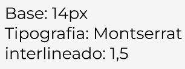
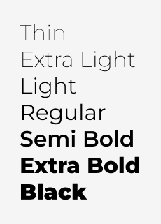
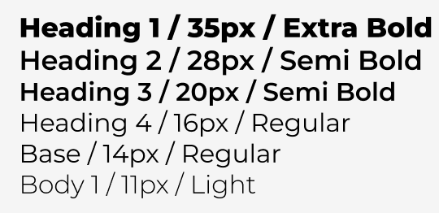

# Capítulo IV: Product Design
## 4.1. Style Guidelines
### 4.1.1. General Style Guidelines

*   **Branding:** Identidad centrada en la salud digital y la biomecánica, orientada a reducir la brecha de información entre pacientes amputados, clínicas de rehabilitación y centros ortopédicos.
*   **Typography:** La tipografía seleccionada es Montserrat para títulos y elementos destacados, por su claridad y estructura moderna. Para el cuerpo de texto se utiliza Inter a 14px con un interlineado de 1.5, garantizando una lectura fluida de los datos médicos. Los tamaños se adaptan al contexto web según la jerarquía: títulos, subtítulos y párrafos.

    *   **Escala:**
        

          
        

    *   **Weights:**
        

          
        

    *   **Nomenclatura:**
        

          
        

    *   **Example:**
        

          
        

*   **Colors:** La paleta de colores de Prothia prioriza la confianza médica, la tecnología y el progreso. El Azul Profundo transmite estabilidad y profesionalismo, usado en textos y fondos principales. El Teal (Verde Azulado) simboliza innovación y eficiencia, ideal para acentos y gráficos biomecánicos. El Verde Esmeralda incrementa la sensación de logro, siendo ideal para captar estados positivos o metas de rehabilitación cumplidas. Finalmente, el Gris Claro aporta orden y limpieza, usado en fondos secundarios y contenedores.

*   **Spacing:** El espaciado está diseñado para ofrecer una experiencia clara y ordenada, facilitando la lectura de historiales técnicos y datos biomecánicos en tiempo real:
    *   Entre secciones principales: mínimo 24px para marcar el cambio de contexto clínico.
    *   Entre encabezados y párrafos: 16px para reforzar jerarquía visual.
    *   Entre párrafos consecutivos: 14px para mantener continuidad y evitar bloques densos.
    *   Espaciado de botones e inputs: mínimo 10px entre elementos para garantizar usabilidad, especialmente en dispositivos móviles.

*   **Tono de comunicación:** Prothia transmite profesionalismo, empatía y proactividad, claves para un sistema que acompaña la adaptación a una prótesis:
    *   Profesional y analítico, de modo que sea comprensible para clínicas de rehabilitación y centros ortopédicos.
    *   Preventivo y confiable, orientado a alertar sobre posturas incorrectas sin generar alarma innecesaria.
    *   Empático y cercano, resaltando que la plataforma está diseñada para apoyar al paciente en su rutina diaria.

*   **Lenguaje aplicado:**
    *   Claro y directo, evitando tecnicismos ortopédicos complejos en la vista del paciente.
    *   Orientado a la acción, con instrucciones breves para los ejercicios de rehabilitación.
    *   Consistente en terminología médica, garantizando coherencia en alertas, reportes de desempeño y documentación técnica.