# Capítulo IV: Product Design
## 4.1. Style Guidelines
### 4.1.1. General Style Guidelines

*   **Branding:** Identidad centrada en la salud digital y la biomecánica, orientada a reducir la brecha de información entre pacientes amputados, clínicas de rehabilitación y centros ortopédicos.
*   **Typography:** La tipografía seleccionada es Montserrat para títulos y elementos destacados, por su claridad y estructura moderna. Para el cuerpo de texto se utiliza Inter a 14px con un interlineado de 1.5, garantizando una lectura fluida de los datos médicos. Los tamaños se adaptan al contexto web según la jerarquía: títulos, subtítulos y párrafos.

    *   **Escala:**
        

          
        

    *   **Weights:**
        

          
        

    *   **Nomenclatura:**
        

          
        

    *   **Example:**
        

          
        

*   **Colors:** La paleta de colores de Prothia prioriza la confianza médica, la tecnología y el progreso. El Azul Profundo transmite estabilidad y profesionalismo, usado en textos y fondos principales. El Teal (Verde Azulado) simboliza innovación y eficiencia, ideal para acentos y gráficos biomecánicos. El Verde Esmeralda incrementa la sensación de logro, siendo ideal para captar estados positivos o metas de rehabilitación cumplidas. Finalmente, el Gris Claro aporta orden y limpieza, usado en fondos secundarios y contenedores.

*   **Spacing:** El espaciado está diseñado para ofrecer una experiencia clara y ordenada, facilitando la lectura de historiales técnicos y datos biomecánicos en tiempo real:
    *   Entre secciones principales: mínimo 24px para marcar el cambio de contexto clínico.
    *   Entre encabezados y párrafos: 16px para reforzar jerarquía visual.
    *   Entre párrafos consecutivos: 14px para mantener continuidad y evitar bloques densos.
    *   Espaciado de botones e inputs: mínimo 10px entre elementos para garantizar usabilidad, especialmente en dispositivos móviles.

*   **Tono de comunicación:** Prothia transmite profesionalismo, empatía y proactividad, claves para un sistema que acompaña la adaptación a una prótesis:
    *   Profesional y analítico, de modo que sea comprensible para clínicas de rehabilitación y centros ortopédicos.
    *   Preventivo y confiable, orientado a alertar sobre posturas incorrectas sin generar alarma innecesaria.
    *   Empático y cercano, resaltando que la plataforma está diseñada para apoyar al paciente en su rutina diaria.

*   **Lenguaje aplicado:**
    *   Claro y directo, evitando tecnicismos ortopédicos complejos en la vista del paciente.
    *   Orientado a la acción, con instrucciones breves para los ejercicios de rehabilitación.
    *   Consistente en terminología médica, garantizando coherencia en alertas, reportes de desempeño y documentación técnica.
### 4.1.2. Web Style Guidelines

Elegimos una paleta basada en Azul Profundo, Teal / Verde Azulado, Verde Esmeralda y Gris Claro, porque queremos representar los valores de profesionalismo médico, tecnología, progreso y confianza. El Azul Profundo transmite estabilidad clínica y rigor, siendo el color principal de fondos de cabecera y tipografías para garantizar un alto contraste. El Teal simboliza la salud digital y la innovación, y es utilizado en botones primarios, elementos interactivos y trazados de gráficos biomecánicos. El Verde Esmeralda se reserva para indicadores de éxito, como la confirmación de ejercicios completados o posturas correctas. Finalmente, el Gris Claro se emplea como color de fondo en los dashboards, ofreciendo un lienzo limpio que evita la fatiga visual al revisar historiales clínicos y reportes de uso prolongado.

El uso balanceado de estos tonos asegura que la información clave, como las alertas de posturas inadecuadas o avisos de mantenimiento preventivo, sea rápidamente perceptible sin perder sobriedad visual. Los contrastes se aplican estratégicamente para mantener un diseño ordenado, moderno y fácil de interpretar por los tres actores del sistema: pacientes, profesionales de rehabilitación y técnicos ortopédicos.

En cuanto a la tipografía, dado que Prothia gestiona datos biomecánicos, historiales técnicos y programas de ejercicios, optamos por fuentes claras y contemporáneas. Montserrat se utiliza en títulos y encabezados para dar una estructura moderna y sólida, mientras que Inter se aplica en los cuerpos de texto y tablas de datos para maximizar la legibilidad. Los tamaños son lo suficientemente grandes para asegurar claridad en las métricas, utilizando variaciones de peso para guiar la atención del usuario en las pantallas de monitoreo.

  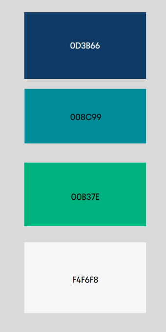

*   **Tipografía:** Se respetará la relación tipográfica y jerarquía establecida en los General Style Guidelines, combinando Montserrat e Inter.

*   **Responsive Design Standards:** Prothia está diseñado con una arquitectura adaptable para satisfacer los distintos contextos de uso de sus usuarios:
    *   **Mobile (360px – 768px)**
        *   Navegación tipo hamburguesa.
        *   Tarjetas de ejercicios y reportes apiladas en columna.
        *   Botones grandes y legibles, ideal para el paciente amputado que consulta su rutina y progreso desde el hogar mediante su smartphone.
    *   **Tablet (769px – 1024px)**
        *   Layout en 2 columnas.
        *   Menú lateral colapsable, optimizado para técnicos ortopédicos que visualizan datos de mantenimiento y ajustan parámetros desde el taller.
    *   **Desktop (1025px en adelante)**
        *   Menú principal siempre visible.
        *   Layout de 3 columnas en los dashboards clínicos, permitiendo a los fisioterapeutas analizar gráficos biomecánicos, métricas en tiempo real y listas de alertas de forma simultánea.

*   **Interactivity:**
    *   **Botones:**
        *   Bordes redondeados en 8px.
        *   Hover: cambio sutil de saturación en el color Teal y sombra suave para indicar interactividad.
        *   Feedback claro mediante animaciones sutiles al confirmar una tarea de rehabilitación o guardar un registro técnico.
    *   **Transiciones y animaciones:**
        *   Duración: 200–300ms.
        *   Curva: ease-in-out, asegurando fluidez al navegar entre fichas de pacientes y reportes de uso de prótesis.

*   **Accessibility:**
    *   Todo ícono debe tener alternativa textual (`aria-label` o `alt`) para herramientas de asistencia.
    *   Navegación totalmente compatible con teclado (Tab, Enter, Esc).
    *   Fuente mínima: 16px para garantizar legibilidad, considerando a pacientes que puedan tener dificultades visuales.
    *   Colores validados para asegurar un contraste suficiente (WCAG AA), permitiendo que textos sobre fondos claros como el Gris Claro se lean sin esfuerzo.

*   **UI Consistency:**
    *   Iconografía uniforme orientada a la salud y biomecánica, en estilo outline con grosor consistente.
    *   Botones y formularios con la misma geometría y espaciado en las interfaces del paciente, clínica y centro ortopédico.
    *   Uso consistente de la paleta semántica: Teal para acciones, Verde Esmeralda para éxito y estados óptimos, y colores de alerta (como rojo o naranja) exclusivamente para advertencias críticas de posturas inadecuadas o necesidades de mantenimiento en la prótesis.
    *   Estándar de espaciado basado en múltiplos de 8px para mantener un ritmo visual coherente y ordenado.

---
## 4.2. Information Architecture

### 4.2.1. Organization Systems

Para estructurar la gran cantidad de datos médicos y de sensores, Prothia utiliza los siguientes sistemas de organización:

*   **Organización Jerárquica:** Utilizada en los dashboards principales, donde se prioriza mostrar en la parte superior las alertas críticas (posturas incorrectas o mantenimientos urgentes), seguidas por los resúmenes de progreso biomecánico y, finalmente, los historiales detallados.
*   **Organización Secuencial:** Aplicada en los flujos de tareas paso a paso, como el registro de los datos clínicos de un paciente, la asociación de una prótesis a un usuario o la asignación de un plan de ejercicios.
*   **Organización Matricial:** Empleada en las vistas de analítica, permitiendo a los profesionales de rehabilitación cruzar datos de adherencia a los ejercicios con métricas de simetría de apoyo o cadencia a lo largo del tiempo.
### 4.2.2. Labeling Systems

El sistema de etiquetado en Prothia está diseñado para reducir la carga cognitiva, utilizando un lenguaje ubicuo que sea familiar tanto para el personal clínico como para el paciente en su hogar.

*   **Principios clave del sistema de etiquetado:**
    *   Se evitarán tecnicismos ortopédicos en la vista del paciente, utilizando términos claros como "Mis Ejercicios" o "Mi Progreso".
    *   Para las clínicas y ortopedias, se mantendrá la precisión técnica necesaria (ej. "Datos Biomecánicos", "Historial Técnico").
*   **Etiquetas principales por área:**
    *   **Navegación global:** Inicio, Pacientes, Prótesis, Monitoreo, Alertas, Mensajes.
    *   **Landing Page:** Soluciones, Para Clínicas, Para Ortopedias, Para Pacientes, Contacto.
    *   **Gestión de rehabilitación (Clínicas):** Asignar plan, Progreso de rehabilitación, Historial biomecánico.
    *   **Gestión técnica (Ortopedias):** Historial de uso, Programar mantenimiento, Estado del dispositivo.
    *   **Acciones del usuario:** Registrar paciente, Asociar prótesis, Generar reporte, Enviar mensaje, Configurar umbrales.
### 4.2.3. SEO Tags and Meta Tags

Para asegurar el posicionamiento orgánico del ecosistema de Prothia en motores de búsqueda, consolidar la autoridad de marca médica y controlar los accesos según los segmentos objetivo (pacientes amputados, clínicas de rehabilitación física y centros ortopédicos), se han formulado los siguientes SEO Tags y Meta Tags, diferenciando entre el sitio web promocional público (Landing Page) y la aplicación transaccional (Web Application):

*   **Landing Page (Sitio Web Estático):**
    Diseñada para maximizar la indexación comercial, la captación institucional y la correcta previsualización en redes sociales profesionales:
    *   **Title:** Prothia | Biomechanical Telemetry & Rehabilitation Platform
    *   **Meta Description:** Prothia connects amputee patients, rehabilitation clinics, and orthopedic centers to optimize remote tracking, analyze biomechanical telemetry, and manage prosthetic maintenance.
    *   **Meta Keywords:** biomechanical telemetry, prosthetic rehabilitation, amputee patient, smart prosthetics, clinical telerehabilitation, gait analysis, socket comfort, orthopedic maintenance, digital health, IoT healthcare
    *   **Meta Author:** SeniorsInProcess
    *   **Meta Robots:** index, follow
    *   **Open Graph Tags:**
        *   `og:type`: website
        *   `og:url`: https://www.prothia.tech
        *   `og:title`: Prothia | Biomechanical Telemetry & Rehabilitation Platform
        *   `og:description`: Connecting amputee patients, rehabilitation clinics, and orthopedic centers through continuous telemetry and remote rehabilitation monitoring.
        *   `og:image`: https://www.prothia.tech/assets/Logo.png

*   **Web Application (Aplicación Web Transaccional):**
    Orientada a usuarios autenticados bajo control de acceso por roles (RBAC). Su propósito es preservar la identidad institucional en navegadores y garantizar la confidencialidad de las historias clínicas mediante directivas estrictas de exclusión de motores de búsqueda:
    *   **Title:** Prothia App | Clinical Telemetry & Prosthetic Management
    *   **Meta Description:** Access the Prothia clinical portal to monitor real-time gait telemetry, manage patient exercise adherence, and track prosthetic mechanical durability.
    *   **Meta Keywords:** Prothia clinical portal, biomechanical monitoring system, patient gait dashboard, prosthetic wear logs, telemetría médica, rehabilitación protésica
    *   **Meta Author:** SeniorsInProcess
    *   **Meta Robots:** noindex, nofollow
    *   **Open Graph Tags:**
        *   `og:type`: application
        *   `og:url`: https://app.prothia.tech
        *   `og:title`: Prothia App | Clinical Telemetry & Prosthetic Management
        *   `og:description`: Secure access to clinical telemetry, exercise prescriptions, and prosthetic lifecycle tracking.
        *   `og:image`: https://app.prothia.tech/assets/Logo.png

### 4.2.4. Searching Systems

Dentro de la plataforma Prothia, los sistemas de búsqueda han sido diseñados para facilitar el acceso rápido y eficiente a la información relacionada con la rehabilitación biomecánica y el seguimiento de prótesis. Debido al manejo constante de datos vinculados con pacientes, prótesis, alertas posturales, historiales de marcha y registros técnicos, se contempla un sistema de búsqueda que permita a los usuarios localizar información relevante de manera inmediata y mantener un control ordenado de sus actividades. El sistema permitirá realizar búsquedas dentro de los distintos módulos de la plataforma mediante:

* **Palabras clave** (nombre de pacientes, tipo o modelo de prótesis, clínica tratante, profesional responsable o descripciones biomecánicas relacionadas).
* **Filtros por fechas** (sesiones telemétricas de marcha, consultas de seguimiento, mantenimientos técnicos o rangos de fechas específicos).
* **Estados del registro** (activo, en rehabilitación, rutina completada, pendiente de revisión o en mantenimiento).
* **Búsqueda por nombres de pacientes e identificadores internos** (DNI, código de historia clínica, número de serie de prótesis o identificadores de sensores).
* **Filtros por categoría** (directorio de pacientes, inventario de prótesis, registro de alertas o perfiles de usuario).

Este sistema será especialmente útil para:

* Ahorrar tiempo en la localización de pacientes, prótesis o registros específicos sin necesidad de navegar manualmente entre módulos.
* Encontrar rápidamente información relacionada con historiales biomecánicos, alertas de postura emitidas o datos de mantenimiento.
* Mejorar la organización operativa mediante el acceso inmediato a la información previamente registrada por las clínicas y centros ortopédicos.
* Facilitar la gestión diaria del personal de salud y los pacientes al mantener una navegación más ágil y ordenada dentro de la plataforma.

Una vez realizada la búsqueda, los resultados se mostrarán de forma estructurada dentro de listas, tablas o tarjetas interactivas según el módulo correspondiente, permitiendo visualizar el estado del paciente o del dispositivo (con indicadores visuales o semáforos de estado), editar la información o acceder a su ficha detallada de acuerdo con los permisos asignados al usuario.

### 4.2.5. Navigation Systems

Para el sistema de navegación otorgamos libertad y facilidad al usuario dentro de la plataforma con diversas interfaces de navegación:

***PRIMERA NAVEGACIÓN:*** Acceso a apartados para cada tipo de usuario, herramientas de registro y cambio de idioma. Este navegador global se encuentra fijado en la parte superior de la pantalla (*sticky header*), permitiendo que el visitante pueda acceder en todo momento a las funciones y secciones principales del sitio (Home, The Challenge, Solutions, Features, Plans, About Us, FAQ, Contact), alternar el idioma (EN / ES) e interactuar directamente con el botón de registro (Register Now) sin la necesidad de hacer scroll de retorno.

  

*Fuente: Propia.*

***SEGUNDA NAVEGACIÓN:*** Pantalla principal (Hero Section) con llamado a la acción directo. Esta sección, ubicada inmediatamente después del encabezado, presenta la propuesta de valor de Prothia orientada a la telemetría biomecánica y cuenta con el botón principal "Register Now", el cual guía al visitante directamente hacia el formulario de registro y contacto tras captar su interés con la presentación del producto.

  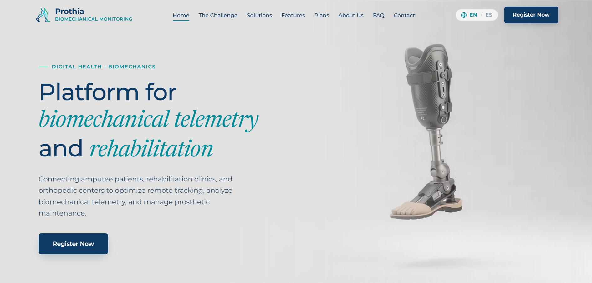

*Fuente: Propia.*

***TERCERA NAVEGACIÓN:*** Pie de página con información complementaria. Esta sección reúne enlaces de interés organizados por categorías (Plataforma, Aspectos Legales y Seguridad, y Centro de Innovación), permitiendo que los usuarios que llegaron al final del sitio continúen navegando fácilmente, consulten políticas de privacidad y normativas de seguridad médica (AES-256 y WCAG 2.1 AA) sin necesidad de regresar al inicio.

  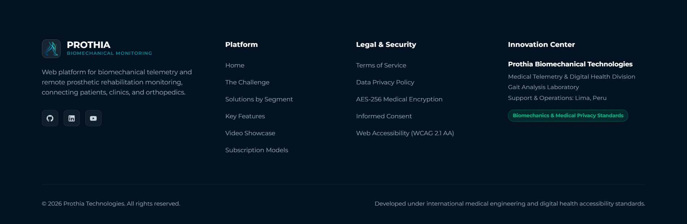

*Fuente: Propia.*

## 4.3. Landing Page UI Design

La Landing Page funciona como punto de entrada público a Prothia. Su propósito es comunicar la propuesta de valor, presentar el monitoreo biomecánico continuo para la rehabilitación protésica y conectar a los tres actores del sistema (pacientes amputados, clínicas de rehabilitación y centros ortopédicos), facilitando el acceso a la Web Application y la captación de solicitudes de demostración.

### 4.3.1. Landing Page Wireframe

Para la Landing Page se diseñó el wireframe completo en Figma, priorizando la estructura informativa, la jerarquía de contenidos y el flujo de conversión antes de aplicar la paleta cromática y el detalle visual definitivo. El wireframe integra las secciones de encabezado con navegación global, presentación de la propuesta de valor con métricas de impacto, antecedentes del problema clínico, soluciones por segmento con pestañas interactivas, capacidades técnicas de la plataforma, bloque audiovisual demostrativo, planes de acceso, perfil institucional, testimonios clínicos, preguntas frecuentes y formulario de contacto.

  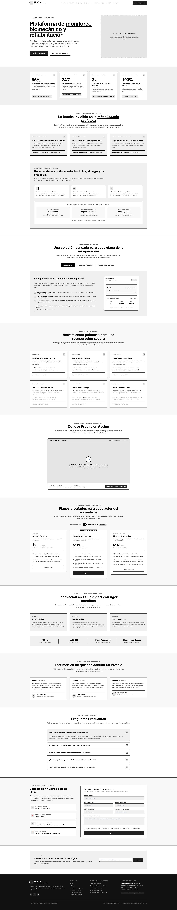

*Nota: Elaboración propia. Elaborado en: https://www.figma.com/design/dqRIVk8vPGYi9k3EEpfijS/Sin-t%C3%ADtulo?node-id=0-1*

### 4.3.2. Landing Page Mock-up

Los mock-ups de alta fidelidad aplican la identidad visual, paleta cromática, jerarquía tipográfica y componentes interactivos definidos para Prothia, consolidando una experiencia limpia, profesional y orientada al rigor médico y la biomecánica.

  

*Nota: Elaboración propia. Elaborado en: https://www.figma.com/design/dqRIVk8vPGYi9k3EEpfijS/Sin-t%C3%ADtulo?node-id=19-3&t=cwyNHtJ3qwCys5Rq-4*

## 4.4. Web Applications UX/UI Design

La aplicación web de Prothia constituye el núcleo operativo de la plataforma, permitiendo la interacción coordinada entre los tres actores clave del ecosistema de rehabilitación protésica: pacientes con amputación de miembro inferior, especialistas clínicos en fisioterapia y centros ortopédicos / protesistas técnicos. El diseño de experiencia de usuario (UX) e interfaz de usuario (UI) se estructura para garantizar la visualización rigurosa de datos biomecánicos en tiempo real, la gestión centralizada de historias clínicas y la trazabilidad técnica y mantenimiento preventivo de las prótesis.

### 4.4.1. Web Applications Wireframes

Los wireframes de la aplicación web definen la disposición esquemática, la jerarquía de información y los flujos funcionales para entornos de escritorio (*Desktop Web Browser*).

#### Desktop Web Browser

  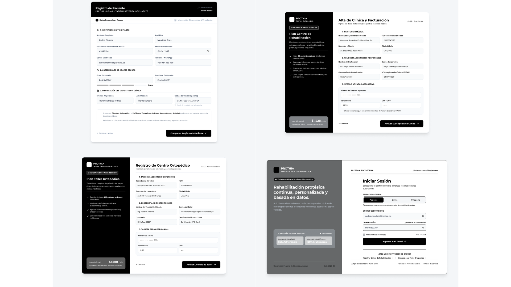

  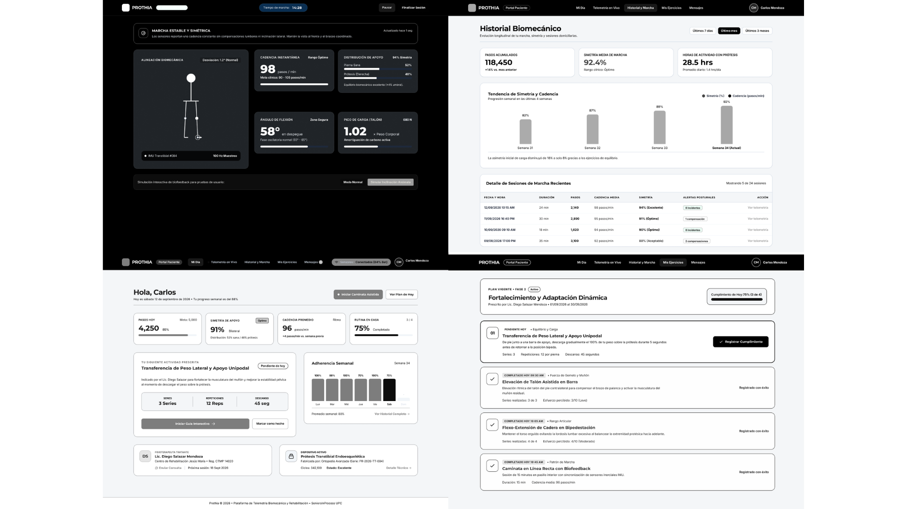

  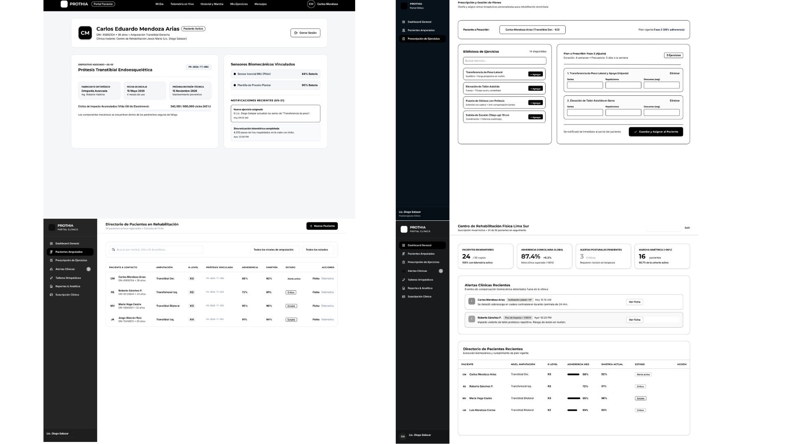

  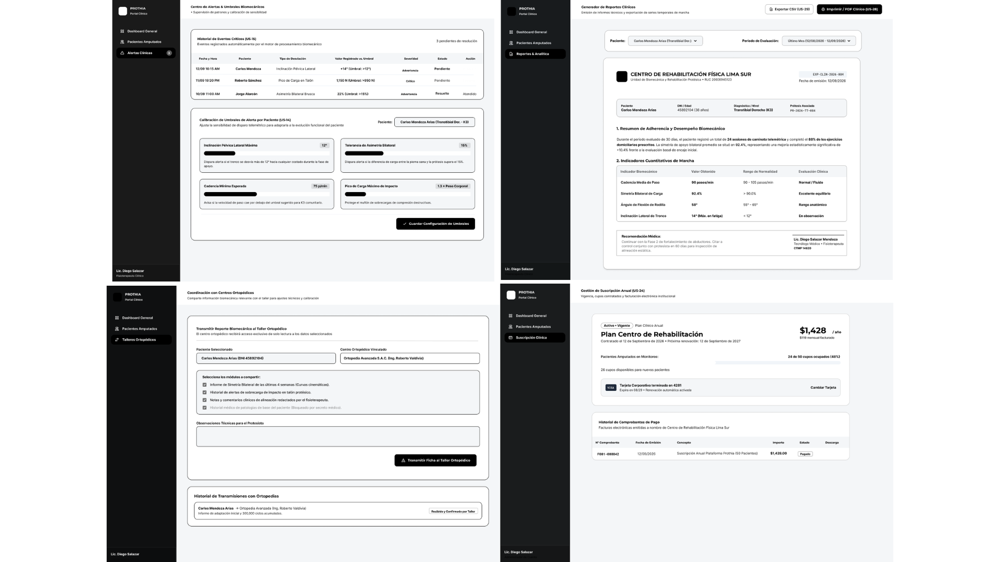

  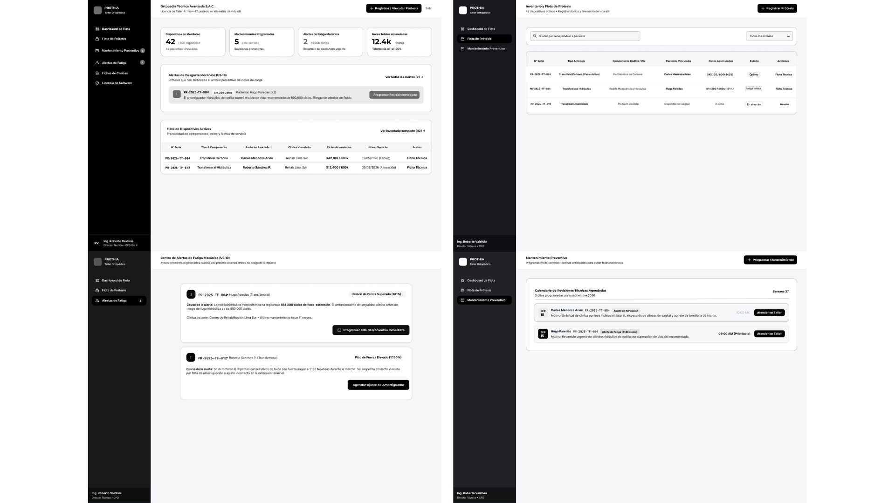

  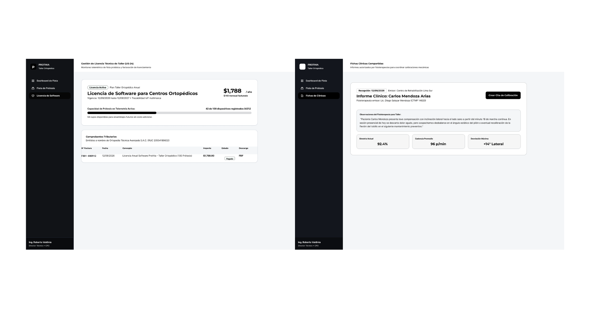

*Nota: Elaboración propia. Elaborado en: https://www.figma.com/design/dqRIVk8vPGYi9k3EEpfijS/Sin-t%C3%ADtulo?node-id=10-2*

### 4.4.2. Web Applications Wireflow Diagrams

Los Web Applications Wireflow Diagrams son representaciones visuales de los flujos de navegación y la arquitectura de una aplicación web. Estos diagramas combinan elementos de wireframes y diagramas de flujo para proporcionar una vista general de cómo los usuarios navegarán a través de la aplicación y cómo interactuarán con ella.

  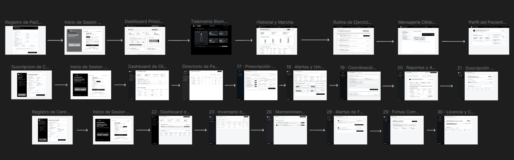

*Nota: Elaboración propia.*

## 4.6.2. Software Architecture Context Diagram

El Context Diagram representa a Prothia como un único sistema de software y muestra a los principales actores y sistemas externos con los que interactúa. Los actores considerados son Visitor, Patient, Clinic User y Orthopedic Center User, de acuerdo con las interacciones principales representadas en la solución. Esta separación permite reflejar las responsabilidades relacionadas con la consulta pública del Landing Page, el seguimiento de rehabilitación, el monitoreo clínico y la gestión de prótesis y mantenimiento.

Como sistemas externos se consideran Payment Gateway, Email Service y Prosthesis Biomechanical Sensors (IMU). El Payment Gateway procesa los pagos asociados a suscripciones y licencias; el Email Service soporta recuperación de contraseña y comunicaciones transaccionales; y los sensores biomecánicos suministran la telemetría utilizada durante el monitoreo del paciente.

C4 System Context Diagram de Prothia.

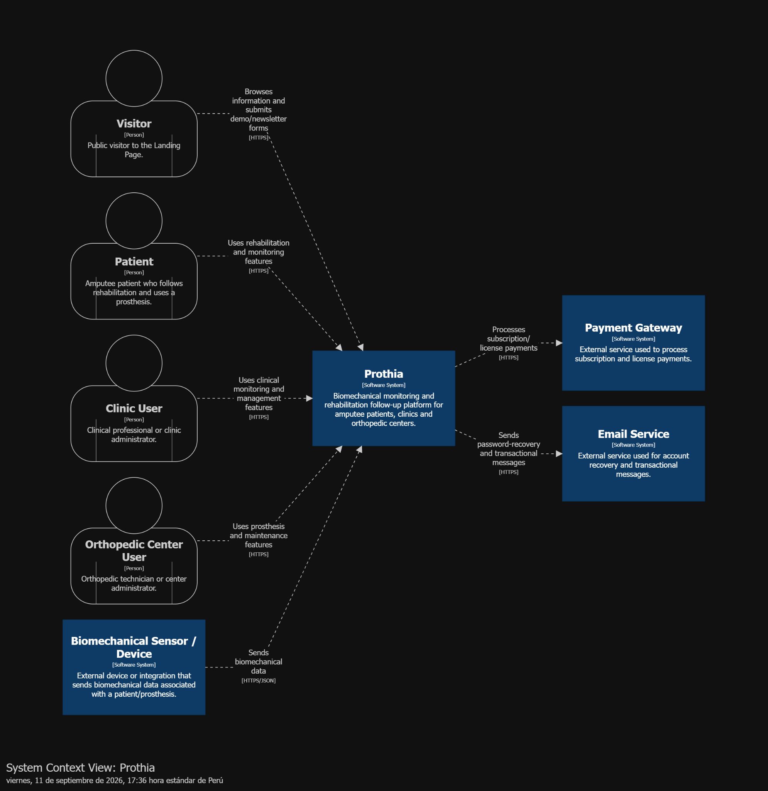

## 4.6.3. Software Architecture Container Diagrams

La solución se distribuye en cuatro containers principales: Landing Page, Web Application, RESTful API y Relational Database. La Landing Page utiliza HTML5, CSS3 y JavaScript para presentar el modelo de negocio y captar solicitudes públicas. La Web Application utiliza Vue 3, PrimeVue y JavaScript para proporcionar las experiencias autenticadas de los diferentes roles. El RESTful API utiliza ASP.NET Core, C# y Entity Framework Core para exponer servicios, aplicar reglas de negocio y coordinar persistencia e integraciones. La información relacional se almacena en PostgreSQL.

Los CTA de la Landing Page redirigen hacia la Web Application. Tanto los formularios públicos como la Web Application se comunican con el RESTful API mediante HTTPS y JSON. El RESTful API es el único container que accede a la base de datos y a los servicios externos.

C4 Container Diagram de Prothia.

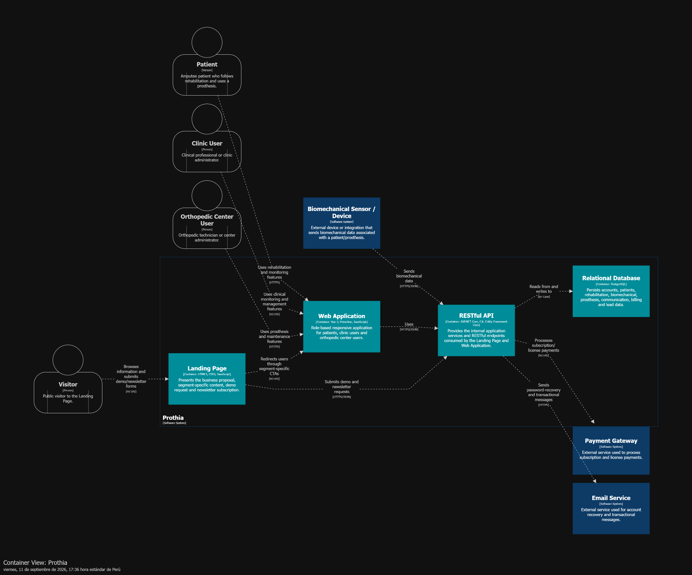

## 4.6.4. Software Architecture Components Diagrams

### Landing Page Components

La Landing Page se descompone en Navigation & Segment CTAs, Segment Content, Demo Request Form, Newsletter Form, Landing API Client e Internationalization & Accessibility. Los CTA dirigen a los visitantes hacia la experiencia correspondiente de la Web Application, mientras que Demo Request Form y Newsletter Form utilizan Landing API Client para registrar información mediante el RESTful API.

C4 Component Diagram - Landing Page.

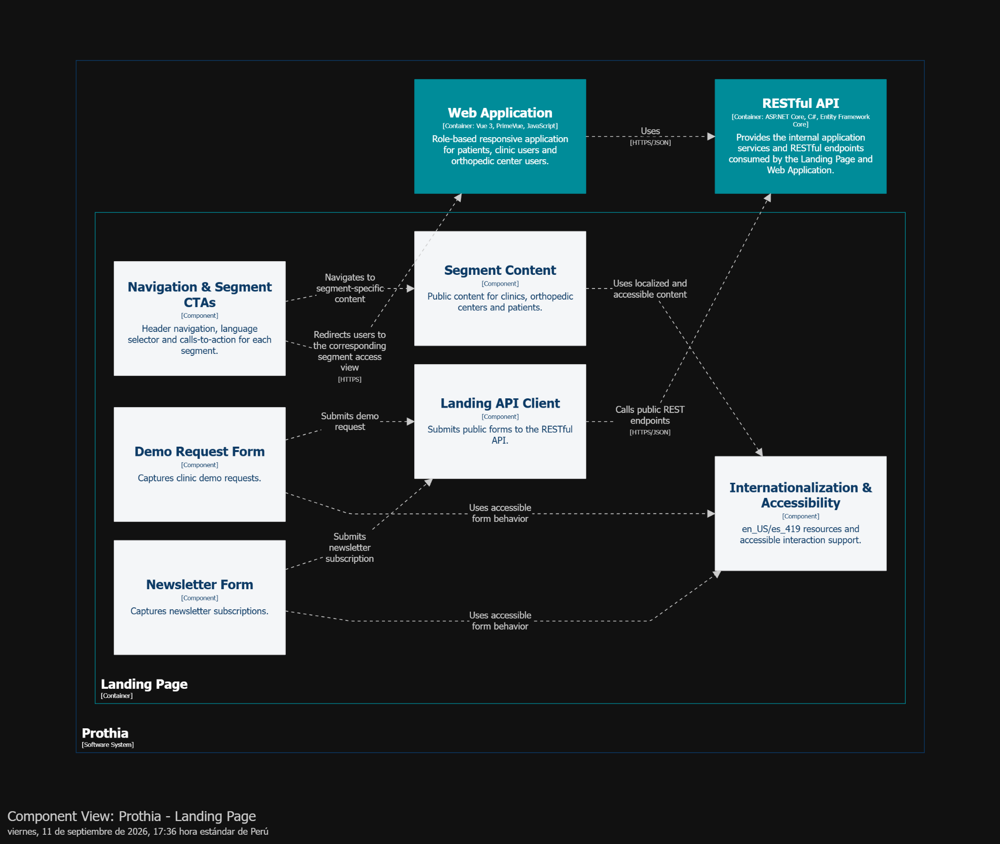

### Web Application Components

La Web Application separa Authentication & Access UI, Patient Experience, Clinic Experience, Orthopedic Experience y Subscription & License UI. Todas estas experiencias utilizan un API Client centralizado y comparten recursos de Internationalization & Accessibility, manteniendo una única vía de comunicación con el RESTful API.

C4 Component Diagram - Web Application.

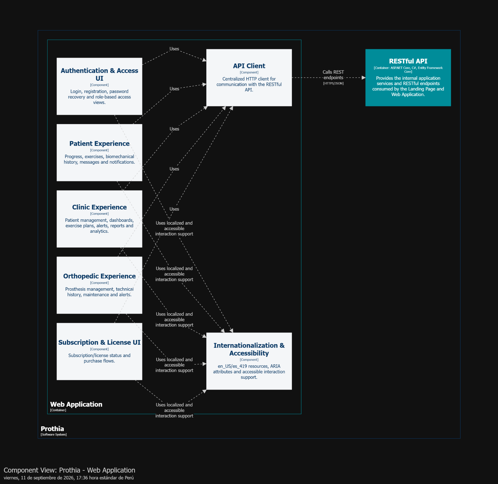

### RESTful API Components

El RESTful API organiza sus componentes principales de acuerdo con los Bounded Contexts identificados en el Design-Level EventStorming: Identity & Access Management, Rehabilitation Planning & Tracking, Service Execution & Biomechanical Monitoring, Profiles & Asset Management y Subscriptions & Payment Management.

Identity & Access Management API concentra registro, autenticación, sesiones y recuperación de contraseña. Rehabilitation Planning & Tracking API gestiona planes de rehabilitación, cumplimiento de ejercicios, progreso, compartición autorizada de información, reportes, exportaciones e indicadores de clínica. Service Execution & Biomechanical Monitoring API procesa telemetría, sesiones biomecánicas, evaluaciones de marcha, umbrales y alertas clínicas. Profiles & Asset Management API administra perfiles de paciente, prótesis, asociación paciente-prótesis, historial técnico y mantenimiento. Subscriptions & Payment Management API gestiona planes, suscripciones, licencias, pagos y vigencia de acceso institucional.

Además, Communication & Notification Support mantiene la mensajería y la bandeja general de notificaciones requeridas por las User Stories, mientras que Public Lead Management API soporta las solicitudes de demostración y las suscripciones al newsletter del Landing Page. Estos dos componentes actúan como módulos de soporte y no introducen Bounded Contexts adicionales.

Persistence Layer concentra el acceso mediante Entity Framework Core hacia PostgreSQL y External Integrations encapsula la comunicación con Payment Gateway, Email Service y Prosthesis Biomechanical Sensors (IMU).

C4 Component Diagram - RESTful API.

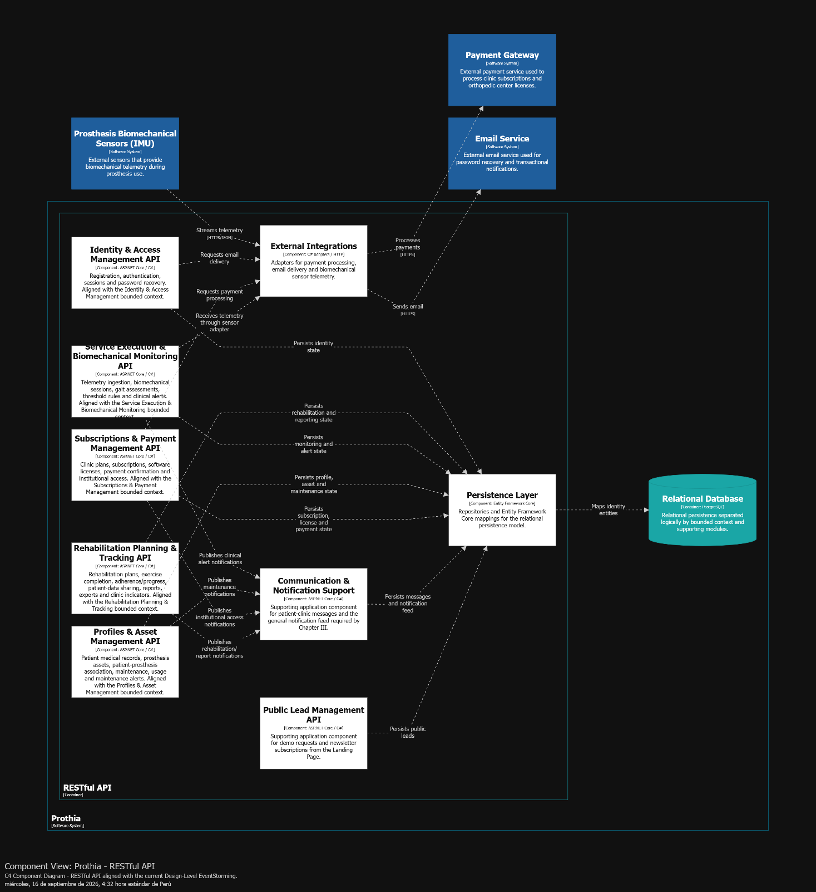

### Relational Database Components

El container Relational Database se organiza mediante separación lógica de datos. Los esquemas identity_access, rehabilitation_tracking, biomechanical_monitoring, profiles_asset y subscriptions_payments corresponden a los cinco Bounded Contexts identificados. Los esquemas communication_notifications y public_leads mantienen la persistencia requerida por los módulos de soporte de comunicación y captación pública.

Esta organización permite conservar límites de responsabilidad a nivel de persistencia aun cuando PostgreSQL sea desplegado inicialmente como una única instancia.

C4 Component Diagram - Relational Database.

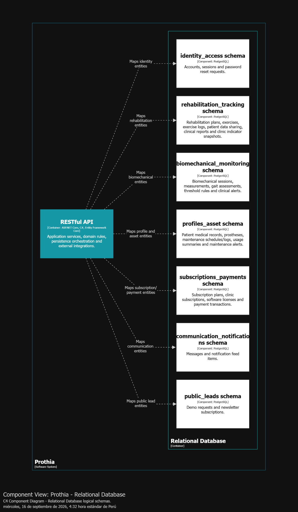

## 4.7. Software Object-Oriented Design

El diseño orientado a objetos se organiza de acuerdo con los Bounded Contexts identificados en el Design-Level EventStorming y con los módulos de soporte necesarios para mantener trazabilidad con las User Stories del Capítulo III. Los nombres de clases, atributos, métodos e interfaces se mantienen en inglés y se especifican relaciones, multiplicidades y visibilidad de miembros.

## 4.7.1. Class Diagrams

### Identity & Access Management

El modelo concentra UserAccount, UserSession y PasswordResetRequest. IdentityService implementa IIdentityService y coordina registro, autenticación, administración de sesiones y recuperación de contraseña. UserRole, AccountStatus y UserSessionStatus representan estados y roles válidos del dominio.

Class Diagram - Identity & Access Management.

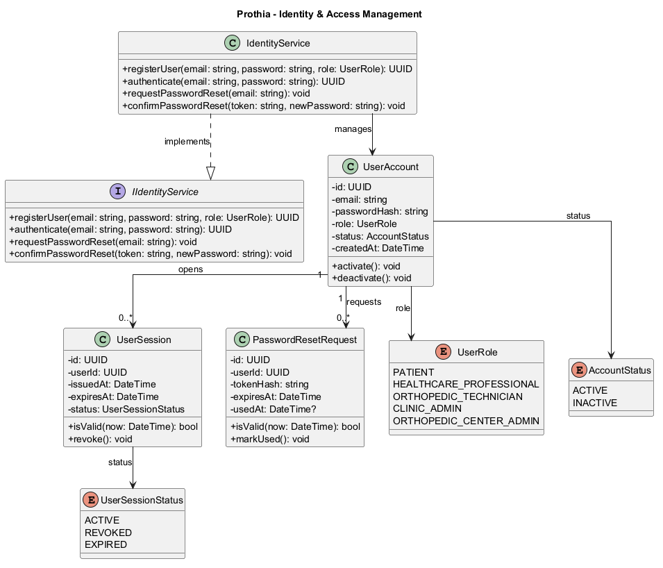

### Rehabilitation Planning & Tracking

RehabilitationPlan representa la planificación de rehabilitación del paciente y se relaciona con Exercise mediante PlanExercise. ExerciseLog registra el cumplimiento de la rutina. PatientDataShare representa la autorización para compartir información con el centro ortopédico. ClinicalReport y ReportFile representan la generación y resultado de reportes, mientras que ClinicIndicatorReadModel concentra los indicadores agregados requeridos para consulta.

RehabilitationTrackingService implementa IRehabilitationTrackingService y coordina las operaciones de asignación, cumplimiento, compartición y generación de información de seguimiento.

Class Diagram - Rehabilitation Planning & Tracking.

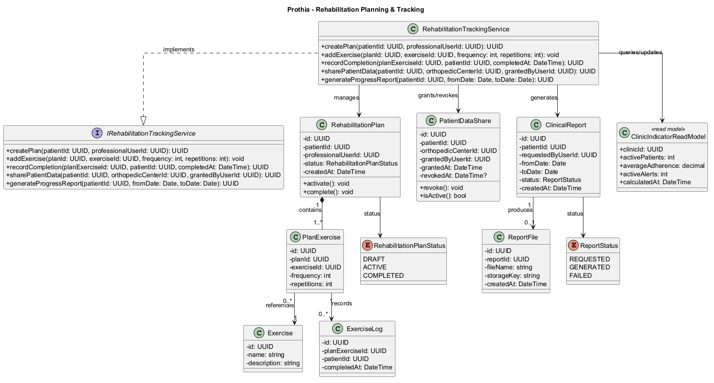

### Service Execution & Biomechanical Monitoring

BiomechanicalSession representa una sesión de captura y agrupa BiomechanicalMeasurement. GaitAssessment almacena el resultado del análisis de movimiento, ThresholdRule mantiene los límites configurados por el profesional y ClinicalAlert representa una condición que requiere revisión clínica. BiomechanicalMonitoringService coordina ingesta, evaluación y administración de umbrales y alertas.

Class Diagram - Service Execution & Biomechanical Monitoring.

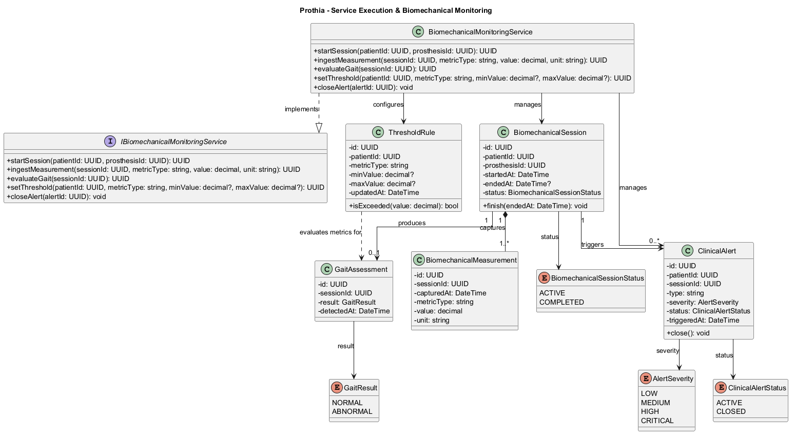

### Profiles & Asset Management

PatientMedicalRecord representa la información de perfil utilizada por la clínica. Prosthesis representa el activo protésico y permite su asociación con un paciente. MaintenanceSchedule modela el mantenimiento programado, MaintenanceLog registra las intervenciones realizadas, ProsthesisUsageSummary mantiene información acumulada de uso y MaintenanceAlert representa condiciones de mantenimiento que requieren atención.

ProfilesAssetService implementa IProfilesAssetService y coordina creación de perfiles, registro y asociación de prótesis, programación de mantenimiento e intervenciones técnicas.

Class Diagram - Profiles & Asset Management.

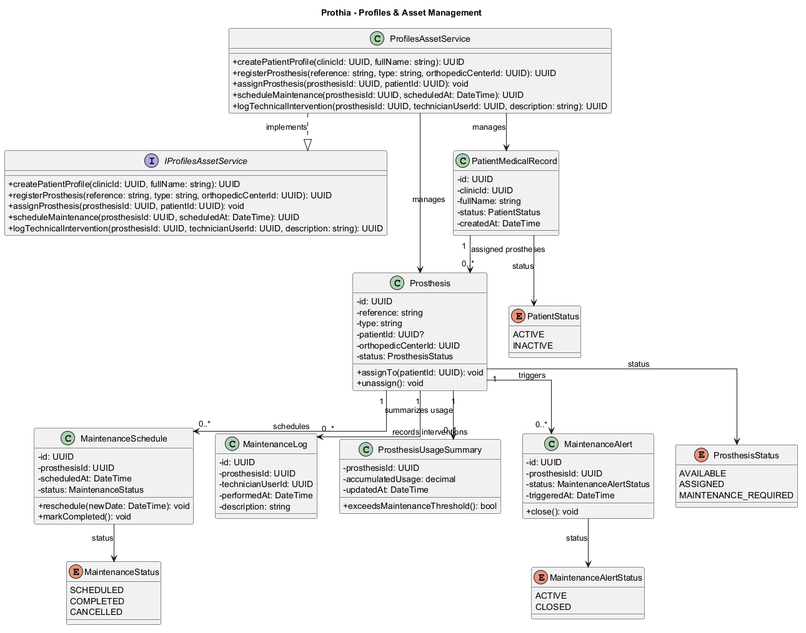

### Subscriptions & Payment Management

SubscriptionPlan representa la oferta contratada por una clínica, ClinicSubscription representa su acceso vigente y SoftwareLicense representa la licencia otorgada a un centro ortopédico. PaymentTransaction registra el resultado de cada operación de pago. SubscriptionPaymentService coordina contratación, licenciamiento, confirmación de pagos y vigencia de acceso.

Class Diagram - Subscriptions & Payment Management.

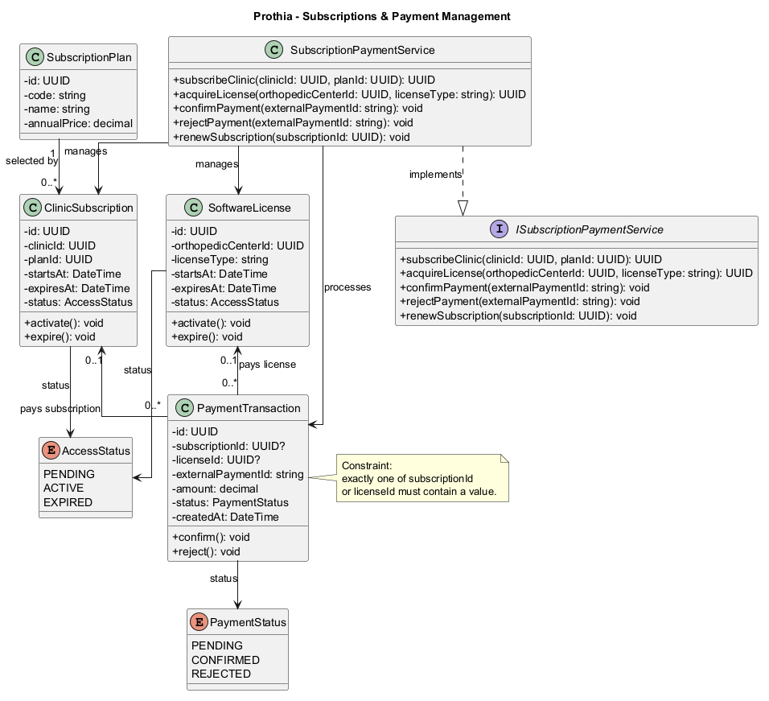

### Communication & Notification Support

Message representa la comunicación entre usuarios y UserNotification concentra los elementos mostrados en la bandeja de notificaciones. CommunicationNotificationService coordina envío de mensajes, consulta de conversaciones y publicación/lectura de notificaciones originadas por eventos de otros contextos.

Class Diagram - Communication & Notification Support.

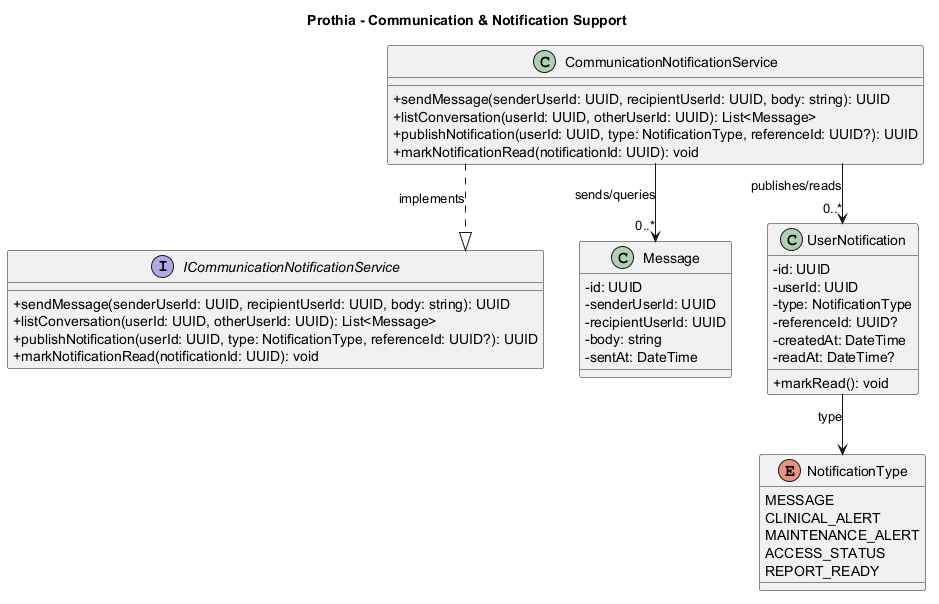

### Public Lead Management

DemoRequest y NewsletterSubscription representan los dos flujos públicos de captación utilizados en la Landing Page. PublicLeadService registra las solicitudes de demostración y las suscripciones al newsletter.

Class Diagram - Public Lead Management.

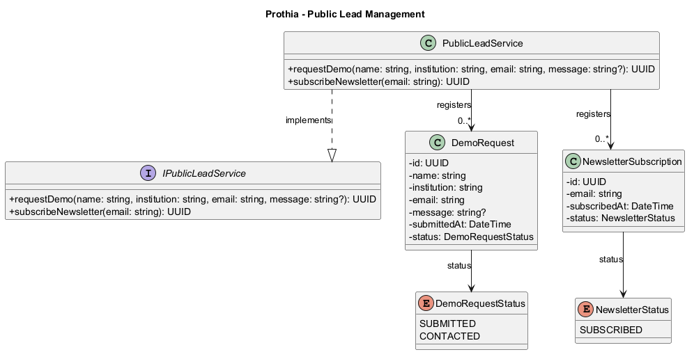

## 4.8. Database Design

El diseño de base de datos utiliza PostgreSQL como DBMS relacional y conserva la separación lógica establecida por los Bounded Contexts identificados en el Design-Level EventStorming. Los módulos de soporte mantienen su propia persistencia para conservar la trazabilidad con las User Stories especificadas en el Capítulo III.

Se utiliza lowercase_snake_case para tablas y columnas, UUID para identificadores, TIMESTAMPTZ para instantes que representan un momento real en el tiempo, DATE para fechas sin componente horario y NUMERIC para valores exactos. Los diagramas especifican claves primarias, claves foráneas internas, restricciones de unicidad, nulabilidad y reglas CHECK necesarias para mantener la integridad de los datos.

Las relaciones internas de cada Bounded Context se representan mediante claves foráneas. Cuando una entidad necesita identificar información administrada por otro contexto, se conserva únicamente el identificador como referencia lógica, evitando introducir dependencias de persistencia que mezclen responsabilidades de dominio.

### 4.8.1. Database Diagrams

#### Identity & Access Management

El modelo persiste cuentas de usuario, sesiones y solicitudes de recuperación de contraseña. El correo de cada cuenta y el hash de cada token de recuperación son únicos. Una cuenta puede originar múltiples sesiones y solicitudes de recuperación; las sesiones controlan su periodo de vigencia y las solicitudes conservan used_at en NULL mientras no hayan sido utilizadas.

Database Diagram - Identity & Access Management.

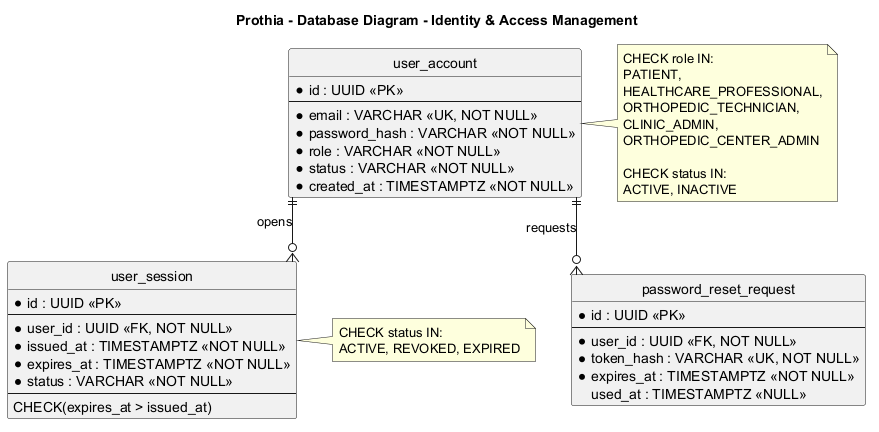

#### Rehabilitation Planning & Tracking

El modelo persiste planes de rehabilitación, ejercicios, asignaciones de ejercicios, registros de cumplimiento, autorizaciones para compartir información, reportes clínicos, archivos generados y snapshots de indicadores de clínica. Cada plan contiene uno o más ejercicios mediante plan_exercise, donde la combinación de plan y ejercicio es única. Las frecuencias y repeticiones deben ser positivas y los rangos utilizados para reportes deben mantener una fecha final igual o posterior a la fecha inicial.

Los identificadores de paciente, profesional, clínica y centro ortopédico se mantienen como referencias lógicas cuando pertenecen a responsabilidades administradas por otros contextos.

Database Diagram - Rehabilitation Planning & Tracking.

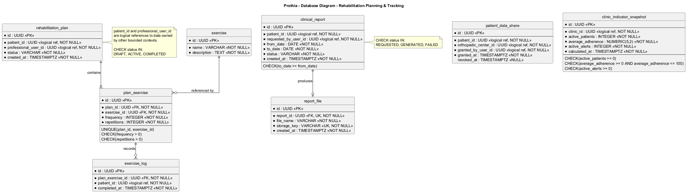

#### Service Execution & Biomechanical Monitoring

El modelo persiste sesiones biomecánicas, mediciones capturadas, evaluaciones de marcha, reglas de umbral y alertas clínicas. Cada sesión contiene una o más mediciones y puede producir como máximo una evaluación de marcha. Las alertas clínicas mantienen la sesión que originó el evento, mientras que las reglas de umbral se configuran por paciente y tipo de métrica.

Los límites configurados deben incluir al menos un valor mínimo o máximo y, cuando ambos existen, el máximo no puede ser menor que el mínimo.

Database Diagram - Service Execution & Biomechanical Monitoring.

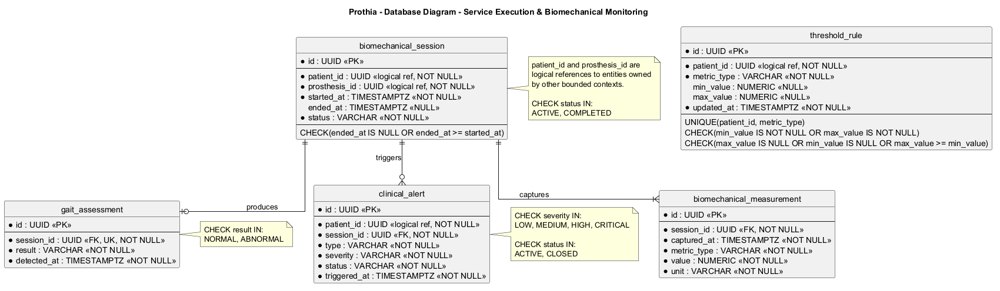

#### Profiles & Asset Management

El modelo persiste perfiles clínicos de pacientes, prótesis, programaciones de mantenimiento, intervenciones técnicas, resúmenes de uso y alertas de mantenimiento. Debido a que paciente y prótesis se administran dentro del mismo Bounded Context, la asociación entre ambos se representa mediante una clave foránea interna. La asociación es opcional mientras la prótesis permanezca disponible.

La referencia de cada prótesis es única y el uso acumulado no admite valores negativos. Las programaciones, intervenciones y alertas permanecen vinculadas a la prótesis correspondiente.

Database Diagram - Profiles & Asset Management.

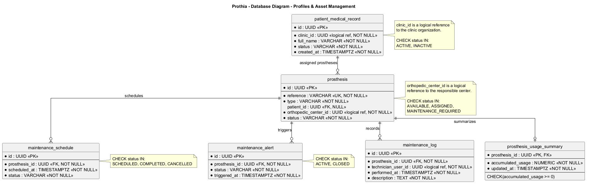

#### Subscriptions & Payment Management

El modelo persiste planes de suscripción, suscripciones de clínicas, licencias de software y transacciones de pago. Cada suscripción referencia el plan contratado y cada transacción corresponde a una suscripción o a una licencia, pero no a ambas simultáneamente. Esta exclusión se controla mediante una restricción CHECK.

Los importes deben ser positivos y las fechas de expiración deben ser posteriores al inicio del periodo contratado.

Database Diagram - Subscriptions & Payment Management.

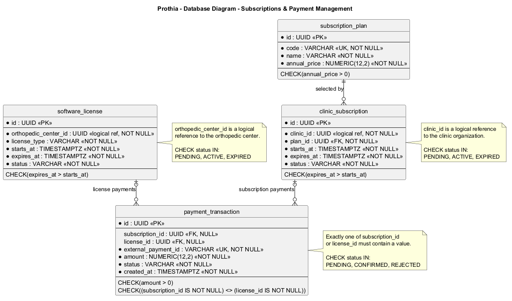

#### Communication & Notification Support

El módulo persiste mensajes y elementos de notificación. Los identificadores de emisor, destinatario y usuario se conservan como referencias lógicas a las cuentas administradas por Identity & Access Management. Las notificaciones pueden incluir una referencia lógica al evento o elemento que las originó y mantienen read_at en NULL hasta que el usuario las marque como leídas.

Database Diagram - Communication & Notification Support.

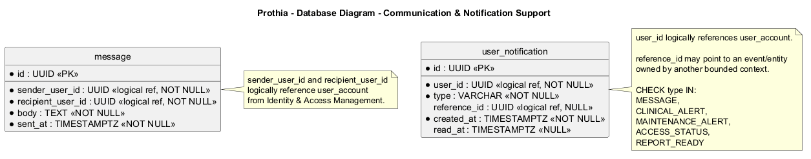

#### Public Lead Management

El módulo persiste las solicitudes de demostración y las suscripciones al newsletter provenientes del Landing Page. Ambos procesos son independientes. Las solicitudes conservan la institución y los datos de contacto necesarios para su seguimiento, mientras que el correo utilizado para el newsletter mantiene una restricción de unicidad.

Database Diagram - Public Lead Management.

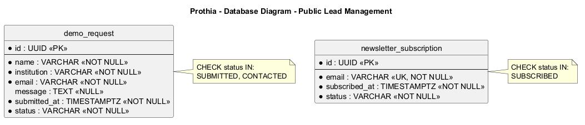
