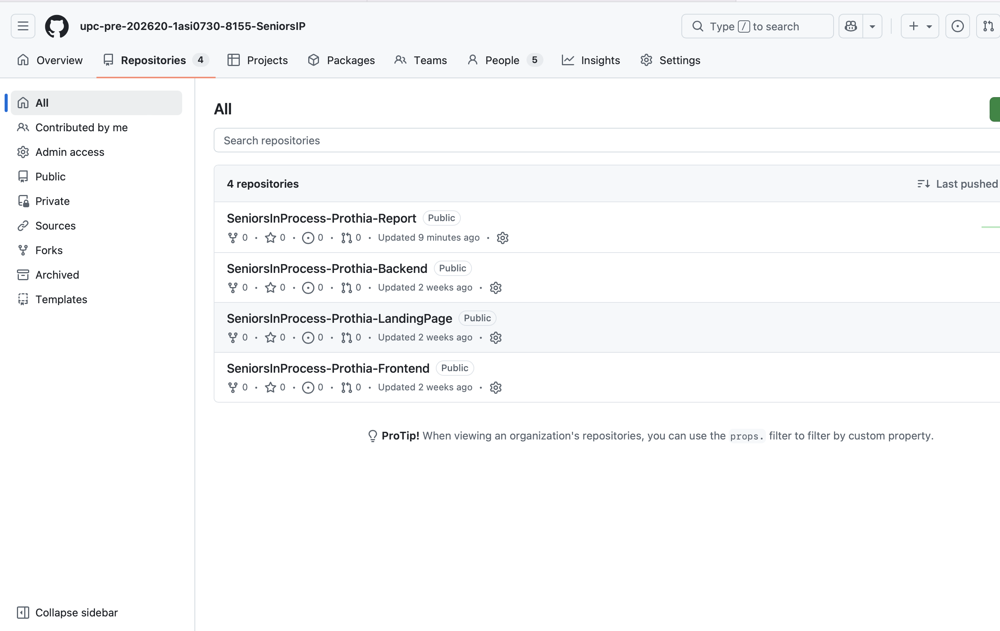
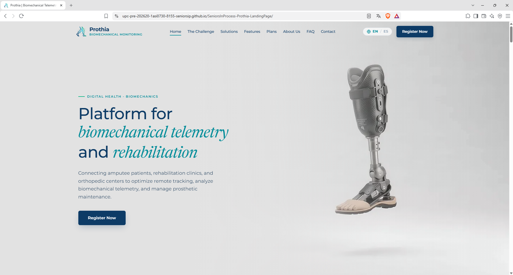
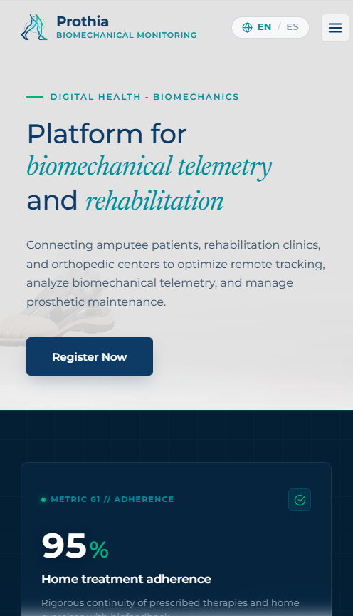
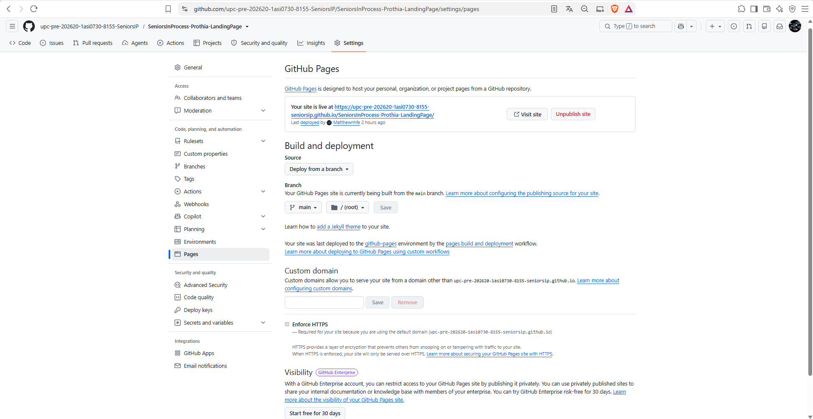

# Capítulo V: Product Implementation, Validation & Deployment

## 5.1 Software Configuration Management

La gestión en **SeniorsInProcess (Prothia)** incluye el código fuente, documentación, prototipos y configuraciones del entorno de desarrollo de la plataforma web de monitoreo y seguimiento de rehabilitación de pacientes amputados. El proyecto contempla distintos productos digitales, incluyendo una Landing Page institucional, una aplicación web para clínicas de rehabilitación y centros ortopédicos, y servicios backend orientados al procesamiento de datos biomecánicos y de uso de prótesis en tiempo real. El equipo adopta prácticas basadas en GitFlow, Conventional Commits y Semantic Versioning, asegurando un flujo de trabajo colaborativo y organizado.

### 5.1.1. Software Development Environment Configuration

| Categoría / Actividad | Nombre del Producto | Propósito de Uso en el Proyecto | Tipo / Plataforma | Ruta de Referencia / Descarga |
|---|---|---|---|---|
| Project Management | Trello | Gestión e itinerario de tareas del proyecto mediante tableros organizados por estados (To-Do, In Progress, Done), clave para el seguimiento de entregables como el reporte y la landing page. | SaaS | https://trello.com |
| Team Communication | Discord | Plataforma principal de comunicación remota para la realización de reuniones de equipo sincrónicas, planificación de Sprints y coordinación general. | SaaS / Desktop | https://discord.com/ |
| Requirements Management | Miro | Estructuración de ideas, diagramación de flujos de sistema, análisis del negocio y ejecución de la sesión de Event Storming para el ecosistema IoT. | SaaS | https://miro.com |
| Requirements Management | Structurizr | Modelado de la arquitectura de software del sistema DomotiCore bajo el modelo C4, representando los componentes clave (dashboard, gateway, nodos IoT y servicios de monitoreo). | SaaS / Desktop | https://structurizr.com |
| Product UX/UI Design | Figma | Diseño visual y prototipado interactivo de las interfaces del sistema, incluyendo el dashboard centralizado, paneles de control de dispositivos y visualización de consumo energético. | SaaS / Desktop | https://www.figma.com |
| Product UX/UI Design | Lucidchart | Elaboración de diagramas de flujo de trabajo, arquitectura técnica y diseño de procesos operativos del sistema. | SaaS | https://www.lucidchart.com |
| Software Development | HTML5 / CSS3 / JavaScript | Lenguajes y estándares base utilizados para el desarrollo del frontend web, las interfaces de usuario y la Landing Page del producto. | Lenguajes / Estándares | https://developer.mozilla.org/es/docs/Web |
| Software Development | WebStorm | Entorno de desarrollo integrado (IDE) principal utilizado para la programación, edición y depuración del código fuente del frontend. | Desktop | https://www.jetbrains.com/webstorm/download |
| Software Testing | Gherkin | Lenguaje de especificación para definir escenarios de prueba BDD (Behavior-Driven Development) basados en historias de usuario (control remoto, automatizaciones por horario y alertas de consumo). | Estándar / DSL | https://cucumber.io/docs/gherkin/reference |
| Software Documentation | GitHub | Repositorio central del proyecto para el control de versiones distribuido, registro de commits, trabajo colaborativo y alojamiento de la documentación del sistema. | SaaS | https://github.com |
| Software Deployment | GitHub Pages | Servicio de alojamiento y despliegue continuo para la Landing Page pública del producto, permitiendo exponer la propuesta de valor de DomotiCore. | SaaS | https://pages.github.com |

### 5.1.2 Source Code Management

La gestión de código fuente del proyecto **Prothia (SeniorsInProcess)** se realiza mediante la plataforma **GitHub**, permitiendo un control de versiones en entorno de trabajo colaborativo. Se han definido repositorios independientes para cada producto digital.

#### 5.1.2.1 Repositories

| Product | Repository URL | Description |
| :--- | :--- | :--- |
| **Organization** | [SeniorsInProcess-Prothia-1ASI0729](https://github.com/SeniorsInProcess-Prothia-1ASI0729) --- [https://github.com/SeniorsInProcess-Prothia-1ASI0729] --- | Organización donde se ubican todos los repositorios del proyecto. |
| **Landing Page** | [Prothia-Business-Web-Page](https://github.com/upc-pre-202620-1asi0730-8155-SeniorsIP/SeniorsInProcess-Prothia-LandingPage) --- [https://github.com/upc-pre-202620-1asi0730-8155-SeniorsIP/SeniorsInProcess-Prothia-LandingPage] --- | Repositorio de la Landing Page institucional del proyecto. |
| **Frontend Web Application** | [Prothia-Front-End](https://github.com/upc-pre-202620-1asi0730-8155-SeniorsIP/SeniorsInProcess-Prothia-Frontend) --- [https://github.com/upc-pre-202620-1asi0730-8155-SeniorsIP/SeniorsInProcess-Prothia-Frontend] --- | Aplicación web para el monitoreo y seguimiento de la rehabilitación de pacientes amputados. |
| **Backend Web Services** | [Prothia-Back-end](https://github.com/upc-pre-202620-1asi0730-8155-SeniorsIP/SeniorsInProcess-Prothia-Backend) --- [https://github.com/upc-pre-202620-1asi0730-8155-SeniorsIP/SeniorsInProcess-Prothia-Backend] --- | API REST y lógica de procesamiento de datos biomecánicos y de uso de prótesis. |
| **Documentation Repository** | [Prothia-Report](https://github.com/upc-pre-202620-1asi0730-8155-SeniorsIP/SeniorsInProcess-Prothia-Report/tree/develop) --- [https://github.com/upc-pre-202620-1asi0730-8155-SeniorsIP/SeniorsInProcess-Prothia-Report/tree/develop] --- | Documentación técnica, reportes y entregables del proyecto. |
---

#### 5.1.2.2 GitFlow Workflow

El equipo adopta **GitFlow** como estrategia de branching para mantener la estabilidad.

* **Main Branch**: Contiene únicamente versiones estables y aprobadas del proyecto listas para producción.
    * `main`
* **Develop Branch**: Rama principal de integración donde se consolidan las funcionalidades desarrolladas antes de integrarse en producción.
    * `develop`
* **Feature Branches**: Cada nueva funcionalidad se desarrolla en una rama independiente para evitar conflictos en el código base.
    * **Naming Convention**: `feature/<feature-name>`
    * **Examples**: `feature/patient-monitoring-dashboard`, `feature/biomechanical-data-tracking`
* **Hotfix Branches**: Ramas de emergencia para corregir errores críticos detectados directamente en producción.
    * **Naming Convention**: `hotfix/<issue-description>`

#### 5.1.2.3 Semantic Versioning

El proyecto utiliza **Semantic Versioning 2.0.0** para controlar las versiones de los productos digitales de Prothia.

| Version | Description |
| :--- | :--- |
| **v1.0.0** | Primera versión estable y funcional del producto. |
| **v1.1.0** | Incorporación de nuevas funcionalidades menores. |
| **v1.1.1** | Corrección de errores menores. |
| **v2.0.0** | Cambios mayores que incluyen modificaciones estructurales incompatibles. |

#### 5.1.2.4 Conventional Commits

Se adopta el estándar de **Conventional Commits** para mantener un historial de cambios limpio y fácil de verificar por el equipo.

| Prefix | Purpose |
| :--- | :--- |
| **feat** | Implementación de nuevas funcionalidades. |
| **fix** | Corrección de errores o bugs. |
| **docs** | Actualizaciones en la documentación del repositorio. |
| **style** | Cambios que no afectan la lógica (espaciados, formatos, CSS). |
| **refactor** | Reestructuración del código existente sin cambiar su funcionalidad. |
| **test** | Corrección de pruebas unitarias o de integración. |

**Examples:**
* `feat: implement patient rehabilitation dashboard`
* `docs: update sprint 1 documentation`
* `fix: correct biomechanical data sync error`
* `style: improve clinic panel spacing`

## 5.2. Landing Page, Services & Applications Implementation

### 5.2.1. Sprint 1

Durante este primer sprint, el equipo se enfocó en la implementación de la Landing Page de Prothia, estableciendo el principal canal de comunicación pública y captación para la plataforma biomecánica.  

### 5.2.1.1. Sprint Planning 1 

En esta sección se detalla la reunión de planificación del primer sprint, donde se definieron los objetivos y la capacidad del equipo. 

| **Sprint #** | Sprint 1 |
| :--- | :--- |
| **Sprint Planning Background** | Reunión inicial para definir las prioridades del producto, enfocándonos en establecer la presencia web pública y habilitar la captación de usuarios interesados mediante la Landing Page. |
| **Date** | 2026-09-03 |
| **Time** | 20:00 PM |
| **Location** | Microsoft Teams Group Call |
| **Prepared By** | Patricio Farias, Ana Camila |
| **Attendees (to planning meeting)** | Patricio Farias, Ana Camila / Checa Burga, Oscar Diego / Dextre Flores, Leonardo Felix / Salcedo Correa, Carlos Mathhew / Barrenechea Bustamante, Rafael Andre |
| **Sprint n - 1 Review Summary** | Durante la fase preliminar, el equipo definió la arquitectura de información, elaboró los wireframes y mock-ups, y configuró los repositorios en GitHub junto con el tablero de Trello. Se revisaron y aprobaron los diseños iniciales que servirán como base para la maquetación web. |
| **Sprint n - 1 Retrospective Summary** | **Start:** Realizar sincronizaciones de avance cortas para identificar bloqueos técnicos a tiempo. **Continue:** Mantener la revisión cruzada de diseños y la buena distribución de las tareas. **Stop:** Retrasar la creación de ramas (branches) en el repositorio hasta el momento de escribir el código. |
| **Sprint Goal & User Stories** | |
| **Sprint 1 Goal** | Our focus is on implementing the core information architecture and functionalities of the Prothia landing page. We believe it delivers a clear value proposition to amputee patients, rehabilitation clinics, and orthopedic centers. This will be confirmed when visitors are able to successfully navigate the platform's features, review access plans, and submit a clinical demonstration request. |
| **Sprint 1 Velocity** | 6 |
| **Sum of Story Points** | 6 |

### 5.2.1.2. Aspect Leaders and Collaborators 

A continuación, se detalla la matriz de liderazgo y colaboración (LACX) para los aspectos clave abordados en este sprint.  

| Team Member (Last Name, First Name) | GitHub Username | Landing Page (HTML/CSS/JS) Leader (L) / Collaborator (C) | UX/UI & Prototyping Leader (L) / Collaborator (C) | Project Documentation Leader (L) / Collaborator (C) |
| :--- | :--- | :---: | :---: | :---: |
| Barrenechea Bustamante, Rafael Andre | yafussssss | C | C | C |
| Checa Burga, Oscar Diego | OscarCheca | C | C | L |
| Dextre Dextre Flores, Leonardo | Leo-dex45 | C | C | C |
| Patricio Farias, Ana Camila | anacamilapatricio-sketch | C | L | L |
| Salcedo Correa, Carlos Mathhew | Matthewnhfe | L | L | C |

### 5.2.1.3. Sprint Backlog 1 
Para organizar el flujo de trabajo, las tareas se gestionaron mediante **Trello**. A continuación se desglosan las historias de usuario priorizadas de la épica EP-09 y sus respectivas tareas. 

**Figura**

**Enlace del tablero de Trello:** 
https://trello.com/invite/b/6aabb55b023122d8fe598ee0/ATTI98b4a9da9fc821f35855872e0885a87cFED1E6E2/seniorsinprocess-prothia-sprint-1

### 5.2.1.4. Development Evidence for Sprint Review 

| Repository | Branch | Commit Id | Commit Message | Commit Message Body | Commited on (Date) |
| :--- | :--- | :--- | :--- | :--- | :--- |
| SeniorsInProcess/Prothia-Landing-Page | develop | `e5acca4` | Feat(landing): complete landing page structure and content in index.html | Estructura y contenido completos de la Landing page en index.html | 17/09/2026 |
| SeniorsInProcess/Prothia-Landing-Page | develop | `b2c7cce` | Feat(landing): complete landing page styles and responsive layout in styles.css | Completa los estilos de la Landing page y el diseño responsivo en styles.css. | 17/09/2026 |
| SeniorsInProcess/Prothia-Landing-Page | develop | `f2b24fc` | feat(landing): complete main javascript interactions and logic in main.js | Completa las interacciones y la lógica principales de JavaScript en main.js. | 17/09/2026 |
| SeniorsInProcess/Prothia-Landing-Page | develop | `a4d9681` | feat(landing): complete hero sequence animation logic in hero-sequence.js | Implementar la lógica de animación de la secuencia del hero en hero-sequence.js. | 17/09/2026 |
| SeniorsInProcess/Prothia-Landing-Page | develop | `a4d9681` | feat(landing): complete internationalization logic and language switcher in translation.js | Implementar la lógica de internacionalización y el selector de idioma en translation.js. | 17/09/2026 |

#### 5.2.1.5. Execution Evidence for Sprint Review

Capturas de pantalla de la Landing Page implementada en vistas Desktop y Mobile, acompañadas del video demostrativo de navegación e interacción del sitio.

link de la landing: https://upc-pre-202620-1asi0730-8155-seniorsip.github.io/SeniorsInProcess-Prothia-LandingPage/

link del video: https://upcedupe-my.sharepoint.com/:v:/g/personal/u202421065_upc_edu_pe/IQDNRf7YFyx2S7sfhe8y7z-aAemJubaEn3IlURxzwNnz_MM?e=NuhSGo

### 5.2.1.6. Services Documentation Evidence for Sprint Review
Durante este Sprint 1, el esfuerzo del equipo se concentró de manera exclusiva en el desarrollo del Landing Page estático (HTML, CSS y JavaScript) y en establecer la identidad visual del producto. Dado que el alcance funcional de esta iteración no contempló aún el desarrollo del backend (RESTful API), no se cuenta con endpoints documentados mediante OpenAPI/Swagger para esta entrega. La documentación de servicios se abordará en los siguientes sprints, conforme se inicie la construcción de la API orientada a dominio de Prothia.

### 5.2.1.7. Software Deployment Evidence for Sprint Review
Para asegurar el acceso público a la propuesta de Prothia, el Landing Page fue desplegado utilizando GitHub Pages. Se consolidó el código estático en la rama develop del repositorio SeniorsInProcess/Prothia-Landing-Page. Desde la sección Settings de GitHub, se configuró "Build and deployment" apuntando a la rama correspondiente. El despliegue generó exitosamente la URL pública, donde se verificó la correcta carga de estilos, scripts de internacionalización y assets visuales en todos los breakpoints.

**Figura**
*Evidencia de deployment 1*

*Nota. Elaboración propia.*

**Figura**
*Evidencia de deployment 2*

